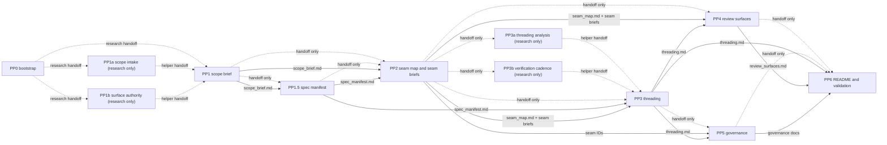

# FSE Pre-Planning Dependency Graph

## Status

Proposed dependency and overlap contract for a v2.5-aligned replacement of the current FSE pre-planning pipeline.

## Grounding

This graph is based on:

- `/Users/spensermcconnell/__Active_Code/atomize-hq/substrate/docs/project_management/system/fse/standards/planning/PLANNING_PRE_PLANNING_RESEARCH_WRAPPER.md`
- `/Users/spensermcconnell/__Active_Code/atomize-hq/substrate/docs/project_management/system/fse/scripts/planning/pre_planning_research_orchestrate.sh`
- `/Users/spensermcconnell/.agents/skills/feature-seam-extractor-v2-5/SKILL.md`
- `/Users/spensermcconnell/.agents/skills/threaded-seam-decomposer-v2-5/SKILL.md`
- `/Users/spensermcconnell/.agents/skills/seam-promotion-v2-5/SKILL.md`
- `/Users/spensermcconnell/.agents/skills/seam-execution-v2-5/SKILL.md`

## Core Rule

Research may overlap on handoff files. Canonical writes may not overlap on the same output and may not treat handoff content as final truth once an upstream canonical file exists.

Hyper-focused helper stages are allowed when they stay research-only. They exist to keep agent responsibility narrow without multiplying canonical truth surfaces.

## Stage Graph

Interpretation:

- dashed edges are allowed early-research overlap
- solid edges are canonical-write dependencies
- PP6 is the only pack-close stage
- PP1a, PP1b, PP3a, and PP3b are helper stages with no canonical outputs

## Canonical Output Ownership

| Stage | Canonical outputs | Canonical truth type |
| --- | --- | --- |
| PP0 | none | wrapper metadata only |
| PP1a | none | research-only helper |
| PP1b | none | research-only helper |
| PP1 | `/Users/spensermcconnell/__Active_Code/atomize-hq/substrate/docs/project_management/packs/<bucket>/<feature>/scope_brief.md` | pack backbone |
| PP1.5 | `/Users/spensermcconnell/__Active_Code/atomize-hq/substrate/docs/project_management/packs/<bucket>/<feature>/spec_manifest.md` | domain and authored-doc-class inventory |
| PP2 | `/Users/spensermcconnell/__Active_Code/atomize-hq/substrate/docs/project_management/packs/<bucket>/<feature>/seam_map.md`, `/Users/spensermcconnell/__Active_Code/atomize-hq/substrate/docs/project_management/packs/<bucket>/<feature>/seam-<n>-<slug>.md` | seam control plane |
| PP3a | none | research-only helper |
| PP3b | none | research-only helper |
| PP3 | `/Users/spensermcconnell/__Active_Code/atomize-hq/substrate/docs/project_management/packs/<bucket>/<feature>/threading.md` | dependency and contract control plane |
| PP4 | `/Users/spensermcconnell/__Active_Code/atomize-hq/substrate/docs/project_management/packs/<bucket>/<feature>/review_surfaces.md` | orientation surface |
| PP5 | `/Users/spensermcconnell/__Active_Code/atomize-hq/substrate/docs/project_management/packs/<bucket>/<feature>/governance/remediation-log.md`, `/Users/spensermcconnell/__Active_Code/atomize-hq/substrate/docs/project_management/packs/<bucket>/<feature>/governance/seam-<n>-closeout.md`, `/Users/spensermcconnell/__Active_Code/atomize-hq/substrate/docs/project_management/packs/<bucket>/<feature>/governance/pack-closeout.md` | governance scaffold |
| PP6 | `/Users/spensermcconnell/__Active_Code/atomize-hq/substrate/docs/project_management/packs/<bucket>/<feature>/README.md` | pack landing page |

## Research-Only Output Ownership

Every stage may own only its own research-only directory:

- `/Users/spensermcconnell/__Active_Code/atomize-hq/substrate/docs/project_management/packs/<bucket>/<feature>/logs/pre-planning-v2_5/pp0-bootstrap/**`
- `/Users/spensermcconnell/__Active_Code/atomize-hq/substrate/docs/project_management/packs/<bucket>/<feature>/logs/pre-planning-v2_5/pp1a-scope-intake/**`
- `/Users/spensermcconnell/__Active_Code/atomize-hq/substrate/docs/project_management/packs/<bucket>/<feature>/logs/pre-planning-v2_5/pp1b-surface-authority/**`
- `/Users/spensermcconnell/__Active_Code/atomize-hq/substrate/docs/project_management/packs/<bucket>/<feature>/logs/pre-planning-v2_5/pp1-scope/**`
- `/Users/spensermcconnell/__Active_Code/atomize-hq/substrate/docs/project_management/packs/<bucket>/<feature>/logs/pre-planning-v2_5/pp1_5-spec-manifest/**`
- `/Users/spensermcconnell/__Active_Code/atomize-hq/substrate/docs/project_management/packs/<bucket>/<feature>/logs/pre-planning-v2_5/pp2-seams/**`
- `/Users/spensermcconnell/__Active_Code/atomize-hq/substrate/docs/project_management/packs/<bucket>/<feature>/logs/pre-planning-v2_5/pp3a-threading/**`
- `/Users/spensermcconnell/__Active_Code/atomize-hq/substrate/docs/project_management/packs/<bucket>/<feature>/logs/pre-planning-v2_5/pp3b-verification-cadence/**`
- `/Users/spensermcconnell/__Active_Code/atomize-hq/substrate/docs/project_management/packs/<bucket>/<feature>/logs/pre-planning-v2_5/pp3-threading/**`
- `/Users/spensermcconnell/__Active_Code/atomize-hq/substrate/docs/project_management/packs/<bucket>/<feature>/logs/pre-planning-v2_5/pp4-review/**`
- `/Users/spensermcconnell/__Active_Code/atomize-hq/substrate/docs/project_management/packs/<bucket>/<feature>/logs/pre-planning-v2_5/pp5-governance/**`
- `/Users/spensermcconnell/__Active_Code/atomize-hq/substrate/docs/project_management/packs/<bucket>/<feature>/logs/pre-planning-v2_5/pp6-readme/**`

Research-only outputs may include:

- `scratch.md`
- `handoff.md`
- `staged/**`
- compatibility-only renderings of the old six pre-planning artifacts

Research-only outputs are never authoritative once the corresponding canonical file exists.

## Stage-by-Stage Dependencies

| Stage | May start research when | Canonical write requires | Canonical consumers |
| --- | --- | --- | --- |
| PP0 | operator starts the lane | ADR set resolved and feature dir exists | PP1 |
| PP1a | PP0 handoff exists | none; research only | PP1 |
| PP1b | PP0 handoff exists | none; research only | PP1 |
| PP1 | PP0 handoff exists | stable input set from PP0 plus any helper research it chooses to consume | PP1.5, PP2 |
| PP1.5 | PP1 handoff exists | canonical `scope_brief.md` | PP2, PP3 |
| PP2 | PP1 and PP1.5 handoffs exist | canonical `scope_brief.md` and `spec_manifest.md` | PP3, PP4, PP5 |
| PP3a | PP2 handoff exists | none; research only | PP3 |
| PP3b | PP2 handoff exists | none; research only | PP3 |
| PP3 | PP2 handoff exists | canonical `spec_manifest.md`, `seam_map.md`, and seam briefs plus any helper research it chooses to consume | PP4, PP5, PP6 |
| PP4 | PP2 handoff exists | canonical `seam_map.md`, seam briefs, and `threading.md` | PP6 |
| PP5 | PP3 handoff exists | canonical seam briefs and `threading.md` | PP6, later seam promotion |
| PP6 | PP4 and PP5 handoffs exist | all required canonical seam-pack files | downstream v2.5 tooling |

## Allowed Overlap Rules

Allowed:

- PP1a and PP1b may run in parallel from the PP0 handoff as long as they stay research-only.
- PP1.5 may begin spec-class and authored-doc research from the PP1 handoff before canonical promotion.
- PP2 may research seam candidates from the PP1 handoff before `scope_brief.md` is promoted.
- PP3a and PP3b may run in parallel from the PP2 handoff as long as they stay research-only.
- PP3 may research thread candidates from the PP2 handoff before seam files are promoted.
- PP4 may draft diagrams from the PP2 handoff while PP3 is still refining `threading.md`.
- PP5 may draft remediation and closeout structure from PP3 handoff material before canonical governance write.
- PP6 may draft the pack summary from PP4 and PP5 handoffs before final validation.

Not allowed:

- PP2 writing canonical seam files before `scope_brief.md` exists.
- PP3 writing `threading.md` from PP2 handoff alone.
- PP4 writing `review_surfaces.md` before `threading.md` is canonical.
- PP5 writing governance docs before thread IDs and seam IDs are canonical.
- PP6 writing `README.md` before all downstream-consumed files exist.
- any stage writing another stage's canonical outputs.

## Canonical vs Research-Only Decisions

Canonical:

- anything that defines which authored spec, contract, schema, policy, parity, compatibility, or validation docs must exist at all
- anything directly consumed by `/Users/spensermcconnell/.agents/skills/threaded-seam-decomposer-v2-5/SKILL.md`
- anything directly consumed by `/Users/spensermcconnell/.agents/skills/seam-promotion-v2-5/SKILL.md`
- anything that names stable seam IDs, thread IDs, contract ownership, horizon posture, or governance blockers

Research-only:

- scratch reasoning
- early overlap handoff summaries
- staged candidates before promotion
- compatibility views that preserve the old six-doc vocabulary during migration
- speculative restructuring notes that were not accepted into canonical seam or thread truth

## Upstream and Downstream Contract Edges

### Upstream inputs into this lane

- ADRs
- current repo state
- queued, draft, active, and archived planning packs that touch the same surfaces
- existing canonical docs under `/Users/spensermcconnell/__Active_Code/atomize-hq/substrate/docs/contracts/` when the feature intersects an existing durable contract

### Downstream consumers of this lane

- `/Users/spensermcconnell/.agents/skills/threaded-seam-decomposer-v2-5/SKILL.md`
- `/Users/spensermcconnell/.agents/skills/seam-promotion-v2-5/SKILL.md`

Not yet in scope:

- `/Users/spensermcconnell/.agents/skills/seam-execution-v2-5/SKILL.md` because that skill requires `/Users/spensermcconnell/__Active_Code/atomize-hq/substrate/docs/project_management/packs/<bucket>/<feature>/threaded-seams/**`, which this lane must not create

## Legacy Six-Artifact Compatibility

If migration support is needed, the old artifact names may still be rendered under `logs/pre-planning-v2_5/compat/`. They are derived views only:

- `spec_manifest.md` remains canonical and does not move into compatibility-only status
- `impact_map.md` derives from `seam_map.md`, `threading.md`, and `review_surfaces.md`
- `minimal_spec_draft.md` derives from `scope_brief.md`, `seam_map.md`, and seam briefs
- `ci_checkpoint_plan.md` derives from `threading.md` and governance stubs
- `workstream_triage.md` derives from `threading.md`
- `alignment_report.md` derives from governance docs and `README.md`

Those compatibility artifacts must never be read as canonical inputs by downstream v2.5 tooling.

## Readiness Gate for the Whole Pipeline

The pipeline is considered complete only when:

- every required v2.5 seam-pack file exists
- `spec_manifest.md` exists and defines the required authored-doc classes and canonical contract homes
- exactly one `active` seam and one `next` seam exist by default
- no `threaded-seams/` directory exists
- no slice or subslice files exist
- thread vocabulary matches v2.5
- governance docs exist but do not claim post-exec truth
- the pack is directly consumable by the threaded seam decomposer without reading a legacy pre-planning file
