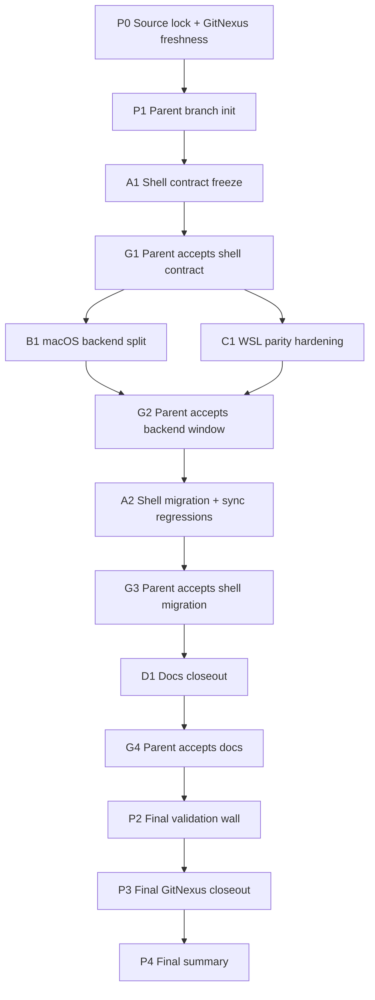

# ORCH_PLAN: Async Persistent-Session Bootstrap Readiness Split

Authoritative plan source: [PLAN.md](/Users/spensermcconnell/__Active_Code/atomize-hq/substrate/PLAN.md)  
Primary protocol doc: [persistent_session.md](/Users/spensermcconnell/__Active_Code/atomize-hq/substrate/docs/internals/repl/persistent_session.md)  
World backend doc: [WORLD.md](/Users/spensermcconnell/__Active_Code/atomize-hq/substrate/docs/WORLD.md)  
Stale note: the existing durable-session orchestration content is out of scope for this run and is replaced by this controller.  
Live repo root: `/Users/spensermcconnell/__Active_Code/atomize-hq/substrate`  
Fresh worktree root: `/Users/spensermcconnell/__Active_Code/atomize-hq/.worktrees/substrate-slice-26-readiness-split`  
Baseline branch: `feat/host-orchestrator-durable-session`  
Run id: `slice-26-async-persistent-session-bootstrap-readiness`  
Max concurrent workers: `2`  
Parent role: only integrator, only gate authority, only writer of `.runs` artifacts

## Summary

This controller operationalizes [PLAN.md](/Users/spensermcconnell/__Active_Code/atomize-hq/substrate/PLAN.md) for the async persistent-session bootstrap readiness split.

Execution shape is fixed:

1. Parent source-locks the plan and creates a clean integration branch from the current slice branch.
2. Worker A lands `A1`, which freezes the shell-facing async readiness contract without widening sync surfaces.
3. Workers B and C run in the only parallel window, on disjoint backend crates.
4. Worker A returns for `A2` to wire the shell caller migration and sync-regression proof against the merged backend seams.
5. Worker D updates docs late.
6. Parent runs the full validation wall and decides final acceptance.

This preserves the slice contract:

1. no async `WorldBackend` rewrite
2. sync `ensure_ready` preserved for sync callers
3. macOS async persistent-session startup stops using the sync bridge
4. socket override bypass remains exact
5. backend-owned readiness stays backend-owned
6. WSL work is internal parity only
7. tests, docs, and validation are mandatory
8. concurrency stays honest

## Hard Guards

1. `WorldBackend` remains synchronous for this slice.
2. `PlatformWorldContext.ensure_ready` remains available and unchanged for sync callers.
3. The macOS persistent-session async startup path must stop calling the sync bridge.
4. `SUBSTRATE_WORLD_SOCKET` override behavior must remain exact, including bypass semantics.
5. Shell code may dispatch to backend-owned readiness. It may not duplicate VM, forwarding, client, or capability logic.
6. Linux behavior stays structurally unchanged unless a tiny compile-only adapter is needed.
7. WSL hardening is internal-only and must not create a shipped Windows persistent-session shell caller.
8. Readiness failures stay fail closed and return normal errors, never a Tokio panic and never best-effort degraded startup.
9. Docs ship only after merged behavior is stable.
10. Workers do not edit [PLAN.md](/Users/spensermcconnell/__Active_Code/atomize-hq/substrate/PLAN.md), [ORCH_PLAN.md](/Users/spensermcconnell/__Active_Code/atomize-hq/substrate/ORCH_PLAN.md), or `.runs/**`.
11. Every symbol edit requires prior GitNexus impact analysis.
12. Any `HIGH` or `CRITICAL` GitNexus impact result is a parent-only escalation point.
13. Every worker handoff must include `gitnexus_detect_changes()` status before the parent considers merge.
14. Parent runs a final `gitnexus_detect_changes()` on the merged branch before closeout.

## Worktree Creation Order And Commands

Parent creates worktrees in this exact order.

### 1. Create parent integration worktree

```bash
mkdir -p /Users/spensermcconnell/__Active_Code/atomize-hq/.worktrees/substrate-slice-26-readiness-split

git -C /Users/spensermcconnell/__Active_Code/atomize-hq/substrate fetch origin

git -C /Users/spensermcconnell/__Active_Code/atomize-hq/substrate worktree add \
  /Users/spensermcconnell/__Active_Code/atomize-hq/.worktrees/substrate-slice-26-readiness-split/parent \
  -b codex/slice-26-async-persistent-session-readiness \
  feat/host-orchestrator-durable-session
```

### 2. Create Worker A worktree for `A1`

```bash
git -C /Users/spensermcconnell/__Active_Code/atomize-hq/substrate worktree add \
  /Users/spensermcconnell/__Active_Code/atomize-hq/.worktrees/substrate-slice-26-readiness-split/shell-lane \
  -b codex/slice-26-shell-readiness-seam \
  codex/slice-26-async-persistent-session-readiness
```

### 3. After `G1`, create Worker B and Worker C worktrees

```bash
git -C /Users/spensermcconnell/__Active_Code/atomize-hq/substrate worktree add \
  /Users/spensermcconnell/__Active_Code/atomize-hq/.worktrees/substrate-slice-26-readiness-split/mac-lima-lane \
  -b codex/slice-26-mac-lima-readiness-split \
  codex/slice-26-async-persistent-session-readiness

git -C /Users/spensermcconnell/__Active_Code/atomize-hq/substrate worktree add \
  /Users/spensermcconnell/__Active_Code/atomize-hq/.worktrees/substrate-slice-26-readiness-split/wsl-lane \
  -b codex/slice-26-wsl-readiness-parity \
  codex/slice-26-async-persistent-session-readiness
```

### 4. After `G2`, refresh Worker A for `A2`

If the original Worker A worktree is still clean and easy to reuse, rebase it on the parent branch. Otherwise, remove and recreate it.

```bash
git -C /Users/spensermcconnell/__Active_Code/atomize-hq/.worktrees/substrate-slice-26-readiness-split/shell-lane fetch origin

git -C /Users/spensermcconnell/__Active_Code/atomize-hq/.worktrees/substrate-slice-26-readiness-split/shell-lane rebase \
  codex/slice-26-async-persistent-session-readiness
```

If recreate is cleaner:

```bash
git -C /Users/spensermcconnell/__Active_Code/atomize-hq/substrate worktree remove \
  /Users/spensermcconnell/__Active_Code/atomize-hq/.worktrees/substrate-slice-26-readiness-split/shell-lane

git -C /Users/spensermcconnell/__Active_Code/atomize-hq/substrate worktree add \
  /Users/spensermcconnell/__Active_Code/atomize-hq/.worktrees/substrate-slice-26-readiness-split/shell-lane \
  -B codex/slice-26-shell-readiness-seam \
  codex/slice-26-async-persistent-session-readiness
```

### 5. After `G3`, create Worker D worktree

```bash
git -C /Users/spensermcconnell/__Active_Code/atomize-hq/substrate worktree add \
  /Users/spensermcconnell/__Active_Code/atomize-hq/.worktrees/substrate-slice-26-readiness-split/docs-lane \
  -b codex/slice-26-docs-readiness-split \
  codex/slice-26-async-persistent-session-readiness
```

## Parent-Owned Run-State Surface / Artifact Ledger

Canonical run root:

- `/Users/spensermcconnell/__Active_Code/atomize-hq/substrate/.runs/slice-26-async-persistent-session-bootstrap-readiness/`

Required directory tree:

```text
.runs/slice-26-async-persistent-session-bootstrap-readiness/
  run-state.json
  source-lock.json
  branch-map.json
  ownership-boundaries.json
  task-ledger.json
  merge-log.md
  final-summary.md
  blocked.json                           # only if run blocks
  sentinels/
    RUN_OPEN
    RUN_BLOCKED                         # only if blocked
    RUN_COMPLETE                        # only if complete
  gates/
    G0-source-lock/
      gate.json
      evidence.md
      OPEN
    G1-shell-contract-freeze/
      gate.json
      evidence.md
      OPEN
      REOPENED                          # touched only if contract drift forces reset
    G2-backend-parallel-window/
      gate.json
      evidence.md
      OPEN
    G3-shell-migration/
      gate.json
      evidence.md
      OPEN
    G4-docs-closeout/
      gate.json
      evidence.md
      OPEN
    G5-final-acceptance/
      gate.json
      evidence.md
      OPEN
  tasks/
    P0-source-lock/
    P1-parent-branch-init/
    A1-shell-contract-freeze/
    G1-shell-contract-accept/
    B1-mac-lima-readiness-split/
    C1-wsl-parity-hardening/
    G2-backend-accept/
    A2-shell-migration-and-sync-regressions/
    G3-shell-accept/
    D1-docs-closeout/
    G4-docs-accept/
    P2-final-validation-wall/
    P3-final-gitnexus-closeout/
    P4-final-summary/
```

Required per-task artifact files under each `tasks/<task-id>/` directory:

1. `task.json`
2. `owner.txt`
3. `status.txt`
4. `dependency-status.json`
5. `scope.txt`
6. `deliverable.txt`
7. `acceptance-notes.md`
8. `changed-files.txt`
9. `commands.txt`
10. `exit-codes.json`
11. `impact-analysis-summary.md`
12. `gitnexus-detect-changes.txt`
13. `handoff-notes.md`
14. `blocker-notes.md` if blocked
15. `HEAD_SHA.txt`
16. sentinel file exactly one of:
   - `READY_FOR_REVIEW`
   - `ACCEPTED`
   - `REJECTED`
   - `BLOCKED`

Rules:

1. Workers do not write these artifacts directly.
2. Workers return the content in their handoff.
3. Parent transcribes the handoff into `.runs/**`.
4. No task is considered complete until the parent has written the task artifacts and touched the correct sentinel.

## GitNexus Workflow

GitNexus is an active part of the run, not a passive guard.

### Source-lock stage

1. Parent checks GitNexus availability and index freshness.
2. If stale, parent runs `npx gitnexus analyze` from the parent worktree before any worker starts.
3. Parent records GitNexus freshness status in `tasks/P0-source-lock/impact-analysis-summary.md`.

### Before each worker edits symbols

The worker must run impact analysis on the symbols it expects to touch and include a concise summary in handoff. Minimum required targets by lane:

- `A1`
  - `PlatformWorldContext`
  - `build_ws_and_start_session_frame`
- `B1`
  - `MacLimaBackend::ensure_session`
  - any backend-local readiness helper being split
- `C1`
  - `WindowsWslBackend::ensure_session`
  - any backend-local readiness helper being split
- `A2`
  - `ReplPersistentSessionClient::start_with`
  - `open_world_session`
  - any sync shell caller or regression surface being touched
- `D1`
  - no GitNexus impact required if docs-only, but worker still reports docs-only status

Escalation rule:

1. If any impact analysis returns `HIGH` or `CRITICAL`, the worker stops before editing and returns a blocker handoff.
2. Parent records the blocker, decides whether the slice still fits [PLAN.md](/Users/spensermcconnell/__Active_Code/atomize-hq/substrate/PLAN.md), and either relaunches with narrower scope or blocks the run.

### Before each worker handoff

Each coding lane runs `gitnexus_detect_changes()` and reports:

1. pass or fail
2. changed symbols
3. changed execution flows
4. whether the result matches the intended lane scope

### Before final closeout

Parent runs `gitnexus_detect_changes()` on the merged parent branch and records the result under `tasks/P3-final-gitnexus-closeout/`.

The run cannot close green if final GitNexus detection shows unexpected symbol drift that the parent cannot explain from the task ledger.

## Frozen Ownership Boundaries

### Worker A, phase `A1`: shell contract freeze only

Owned files:

1. [crates/shell/src/execution/platform_world/mod.rs](/Users/spensermcconnell/__Active_Code/atomize-hq/substrate/crates/shell/src/execution/platform_world/mod.rs)
2. [crates/shell/src/execution/routing/dispatch/world_persistent_session.rs](/Users/spensermcconnell/__Active_Code/atomize-hq/substrate/crates/shell/src/execution/routing/dispatch/world_persistent_session.rs)

Purpose:

1. add the shell-facing async readiness seam
2. preserve sync `ensure_ready`
3. freeze helper names, dispatch shape, and error-shape expectations for backend lanes

Not allowed in `A1`:

1. no edits to `async_repl.rs`
2. no backend crate edits
3. no docs
4. no sync regression additions outside minimal compile coverage

### Worker B, phase `B1`: macOS backend split

Owned files:

1. [crates/world-mac-lima/src/lib.rs](/Users/spensermcconnell/__Active_Code/atomize-hq/substrate/crates/world-mac-lima/src/lib.rs)

Purpose:

1. split shared setup and async verification from the sync wrapper
2. keep sync `ensure_session(...)` working
3. harden `block_on_compat(...)` as defense-in-depth

### Worker C, phase `C1`: WSL parity hardening

Owned files:

1. [crates/world-windows-wsl/src/backend.rs](/Users/spensermcconnell/__Active_Code/atomize-hq/substrate/crates/world-windows-wsl/src/backend.rs)
2. [crates/world-windows-wsl/src/tests.rs](/Users/spensermcconnell/__Active_Code/atomize-hq/substrate/crates/world-windows-wsl/src/tests.rs)

Purpose:

1. mirror the readiness split internally
2. preserve existing sync behavior
3. explicitly avoid shipping a Windows persistent-session caller

### Worker A, phase `A2`: shell caller migration and sync regressions

Owned files:

1. [crates/shell/src/execution/routing/dispatch/world_persistent_session.rs](/Users/spensermcconnell/__Active_Code/atomize-hq/substrate/crates/shell/src/execution/routing/dispatch/world_persistent_session.rs)
2. [crates/shell/src/repl/async_repl.rs](/Users/spensermcconnell/__Active_Code/atomize-hq/substrate/crates/shell/src/repl/async_repl.rs)
3. [crates/shell/src/execution/routing/world.rs](/Users/spensermcconnell/__Active_Code/atomize-hq/substrate/crates/shell/src/execution/routing/world.rs)
4. [crates/shell/src/execution/routing/dispatch/world_ops.rs](/Users/spensermcconnell/__Active_Code/atomize-hq/substrate/crates/shell/src/execution/routing/dispatch/world_ops.rs)
5. [crates/shell/src/execution/workspace_cmd.rs](/Users/spensermcconnell/__Active_Code/atomize-hq/substrate/crates/shell/src/execution/workspace_cmd.rs)
6. [crates/shell/tests/repl_world_first_routing_v1.rs](/Users/spensermcconnell/__Active_Code/atomize-hq/substrate/crates/shell/tests/repl_world_first_routing_v1.rs)
7. any directly related shell-side tests required by the slice

Purpose:

1. replace the macOS sync bridge with the async seam
2. preserve exact socket override behavior
3. prove sync callers still use sync `ensure_ready`

Reason `A1` and `A2` are serialized:

1. `A1` defines the shell-to-backend seam consumed by `B1` and `C1`
2. `A2` cannot honestly finish until the backend adapters are merged and stable
3. merging them into one long shell lane would either block the backend window or force backend workers to guess the final shell contract

### Worker D, phase `D1`: docs late

Owned files:

1. [docs/internals/repl/persistent_session.md](/Users/spensermcconnell/__Active_Code/atomize-hq/substrate/docs/internals/repl/persistent_session.md)
2. [docs/WORLD.md](/Users/spensermcconnell/__Active_Code/atomize-hq/substrate/docs/WORLD.md)
3. optional [llm-last-mile/README.md](/Users/spensermcconnell/__Active_Code/atomize-hq/substrate/llm-last-mile/README.md) only if needed for index hygiene

Purpose:

1. document the shipped caller-shape split
2. document the Windows parity decision as internal only

## Detailed Task Ledger

| Task ID | Owner | Worktree / Branch | Depends on | Deliverable | Acceptance notes |
| --- | --- | --- | --- | --- | --- |
| `P0` | Parent | `parent` / `codex/slice-26-async-persistent-session-readiness` | none | source lock, GitNexus freshness check, run-state init | `source-lock.json` exists, `RUN_OPEN` touched |
| `P1` | Parent | `parent` / `codex/slice-26-async-persistent-session-readiness` | `P0` | parent branch ready, Worker A launched | clean parent branch exists, `branch-map.json` written |
| `A1` | Worker A | `shell-lane` / `codex/slice-26-shell-readiness-seam` | `P1` | shell-facing async readiness seam only | sync `ensure_ready` preserved, no backend or `async_repl.rs` edits |
| `G1` | Parent | `parent` / same | `A1` | shell contract accepted | contract artifact written, gate `G1` opened |
| `B1` | Worker B | `mac-lima-lane` / `codex/slice-26-mac-lima-readiness-split` | `G1` | macOS backend shared sync/async readiness split | crate tests green, no shell edits |
| `C1` | Worker C | `wsl-lane` / `codex/slice-26-wsl-readiness-parity` | `G1` | WSL parity hardening and tests | crate tests green, no product-surface expansion |
| `G2` | Parent | `parent` / same | `B1`, `C1` | backend window accepted | both backend merges recorded, gate `G2` opened |
| `A2` | Worker A | `shell-lane` / `codex/slice-26-shell-readiness-seam` rebased | `G2` | shell caller migration plus sync regressions | macOS path off sync bridge, socket override exact, shell tests green |
| `G3` | Parent | `parent` / same | `A2` | shell migration accepted | merged tree satisfies code-path split, gate `G3` opened |
| `D1` | Worker D | `docs-lane` / `codex/slice-26-docs-readiness-split` | `G3` | docs updates only | docs match merged code, no code edits |
| `G4` | Parent | `parent` / same | `D1` | docs accepted | gate `G4` opened |
| `P2` | Parent | `parent` / same | `G4` | final validation wall | all commands executed and logged |
| `P3` | Parent | `parent` / same | `P2` | final GitNexus detect-changes closeout | output matches expected scope |
| `P4` | Parent | `parent` / same | `P3` | final summary and run completion | `RUN_COMPLETE` touched |

## Lane Handoff Requirements

Every worker handoff must include, at minimum:

1. `HEAD` commit SHA
2. exact changed file list
3. exact commands run
4. per-command exit codes
5. concise GitNexus impact summary
6. whether any impact call returned `HIGH` or `CRITICAL`
7. whether `gitnexus_detect_changes()` passed
8. concise explanation of any unexpected file drift
9. blocker notes if not green
10. statement of whether the lane stayed within ownership boundaries

Parent records this under the matching `tasks/<task-id>/` artifact directory.

### Minimum handoff packet format for coding lanes

1. `changed-files.txt`
2. `commands.txt`
3. `exit-codes.json`
4. `impact-analysis-summary.md`
5. `gitnexus-detect-changes.txt`
6. `handoff-notes.md`
7. `HEAD_SHA.txt`

### Required lane-specific notes

`A1` must additionally state:

1. the exact new shell-facing async helper name
2. which backend-facing contract points were frozen
3. whether any shell test additions were deferred to `A2`

`B1` must additionally state:

1. which sync and async backend-local helpers now exist
2. whether `block_on_compat(...)` behavior changed only as hardening
3. whether any shell contract mismatch was discovered

`C1` must additionally state:

1. which backend-local parity helpers now exist
2. whether any Windows product-surface change was avoided explicitly
3. whether any shell contract mismatch was discovered

`A2` must additionally state:

1. which call site stopped using the sync bridge
2. how socket override bypass was preserved
3. which sync caller regressions were tested

`D1` must additionally state:

1. docs touched
2. exact statements added for macOS async split and Windows internal-only scope

## Task Graph And Control Points



## Validation Commands By Task

These are the required commands, not examples.

### `A1` validation commands

Run from `/Users/spensermcconnell/__Active_Code/atomize-hq/.worktrees/substrate-slice-26-readiness-split/shell-lane`:

```bash
cargo fmt --all
cargo test -p shell --lib -- --nocapture
cargo test -p shell --test repl_world_first_routing_v1 -- --nocapture
```

### `B1` validation commands

Run from `/Users/spensermcconnell/__Active_Code/atomize-hq/.worktrees/substrate-slice-26-readiness-split/mac-lima-lane`:

```bash
cargo fmt --all
cargo test -p world-mac-lima -- --nocapture
```

### `C1` validation commands

Run from `/Users/spensermcconnell/__Active_Code/atomize-hq/.worktrees/substrate-slice-26-readiness-split/wsl-lane`:

```bash
cargo fmt --all
cargo test -p world-windows-wsl -- --nocapture
```

### `A2` validation commands

Run from `/Users/spensermcconnell/__Active_Code/atomize-hq/.worktrees/substrate-slice-26-readiness-split/shell-lane` after rebase to the parent branch:

```bash
cargo fmt --all
cargo test -p shell --lib -- --nocapture
cargo test -p shell --test repl_world_first_routing_v1 -- --nocapture
cargo test -p shell -- --nocapture
```

### `D1` validation commands

Run from `/Users/spensermcconnell/__Active_Code/atomize-hq/.worktrees/substrate-slice-26-readiness-split/docs-lane`:

```bash
git diff -- docs/internals/repl/persistent_session.md docs/WORLD.md llm-last-mile/README.md
```

### Parent final validation wall in `P2`

Run from `/Users/spensermcconnell/__Active_Code/atomize-hq/.worktrees/substrate-slice-26-readiness-split/parent`:

```bash
cargo fmt --all -- --check
cargo clippy --workspace --all-targets -- -D warnings
cargo test -p shell -- --nocapture
cargo test -p world-mac-lima -- --nocapture
cargo test -p world-windows-wsl -- --nocapture
script -q /dev/null zsh -lc 'RUST_BACKTRACE=1 ~/.substrate/bin/substrate'
```

## Conflict-Resolution Rule For Cross-Lane Contract Drift

Contract drift after `G1` is handled explicitly.

If `B1` or `C1` discovers that the `A1` shell contract is insufficient or wrong:

1. The worker stops immediately.
2. The worker does not patch shell files locally.
3. The worker returns a blocker handoff describing the exact contract mismatch.
4. Parent writes `BLOCKED` for that task and touches `REOPENED` under `gates/G1-shell-contract-freeze/`.
5. Parent closes downstream acceptance for unmerged work based on the stale contract.
6. Parent either:
   - launches a narrow `A1R1` correction on the shell lane, or
   - blocks the run if the required change violates [PLAN.md](/Users/spensermcconnell/__Active_Code/atomize-hq/substrate/PLAN.md)
7. If `A1R1` lands, parent updates:
   - `source-lock.json` only if the plan authority itself changed
   - `gates/G1-shell-contract-freeze/gate.json`
   - `ownership-boundaries.json` if file boundaries changed
   - `task-ledger.json`
8. Parent then relaunches affected backend lanes from the new parent base. Old backend commits against the stale contract are not merged opportunistically.

## Gate Rules And Stop Conditions

### Gate `G1` acceptance rule

Open only when:

1. `A1` handoff is complete
2. parent confirms sync `ensure_ready` still exists for sync callers
3. parent confirms `A1` did not spill into backend crates or `async_repl.rs`
4. parent has a written shell contract artifact under `tasks/G1-shell-contract-accept/`

### Gate `G2` acceptance rule

Open only when:

1. `B1` and `C1` are both merged into the parent branch
2. their required crate tests passed
3. neither lane expanded public Windows persistent-session surface
4. neither lane forced shell changes after `G1` without reopening the gate

### Gate `G3` acceptance rule

Open only when:

1. `A2` is merged
2. macOS persistent-session startup no longer uses the sync bridge
3. socket override bypass is still exact
4. sync caller regressions are covered and green

### Gate `G4` acceptance rule

Open only when:

1. docs are based on the merged parent branch
2. docs explicitly describe:
   - async persistent-session startup using a dedicated async readiness seam
   - sync request-builders continuing to use sync `ensure_ready`
   - WSL work in this slice being internal-only parity hardening

### Run stop conditions

Write `blocked.json`, touch `RUN_BLOCKED`, and stop if any are true:

1. the slice requires an async `WorldBackend`
2. sync `ensure_ready` cannot be preserved
3. exact socket override bypass cannot be preserved
4. shell code must duplicate backend readiness logic to succeed
5. a backend lane requires a shipped Windows persistent-session caller to validate the design
6. final manual smoke still produces a Tokio panic
7. final GitNexus detect-changes shows unexpected scope the parent cannot justify
8. required macOS smoke cannot be run honestly and the user has not explicitly approved an evidence waiver

## Final Acceptance Wall

The run passes only if all of the following are true on the merged parent branch:

1. Persistent-session startup no longer calls the sync readiness bridge on the macOS async path.
2. macOS current-thread REPL startup no longer panics on `block_in_place`.
3. Readiness failures surface as normal `Result` errors.
4. Existing sync bootstrap and request-builder callers still use sync `ensure_ready`.
5. Shared readiness rules remain backend-owned across sync and async entrypoints.
6. `SUBSTRATE_WORLD_SOCKET` override bypass remains exact.
7. WSL parity hardening stayed internal-only.
8. Required tests are present and pass.
9. Docs clearly encode the caller-shape split and Windows scope decision.
10. Final GitNexus detect-changes matches expected scope.

### Manual smoke expectation

Primary honest smoke:

1. Run the parent `script -q /dev/null zsh -lc 'RUST_BACKTRACE=1 ~/.substrate/bin/substrate'` check in a macOS environment where the current-thread REPL path is meaningful for this slice.
2. Pass if startup succeeds without panic.
3. Pass if startup fails as a normal readiness error without Tokio runtime panic.
4. Fail if a Tokio panic or `block_in_place` runtime invariant panic is observed.

### If the environment cannot run the smoke honestly

This does not default to pass.

Rules:

1. Parent records `SMOKE_UNAVAILABLE` in `tasks/P2-final-validation-wall/acceptance-notes.md`.
2. Parent explains exactly why the environment is not honest for this smoke.
3. Parent marks the run blocked unless the user explicitly accepts a smoke-evidence waiver.
4. If a waiver is granted, parent still records the gap in `final-summary.md`. The run is “accepted with waived manual smoke,” not “fully validated.”

## Tests And Acceptance Mapping To PLAN.md

The parent should use this direct mapping when deciding final acceptance:

1. PLAN completion point `1`: covered by `A2`, `G3`, and final code inspection
2. PLAN completion point `2`: covered by `A2` tests and manual smoke
3. PLAN completion point `3`: covered by shell and backend error-path tests and smoke failure mode
4. PLAN completion point `4`: covered by `A1`, `A2`, and sync shell regressions
5. PLAN completion point `5`: covered by `B1`, `C1`, `A2`, and docs
6. PLAN completion point `6`: covered by `C1` scope notes and docs
7. PLAN completion point `7`: covered by `D1` and parent doc review

## Assumptions

1. The parent will create a clean integration worktree from the current slice branch, `feat/host-orchestrator-durable-session`, and treat the current [PLAN.md](/Users/spensermcconnell/__Active_Code/atomize-hq/substrate/PLAN.md) text as the locked slice authority in run-state artifacts.
2. If the manual smoke environment is unavailable, that is a real acceptance gap, not a silent skip.
3. The parent can access GitNexus through the required MCP workflow or equivalent repo-supported invocation before worker edits begin.
