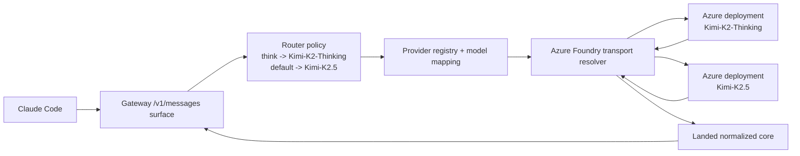
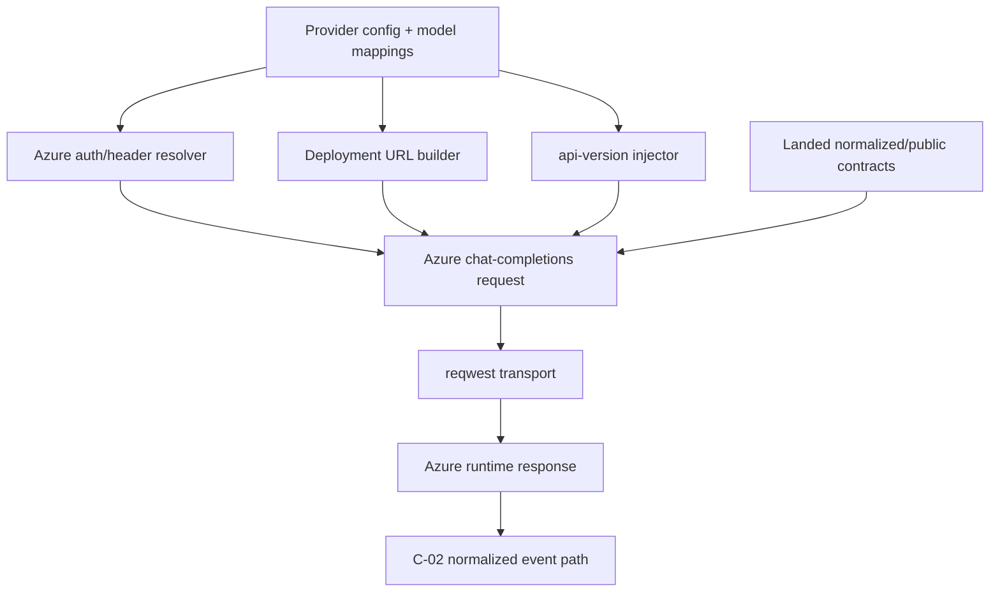
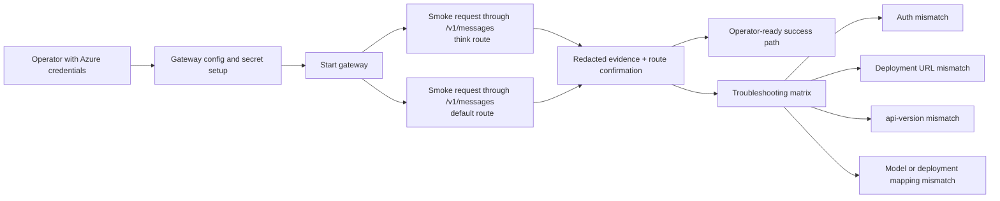

# Review Surfaces - Azure Foundry Provider Transport

These diagrams orient the pack. They show the actual product/work shape that is expected to land.
They do not, by themselves, satisfy seam-local pre-exec review.
Active and next seams still require seam-local `review.md` artifacts later.

## R1 - End-to-end Claude Code to Azure runtime flow

## R2 - Azure request construction surface

## R3 - Live smoke and troubleshooting loop

## Review intent

- `R1` makes the real delivery target explicit: Claude Code must reach Azure-hosted Kimi through the landed Anthropic-compatible surface and existing internal routing policy
- `R2` highlights the exact seam-1 control points that remain unresolved in the current generic OpenAI path
- `R3` makes live operator proof first-class and forces the pack to name success signals and troubleshooting surfaces instead of assuming runtime verification will be obvious later
