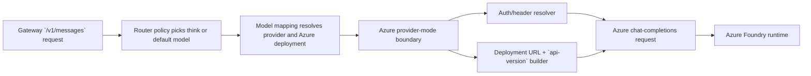

# Review Bundle - SEAM-1 Azure Foundry Runtime Transport

This artifact feeds `gates.pre_exec.review`.
`../../review_surfaces.md` is pack orientation only.

## Falsification questions

- Can the seam still claim Azure support while `gateway/src/providers/openai.rs` keeps assuming `Authorization: Bearer ...` plus unconditional `/chat/completions` appends for Azure traffic?
- Is the Azure runtime contract still under-specified enough that `SEAM-2` would need to rediscover auth, deployment URL, or `api-version` behavior during live smoke instead of consuming published `C-07` truth?
- Does the planned provider-mode boundary still protect non-Azure OpenAI-compatible providers, or does Azure-specific request construction leak into the generic path and violate the isolation promised by ADR 0006?

## R1 - Azure runtime transport flow that should land



## R2 - Seam-local verification flow that must stay deterministic

```mermaid
flowchart LR
  C07["Frozen `C-07` contract"] --> CODE["Provider + registry implementation"]
  C07 --> CFG["Config and model examples"]
  CODE --> TEST["Transport request-construction tests"]
  CFG --> TEST
  TEST --> EXIT["`THR-06` publication decision"]
  EXIT --> NEXT["`SEAM-2` live smoke basis"]
```

## Likely mismatch hotspots

- The current `OpenAIProvider` path only exposes bearer auth plus `{base_url}/chat/completions`, so Azure-specific target and auth rules may stay implicit unless `S1` freezes them first.
- Provider config currently exposes generic `base_url` and `headers`, which risks hiding Azure deployment mapping and `api-version` semantics in ad hoc examples instead of one contract.
- Transport tests could overfit to Azure-specific success paths and forget the non-regression boundary for other OpenAI-compatible providers.

## Pre-exec findings

- No remediation is opened during decomposition. The basis is usable because the upstream public, normalized, policy, and boundary contracts are already landed and the pack clearly assigns `C-07` ownership to `SEAM-1`.
- The main review pressure is contract sharpness before implementation: `S1` must freeze Azure auth mode, deployment target rules, `api-version`, routing-ready model/deployment mapping, and provider-mode isolation so `S2` does not invent transport truth in code.
- Revalidation remains required before `exec-ready`: execution must confirm current Azure runtime requirements still match the assumptions captured in `gateway/src/providers/openai.rs`, config/example surfaces, and the landed upstream routing basis.

## Pre-exec gate disposition

- **Review gate**: `pending`
- **Contract gate concerns**: `C-07` must explicitly name auth header posture, deployment-scoped URL composition, `api-version` handling, model/deployment mapping fields, and the non-Azure isolation boundary.
- **Revalidation prerequisites**: confirm the current Azure runtime requirements do not contradict the planned request builder, ensure `Kimi-K2-Thinking` and `Kimi-K2.5` routing assumptions still match the landed upstream basis, and verify the config/example schema matches the contract frozen in `S1`.
- **Opened remediations**: none

## Planned seam-exit gate focus

- **What must be true before downstream promotion is legal**: `C-07` is concrete and landed, `THR-06` is explicitly `published`, deterministic tests prove Azure request construction for both Kimi deployments, and non-Azure OpenAI-compatible behavior remains within the planned isolation boundary.
- **Which outbound contracts/threads matter most**: `C-07` and `THR-06`
- **Which review-surface deltas would force downstream revalidation**: changed Azure auth posture, changed deployment URL or `api-version` rules, newly required config fields, or any implementation drift that exposes planner/executor or public-surface semantics inside the transport layer
