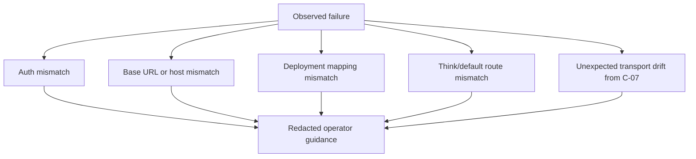

# Review Bundle - SEAM-2 Azure Live Smoke And Operator Readiness

This artifact feeds `gates.pre_exec.review`.
`../../review_surfaces.md` remains pack orientation only.

## Falsification questions

- Does the planned live verification path still bypass the landed `/v1/messages` surface instead of testing the real gateway route Claude Code consumes?
- Is `C-08` still under-specified enough that an operator would need to inspect runtime code or rerun provider-only calls to understand auth, URL, deployment, or mapping failures?
- Do the planned operator surfaces still leak provider/deployment details or localhost-only assumptions in a way that violates `C-05`?

## R1 - Operator live smoke flow that should land

```mermaid
flowchart LR
  CFG["Azure credentials + config"] --> START["Start gateway"]
  START --> THINK["`/v1/messages` smoke on think route"]
  START --> EXEC["`/v1/messages` smoke on default route"]
  THINK --> EVID["Redacted evidence capture"]
  EXEC --> EVID
  EVID --> PASS["Route + provider success signals"]
  EVID --> FAIL["Troubleshooting taxonomy"]
```

## R2 - Troubleshooting boundaries that must stay capability-oriented



## Likely mismatch hotspots

- Operators may still try provider-only test calls instead of the landed `/v1/messages` path if the smoke contract is not explicit.
- `SEAM-1` examples now express the Azure transport contract, but `SEAM-2` still needs to prove the real think/default routes against live credentials and capture redacted evidence.
- Troubleshooting can drift into raw provider detail unless failure signatures are organized around auth, URL, deployment, route, and redaction-safe evidence.

## Pre-exec findings

- `SEAM-1` closeout now publishes `THR-06`, lands `C-07`, and records deterministic verification for Azure versus generic OpenAI transport behavior.
- The target seam basis is `current`: the operator-readiness plan can now consume concrete Azure auth, base URL, and deployment-mapping rules instead of carrying provisional assumptions.
- No pre-exec remediation is required. The owned `C-08` contract baseline, smoke procedure, and troubleshooting taxonomy are concrete enough in seam-local planning to execute without guessing.

## Pre-exec gate disposition

- **Review gate**: `passed`
- **Contract gate**: `passed`; the owned `C-08` contract baseline is concrete in `S1`, including redacted evidence expectations and troubleshooting categories
- **Revalidation gate**: `passed`; the seam was rechecked against `../../governance/seam-1-closeout.md`, `docs/foundation/azure-foundry-c07-runtime-transport-contract.md`, `docs/foundation/anthropic-messages-c03-contract.md`, `docs/foundation/planner-executor-c04-policy-contract.md`, and `docs/foundation/substrate-boundary-c05-contract.md`
- **Opened remediations**: none

## Planned seam-exit gate focus

- **What must be true before downstream promotion is legal**: the live `/v1/messages` smoke path is documented and proven with redacted evidence for both Azure Kimi routes, `C-08` is landed, and future operators can diagnose auth, URL, deployment, and route failures without rediscovering `C-07`
- **Which outbound contracts/threads matter most**: `C-08` and `THR-07`
- **Which review-surface deltas would force downstream revalidation**: changes to `C-07`, changes to the live smoke route or success signals, or new failure signatures/redaction requirements that the seam does not yet explain
