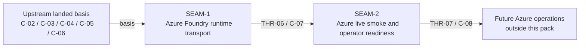

# Threading - Azure Foundry Provider Transport

## Execution horizon summary

- **Active seam**: `SEAM-2`
- **Next seam**: `null`
- **Policy**:
  - only `SEAM-2` is eligible for authoritative downstream decomposition by default
  - no additional seam is queued in the forward horizon until later Azure operational work is extracted
  - no additional future seams are extracted here because this pack is intentionally bounded to the Azure transport-to-live-verification path

## Contract registry

- **Contract ID**: `C-07`
  - **Type**: `config`
  - **Owner seam**: `SEAM-1`
  - **Direct consumers**: `SEAM-2`
  - **Derived consumers**: future Azure deployment automation, future in-world deployment wrappers, and later support tooling outside this pack
  - **Thread IDs**: `THR-06`
  - **Definition**: Azure Foundry runtime transport contract covering provider auth mode, deployment-scoped request target construction, `api-version` propagation, provider/model mapping rules for `Kimi-K2-Thinking` and `Kimi-K2.5`, and the non-negotiable invariant that landed `C-02` through `C-06` behavior remains unchanged above the provider seam
  - **Versioning / compat**: changes must preserve the landed normalized-event, Anthropic-surface, planner/executor, and external-boundary contracts; Azure-specific request construction may become concrete, but it must not require public contract or identity changes

- **Contract ID**: `C-08`
  - **Type**: `UX affordance`
  - **Owner seam**: `SEAM-2`
  - **Direct consumers**: gateway operators using real Azure credentials
  - **Derived consumers**: future operational runbooks, support surfaces, and downstream deployment automation outside this pack
  - **Thread IDs**: `THR-07`
  - **Definition**: operator verification contract covering the live smoke procedure, redacted evidence expectations, router/provider success signals for think and default traffic, and troubleshooting surfaces for auth, URL shape, deployment, and `api-version` failures
  - **Versioning / compat**: changes must stay capability-oriented, preserve one logical backend identity, and avoid exposing provider-internal or planner/executor identities as public contract

## Thread registry

- **Thread ID**: `THR-06`
  - **Producer seam**: `SEAM-1`
  - **Consumer seam(s)**: `SEAM-2`
  - **Carried contract IDs**: `C-07`
  - **Purpose**: carry concrete Azure runtime transport truth from the provider seam into the live smoke and operator-readiness seam so real verification does not guess at auth headers, deployment URL shape, or `api-version` behavior
  - **State**: `published`
  - **Revalidation trigger**: Azure runtime requirements, provider config schema, request-target construction, or model-to-deployment mapping assumptions change materially after `SEAM-1` planning or landing
  - **Satisfied by**: a concrete transport contract plus deterministic verification surfaces for headers, URL/query composition, request-body construction, and configuration examples for both Kimi deployments
  - **Notes**: this thread must remain below `C-03` and `C-04`; it cannot reopen public-surface semantics or planner/executor identity

- **Thread ID**: `THR-07`
  - **Producer seam**: `SEAM-2`
  - **Consumer seam(s)**: future Azure operations and deployment work outside this pack
  - **Carried contract IDs**: `C-08`
  - **Purpose**: publish a reusable live-verification and troubleshooting path so later operators or downstream integrations do not rediscover Azure runtime failures ad hoc
  - **State**: `identified`
  - **Revalidation trigger**: `C-07` changes, the `/v1/messages` verification path changes materially, or Azure failure signatures shift in a way that makes the recorded operator workflow stale
  - **Satisfied by**: redacted live smoke evidence, documented success/failure signatures, and troubleshooting surfaces tied back to the landed Azure runtime transport contract
  - **Notes**: this thread should publish real gateway-backed evidence, not a provider-only side test that bypasses the public Claude Code path

## Dependency graph

## Critical path

1. Consume the upstream `azure-kimi-claude-gateway` closeouts as landed basis instead of reopening `C-02` through `C-06`.
2. Land `SEAM-1` so Azure runtime auth, deployment URL shape, `api-version`, and model/deployment mapping are concrete under one provider-boundary contract.
3. Use published `C-07` truth in `SEAM-2` to prove a real `/v1/messages` smoke path, capture operator-facing success/failure signals, and publish the reusable verification contract.

## Workstreams

- **WS-A Azure transport contract**: `SEAM-1` owns provider/runtime request construction, registry/config expression, and deterministic transport verification
- **WS-B Azure live verification**: `SEAM-2` consumes `C-07` to own the live smoke, redacted evidence chain, and operator troubleshooting surfaces
