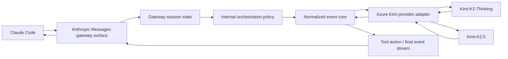
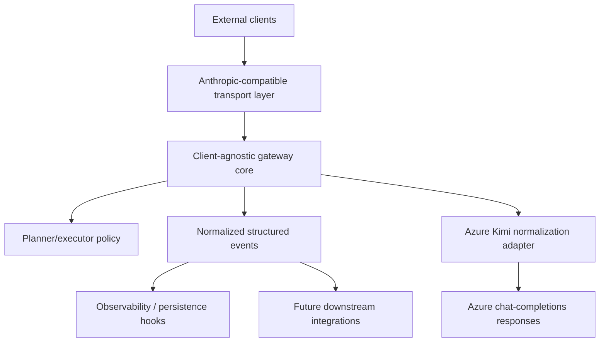
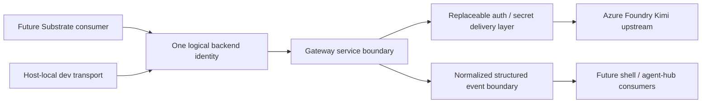

# Review Surfaces - Azure Kimi Claude Gateway

These diagrams orient the pack. They show the actual product/work shape that is expected to land.
They do not, by themselves, satisfy seam-local pre-exec review.
Active and next seams still require seam-local `review.md` artifacts later.

## R1 - Runtime request and tool loop

## R2 - Landed gateway component map

## R3 - External boundary and future Substrate posture

## Review intent

- `R1` makes the landed runtime behavior explicit: Anthropic ingress, normalized core, internal orchestration, and Azure provider interaction
- `R2` highlights the component boundaries that should exist even if the implementation reuses large parts of `claude-code-mux`
- `R3` makes the non-negotiable external posture visible: one logical backend identity, replaceable deployment/auth boundary, and structured events instead of raw provider streams
