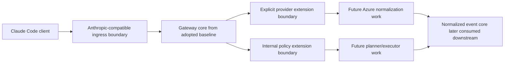

# Review Bundle - SEAM-1 Mux Foundation And Baseline Verification

This artifact feeds `gates.pre_exec.review`.
`../../review_surfaces.md` is pack orientation only.

## Falsification questions

- Can the imported baseline still force Anthropic-only, loopback-only, or host-credential assumptions into the gateway core even if the repo claims it is only establishing a foundation?
- Is `C-01` still vague enough that `SEAM-2` could not point to one provider-extension boundary and one baseline verification artifact before it starts execution?
- Could the team treat upstream commit `5a372fb` as sufficient Kimi evidence without reproducing the Azure Foundry hidden-tool gap described in ADR 0002 and the handoff chain?

## R1 - Foundation adoption and downstream handoff

```mermaid
flowchart LR
  ADRS["Repo ADR set + Substrate constraints"] --> PLAN["SEAM-1 slices"]
  PLAN --> IMPORT["Adopted `claude-code-mux` baseline"]
  IMPORT --> BUILD["Local build / startup proof"]
  IMPORT --> BOUNDARY["Named extension boundary"]
  BUILD --> NOTE["`5a372fb` verification note"]
  BOUNDARY --> THR["THR-01 published for downstream seams"]
  NOTE --> THR
```

## R2 - Runtime shape this seam must preserve



## Likely mismatch hotspots

- The adopted baseline may keep Anthropic transport assumptions too deep in the core for `SEAM-3` and future Responses work to remain thin adapters.
- The local build or startup proof may depend on loopback HTTP, direct host credentials, or always-on host state that violates `IMPORTANT_SUBSTRATE_ALIGNMENT.md`.
- The `5a372fb` validation note may collapse native Kimi behavior and Azure Foundry hidden-tool behavior into one claim, leaving `SEAM-2` with a stale basis.

## Concrete execution baseline

- `C-01` now freezes one import topology: adopt the archived upstream baseline as the repo's primary codebase under `gateway/`, keep it close to baseline behavior long enough to prove it works, then perform targeted identity renames.
- The post-rename verification surface is concrete against the current docs-only repo state:
  - build check: `cargo build --manifest-path gateway/Cargo.toml -p substrate-gateway`
  - smoke check: `cargo run --manifest-path gateway/Cargo.toml -p substrate-gateway -- --help`
- The required execution order is explicit:
  - download and establish the archived baseline in `gateway/`
  - stabilize it at baseline behavior
  - rename identity surfaces that disconnect it from the old project naming
  - begin Azure/provider and gateway-feature modifications afterward
- The owned contract outputs are concrete enough for execution:
  - adoption note: `docs/foundation/claude-code-mux-adoption.md`
  - extension-boundary note: `docs/foundation/claude-code-mux-extension-boundary.md`
  - `5a372fb` validation note: `docs/foundation/claude-code-mux-5a372fb-validation.md`
- The adoption note must record the repo-local rename decisions explicitly:
  - source code lands under `gateway/`
  - `gateway/Cargo.toml` sets `package.name = "substrate-gateway"`
  - the initial stabilization pass happens before those renames begin
  - no ongoing upstream update path is assumed because the source repo is archived
- The extension-boundary note must preserve the pack review surfaces by naming:
  - one provider hook where Azure normalization attaches without leaking sentinel syntax downstream
  - one client-surface hook where Anthropic Messages remains the first ingress without becoming the core data model
  - one internal-policy hook where planner/executor routing stays above provider normalization

## Pre-exec findings

- No new remediation is required. The repo is still docs-only, but the seam-local plan now matches that reality by freezing an adopted archived baseline in `gateway/`, sequencing baseline stabilization first, and then performing the identity-renaming pass before deeper feature work.
- The contract gate can pass because `C-01` now has one explicit import topology, one concrete build/smoke path, and three named documentation outputs that downstream seams can cite without inventing new boundary language.
- The revalidation gate can pass because `SEAM-1` has no upstream closeout dependency, the target seam remains `active`, and the refreshed contract baseline is aligned with the current repository state and the handoff evidence chain.

## Pre-exec gate disposition

- **Review gate**: `passed`
- **Contract gate concerns**: none; `C-01` now fixes one repo-owned `gateway/` baseline path, one `substrate-gateway` crate identity, one manifest-path verification surface, and one concrete note set under `docs/foundation/`.
- **Revalidation prerequisites**: satisfied against the current docs-only repo state and the cited handoff evidence chain.
- **Opened remediations**: none

## Planned seam-exit gate focus

- **What must be true before downstream promotion is legal**: the downloaded baseline is landed at `gateway/` as crate `substrate-gateway`, the extension-boundary note is published, the `5a372fb` note is written against Azure-specific evidence, and no loopback-only or Anthropic-only core dependency remains as an undocumented assumption.
- **Which outbound contracts/threads matter most**: `C-01` and `THR-01`
- **Which review-surface deltas would force downstream revalidation**: any change to the provider hook location, any core coupling to Anthropic-specific state, and any verification result showing `5a372fb` does not cover the Azure Kimi gap assumed by `SEAM-2`
