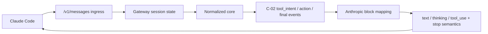
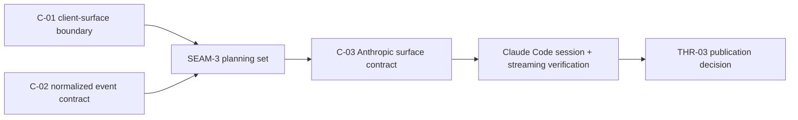

# Review Bundle - SEAM-3 Anthropic Messages Gateway Surface

This artifact feeds `gates.pre_exec.review`.
`../../review_surfaces.md` is pack orientation only.

## Falsification questions

- Does the Anthropic surface still depend on raw Azure payload framing, hidden sentinel syntax, or provider-specific chunk ordering because the `/v1/messages` path bypasses landed `C-02` semantics?
- Does the session and tool-result loop freeze Anthropic-only state or data shapes into the core in a way that would make later Responses work more than a thin outer adapter?
- Do public route behavior, docs, or config leak planner/executor role selection or other internal policy truth that belongs to `SEAM-4` instead of the first public-surface seam?

## R1 - Public surface over the normalized core

## R2 - Revalidated basis and owned contract boundary

## Likely mismatch hotspots

- `gateway/src/providers/openai.rs` already renders Anthropic-compatible content blocks, so `SEAM-3` must keep that rendering downstream of normalized events instead of letting provider-specific response shape leak back into the surface contract.
- `gateway/src/server/mod.rs` already treats `/v1/messages` as the primary path, which is helpful, but it can still hide Anthropic-only assumptions in session carry-forward and tool-result handling if the core boundary is not named explicitly.
- Later planner/executor policy or diagnostics could leak into surface-visible model identity, headers, or docs unless `C-03` keeps public behavior capability-oriented.

## Pre-exec findings

- The upstream handoff is now current: `SEAM-1` and `SEAM-2` closeouts are landed, `SEAM-2` recorded `seam_exit_gate.status: passed`, `promotion_readiness: ready`, and both `THR-01` and `THR-02` are usable promotion inputs.
- The codebase already has concrete client-surface anchors in `gateway/src/server/mod.rs` and Anthropic block-rendering anchors in `gateway/src/providers/openai.rs`, so this seam can plan concrete surface work instead of inventing a new ingress family.
- No blocking pre-exec remediation is required: the owned `C-03` contract can be made execution-grade in seam-local planning while keeping raw Azure semantics inside `C-02` and leaving policy ownership in `SEAM-4`.

## Pre-exec gate disposition

- **Review gate**: `passed`
- **Contract gate**: `passed`; `S1` freezes the owned `C-03` block mapping, session/tool-result loop rules, and the thin-adapter boundary for later Responses work
- **Revalidation gate**: `passed`; the seam was rechecked against `docs/foundation/claude-code-mux-extension-boundary.md`, `docs/foundation/azure-kimi-c02-normalized-event-contract.md`, `gateway/src/server/mod.rs`, and `gateway/src/providers/openai.rs`
- **Opened remediations**: none

## Planned seam-exit gate focus

- **What must be true before downstream promotion is legal**: `C-03` is concrete and landed, `/v1/messages` behavior is verified against Claude Code expectations on top of normalized events, and no public behavior forces downstream seams to understand raw provider payloads or internal policy roles.
- **Which outbound contracts/threads matter most**: `C-03` and `THR-03`
- **Which review-surface deltas would force downstream revalidation**: changed Anthropic block mapping, changed session/tool loop guarantees, public exposure of internal routing roles, or any surface drift that makes future Responses work more than a thin outer adapter
