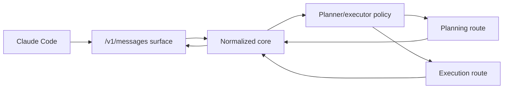
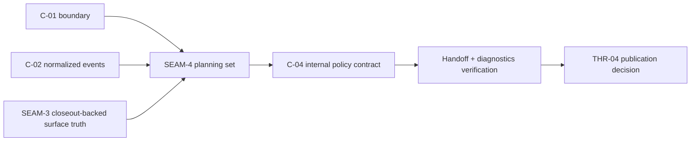

# Review Bundle - SEAM-4 Planner Executor Orchestration

This artifact feeds `gates.pre_exec.review`.
`../../review_surfaces.md` is pack orientation only.

## Falsification questions

- Does planner/executor routing still depend on provider-specific parsing or raw Azure framing instead of the landed normalized `C-02` event contract?
- Do internal route-selection or handoff rules leak planner/executor identity into the landed `C-03` public surface, docs, or diagnostics?
- Does session handoff require Anthropic-only state or public-surface assumptions that would make later conformance or adapter work more than a thin layer over the same normalized core?

## R1 - Internal policy over the landed public surface

## R2 - Policy boundary and downstream handoff

## Likely mismatch hotspots

- `gateway/src/router/mod.rs` already owns routing decisions, so this seam must keep policy there instead of smearing provider-aware branches across the server or provider layers.
- `gateway/src/server/mod.rs` now has explicit continuation coverage, which is useful, but policy work must avoid turning those internal cues into public contract guarantees.
- The landed `C-03` note keeps public behavior capability-oriented, so diagnostics and config work here must not backdoor planner/executor identity into public-facing examples or headers.

## Pre-exec findings

- The upstream handoff is now current: `SEAM-1`, `SEAM-2`, and `SEAM-3` closeouts are landed, and `THR-03` is published as closeout-backed public-surface truth even though this seam still owns `THR-04`.
- The codebase already has a concrete policy anchor in `gateway/src/router/mod.rs`, so this seam can plan explicit internal orchestration work without inventing a new ownership surface.
- No blocking pre-exec remediation is required: the owned `C-04` contract can be made execution-grade in seam-local planning while keeping public contract ownership in `SEAM-3` and external lock-in in `SEAM-5`.

## Pre-exec gate disposition

- **Review gate**: `passed`
- **Contract gate**: `passed`; `S1` freezes the owned `C-04` contract, handoff invariants, and internal/public boundary rules for planner/executor policy
- **Revalidation gate**: `passed`; the seam was rechecked against `docs/foundation/anthropic-messages-c03-contract.md`, `docs/foundation/azure-kimi-c02-normalized-event-contract.md`, `gateway/src/router/mod.rs`, and `gateway/src/server/mod.rs`
- **Opened remediations**: none

## Planned seam-exit gate focus

- **What must be true before downstream promotion is legal**: `C-04` is concrete and landed, planning-to-execution handoff is verified on normalized events, and no public behavior or public identity leaks planner/executor role truth
- **Which outbound contracts/threads matter most**: `C-04` and `THR-04`
- **Which review-surface deltas would force downstream revalidation**: changed route-selection invariants, changed state-handoff guarantees, public exposure of internal roles, or any policy shift that changes external identity assumptions
