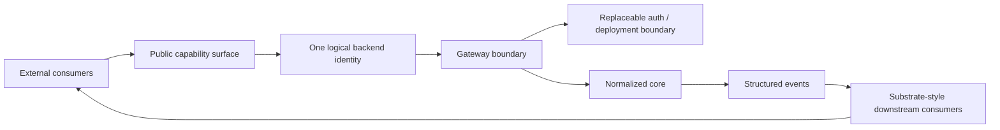
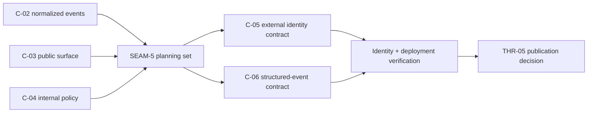

# Review Bundle - SEAM-5 Substrate Compatible Boundary

This artifact feeds `gates.pre_exec.review`.
`../../review_surfaces.md` is pack orientation only.

## Falsification questions

- Does public configuration or documentation still expose separate planner, executor, or provider identities instead of one logical backend identity?
- Does the deployment/auth boundary still assume loopback-local transport as a contract rather than a convenience?
- Do downstream consumers still need raw provider chunks or internal policy roles instead of normalized structured events?

## R1 - One logical backend identity

## R2 - Boundary, policy, and event shape

## R3 - Downstream conformance posture

## Likely mismatch hotspots

- `docs/project_management/packs/active/azure-kimi-claude-gateway/seam-5-substrate-compatible-boundary.md` can drift into a future-only posture if it keeps `SEAM-5` described as queued instead of active and exec-ready.
- `gateway/src/server/mod.rs` and config docs can accidentally hard-code localhost-style assumptions even when the pack is trying to keep deployment replaceable.
- Downstream schema or docs can reintroduce raw provider transport detail if `C-06` is not kept normalized and stable.

## Pre-exec findings

- `THR-04` is now published from `SEAM-4`, so the remaining boundary seam can consume closeout-backed policy truth rather than waiting on speculative internal routing.
- The pack already names one logical backend identity and normalized structured events as the downstream shape, so `SEAM-5` can plan concrete conformance work instead of inventing a new capability family.
- No blocking pre-exec remediation is required: the owned `C-05` and `C-06` contracts can be made execution-grade in seam-local planning while keeping public contract ownership in the gateway and external lock-in out of the earlier seams.

## Pre-exec gate disposition

- **Review gate**: `passed`
- **Contract gate**: `passed`; `S1` freezes the owned public identity and deployment boundary, while `S2` freezes normalized downstream structured events and drift guards
- **Revalidation gate**: `passed`; the seam was rechecked against `docs/foundation/anthropic-messages-c03-contract.md`, `docs/foundation/azure-kimi-c02-normalized-event-contract.md`, `docs/foundation/planner-executor-c04-policy-contract.md`, and `docs/project_management/packs/active/azure-kimi-claude-gateway/threading.md`
- **Opened remediations**: none

## Planned seam-exit gate focus

- **What must be true before downstream promotion is legal**: `C-05` and `C-06` are concrete and landed in seam-local planning, public configuration and docs describe one stable backend identity, deployment/auth remain replaceable, and downstream consumers can rely on normalized structured events.
- **Which outbound contracts/threads matter most**: `C-05`, `C-06`, and `THR-05`
- **Which review-surface deltas would force downstream revalidation**: public identity drift, transport/auth factoring changes, or event-shape changes that expose internal roles or raw provider streams
