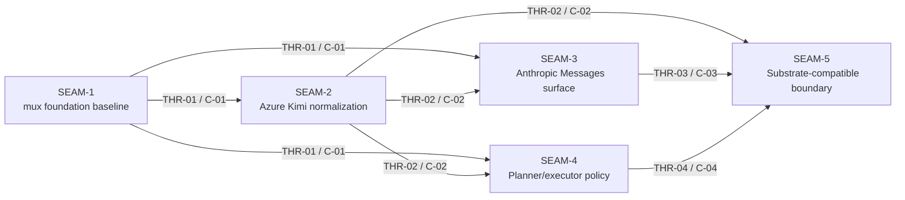

# Threading - Azure Kimi Claude Gateway

## Execution horizon summary

- **Active seam**: none remaining in this pack
- **Next seam**: none remaining in this pack
- **Policy**:
  - no seam remains eligible for authoritative downstream decomposition inside this pack because the forward window is closed
  - no later seam remains in this pack, so the forward window ends here
  - `SEAM-5` has now frozen the external boundary on closeout-backed `C-05` and `C-06` truth and published `THR-05`

## Contract registry

- **Contract ID**: `C-01`
  - **Type**: `config`
  - **Owner seam**: `SEAM-1`
  - **Direct consumers**: `SEAM-2`, `SEAM-3`, `SEAM-4`, `SEAM-5`
  - **Derived consumers**: future OpenAI Responses adapter work outside this default horizon
  - **Thread IDs**: `THR-01`
  - **Definition**: the adopted `claude-code-mux` baseline plus the documented extension boundary for Azure provider work and a verification note on what commit `5a372fb` actually covers
  - **Versioning / compat**: foundation updates must preserve the ability to add provider normalization and external API adapters without reintroducing Anthropic-only or loopback-only assumptions

- **Contract ID**: `C-02`
  - **Type**: `event`
  - **Owner seam**: `SEAM-2`
  - **Direct consumers**: `SEAM-3`, `SEAM-4`, `SEAM-5`
  - **Derived consumers**: future OpenAI Responses adapter work and downstream observability tooling
  - **Thread IDs**: `THR-02`
  - **Definition**: normalized internal tool/action/final event semantics for Azure Kimi, covering explicit `tool_calls` and hidden tool intent parsed from `reasoning_content`
  - **Versioning / compat**: downstream seams consume normalized semantics only and must not depend on raw sentinel syntax or provider chunk shape

- **Contract ID**: `C-03`
  - **Type**: `API`
  - **Owner seam**: `SEAM-3`
  - **Direct consumers**: Claude Code and Anthropic Messages-compatible clients
  - **Derived consumers**: `SEAM-5`, future OpenAI Responses adapter work
  - **Thread IDs**: `THR-03`
  - **Definition**: Anthropic Messages-compatible ingress and streaming gateway surface backed by the normalized core rather than raw provider transport
  - **Versioning / compat**: public contract stays capability-oriented and must not force downstream refactors when future Responses support is added

- **Contract ID**: `C-04`
  - **Type**: `config`
  - **Owner seam**: `SEAM-4`
  - **Direct consumers**: `SEAM-3`, `SEAM-5`
  - **Derived consumers**: operators and future policy/config integration surfaces
  - **Thread IDs**: `THR-04`
  - **Definition**: internal planner/executor routing policy and state-handoff rules that can use `Kimi-K2-Thinking` and `Kimi-K2.5` without leaking those roles into the public backend identity
  - **Versioning / compat**: policy remains internal and replaceable; no public backend id or downstream consumer may require direct role selection

- **Contract ID**: `C-05`
  - **Type**: `config`
  - **Owner seam**: `SEAM-5`
  - **Direct consumers**: future Substrate config and deployment integration work
  - **Derived consumers**: operators, policy surfaces, deployment wrappers
  - **Thread IDs**: `THR-05`
  - **Definition**: one logical backend identity and replaceable deployment/auth boundary for the gateway
  - **Versioning / compat**: capability-oriented external naming must stay stable even if internal provider or orchestration policy changes

- **Contract ID**: `C-06`
  - **Type**: `event`
  - **Owner seam**: `SEAM-5`
  - **Direct consumers**: future Substrate agent-hub and shell/repl integration work
  - **Derived consumers**: observability and persistence surfaces
  - **Thread IDs**: `THR-05`
  - **Definition**: downstream structured-event contract emitted from the normalized gateway rather than raw provider stream frames
  - **Versioning / compat**: downstream consumers may depend on stable event semantics and durable structure, not provider transport details

## Thread registry

- **Thread ID**: `THR-01`
  - **Producer seam**: `SEAM-1`
  - **Consumer seam(s)**: `SEAM-2`, `SEAM-3`, `SEAM-4`, `SEAM-5`
  - **Carried contract IDs**: `C-01`
  - **Purpose**: freeze the real gateway foundation and extension points before downstream seams plan against speculative upstream behavior
  - **State**: `revalidated`
  - **Revalidation trigger**: upstream `claude-code-mux` import strategy changes materially or `5a372fb` proves insufficient enough to require a different foundation shape
  - **Satisfied by**: buildable local foundation, explicit provider-extension boundary, and written verification note on the Azure Kimi gap
  - **Notes**: this thread was published by the SEAM-1 closeout record and has now been revalidated by `SEAM-3` pre-exec review against the landed `C-01` client-surface boundary; later consumers still rerun promotion-time revalidation if a stale trigger fires

- **Thread ID**: `THR-02`
  - **Producer seam**: `SEAM-2`
  - **Consumer seam(s)**: `SEAM-3`, `SEAM-4`, `SEAM-5`
  - **Carried contract IDs**: `C-02`
  - **Purpose**: provide a stable normalized event contract so downstream seams never consume Azure sentinel syntax directly
  - **State**: `revalidated`
  - **Revalidation trigger**: new Azure evidence shows additional hidden-tool variants, or the normalized event contract changes in a way that affects surface semantics or policy routing
  - **Satisfied by**: fixtures and probes showing explicit streamed tool calls, streamed hidden markers, and hidden non-stream tool intent normalize into one internal model with named invariants
  - **Notes**: this thread was published by the SEAM-2 closeout record and has now been revalidated by `SEAM-3` pre-exec review against the landed `C-02` event contract and current server/provider anchors; later seams still consume promotion-time stale triggers rather than assuming this one revalidation exhausts all downstream review

- **Thread ID**: `THR-03`
  - **Producer seam**: `SEAM-3`
  - **Consumer seam(s)**: `SEAM-5`
  - **Carried contract IDs**: `C-03`
  - **Purpose**: carry the first public Anthropic client contract into later external-boundary conformance work
  - **State**: `published`
  - **Revalidation trigger**: normalized event semantics or internal orchestration policy changes the surface-level tool or streaming behavior
  - **Satisfied by**: the landed `C-03` contract note, S2 verification in `gateway/src/server/mod.rs`, and the existing provider verification surface in `gateway/src/providers/openai.rs`
  - **Notes**: `THR-03` was published by the `SEAM-3` closeout record; future OpenAI Responses work should consume the same normalized core rather than fork execution

- **Thread ID**: `THR-04`
  - **Producer seam**: `SEAM-4`
  - **Consumer seam(s)**: `SEAM-3`, `SEAM-5`
  - **Carried contract IDs**: `C-04`
  - **Purpose**: carry internal routing policy truth without turning it into public backend identity
  - **State**: `published`
  - **Revalidation trigger**: model-role assumptions change, or the planner/executor split requires new session-state guarantees from upstream seams
  - **Satisfied by**: a concrete internal policy contract plus at least one proved planning-to-execution handoff through normalized events
  - **Notes**: this thread may partially overlap `SEAM-3`, but it remains an internal contract rather than a public surface

- **Thread ID**: `THR-05`
  - **Producer seam**: `SEAM-5`
  - **Consumer seam(s)**: future Substrate integration work outside this pack
  - **Carried contract IDs**: `C-05`, `C-06`
  - **Purpose**: lock in a stable external identity and structured-event boundary so Substrate can consume the gateway later without architectural inversion
  - **State**: `published`
  - **Revalidation trigger**: upstream seams land with public naming, transport, or event-shape deltas that change the external integration posture
  - **Satisfied by**: explicit external identity and structured-event boundary evidence recorded in the landed `SEAM-5` closeout, `C-05`, `C-06`, and their drift guards
  - **Notes**: `THR-05` was published by the `SEAM-5` closeout record so later Substrate integration work can consume boundary truth without reopening provider or identity seams

## Dependency graph

## Critical path

1. `SEAM-1` established the real foundation and published `THR-01` for downstream use.
2. `SEAM-2` has now published `THR-02` and frozen the Azure normalization contract on top of that published foundation.
3. `SEAM-3` has now landed, published `THR-03`, and frozen the first public-surface contract on closeout-backed `C-03` truth.
4. `SEAM-4` has now landed and published `THR-04`, closing the internal-policy seam on revalidated `C-01`, `C-02`, and landed `C-03` truth.
5. `SEAM-5` has now landed, published `THR-05`, and closed the boundary-conformance seam on closeout-backed `C-05` and `C-06` truth.

## Workstreams

- **WS-A Foundation**: `SEAM-1` landed and published `THR-01`
- **WS-B Normalized core**: `SEAM-2` has landed and published `THR-02` on top of the published `THR-01` foundation
- **WS-C Public surface**: `SEAM-3` has landed and published `THR-03` on top of revalidated `THR-01` and `THR-02`
- **WS-D Internal policy**: `SEAM-4` has landed and published `THR-04`, so the internal-policy seam is now closeout-backed truth instead of a forward blocker
- **WS-E Boundary lock-in**: `SEAM-5` has now landed and published `THR-05`, so external identity and structured-event expectations are closed out on the published `THR-04` handoff
