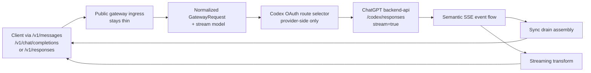
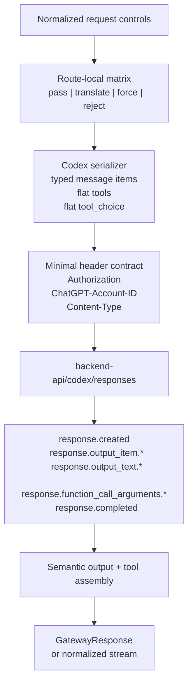
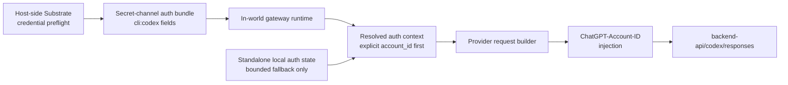

# Review Surfaces - ChatGPT Codex OAuth Backend-API Responses

These diagrams orient the pack. They show the actual product/work shape that is expected to land.
They do not, by themselves, satisfy seam-local pre-exec review.
Active and next seams still require seam-local `review.md` artifacts later.

## R1 - End-to-end routed Codex OAuth turn

## R2 - Route compatibility and stream assembly boundary

## R3 - Integrated auth-handoff owner line

## Review intent

- `R1` makes the delivery target explicit: public ingress stays thin while the routed provider path becomes a dedicated ChatGPT Codex transport
- `R2` highlights the seam-1 review surface that must become canonical before implementation: compatibility classification, serializer shape, minimal headers, and semantic event assembly
- `R3` makes the seam-2 trust boundary explicit so integrated auth delivery and standalone fallback cannot blur into one implicit owner line
