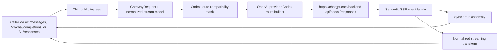
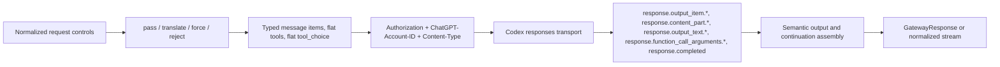

# Review Bundle - SEAM-1 ChatGPT Codex Route Contract And Stream-Native Transport

This artifact feeds `gates.pre_exec.review`.
`../../review_surfaces.md` is pack orientation only.

## Falsification questions

- Can the route still behave as two different upstream transports by sending sync traffic to `/codex/responses` while streaming traffic stays on `/responses`, or has the plan made one endpoint and one header contract mandatory?
- Does the owned contract now fully freeze which caller-visible controls are passed, translated, forced, or rejected, or would an implementer still have to guess about generic Responses fields, nested tool shapes, or `tool_choice = "required"`?
- Can sync success still be reported from partial semantic output without terminal `response.completed`, or do the seam-local slices make malformed or truncated sync drains fail deterministically with `502 transport_drift`?

## R1 - Routed Codex OAuth flow that must land

## R2 - Contract and implementation boundary that must remain true

## Likely mismatch hotspots

- `crates/gateway/src/providers/openai.rs` currently treats sync and streaming differently at the endpoint boundary, so the first implementation slice must remove `/responses` streaming drift and enforce one Codex route.
- The current provider path still carries extra Codex parity headers and generic Responses request shaping assumptions; the owned contract must freeze the minimal successful header set plus the explicit field allowlist/reject posture before implementation starts.
- Sync parsing currently risks trusting the terminal envelope more than the semantic stream. The plan must keep `response.completed` as lifecycle/usage truth while making semantic event families authoritative for assembled output and tool arguments.
- Tool continuation and reasoning handling are easy to “mostly support” while violating route truth. The slices must keep continuation synthesis provenance-based, preserve normalized-history order, and keep encrypted reasoning non-public even when the upstream stream includes it.

## Pre-exec findings

- The upstream OpenAI-side basis is landed and ready: `crates/gateway/docs/project_management/packs/active/openai-side-chat-completions-and-responses/governance/seam-2-closeout.md` and `.../seam-3-closeout.md` both record `seam_exit_gate.status: passed`, `promotion_readiness: ready`, and passed post-exec landing evidence.
- ADR 0010 plus `crates/gateway/docs/IMPORTANT_SUBSTRATE_ALIGNMENT.md` are concrete enough to freeze the owned route contract without inventing post-exec truth. The seam-local plan now turns that direction into execution-grade contract, implementation, and conformance slices.
- `crates/gateway/docs/contracts/chatgpt-codex-route-contract.md` now gives the producer seam one descriptive canonical contract path, while the slice set makes the contract concrete enough for implementation and verification without waiting on landing-time publication evidence.
- No blocking pre-exec remediation is required. Remaining uncertainty is already captured as explicit stale triggers in `seam.md` and the slice basis metadata.

## Pre-exec gate disposition

- **Review gate**: `passed`
- **Contract gate**: `passed`
  - the owned route contract now names one endpoint, one minimal header contract, one compatibility matrix, one continuation rule set, and one semantic event assembly rule set
  - the contract note and slice set keep auth ownership out of this seam while making the consumed `ChatGPT-Account-ID` input explicit
- **Revalidation gate**: `passed`
  - the seam basis is current against the landed upstream OpenAI-side public contract and conformance closeouts, and this seam has no inbound thread that must be published before execution planning can begin
- **Opened remediations**: none

## Planned seam-exit gate focus

- **What must be true before downstream promotion is legal**: the canonical route contract lands, sync and streaming both use `/backend-api/codex/responses`, the minimal-header and compatibility matrix behavior is proven by deterministic verification, semantic assembly comes from the stream event family, and sync drain fails cleanly on transport drift instead of returning partial success.
- **Which outbound contracts/threads matter most**: `C-14`, `THR-14`
- **Which review-surface deltas would force downstream revalidation**: changes to the minimal header contract, field allowlist/reject posture, continuation synthesis/order rules, semantic event family, sync-drain failure classification, or reasoning-visibility rule
