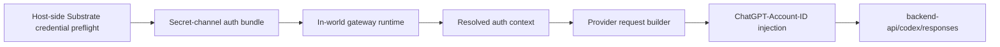
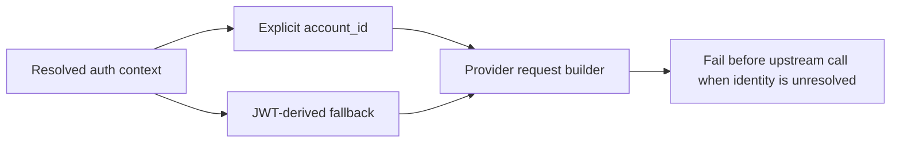

# Review Bundle - SEAM-2 Substrate Auth Handoff And Account-Id Provenance

This artifact feeds `gates.pre_exec.review`.
`../../review_surfaces.md` is pack orientation only.

## Falsification questions

- Can integrated mode still claim to be Substrate-owned if the in-world gateway runtime reads host-local auth files to recover account identity?
- Does the plan still preserve explicit `account_id` precedence over JWT fallback, or would the provider path quietly redefine ownership by parsing whatever token shape happens to exist?
- Does the failure posture still stop before the upstream call when no valid account identity exists, or does the seam risk deferring the error until provider-side behavior fails later?

## R1 - Auth ownership flow that must land

## R2 - Ownership and fallback boundary that must remain true

## Likely mismatch hotspots

- The current token store schema still lacks a first-class `account_id` field, which makes it easy for fallback behavior to masquerade as integrated ownership.
- The provider path already extracts account identity in `openai.rs`, but this seam must keep that as a consumer action rather than a trust-boundary decision.
- The current provider path still derives `ChatGPT-Account-ID` from JWT fallback only, so execution must land a resolved-auth-context carrier before the owner line is true in code.

## Pre-exec findings

- `THR-14` was published by the seam-1 closeout and is now revalidated here against the landed route contract, the seam-1 closeout seam-exit record, and the current provider/auth evidence anchors.
- The owned canonical contract artifact now exists at `crates/gateway/docs/contracts/chatgpt-codex-auth-handoff-contract.md`, and `S00` records the integrated owner line, field identifiers, fallback order, and execution checklist concretely enough for implementation.
- `REM-001` remains open only as a landing-phase owner checklist for the S1/S2/S3 code and verification work that must publish `THR-15`; it no longer blocks `status: exec-ready`.

## Pre-exec gate disposition

- **Review gate**: `passed`
- **Contract gate**: `passed`; the owned auth-handoff baseline and execution checklist are now concrete in the canonical contract note plus `S00`
- **Revalidation gate**: `passed`; the seam was rechecked against `../../governance/seam-1-closeout.md`, `crates/gateway/docs/contracts/chatgpt-codex-route-contract.md`, `crates/gateway/src/providers/openai.rs`, `crates/gateway/src/auth/token_store.rs`, and `crates/gateway/src/server/mod.rs`
- **Open remediations**: `REM-001` remains open for landing and thread publication only

## Planned seam-exit gate focus

- **What must be true before downstream promotion is legal**: the canonical auth-handoff contract must exist, integrated mode must consume Substrate-delivered auth context first, JWT fallback must remain bounded, and the provider path must inject `ChatGPT-Account-ID` from resolved context without reintroducing host-local auth ownership.
- **Which outbound contracts/threads matter most**: `C-15`, `THR-15`
- **Which review-surface deltas would force downstream revalidation**: changes to owner-line precedence, fallback behavior, auth-field identifiers, delivery posture, or provider injection order
