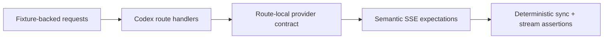
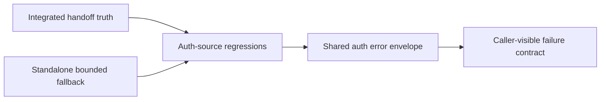

# Review Bundle - SEAM-3 Codex Route Conformance And Drift Guards

This artifact feeds `gates.pre_exec.review`.
`../../review_surfaces.md` remains pack orientation only.

## Falsification questions

- Do the planned regressions still prove the real route contract, or are they drifting toward implementation-shaped assertions that miss caller-visible breakage?
- Does the conformance plan keep integrated auth ownership and standalone fallback distinct, or would the suite accidentally bless standalone local behavior as integrated truth?
- Does the suite still fail before caller-visible drift ships when the route matrix, semantic event assembly, or auth-failure envelope changes?

## R1 - Deterministic route regression surface

## R2 - Auth provenance verification surface

## Likely mismatch hotspots

- The route already has strong provider-local tests, but SEAM-3 must keep route-boundary and doc-level evidence aligned so maintenance does not rely on private code knowledge alone.
- Auth provenance is now closeout-backed, so the conformance seam must assert that integrated truth and standalone fallback stay distinct instead of treating any successful header injection as sufficient proof.
- Maintenance docs can easily drift toward generic OAuth guidance; the conformance seam must keep route-specific stale triggers and evidence anchors explicit.

## Pre-exec findings

- `THR-14` and `THR-15` are both published and revalidated against `../../governance/seam-1-closeout.md`, `../../governance/seam-2-closeout.md`, the canonical route and auth-handoff contract notes, and the current route/docs test surfaces.
- The owned conformance contract baseline can now be made concrete in `S00` without waiting on further upstream truth.
- No blocking pre-exec remediations remain open for this seam.

## Pre-exec gate disposition

- **Review gate**: `passed`
- **Contract gate**: `passed`; the owned conformance contract target and execution checklist are concrete in `S00`
- **Revalidation gate**: `passed`; the seam was refreshed against the landed route and auth closeouts plus the current deterministic regression anchors
- **Open remediations**: none

## Planned seam-exit gate focus

- **What must be true before downstream publication is legal**: the conformance contract must be concrete, deterministic regressions must cover the route matrix and auth-source posture, and docs must identify the same stale triggers the tests protect
- **Which outbound contracts/threads matter most**: `C-16`, `THR-16`
- **Which review-surface deltas would force downstream revalidation**: route compatibility changes, auth-source rule changes, or maintenance evidence anchors moving
