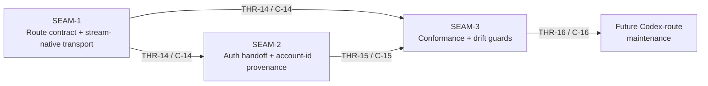

# Threading - ChatGPT Codex OAuth Backend-API Responses

## Execution horizon summary

- **Active seam**: `SEAM-3`
- **Next seam**: none yet
- **Policy**:
  - `SEAM-3` is now eligible for authoritative downstream decomposition because both `THR-14` and `THR-15` are published and closeout-backed
  - only `SEAM-3` is eligible for authoritative downstream decomposition by default
  - canonical contract refs for this pack are reserved under `crates/gateway/docs/contracts/`

## Contract registry

- **Contract ID**: `C-14`
  - **Type**: `API`
  - **Owner seam**: `SEAM-1`
  - **Direct consumers**: `SEAM-2`, `SEAM-3`
  - **Derived consumers**: future Codex-route maintenance and any later provider-side work that must preserve public ingress semantics while changing the routed upstream transport
  - **Thread IDs**: `THR-14`
  - **Definition**: the dedicated ChatGPT Codex OAuth route contract for `https://chatgpt.com/backend-api/codex/responses`, including endpoint parity for sync and streaming, the `pass | translate | force | reject` compatibility overlay, typed `message` item emission, flat function tool/tool-choice shapes, semantic stream assembly, sync-drain failure behavior, and the non-public reasoning visibility rule
  - **Canonical contract ref**: `crates/gateway/docs/contracts/chatgpt-codex-route-contract.md`
  - **Versioning / compat**: route compatibility widens only through explicit route-specific revalidation; unsupported caller-visible controls must fail explicitly rather than being silently stripped or degraded

- **Contract ID**: `C-15`
  - **Type**: `state`
  - **Owner seam**: `SEAM-2`
  - **Direct consumers**: `SEAM-3`
  - **Derived consumers**: future Substrate integration and standalone-compat maintenance work
  - **Thread IDs**: `THR-15`
  - **Definition**: the ChatGPT Codex auth-handoff contract for integrated and standalone mode, including authoritative account-id ownership, auth field identifiers, delivery posture, explicit `account_id` precedence over JWT fallback, and pre-upstream failure behavior when no valid account identity exists
  - **Canonical contract ref**: `crates/gateway/docs/contracts/chatgpt-codex-auth-handoff-contract.md`
  - **Versioning / compat**: integrated mode keeps Substrate as the owner of host credential reads and secret delivery; standalone mode remains a bounded fallback and must not redefine that owner line

- **Contract ID**: `C-16`
  - **Type**: `UX affordance`
  - **Owner seam**: `SEAM-3`
  - **Direct consumers**: gateway maintainers and operators
  - **Derived consumers**: future Codex-route changes that need drift-guard evidence before they land
  - **Thread IDs**: `THR-16`
  - **Definition**: deterministic conformance and drift-guard suite for the ChatGPT Codex route, covering accepted vs rejected request controls, sync/stream parity, continuation synthesis/order rules, reasoning gating, auth-source rules, and the route's no-silent-degradation posture
  - **Canonical contract ref**: `crates/gateway/docs/contracts/chatgpt-codex-conformance-and-drift-guard.md`
  - **Versioning / compat**: the suite should stay offline and deterministic where possible, using captured probe evidence and fixture-backed expectations instead of live upstream network dependence in the core regression path

## Thread registry

- **Thread ID**: `THR-14`
  - **Producer seam**: `SEAM-1`
  - **Consumer seam(s)**: `SEAM-2`, `SEAM-3`
  - **Carried contract IDs**: `C-14`
  - **Purpose**: publish the route contract and stream-native transport truth so auth ownership and conformance work can build on named, reviewable route behavior instead of ADR prose alone
  - **State**: `revalidated`
  - **Revalidation trigger**: the upstream endpoint path, minimal header contract, accepted-field subset, continuation legality rules, or authoritative semantic event family changes
  - **Satisfied by**: the canonical route contract note plus deterministic provider-focused verification that proves sync and streaming share the same upstream event source and compatibility overlay
  - **Notes**: this thread was published by the `SEAM-1` closeout record and has now been revalidated by `SEAM-2` pre-exec review against the landed route contract, the seam-1 seam-exit record, and the current provider/auth evidence anchors; later consumers still rerun promotion-time revalidation if a stale trigger fires

- **Thread ID**: `THR-15`
  - **Producer seam**: `SEAM-2`
  - **Consumer seam(s)**: `SEAM-3`
  - **Carried contract IDs**: `C-15`
  - **Purpose**: publish the integrated-versus-standalone auth owner line so conformance work can prove account-id sourcing, failure posture, and header injection without rediscovering trust-boundary assumptions
  - **State**: `revalidated`
  - **Revalidation trigger**: Substrate auth-bundle delivery semantics, the closed `cli:codex` field set, standalone compatibility inputs, or provider auth-context resolution rules change materially
  - **Satisfied by**: the canonical auth-handoff contract plus verification surfaces that prove integrated mode does not require host-local auth-file reads while standalone mode remains bounded
  - **Notes**: this thread was published by the `SEAM-2` closeout record and is now revalidated for `SEAM-3` against the landed auth-handoff contract, auth-context resolution, provider injection proof, and OAuth doc alignment

- **Thread ID**: `THR-16`
  - **Producer seam**: `SEAM-3`
  - **Consumer seam(s)**: future maintenance work outside this pack
  - **Carried contract IDs**: `C-16`
  - **Purpose**: publish the drift-guard baseline so future route changes cannot silently regress request shaping, semantic event assembly, or auth provenance
  - **State**: `identified`
  - **Revalidation trigger**: new route-specific controls are added, upstream behavior drifts, or auth/normalized-core changes require fixture updates
  - **Satisfied by**: deterministic fixtures, route-local regression tests, and documentation that explicitly names what the Codex route preserves, forces, translates, and rejects
  - **Notes**: this thread should remain the maintenance and revalidation surface for future Codex-route work rather than turning every drift fix into a fresh discovery cycle

## Dependency graph

## Critical path

1. Freeze `C-14` so the gateway has one explicit ChatGPT Codex route contract for endpoint parity, compatibility overlay, typed message items, semantic stream assembly, and sync-drain failure behavior.
2. Freeze `C-15` so integrated mode consumes Substrate-delivered auth context with explicit account-id precedence and standalone mode is reduced to a bounded fallback.
3. Publish `C-16` so future route changes are forced through deterministic drift guards instead of silent behavior changes.

## Workstreams

- **WS-A Route contract and provider boundary**: `SEAM-1` owns the provider-side request/response contract, event assembly, and route-local compatibility matrix
- **WS-B Auth ownership and handoff**: `SEAM-2` owns integrated-versus-standalone account-id provenance, auth bundle semantics, and provider header injection ownership
- **WS-C Conformance and documentation**: `SEAM-3` owns deterministic regressions, fixture/evidence posture, and route-specific maintenance guidance
