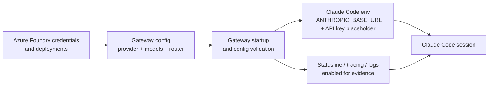
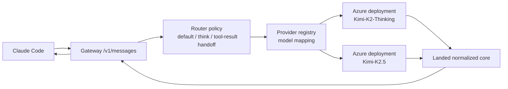
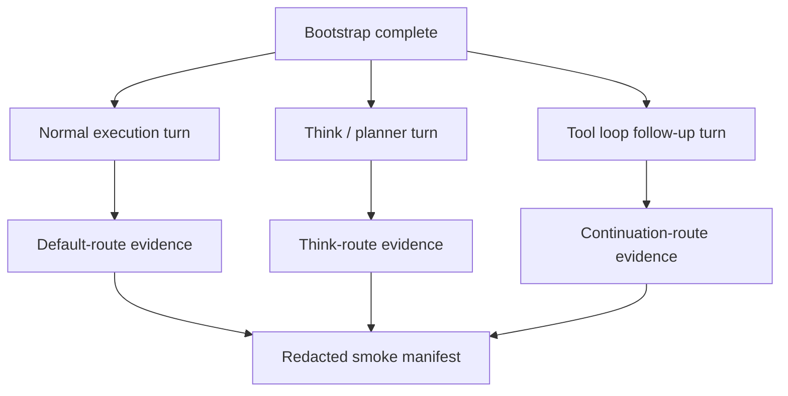
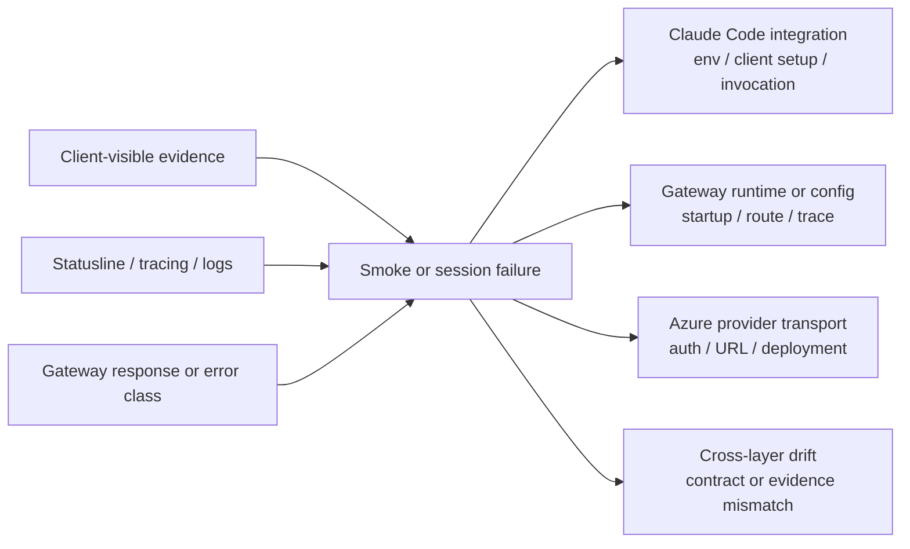

# Review Surfaces - Claude Code Live Integration Smoke

These diagrams orient the pack. They show the actual product/work shape that is expected to land.
They do not, by themselves, satisfy seam-local pre-exec review.
Active and next seams still require seam-local `review.md` artifacts later.

## R1 - Operator bootstrap flow

## R2 - Live request and routing path

## R3 - Smoke coverage map

## R4 - Troubleshooting and ownership branches

## Review intent

- `R1` forces the pack to show the exact operator path from Azure prerequisites into Claude Code rather than stopping at gateway-only setup
- `R2` keeps the live path grounded in the landed `/v1/messages` surface and internal routing policy instead of inventing a new public entrypoint
- `R3` makes the required smoke surface explicit: one normal turn, one think turn, and one tool-loop continuation path with named evidence
- `R4` makes failure ownership first-class so later seam planning cannot blur Claude Code, gateway, and Azure responsibilities together
