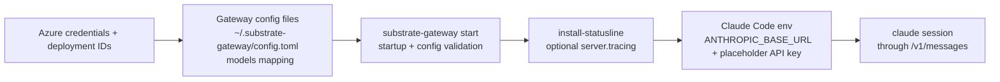
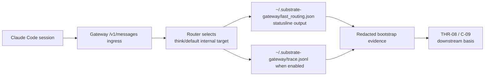

# Review Bundle - SEAM-1 Claude Code Operator Bootstrap

This artifact feeds `gates.pre_exec.review`.
`../../review_surfaces.md` is pack orientation only.

## Falsification questions

- Can an operator still follow the repo guidance and reach gateway startup without ever making the Claude Code attachment or pre-smoke evidence hooks explicit?
- Does the bootstrap plan still blur local loopback convenience and placeholder auth into architecture truth in a way that would mis-teach `C-05` and `C-08`?
- Do the planned statusline and trace surfaces still require reading runtime code or expose provider or deployment detail that should stay internal?

## R1 - Bootstrap workflow that should land

## R2 - Evidence chain the bootstrap seam must make explicit

## Likely mismatch hotspots

- `gateway/README.md`, the config examples, and the CLI-generated default config do not yet read as one canonical bootstrap story from Azure prerequisites through Claude Code launch.
- Statusline installation and message tracing already exist, but their role as required pre-smoke evidence hooks is still implicit instead of frozen in the owned bootstrap contract.
- The loopback host and placeholder API key are correct for local bootstrap, but they are easy to misread as architecture truth unless the boundary language is repeated where operators actually look.

## Pre-exec findings

- Revalidation passed against current repo anchors: `gateway/README.md` already documents the canonical Claude Code env flow, `substrate-gateway install-statusline`, and optional `server.tracing` posture; `gateway/config/default.example.toml` and `gateway/config/models.example.toml` already encode the Azure Kimi model mapping expected by `C-09`.
- Runtime anchors still match the planned evidence story: `gateway/src/main.rs` installs the Claude Code statusline into `~/.substrate-gateway/statusline.sh`, `gateway/src/server/mod.rs` writes `~/.substrate-gateway/last_routing.json`, and the tracing config still defaults to `~/.substrate-gateway/trace.jsonl`.
- No blocking remediation is required for pre-exec promotion. The missing final `docs/foundation/claude-code-c09-operator-bootstrap-contract.md` artifact remains owned execution work in `S1` and `S2`, not a pre-exec blocker, because the artifact path, boundary rules, evidence-hook posture, and verification checklist are already concrete in seam-local planning.

## Pre-exec gate disposition

- **Review gate**: `passed`
- **Contract gate**: `passed` because the owned `C-09` baseline, artifact path, boundary language, evidence-hook expectations, and execution-grade reviewer checklist are explicit across `seam.md`, `S1`, and `S2`
- **Revalidation gate**: `passed` after rechecking `gateway/README.md`, `gateway/config/default.example.toml`, `gateway/config/models.example.toml`, `gateway/src/cli/mod.rs`, `gateway/src/main.rs`, `gateway/src/server/mod.rs`, `docs/foundation/azure-foundry-c07-runtime-transport-contract.md`, and `docs/foundation/azure-foundry-c08-operator-verification-contract.md`
- **Opened remediations**: none

## Planned seam-exit gate focus

- **What must be true before downstream promotion is legal**: `C-09` is landed, the bootstrap docs and helper surfaces match runtime behavior, `THR-08` is explicitly published, and `SEAM-2` can consume the evidence-hook posture without guessing
- **Which outbound contracts/threads matter most**: `C-09` and `THR-08`
- **Which review-surface deltas would force downstream revalidation**: changes to config-file path or startup validation, changes to statusline or trace output expectations, changes to Claude Code attachment commands, or changes to routed-model evidence that affect what operators can prove before smoke execution
