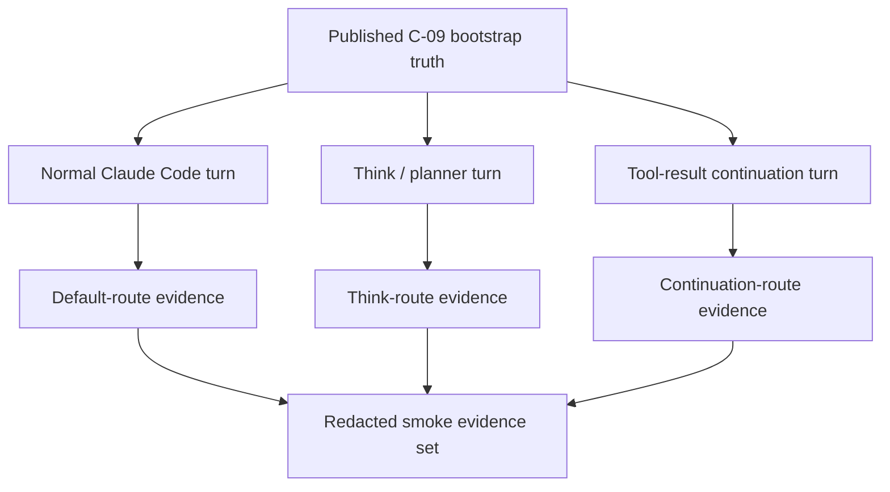
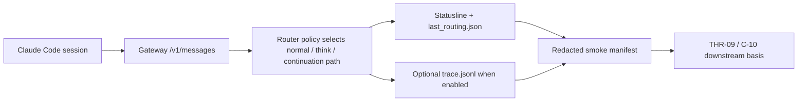

# Review Bundle - SEAM-2 Live Session Smoke Verification

This artifact feeds `gates.pre_exec.review`.
`../../review_surfaces.md` remains pack orientation only.

## Falsification questions

- Can the planned smoke proof still be satisfied without using real Claude Code sessions, causing the seam to drift back into gateway-only or provider-only checks?
- Do the planned normal, think, and tool-loop continuation branches still leave route evidence or redaction posture implicit enough that operators would need to read runtime code to execute them safely?
- Does the current live-proof plan still risk exposing provider or deployment identity as public truth instead of using those labels only as internal route evidence?

## R1 - Live smoke branch coverage that should land

## R2 - Evidence chain the live smoke seam must make explicit

## Likely mismatch hotspots

- the published bootstrap README may still be interpreted as setup-only unless the live smoke scenarios and evidence branches are made explicit in one contract and one operator procedure
- route and continuation anchors already exist in the router and server surfaces, but the operator-facing evidence expectations are still implicit enough that later seams would otherwise rediscover them from code
- the live proof can drift into provider or gateway-only validation unless the contract keeps real Claude Code sessions, route evidence, and redaction posture explicit together

## Pre-exec findings

- Revalidation passed against the landed `SEAM-1` closeout and current repo anchors: `gateway/README.md` now publishes the bootstrap order and evidence-hook posture that `SEAM-2` consumes, while `docs/foundation/claude-code-c09-operator-bootstrap-contract.md` makes the bootstrap contract explicit.
- Current runtime anchors still support the intended live-proof branches: `gateway/src/router/mod.rs` documents tool-result continuation handoff in the route-order comments and keeps the think/default policy explicit, while `gateway/src/server/mod.rs` keeps `/v1/messages`, route-visible evidence, continuation injection, and failure taxonomy under test-backed anchors.
- No blocking remediation is required for pre-exec promotion. The missing final `docs/foundation/claude-code-c10-live-session-smoke-verification-contract.md` artifact and any smoke-procedure surface remain owned execution work in `S1` and `S2`, not pre-exec blockers, because the artifact path, scenario coverage, evidence posture, and verification checklist are already concrete in seam-local planning.

## Pre-exec gate disposition

- **Review gate**: `passed`
- **Contract gate**: `passed` because the owned `C-10` baseline, scenario matrix, artifact path, and verification checklist are explicit across `seam.md`, `S1`, and `S2`
- **Revalidation gate**: `passed` after rechecking `docs/project_management/packs/active/claude-code-live-integration-smoke/governance/seam-1-closeout.md`, `docs/foundation/claude-code-c09-operator-bootstrap-contract.md`, `gateway/README.md`, `gateway/src/router/mod.rs`, and `gateway/src/server/mod.rs`
- **Opened remediations**: none

## Planned seam-exit gate focus

- **What must be true before downstream promotion is legal**: `C-10` is landed, the smoke procedure and evidence expectations match runtime behavior, `THR-09` is explicitly published, and `SEAM-3` can consume live smoke truth without guessing
- **Which outbound contracts/threads matter most**: `C-10` and `THR-09`
- **Which review-surface deltas would force downstream revalidation**: changes to the scenario set, route or continuation evidence expectations, redaction posture, or Claude Code behavior assumptions that affect what operators can prove from real sessions
