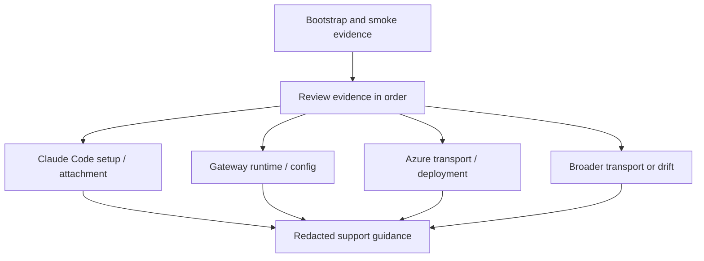
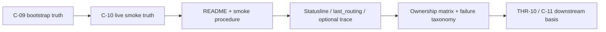

# Review Bundle - SEAM-3 Troubleshooting And Support Boundary

This artifact feeds `gates.pre_exec.review`.
`../../review_surfaces.md` remains pack orientation only.

## Falsification questions

- Can the planned troubleshooting boundary still blur Claude Code setup, gateway runtime/config, Azure transport, and broader drift enough that operators cannot classify failures safely?
- Do the planned support surfaces still leave the evidence review order implicit enough that operators would need to read runtime code or unpublished seam docs to proceed?
- Does the current support plan still risk exposing provider, deployment, or planner/executor identity as public truth instead of keeping those labels internal or support-facing?

## R1 - Failure ownership path that should land

## R2 - Evidence review order the seam must make explicit

## Likely mismatch hotspots

- support guidance can become a vague cleanup bucket unless the ownership matrix keeps Claude Code setup, gateway runtime/config, Azure transport, and broader drift separated
- the bootstrap and smoke contracts already freeze the required evidence surfaces, but the review order is still implicit enough that future operators could otherwise rediscover it from code
- internal route, provider, or deployment labels can leak into public support guidance unless the redaction and boundary posture stays explicit together

## Pre-exec findings

- Revalidation passed against the landed `SEAM-1` and `SEAM-2` closeouts: `C-09` now freezes the canonical bootstrap path while `C-10` and the smoke procedure publish the live branch and evidence posture this seam consumes.
- Current runtime and doc anchors still support the intended troubleshooting flow: `gateway/README.md` names the operator-visible bootstrap and smoke surfaces, `gateway/src/router/mod.rs` keeps think and continuation routing concrete, and `gateway/src/server/mod.rs` keeps `/v1/messages`, `last_routing.json`, optional tracing, and continuation behavior under current anchors.
- The upstream failure taxonomy remains usable for this seam: `C-08` already distinguishes auth, URL, deployment, route, and transport drift, and the support-boundary seam can consume that taxonomy without reopening transport or public-boundary decisions.
- No blocking remediation is required for pre-exec promotion. The missing final `C-11` contract and operator support guide remain owned execution work in `S1` and `S2`, not pre-exec blockers, because the contract path, ownership categories, evidence order, and verification checklist are already concrete in seam-local planning.

## Pre-exec gate disposition

- **Review gate**: `passed`
- **Contract gate**: `passed` because the owned `C-11` baseline, ownership matrix, evidence review order, and verification checklist are explicit across `seam.md`, `S1`, and `S2`
- **Revalidation gate**: `passed` after rechecking `crates/gateway/docs/project_management/packs/active/claude-code-live-integration-smoke/governance/seam-1-closeout.md`, `crates/gateway/docs/project_management/packs/active/claude-code-live-integration-smoke/governance/seam-2-closeout.md`, `docs/foundation/claude-code-c09-operator-bootstrap-contract.md`, `docs/foundation/claude-code-c10-live-session-smoke-verification-contract.md`, `docs/foundation/claude-code-c10-live-session-smoke-procedure.md`, `gateway/README.md`, `gateway/src/router/mod.rs`, and `gateway/src/server/mod.rs`
- **Opened remediations**: none

## Planned seam-exit gate focus

- **What must be true before future support work can consume this seam**: `C-11` is landed, the troubleshooting guide and ownership matrix match current evidence anchors, `THR-10` is explicitly published, and future operator support work can consume closeout-backed support truth without guessing
- **Which outbound contracts/threads matter most**: `C-11` and `THR-10`
- **Which review-surface deltas would force downstream revalidation**: changes to the ownership matrix, evidence review order, redaction posture, or operator-visible failure signatures that alter how support work classifies failures
