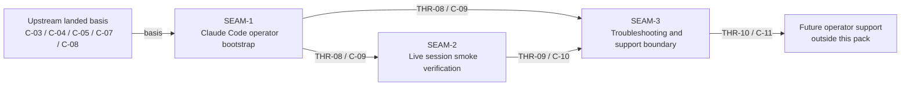

# Threading - Claude Code Live Integration Smoke

## Execution horizon summary

- **Active seam**: none remaining in this pack
- **Next seam**: none remaining in this pack
- **Policy**:
  - no seam remains eligible for authoritative downstream decomposition inside this pack because the forward window is closed
  - no later seam remains in this pack, so the forward window ends here
  - `SEAM-1`, `SEAM-2`, and `SEAM-3` remain authoritative basis outside the forward window
  - `SEAM-3` has now frozen the troubleshooting boundary on closeout-backed `C-11` truth and published `THR-10`

## Contract registry

- **Contract ID**: `C-09`
  - **Type**: `config`
  - **Owner seam**: `SEAM-1`
  - **Direct consumers**: `SEAM-2`, `SEAM-3`
  - **Derived consumers**: future operator onboarding, support runbooks, and deployment automation outside this pack
  - **Thread IDs**: `THR-08`
  - **Definition**: canonical live integration bootstrap contract covering Azure prerequisites, gateway config expression, gateway startup and validation, Claude Code environment attachment, and the operator-visible statusline or tracing hooks required before smoke verification begins
  - **Versioning / compat**: changes must preserve the landed one-backend capability boundary and must not require operators to learn provider or planner/executor identity as public setup truth

- **Contract ID**: `C-10`
  - **Type**: `UX affordance`
  - **Owner seam**: `SEAM-2`
  - **Direct consumers**: `SEAM-3`
  - **Derived consumers**: future support runbooks, operator checklists, and regression-style live verification work outside this pack
  - **Thread IDs**: `THR-09`
  - **Definition**: Claude Code live smoke verification contract covering the concrete normal, think, and tool-loop continuation scenarios, the expected routing evidence, and the minimum redacted artifacts that prove real client behavior against Azure-hosted Kimi
  - **Versioning / compat**: changes must stay anchored to the public Claude Code through gateway capability path and must not redefine the underlying `/v1/messages` or Azure transport contracts

- **Contract ID**: `C-11`
  - **Type**: `UX affordance`
  - **Owner seam**: `SEAM-3`
  - **Direct consumers**: future operators and maintainers outside this pack
  - **Derived consumers**: support automation, incident templates, and later live-integration extensions
  - **Thread IDs**: `THR-10`
  - **Definition**: operator troubleshooting and ownership-boundary contract that classifies failures into Claude Code integration, gateway runtime/config, Azure provider transport, or broader transport drift while preserving redaction and public-boundary rules
  - **Versioning / compat**: changes must remain capability-oriented, must not promote internal deployment or planner/executor details into public identity, and must remain explainable from the landed basis and live evidence

## Thread registry

- **Thread ID**: `THR-08`
  - **Producer seam**: `SEAM-1`
  - **Consumer seam(s)**: `SEAM-2`, `SEAM-3`
  - **Carried contract IDs**: `C-09`
  - **Purpose**: carry canonical bootstrap truth into the live smoke and troubleshooting seams so later work does not rediscover setup order, config shape, or Claude Code attachment rules
  - **State**: `revalidated`
  - **Revalidation trigger**: Claude Code attachment rules, gateway config shape, startup validation behavior, or evidence-hook expectations change materially after `SEAM-1` planning or landing
  - **Satisfied by**: one explicit bootstrap contract plus reproducible setup/checklist surfaces that connect Azure prerequisites, gateway startup, Claude Code env vars, and evidence hooks without reading source
  - **Notes**: `THR-08` was published by the `SEAM-1` closeout record and is now revalidated for `SEAM-3` against the landed `C-09` contract, the `C-10` smoke surfaces, and the current README/router/server evidence anchors; later consumers still rerun promotion-time revalidation if a stale trigger fires

- **Thread ID**: `THR-09`
  - **Producer seam**: `SEAM-2`
  - **Consumer seam(s)**: `SEAM-3`
  - **Carried contract IDs**: `C-10`
  - **Purpose**: publish live Claude Code evidence and expected signals so the troubleshooting seam can classify failures against real behavior rather than hypothetical smoke procedures
  - **State**: `revalidated`
  - **Revalidation trigger**: the live smoke scenarios, expected route evidence, or redaction constraints change materially after `SEAM-2` planning or landing
  - **Satisfied by**: redacted operator evidence for normal, think, and tool-loop continuation scenarios plus explicit pass/fail expectations and route-evidence interpretation notes
  - **Notes**: `THR-09` was published by the `SEAM-2` closeout and is now revalidated by `SEAM-3` pre-exec review against the landed `C-10` contract, operator smoke procedure, and README/router/server evidence anchors; later consumers still rerun promotion-time revalidation if a stale trigger fires. This thread must stay client-real; provider-only probes cannot satisfy it

- **Thread ID**: `THR-10`
  - **Producer seam**: `SEAM-3`
  - **Consumer seam(s)**: future operator support and maintenance work outside this pack
  - **Carried contract IDs**: `C-11`
  - **Purpose**: publish a reusable troubleshooting and ownership boundary so later operators can triage the live integration path without recomputing where failures belong
  - **State**: `published`
  - **Revalidation trigger**: bootstrap truth, live smoke evidence, or failure signatures drift enough that the ownership matrix no longer matches real operator behavior
  - **Satisfied by**: a troubleshooting matrix, evidence review checklist, and bounded escalation path tied back to the landed bootstrap and smoke contracts
  - **Notes**: `THR-10` was published by the `SEAM-3` closeout record; this thread should remain operator-facing and should not become a generic postmortem or infra-operations bucket

## Dependency graph

## Critical path

1. Consume the landed gateway and Azure transport closeouts as basis instead of reopening `C-03`, `C-04`, `C-05`, `C-07`, or `C-08`.
2. Land `SEAM-1` so the operator bootstrap path from Azure prerequisites through gateway startup and Claude Code attachment is concrete and reproducible.
3. Use published `C-09` truth in `SEAM-2` to prove normal, think, and tool-loop continuation behavior from real Claude Code sessions and publish `C-10`.
4. Use published `C-09` and `C-10` truth in `SEAM-3` to freeze the troubleshooting ownership boundary and reusable support surfaces.

## Workstreams

- **WS-A Bootstrap**: `SEAM-1` owns the canonical setup, startup, and Claude Code attachment path
- **WS-B Live proof**: `SEAM-2` consumes bootstrap truth to own the real Claude Code smoke scenarios and evidence chain
- **WS-C Support boundary**: `SEAM-3` consumes bootstrap and live-proof truth to own troubleshooting ownership and reusable operator support surfaces
