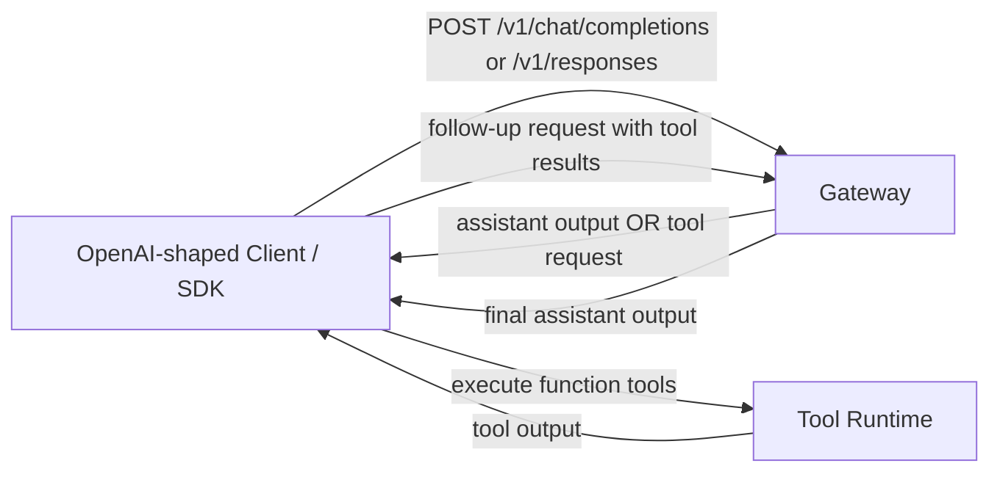
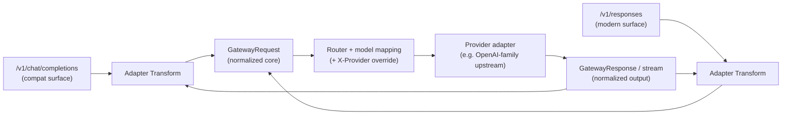
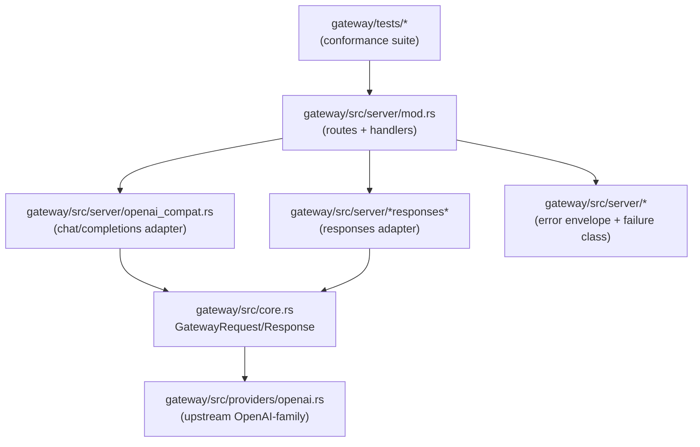

# Review Surfaces - OpenAI-Side Chat Completions and Responses

These diagrams orient the pack. They show the actual product/work shape that is expected to land.
They do not, by themselves, satisfy seam-local pre-exec review.

## R1 - High-level client workflows (tool loop)

## R2 - Gateway flow (thin adapters over shared core)

## R3 - Touch surface map (likely code anchors)

