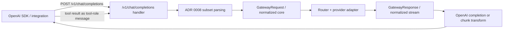
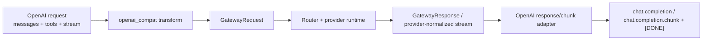

# Review Bundle - SEAM-1 OpenAI Chat Completions Surface

This artifact feeds `gates.pre_exec.review`.
`../../review_surfaces.md` is pack orientation only.

## Falsification questions

- Can `/v1/chat/completions` still bypass the normalized-core contract by keeping streaming unsupported, dropping `tool` messages, or treating function tools as a TODO while the seam claims `C-10` compatibility?
- Does the implementation plan accidentally introduce endpoint-specific request or stream semantics instead of enforcing `C-12` as a pure transform over `GatewayRequest` and normalized output?
- Could the planned SSE chunk mapping diverge enough from OpenAI SDK expectations that `SEAM-3` would later freeze the wrong conformance suite?

## R1 - Compatibility workflow that must land

## R2 - Thin-adapter boundary that must remain true

## Likely mismatch hotspots

- `gateway/src/server/mod.rs` currently rejects `stream=true` for `/v1/chat/completions`, so the stream path is not yet aligned with ADR 0008 and must not grow provider-specific logic while being added.
- `gateway/src/server/openai_compat.rs` currently skips unsupported roles and leaves `tools` as `None`, which means the tool loop, `tool_choice`, and `tool`-role follow-up semantics are still implicit rather than contract-backed.
- `gateway/src/core.rs` still describes streaming bytes as Anthropic SSE, so `C-12` must make the conversion boundary explicit instead of letting Chat Completions own a second transport model.
- current response shaping extracts only text from content blocks, which is insufficient for tool-call mapping, finish-reason precision, and optional usage-chunk behavior.

## Pre-exec findings

- The external basis is current enough for active-seam decomposition: the upstream normalized-core closeout and Anthropic-surface closeout are both `passed` and `ready`, and they provide stable input for this seam’s thin-adapter plan.
- No cross-seam remediation needs to open before decomposition because the gaps are owned by `SEAM-1` itself: missing tool-loop coverage, missing streaming support, and missing OpenAI-specific chunk mapping all sit inside this seam’s touch surface.
- `S00` now freezes the owned `C-10` subset contract and owned `C-12` adapter invariants into canonical artifacts, so implementation can proceed without inventing request, tool-loop, or streaming rules during coding.

## Pre-exec gate disposition

- **Review gate**: `passed`
- **Contract gate**: `passed`
  - `C-10` canonical artifact: `docs/foundation/openai-side-chat-completions-c10-contract.md`
  - `C-12` canonical artifact: `docs/foundation/openai-side-adapter-invariants-c12-contract.md`
- **Revalidation gate**: `passed`
  - upstream basis: `docs/project_management/packs/active/azure-kimi-claude-gateway/governance/seam-2-closeout.md`, `docs/project_management/packs/active/azure-kimi-claude-gateway/governance/seam-3-closeout.md`
- **Opened remediations**: none

## Planned seam-exit gate focus

- **What must be true before downstream promotion is legal**: `C-10` and `C-12` are landed as concrete source-of-truth artifacts or equivalent closeout-backed code/test evidence, `/v1/chat/completions` sync and stream behavior are verified against the planned subset, and no public behavior requires downstream seams to understand provider-specific framing or endpoint-specific engine semantics.
- **Which outbound contracts/threads matter most**: `C-10`, `C-12`, `THR-10`, and `THR-11`
- **Which review-surface deltas would force downstream revalidation**: changes to tool-result message handling, changes to chunk ordering or delta assembly, changes to known-but-unsupported field posture, changes to model echo or error-envelope behavior, or any surface drift that makes `/v1/responses` more than a thin sibling adapter
