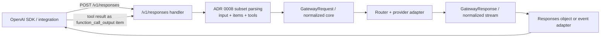
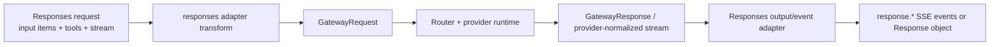

# Review Bundle - SEAM-2 OpenAI Responses Surface

This artifact feeds `gates.pre_exec.review`.
`../../review_surfaces.md` is pack orientation only.

## Falsification questions

- Can `/v1/responses` stay a pure transform over `GatewayRequest` and the normalized stream model, or does any planned step still require provider-specific public parsing that would violate `C-12`?
- Does the execution plan now fully freeze the owned `C-11` subset, including the exact supported item types, reject-vs-ignore posture, and `call_id` threading rules, or would an implementer still need to guess?
- Is the streaming event subset concrete enough that an implementation can be judged wrong by fixture evidence alone if it omits, renames, or misorders the required `response.*` events for a given stream shape?

## R1 - Responses workflow that must land

## R2 - Thin-adapter boundary that must remain true

## Likely mismatch hotspots

- The repo already speaks upstream `/v1/responses` in provider adapters; the public `/v1/responses` endpoint must not leak provider-specific response/event framing into the public adapter.
- `function_call_output` continuation items require stable `call_id` threading; the adapter must define one mapping between OpenAI `call_id` and normalized tool identifiers (and reject ambiguous inputs).
- Streaming event compatibility is more structured than Chat Completions chunking; the adapter must enforce the contracted semantic event subset with matching `data.type` values. Text streams need the content-part and output-text events; function-call streams need the function-call-argument events; both shapes need the shared lifecycle and output-item events.
- Chain-of-thought / reasoning suppression must apply to Response objects and streaming events equally; any “reasoning” payloads must not become user-visible text.

## Frozen `C-11` execution baseline

- **Request allowlist**:
  - top-level fields: `model`, `input`, `tools`, `tool_choice`, `parallel_tool_calls`, `text`, `max_output_tokens`, `temperature`, `top_p`, `stop`, `stream`, `stream_options`
  - `input` supports string shorthand or item arrays
  - supported item types: `message` and `function_call_output`
  - supported content parts inside `message`: `input_text` and `input_image`
- **Reject vs ignore posture**:
  - unknown top-level fields are ignored
  - built-in tools and non-function tool call types reject with `400` and the gateway error envelope
  - JSON schema outputs remain out of scope because `text.format.type` is frozen to `text`
- **Sync response rules**:
  - the public object is `object: "response"`
  - supported `output` items are `message` and `function_call`
  - `function_call.arguments` remains a JSON string
  - `usage` is present when the provider returns token accounting
- **Streaming rules**:
  - the minimum event surface is the ADR 0008-compatible semantic subset named above; not every stream must contain every event, but every emitted event must respect the contracted ordering and payload rules for its stream shape
  - every `data:` payload is JSON whose `type` matches the event name
  - `response.completed` carries the final Response object, not an alternate endpoint-specific summary
- **Tool loop rules**:
  - clients continue tool use by appending `function_call_output` items
  - each `function_call_output.call_id` must match the model-emitted function call id exactly
  - each `function_call_output.output` must be a string; caller-side serialization owns structured tool outputs

## Pre-exec findings

- `SEAM-1` closeout is landed, its `seam_exit_gate` passed, `promotion_readiness` is `ready`, and `THR-10` is published through the landed `C-12` artifact at `docs/foundation/openai-side-adapter-invariants-c12-contract.md`.
- This seam is `execution_horizon: active` with `basis.currentness: current`; the seam-local slices now freeze the request subset, output mapping, streaming event subset and ordering rules, reject-vs-ignore posture, and verification anchors tightly enough for implementation to proceed without guesswork.
- No blocking pre-exec remediation is required. The remaining risk posture is bounded to explicit stale triggers already recorded in `seam.md` rather than unresolved ambiguity.

## Pre-exec gate disposition

- **Review gate**: `passed`
- **Contract gate**: `passed`
  - the owned `C-11` baseline is concrete in the slice set even though its canonical landing artifact path (`docs/foundation/openai-side-responses-c11-contract.md`) will not exist until execution lands
  - the plan explicitly consumes `C-12` by preserving `GatewayRequest` / normalized-stream boundaries and stable `call_id` round-tripping
- **Revalidation gate**: `passed`
  - `SEAM-1` has already closed out with `seam_exit_gate.status: passed`, `promotion_readiness: ready`, and published `THR-10` evidence that this seam has now rechecked
- **Opened remediations**: none

## Planned seam-exit gate focus

- **What must be true before downstream promotion is legal**: `/v1/responses` sync and stream behavior match `C-11`, built-in tools remain rejected, tool-loop continuation works using `function_call_output`, the adapter is thin over `C-12`, and the conformance seam can lock in behavior without reverse-engineering runtime code.
- **Which outbound contracts/threads matter most**: `C-11`, `THR-12` (and consumption of `C-12` via `THR-10`)
- **Which review-surface deltas would force downstream revalidation**: changes to the contracted event subset or per-shape ordering rules, changes to `call_id` mapping, changes to tool-call output item mapping, changes to reject/ignore posture, or any drift that forces provider-specific handling inside the public adapter
