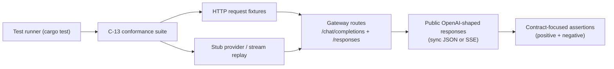
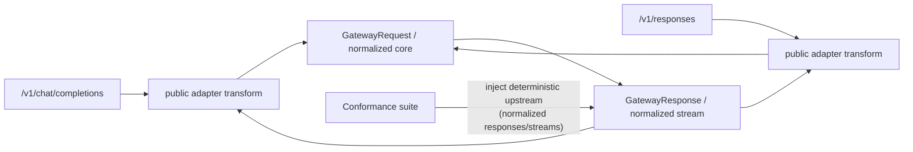

# Review Bundle - SEAM-3 OpenAI-Side Conformance and Drift Guards

This artifact feeds `gates.pre_exec.review`.
`../../review_surfaces.md` is pack orientation only.

## Falsification questions

- Can the suite accidentally lock in *implementation artifacts* (provider-specific stream framing, incidental ordering, internal debug fields) instead of the contracted public subset, making it brittle and expensive to maintain?
- Does the suite accidentally depend on live upstream behavior, nondeterministic timing, or real network calls, making CI flaky and incapable of acting as a drift guard?
- Can drift in the highest-risk surfaces (tool-loop continuation, streaming termination, error envelope posture, and chain-of-thought suppression) still slip through because the tests focus on “happy path snapshots” instead of contract-targeted assertions?

## R1 - Conformance workflow that must land (offline, deterministic)

## R2 - Thin-adapter boundary that conformance must enforce

## Likely mismatch hotspots

- Streaming: termination (`[DONE]` vs event completion), ordering of deltas, and optional final usage behavior are easy to break unintentionally.
- Tool-loop: `tool_call_id` / `call_id` threading, tool-call argument encoding (JSON string rules), and continuation turn shape drift quickly when internal tool IDs evolve.
- Reject/ignore posture: “unknown fields ignored” versus “known-but-unsupported fields rejected” must remain deterministic and consistent across both endpoints.
- Error envelope: status-code mapping and redaction/classification must remain stable, especially for negative-case tests.
- Chain-of-thought / reasoning suppression: any leak into text fields (sync or stream) must be caught by contract-level assertions, not by incidental snapshots.

## Pre-exec findings

- `SEAM-1` and `SEAM-2` are now landed, both closeouts pass seam-exit, and the inbound contract basis is explicit at `docs/foundation/openai-side-chat-completions-c10-contract.md`, `docs/foundation/openai-side-responses-c11-contract.md`, and `docs/foundation/openai-side-adapter-invariants-c12-contract.md`.
- This seam is `execution_horizon: active` with `basis.currentness: current`; the seam-local slices now lock an offline, deterministic conformance plan against published endpoint and boundary truth instead of provisional assumptions.
- No blocking pre-exec remediation is required. The remaining risk posture is bounded to explicit stale triggers around later contract, fixture, or normalized-boundary drift.

## Pre-exec gate disposition

- **Review gate**: `passed`
- **Contract gate**: `passed`
  - `C-13` is now bounded by concrete consumed contracts and the seam-local slices define clause-to-test coverage, variance tolerance, fixture layout, and offline execution rules tightly enough for implementation
  - the suite explicitly consumes `C-10`, `C-11`, and `C-12` instead of freezing undocumented runtime behavior
- **Revalidation gate**: `passed`
  - `SEAM-2` now publishes `THR-12` through a passed seam-exit record and a concrete `C-11` contract artifact
  - fixture schema and stream-replay boundaries remain aligned with the published normalized stream model (no provider-specific public framing)
- **Opened remediations**: none

## Planned seam-exit gate focus

- **What must be true before downstream promotion is legal**: the suite runs offline and deterministically, covers positive + negative cases for both endpoints, and fails on drift in tool-loop, streaming termination, error envelope, and reasoning suppression.
- **Which outbound contracts/threads matter most**: `C-13`, `THR-13` (and correct consumption of `C-10`, `C-11`, `C-12`)
- **Which review-surface deltas would force downstream revalidation**: adding new supported fields/item types/event types, changing normalized tool identifiers, changing stream conversion boundaries, or changing reject/ignore posture.
