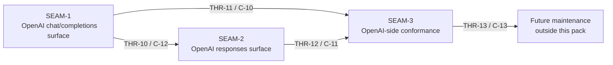

# Threading - OpenAI-Side Chat Completions and Responses

## Execution horizon summary

- **Active seam**: none remaining in this pack
- **Next seam**: none remaining in this pack
- **Policy**:
  - no seam remains eligible for authoritative downstream decomposition inside this pack because the forward window is closed
  - no later seam remains in this pack, so the forward window ends here
  - `SEAM-1`, `SEAM-2`, and `SEAM-3` remain authoritative basis outside the forward window
  - `SEAM-3` has now frozen the OpenAI-side conformance boundary on closeout-backed `C-13` truth and published `THR-13`

## Contract registry

- **Contract ID**: `C-10`
  - **Type**: `API`
  - **Owner seam**: `SEAM-1`
  - **Direct consumers**: OpenAI SDKs/integrations targeting `/v1/chat/completions`
  - **Derived consumers**: `SEAM-2`, `SEAM-3`, and future OpenAI-side expansions that must remain thin over the same core
  - **Thread IDs**: `THR-10`, `THR-11`
  - **Definition**: the ADR 0008 subset contract for `POST /v1/chat/completions`, including request parsing, function-tool loop via `tool` role messages, non-streaming response shape, and streaming SSE chunk semantics with `[DONE]` termination
  - **Versioning / compat**: unknown top-level fields are ignored for forward-compat; known-but-unsupported fields are rejected with a `400` error, and the gateway must echo the request `model` even when routing to a different provider model internally

- **Contract ID**: `C-11`
  - **Type**: `API`
  - **Owner seam**: `SEAM-2`
  - **Direct consumers**: OpenAI SDKs/integrations targeting `/v1/responses`
  - **Derived consumers**: `SEAM-3` and future OpenAI-side expansions (schema outputs, additional item types) once explicitly added by a later ADR
  - **Thread IDs**: `THR-10`, `THR-12`
  - **Definition**: the ADR 0008 subset contract for `POST /v1/responses`, including input items (`message` + `function_call_output`), function-tool loop semantics, non-streaming Response object shape, and the minimum streaming event set + SSE payload conventions
  - **Versioning / compat**: the gateway rejects built-in tools and non-function tool call types with a `400` error; unknown fields are ignored for forward-compat; JSON schema outputs remain out of scope until explicitly added

- **Contract ID**: `C-12`
  - **Type**: `event`
  - **Owner seam**: `SEAM-1`
  - **Direct consumers**: `SEAM-2`, `SEAM-3`
  - **Derived consumers**: future Substrate integration work that consumes structured events rather than raw provider streams
  - **Thread IDs**: `THR-10`
  - **Definition**: shared OpenAI-side adapter invariants: both public endpoints parse into the same internal `GatewayRequest` and convert from the same internal `GatewayResponse`/stream model, while enforcing function-tools-only and chain-of-thought suppression
  - **Versioning / compat**: adapters remain pure transforms; provider-specific streaming logic is forbidden in public endpoints, and adapter correctness is enforced by contract tests instead of provider-conditional code

- **Contract ID**: `C-13`
  - **Type**: `UX affordance`
  - **Owner seam**: `SEAM-3`
  - **Direct consumers**: gateway maintainers and operators
  - **Derived consumers**: future client-integration work and support tooling
  - **Thread IDs**: `THR-13`
  - **Definition**: conformance and drift-guard suite for the OpenAI-side compatibility subset, including positive and negative test coverage for shared behavior, tool loops, and streaming termination
  - **Versioning / compat**: the suite must remain deterministic and should prefer golden fixtures over live upstream network dependencies

## Thread registry

- **Thread ID**: `THR-10`
  - **Producer seam**: `SEAM-1`
  - **Consumer seam(s)**: `SEAM-2`, `SEAM-3`
  - **Carried contract IDs**: `C-12`
  - **Purpose**: freeze and publish shared OpenAI-side adapter invariants so both endpoints stay thin adapters over the same normalized core
  - **State**: `revalidated`
  - **Revalidation trigger**: `GatewayRequest`/`GatewayResponse` shapes, internal tool representation, or streaming model changes materially enough to invalidate adapter invariants or conformance fixtures
  - **Satisfied by**: explicit adapter-boundary invariants plus tests that prove both endpoints are pure transforms over shared internal semantics
  - **Notes**: this thread must prevent “endpoint-specific engines” by making the shared internal mapping and constraints reviewable and testable; `SEAM-2` revalidated against `governance/seam-1-closeout.md`, and `SEAM-3` has now revalidated the same invariant set against the landed `C-10`, `C-11`, and `C-12` evidence anchors

- **Thread ID**: `THR-11`
  - **Producer seam**: `SEAM-1`
  - **Consumer seam(s)**: `SEAM-3`
  - **Carried contract IDs**: `C-10`
  - **Purpose**: publish the `chat/completions` compatibility contract and its tool-loop + streaming behavior so conformance work can lock it in
  - **State**: `revalidated`
  - **Revalidation trigger**: OpenAI SDK parsing assumptions require tighter chunk/event parity, or later ADRs expand the supported subset (e.g., `logprobs`, audio, schema outputs)
  - **Satisfied by**: stable request/response fixtures (including tool calls), streaming golden tests, and negative-case tests for rejected fields and built-in tools
  - **Notes**: this thread is compatibility-first; it should not force adopting `/v1/messages`, but it must remain thin over the same core. `SEAM-3` has now revalidated the published `C-10` truth against the landed Chat Completions contract and drift-guard planning surfaces

- **Thread ID**: `THR-12`
  - **Producer seam**: `SEAM-2`
  - **Consumer seam(s)**: `SEAM-3`
  - **Carried contract IDs**: `C-11`
  - **Purpose**: publish the `responses` modern contract and its evented streaming/tool-loop behavior so conformance work can lock it in
  - **State**: `revalidated`
  - **Revalidation trigger**: upstream provider `/v1/responses` behavior shifts, or the gateway must expand the supported Responses subset (additional item types, richer status states) by later ADR
  - **Satisfied by**: stable Response-object fixtures, streaming event golden tests, and tool-loop fixtures based on `function_call_output`
  - **Notes**: this thread should reuse the shared adapter invariants from `THR-10` rather than reintroducing endpoint-specific logic. `SEAM-2` published `THR-12` through its closeout-backed `C-11` artifact, and `SEAM-3` has now revalidated that basis for conformance planning

- **Thread ID**: `THR-13`
  - **Producer seam**: `SEAM-3`
  - **Consumer seam(s)**: future maintenance work outside this pack
  - **Carried contract IDs**: `C-13`
  - **Purpose**: publish a durable drift-guard posture so future changes do not silently break OpenAI-side ingress compatibility
  - **State**: `published`
  - **Revalidation trigger**: new endpoint fields are added, streaming formats evolve, or the gateway’s internal core changes in ways that require fixture updates
  - **Satisfied by**: the canonical `C-13` drift-guard suite with both positive and negative coverage for the contracted subset, offline fixture replay, and shared parity checks
  - **Notes**: `SEAM-3` has now closed out against `docs/foundation/openai-side-conformance-suite-c13-contract.md`, the offline conformance targets passed in `gateway/tests/openai_conformance_harness_smoke.rs`, `gateway/tests/openai_chat_completions_conformance.rs`, `gateway/tests/openai_responses_conformance.rs`, and `gateway/tests/openai_shared_parity.rs`, and this thread should remain reserved for future drift-guard maintenance only.

## Dependency graph

## Critical path

1. Expand `/v1/chat/completions` to match the contracted subset and publish the shared adapter invariants (`THR-10`) and the compatibility contract (`THR-11`).
2. Add `/v1/responses` as the preferred modern surface and publish the Responses contract (`THR-12`) while reusing the shared invariants from `THR-10`.
3. Lock both endpoints into a conformance suite that enforces shared behavior, tool loops, streaming termination, and negative-case boundaries (`THR-13`).

## Workstreams

- **WS-A Chat Completions compatibility**: `SEAM-1` expands `/v1/chat/completions` (including streaming + function tools) as a thin adapter over the shared core
- **WS-B Responses modern surface**: `SEAM-2` adds `/v1/responses` and its streaming/tool-loop semantics while consuming `THR-10` invariants
- **WS-C Conformance and drift guards**: `SEAM-3` adds deterministic regression coverage spanning both endpoints and shared boundary rules
