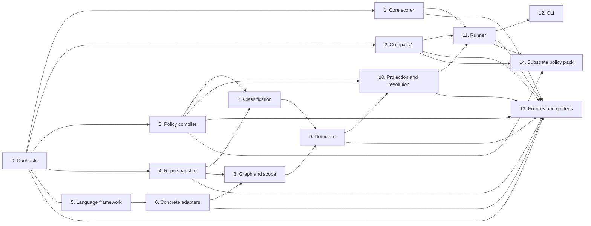
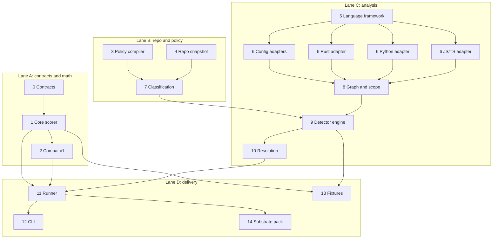
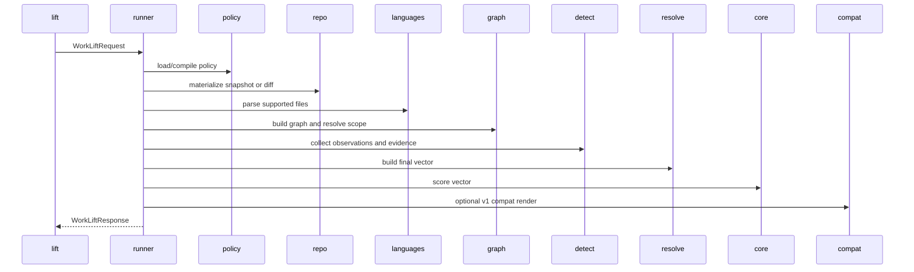

I would keep the workspace member at `crates/lift`, keep the library crate import path as `substrate_lift`, and make the executable name `lift`. That gives you the clean CLI name you want without forcing the publish/package name to be a super-generic `lift`.

```toml
[package]
name = "substrate-lift"

[lib]
name = "substrate_lift"

[[bin]]
name = "lift"
path = "src/bin/lift.rs"
```

The right way to build this is **one package, hard internal seams, optional feature flags**, not multiple crates on day one. That keeps the implementation movable while still letting separate agents work in parallel with low conflict.

## The seam map



The important rule is that each seam has one job, one public boundary, and one test surface.

## The directory/module shape

```text
crates/lift/
  Cargo.toml
  src/
    lib.rs
    bin/lift.rs

    api/
      mod.rs
      request.rs
      response.rs
      vector_v1.rs
      vector_v2.rs
      model.rs
      schema.rs
      errors.rs

    core/
      mod.rs
      score.rs
      scoring_model.rs
      rule_ast.rs
      rule_eval.rs
      rounding.rs

    compat/
      mod.rs
      v1.rs
      emit_json_v1.rs
      translate.rs

    policy/
      mod.rs
      config.rs
      boundaries.rs
      components.rs
      classification.rs
      projection.rs
      compile.rs

    repo/
      mod.rs
      root.rs
      snapshot.rs
      inventory.rs
      fingerprint.rs
      diff.rs
      ignore.rs
      path.rs

    languages/
      mod.rs
      traits.rs
      ir.rs
      rust.rs
      python.rs
      javascript.rs
      typescript.rs
      json.rs
      toml.rs
      yaml.rs

    graph/
      mod.rs
      build.rs
      scope.rs
      symbol_resolve.rs
      edges.rs

    detect/
      mod.rs
      engine.rs
      evidence.rs
      observation.rs
      touch.rs
      contract.rs
      risk.rs
      qa_docs_ops.rs

    resolve/
      mod.rs
      project.rs
      merge.rs
      vector.rs
      provenance.rs

    runner/
      mod.rs
      score_vector.rs
      score_diff.rs
      estimate_path.rs
      estimate_symbol.rs
      analyze.rs
      explain.rs
      validate.rs

    cli/
      mod.rs
      args.rs
      render_human.rs
      render_json.rs
      exit_codes.rs

  schemas/
  fixtures/
  examples/
  profiles/
```

## The hard dependency rules

These should be treated as non-negotiable:

* `core` depends only on `api`.
* `compat` depends only on `api` and `core`.
* `policy` depends only on `api`.
* `repo` depends only on `api`.
* `languages` depends only on `api` and `repo` path/file abstractions.
* `graph` depends on `api`, `repo`, and `languages`.
* `detect` depends on `api`, `policy`, `repo`, `languages`, and `graph`.
* `resolve` depends on `api`, `policy`, and `detect`.
* `runner` wires everything together but owns no domain logic.
* `cli` depends only on `runner` and `api`.

That is what keeps the boundaries clean.

## The work breakdown, seam by seam

### 0. Contracts

This is the first seam because every other seam compiles against it.

**Owns**

* `WorkLiftRequest`
* `WorkLiftResponse`
* `LiftVectorV2`
* `LiftVectorV1Compat`
* `LiftModel`
* `FieldResolution`
* `EvidenceItem`
* error enums
* JSON schema export

**Does not own**

* scoring math
* repo walking
* parsing
* CLI flags

**Public boundary**

```rust
pub mod api;
```

**Deliverables**

* stable Rust types with `serde`
* versioned JSON schemas in `schemas/`
* round-trip tests
* canonical JSON ordering helpers

**Done when**

* every domain object used anywhere else comes from `api`
* there are zero duplicate structs elsewhere in the crate

---

### 1. Pure scoring core

This is the seam that must stay pure forever.

**Owns**

* rule AST
* rule evaluation
* score computation
* trigger evaluation
* slice estimation
* confidence computation

**Input**

* resolved vector
* compiled model

**Output**

* `ScoreBlock`

**Does not own**

* filesystem
* git
* AST parsing
* policy loading
* rendering

**Public boundary**

```rust
pub trait Scorer {
    fn score(&self, vector: &LiftVectorV2, model: &LiftModel) -> Result<ScoreBlock>;
}
```

**Deliverables**

* rule AST evaluator
* builtin `v2` model
* builtin `v1-compat` model
* deterministic tests
* parity tests for v1 behavior

**Done when**

* core tests run with no temp dirs, no git repos, no tree-sitter
* same input always yields byte-identical JSON for the score block

---

### 2. Compat v1

This seam exists so the new crate can replace the current scoring path without changing semantics.

**Owns**

* v1 vector translation
* v1 output shape
* `emit-json` compat output
* v1 trigger naming
* v1 field name mapping

**Does not own**

* analysis
* repo scanning
* generic v2 policy

**Public boundary**

```rust
pub mod compat::v1;
```

**Deliverables**

* `v1 -> v2` translator
* `v2 score -> v1 emit-json` renderer
* golden tests against existing v1 fixtures

**Done when**

* you can feed old-style v1 inputs into `lift` and get the same semantic result

---

### 3. Policy compiler

This is the seam that turns config files into an executable policy.

**Owns**

* `work-lift.toml`
* boundary taxonomy
* component rules
* classification globs
* detector registration metadata
* projection rule compilation

**Does not own**

* file discovery
* AST execution
* score math

**Public boundary**

```rust
pub trait PolicyLoader {
    fn load(&self, root: &Path) -> Result<CompiledPolicy>;
}
```

**Deliverables**

* config parser
* validation
* compiled in-memory policy object
* policy fingerprinting

**Done when**

* all policy files can be validated without touching the repo snapshot
* detector and projection metadata are compiled once up front

---

### 4. Repo snapshot

This seam owns the filesystem and git view.

**Owns**

* repo root detection
* snapshot materialization
* revision selection
* path normalization
* ignore handling
* content fingerprinting
* diff collection

**Does not own**

* syntax parsing
* scoring
* policy decisions

**Public boundary**

```rust
pub trait SnapshotProvider {
    fn snapshot(&self, req: &RepoSelector) -> Result<RepoSnapshot>;
    fn diff(&self, req: &DiffSelector) -> Result<RepoDiff>;
}
```

**Deliverables**

* stable repo-root-relative path model
* deterministic inventory ordering
* snapshot fingerprint
* diff abstraction

**Done when**

* every downstream seam can work entirely from `RepoSnapshot`
* no other module talks to `git` directly

---

### 5. Language framework

This seam defines the parser/plugin contract.

**Owns**

* `LanguageAdapter` trait
* parser result IR
* symbol IR
* edge IR
* parse error model

**Does not own**

* policy-specific detectors
* component logic
* CLI logic

**Public boundary**

```rust
pub trait LanguageAdapter: Send + Sync {
    fn language_id(&self) -> LanguageId;
    fn supports(&self, path: &RepoPath) -> bool;
    fn parse(&self, file: &SourceFile) -> ParseResult;
    fn resolve_symbol(&self, selector: &SymbolSelector, parsed: &ParsedFile) -> Option<SymbolRef>;
}
```

**Deliverables**

* language-neutral IR
* adapter registry
* parse caching hooks
* deterministic parse failure behavior

**Done when**

* adapters can be added without changing detector or scorer code

---

### 6. Concrete adapters

This seam should actually be split into sub-workstreams so agents can work in parallel.

#### 6a. Config adapters

Start here first because they are lower-risk and useful early.

**Owns**

* JSON
* TOML
* YAML

**Outputs**

* config keys
* schema references
* file format observations

#### 6b. Rust adapter

This is the first code-language adapter.

**Owns**

* module graph extraction
* imports/uses
* item symbols
* public API markers
* impl/type references
* test markers

#### 6c. Python adapter

**Owns**

* module imports
* defs/classes
* public API conventions
* pytest/unittest markers

#### 6d. JS/TS adapter

**Owns**

* import/export graph
* functions/classes/interfaces
* public API markers
* test framework markers

**Done when**

* each adapter can produce parsed files, symbols, and edges independently
* unsupported files are explicitly recorded, not ignored silently

---

### 7. Classification

This seam is path- and workspace-based, not AST-based.

**Owns**

* component resolution
* boundary assignment
* docs/test/ci/migration/security path classes
* public API path classes
* overlap validation

**Does not own**

* syntax parsing
* scoring

**Public boundary**

```rust
pub trait Classifier {
    fn classify(&self, snapshot: &RepoSnapshot, policy: &CompiledPolicy) -> Result<ClassificationIndex>;
}
```

**Deliverables**

* `components_touched` basis
* `boundary_crossings` basis
* path-class lookup index

**Done when**

* a repo can be classified without invoking a single parser

---

### 8. Graph and scope resolution

This seam turns seeds into a deterministic closure.

**Owns**

* symbol lookup
* file-to-symbol mapping
* graph assembly
* stable BFS traversal
* closure depth rules
* edge filtering

**Does not own**

* policy inference
* scoring math
* field projection

**Public boundary**

```rust
pub trait ScopeResolver {
    fn resolve(&self, req: &EstimateRequest, graph: &RepoGraph) -> Result<ResolvedScope>;
}
```

**Deliverables**

* graph builder
* path seed resolution
* symbol seed resolution
* closure result with sorted files/symbols/edges

**Done when**

* same seeds + same snapshot + same closure policy always return the same scope

---

### 9. Detector engine

This is the observation seam. It should not compute a score and it should not finalize the vector.

**Owns**

* evidence extraction
* field observations
* detector execution order
* observation dedupe

**Does not own**

* merge precedence
* score math

**Public boundary**

```rust
pub trait Detector: Send + Sync {
    fn id(&self) -> &'static str;
    fn run(&self, ctx: &DetectContext) -> Result<Vec<FieldObservation>>;
}
```

Split the detector work into four families:

#### 9a. Touch detectors

* edit files
* create/delete/deprecate when directly knowable
* components touched
* boundaries crossed

#### 9b. Contract detectors

* CLI flags
* config keys
* exit codes
* file formats
* public API deltas
* behavior delta hints only when provable

#### 9c. Risk detectors

* concurrency/ordering
* security-sensitive surfaces
* migration/backfill paths
* cross-platform surface

#### 9d. QA/docs/ops detectors

* new tests
* docs files
* smoke steps
* CI changes

**Done when**

* detectors only emit observations and evidence
* no detector mutates the final vector directly

---

### 10. Projection and vector resolution

This seam turns hints + observations + policy into a final vector.

**Owns**

* precedence rules
* projection rules
* unknown handling
* field provenance
* final vector synthesis

**Does not own**

* parser execution
* score math

**Public boundary**

```rust
pub trait VectorResolver {
    fn resolve(&self, ctx: &ResolutionContext) -> Result<ResolvedVector>;
}
```

**Normative merge order**

```text
override > observed > projected > unknown > score-default
```

**Deliverables**

* partial vector merge logic
* field-by-field provenance
* unresolved input list
* confidence-cause support data

**Done when**

* every final field can explain where it came from

---

### 11. Runner/orchestration

This seam is the use-case layer. It wires modules together and nothing more.

**Owns**

* `score vector`
* `score diff`
* `estimate path`
* `estimate symbol`
* `analyze`
* `explain`
* `validate`

**Does not own**

* clap parsing
* score math
* detector logic

**Public boundary**

```rust
pub struct LiftService {
    pub fn execute(&self, req: WorkLiftRequest) -> Result<WorkLiftResponse>;
}
```

**Deliverables**

* orchestrator
* request dispatch
* canonical response construction

**Done when**

* the CLI can call one service entrypoint
* tests can hit the full engine without invoking the binary

---

### 12. CLI

This is intentionally thin.

**Owns**

* `lift` binary
* clap args
* human rendering
* JSON rendering
* exit codes

**Does not own**

* any domain logic

**Deliverables**

* subcommands
* human output
* `--json`
* exit code mapping

**Done when**

* CLI tests use fixture repos and snapshot output
* all business behavior lives below the CLI layer

---

### 13. Fixtures and goldens

This seam is cross-cutting and should exist from the start.

**Owns**

* fixture repos
* v1 golden files
* v2 golden files
* cross-language sample repos
* determinism tests
* parser failure fixtures

**Fixture sets**

* tiny Rust repo
* tiny Python repo
* tiny JS/TS repo
* mixed repo
* config-only repo
* repo with boundaries/components
* repo with unsupported files
* Substrate compatibility fixture

**Done when**

* every seam above has fixture-backed tests
* determinism regressions are easy to catch

---

### 14. Substrate policy pack

This seam is deliberately last because it should sit on top of the generic engine.

**Owns**

* bundled profile for current Substrate behavior
* default config templates
* migration helpers from current docs/scripts
* repo-specific examples

**Does not own**

* engine behavior

**Done when**

* Substrate can adopt `lift` without engine changes
* another repo can adopt `lift` without pulling in Substrate assumptions

## The parallel work lanes



That gives you real parallelism:

* one agent can own contracts/core/compat
* one agent can own policy/snapshot/classification
* several agents can own language adapters
* one agent can own detectors/resolution
* one agent can own runner/CLI
* one agent can own fixtures/goldens continuously

## The merge sequence I would use

This is the order I would actually land PRs in:

1. **Skeleton + contracts**

   * crate scaffolding
   * `api`
   * schemas
   * error types
   * feature flags

2. **Pure scorer + compat**

   * `core`
   * `compat`
   * builtin models
   * v1 parity tests

3. **Policy + repo snapshot**

   * `policy`
   * `repo`
   * fingerprinting
   * diff abstraction

4. **Language framework + config adapters**

   * `languages::traits`
   * IR
   * JSON/TOML/YAML adapters

5. **Rust adapter + classification**

   * Rust parsing
   * component/boundary resolution
   * path classes

6. **Graph/scope + detectors + resolution**

   * graph build
   * seed resolution
   * first detector families
   * vector merge/provenance

7. **Runner + CLI**

   * end-to-end service
   * `lift` binary
   * human/json rendering

8. **Python + JS/TS adapters**

   * incremental language support
   * additional fixtures

9. **Substrate profile**

   * bundled config
   * migration examples
   * adoption path

That sequence keeps every merged step usable.

## The feature flags

Feature flags are part of the seam design, not an afterthought.

```toml
[features]
default = ["cli", "compat-v1", "rust-lang", "config-lang"]

cli = []
compat-v1 = []
config-lang = []
rust-lang = []
python-lang = []
javascript-lang = []
typescript-lang = []
substrate-profile = []
```

That lets you build:

* a tiny pure library
* a generic engine without Substrate defaults
* a richer CLI with selected language adapters

## The one architectural mistake to avoid

Do **not** let detectors or adapters write directly into the final vector.

They should only emit:

* `FieldObservation`
* `EvidenceItem`

Then resolution owns:

* merge precedence
* projection
* unknown handling
* provenance

That one rule prevents the whole crate from turning into a tangled scoring script again.

## The end-to-end request flow



## The clean boundary summary

If you want the shortest possible statement of the build plan, it is this:

* **Contracts** define every shared type.
* **Core** scores a resolved vector and nothing else.
* **Policy** tells the engine how to interpret a repo.
* **Repo** materializes a deterministic snapshot.
* **Languages** parse files into a neutral IR.
* **Graph** turns seeds into scope.
* **Detect** produces observations and evidence.
* **Resolve** turns observations into a final vector.
* **Runner** orchestrates use cases.
* **CLI** renders results.
* **Compat** preserves today’s behavior.
* **Profiles** make adoption repo-specific without polluting the engine.

The next artifact worth producing is a ticketized backlog where each seam above becomes 3–8 concrete implementation tasks with acceptance criteria and fixture requirements.
