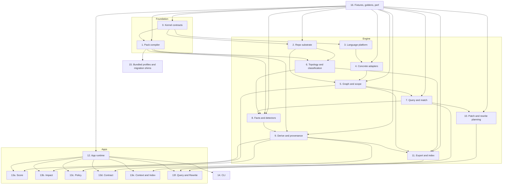
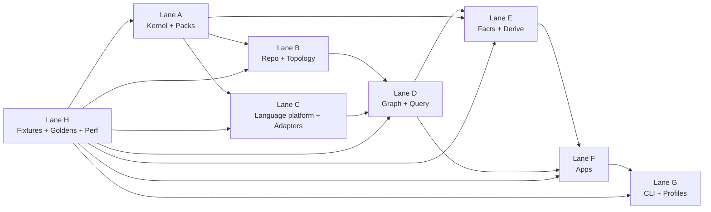

# substrate-lift

`substrate-lift` is being reshaped around a deterministic code-intelligence engine.

Before, `lift score` was the center and everything else existed to support it.
Now the center is the engine, and `lift score` is one app on top of it.

The biggest structural changes are:

1. The old top-level pure scorer seam moves under `app::score`.
2. Generic seams for `query`, `patch/rewrite`, and `export/index` become first-class.
3. The old generic resolve seam splits into:
   - generic fact derivation and provenance
   - app-specific materializers like score, contract diff, and context pack
4. Legacy compatibility becomes an edge seam, not a core seam.

The clean mental model is:

- Engine seams stop at snapshots, parsed units, graph, topology, matches, facts, derived facts, patches, and exports.
- App seams turn those engine artifacts into user-facing products like score, impact, policy findings, contract diff, context packs, and rewrites.

## Updated top-level shape



## Updated module layout

```text
crates/lift/
  src/
    lib.rs
    bin/lift.rs

    kernel/
    pack/
    repo/
    lang/
    graph/
    topo/
    query/
    facts/
    derive/
    patch/
    export/

    app/
      mod.rs
      runtime.rs

      score/
        mod.rs
        vector.rs
        materialize.rs
        model.rs
        scorer.rs
        compat_v1.rs

      impact/
      policy/
      contract/
      context/
      index/
      query_app/
      rewrite/

    cli/

  schemas/
  profiles/
  recipes/
  rules/
  fixtures/
  examples/
```

## Hard boundary rules

These rules keep the seams clean.

1. No app reads the repo directly. Only `repo` does that.
2. No app talks to a language parser directly. Only `lang` and `graph` do that.
3. Adapters never emit findings, scores, or patches. They only emit parsed units, symbols, and local edges.
4. Detectors never emit app results. They only emit facts and evidence.
5. Query never writes patches. Patch planning consumes matches; it does not own matching.
6. Export never computes new analysis. It only serializes already-built artifacts.
7. Compatibility shims live at the app edge, not in the engine core.
8. Packs compile once into immutable runtime objects. The engine consumes compiled packs, never raw config files.

## Seam breakdown

### 0. Kernel contracts

Owns IDs, repo-relative paths, spans, fingerprints, diagnostics, severity, stable JSON helpers, version tags, canonical sort rules, and shared result/error types.

Exposes `RepoPath`, `FileId`, `SymbolId`, `ComponentId`, `BoundaryId`, `Fingerprint`, `Diagnostic`, and `CanonicalJson`.

Must not own repo walking, parsing, scoring, policy logic, or app behavior.

Done when every cross-seam type comes from `kernel`, and no other seam defines duplicate nearly-the-same core types.

### 1. Pack compiler

Phase A owns the crate-private profile compiler foundation: builtin, file-backed, and inline profile sources; hand-authored common/profile schemas; deterministic normalization and fingerprints; typed pack refs and diagnostics; and the narrow builtin `builtin:generic/default`.

Exposes `CompiledProfile` internally. The broader pack-family surface remains deferred.

Must not own repo analysis, AST parsing, git access, or app orchestration.

Done when one standalone profile can be loaded and compiled deterministically from builtin, file, and inline sources without requiring a repo snapshot.

### 2. Repo substrate

Owns repo root detection, snapshotting, inventory, diffing, blob reads, ignore handling, path normalization, content hashing, and repo fingerprinting.

Exposes `RepoSnapshot`, `RepoDiff`, `Inventory`, `BlobStore`, and `RepoProvider`.

Must not own language parsing, classification, findings, or app semantics.

Done when every downstream seam gets filesystem and git data through `RepoSnapshot` or `RepoDiff`, and nothing else shells out to git.

### 3. Language platform

Owns adapter traits, registry, parse cache, normalized parsed-unit interfaces, symbol surface contracts, local edge contracts, and parser error models.

Exposes `LanguageAdapter`, `LanguageRegistry`, `ParsedUnit`, `LocalSymbol`, and `LocalEdge`.

Must not own repo policy, score math, detector logic, or query recipes.

Done when a new language can be added by implementing the adapter trait without changing app code.

### 4. Concrete adapters

This should be parallelized immediately.

- `4a. Config adapters`: JSON, TOML, YAML, schema-reference capture, and config-key extraction.
- `4b. Rust adapter`: modules, `use` edges, item symbols, public-surface markers, impl/type references, tests, and Cargo workspace metadata integration.
- `4c. Python adapter`: modules, imports, defs/classes, public module surface conventions, and test markers.
- `4d. JS/TS adapter`: imports/exports, functions/classes/interfaces, public-surface markers, and common test framework markers.

Exposes parsed units, local symbol tables, local edges, and surface markers.

Must not own repo-wide graph resolution, policy findings, or score behavior.

Done when each adapter independently passes fixture repos and parse-failure cases.

### 5. Graph and scope

Owns graph assembly, symbol resolution, cross-file edges, stable BFS/DFS policy, depth limits, closure policy, seed normalization, and path-to-symbol mapping.

Exposes `RepoGraph`, `ResolvedScope`, and `ScopeResolver`.

Must not own facts, score results, policy findings, or patch generation.

Done when the same snapshot, seeds, and closure rules always produce the same sorted scope.

### 6. Topology and classification

Owns component mapping, boundary assignment, public-surface classes, docs/test/ci/migration/security path classes, overlap validation, and component counting rules.

Exposes `TopologyIndex`, `ComponentMap`, `BoundaryMap`, and `ClassifiedPaths`.

Must not own AST parsing, score math, or app rendering.

Done when a repo can be classified with snapshot plus compiled profile and no app logic.

### 7. Query and match

Owns query DSL compilation, normalized structural matching, scoped query execution, capture sets, and match serialization.

Exposes `QueryEngine`, `CompiledQuery`, `MatchSet`, and `Capture`.

Must not own findings, score vectors, patches, or repo walking.

Done when query packs and ad hoc queries both run deterministically over fixture repos.

### 8. Facts and detectors

This is the observation seam.

Owns detector execution, fact emission, evidence emission, detector registration, fact dedupe, and detector diagnostics.

Exposes `Detector`, `Fact`, `Evidence`, and `FactSet`.

Must not own final app outputs, score math, patch edits, or CLI messages.

Detector families:

- touch
- contract surface
- risk/security
- architecture/boundary
- qa/docs/ops
- migration/backfill
- platform/cross-platform

Done when detectors emit only facts and evidence, and no detector writes into a score vector, contract report, or context pack directly.

### 9. Derive and provenance

Owns generic derivation rules, fact normalization, provenance graphs, conflict resolution, unknown propagation, projection rules, and confidence causes.

Exposes `DerivedFacts`, `ProvenanceGraph`, and `DeriveEngine`.

Must not own Lift scoring math, contract-report formatting, or context serialization.

Done when any derived fact can explain where it came from and what source facts or rules produced it.

### 10. Patch and rewrite planning

Owns recipe compilation, patch planning, edit conflict detection, preview hunks, patch application contracts, and formatter hook surfaces.

Exposes `PatchPlan`, `PatchEdit`, `RewriteRecipe`, and `PatchPlanner`.

Must not own matching, repo scanning, or score math.

Phase split:

- Phase 1: preview-only patch planning
- Phase 2: safe apply
- Phase 3: formatter integration

Done when a rewrite recipe can turn a `MatchSet` into a deterministic preview plan without mutating the repo.

### 11. Export and index

Owns stable export schemas, graph export, topology export, fact export, match export, context-pack export, index export, and canonical serialization.

Exposes `ExportService`, `ContextPackV1`, `RepoIndexV1`, and `GraphExportV1`.

Must not own new analysis or user-facing business logic.

Done when engine artifacts can be exported byte-stably from fixtures.

### 12. App runtime

Owns app registry, request dispatch, dependency injection, shared option resolution, lifecycle hooks, and app result envelopes.

Exposes `App`, `AppRuntime`, `AppRequest`, and `AppResponse`.

Must not own score logic, contract semantics, query behavior, or CLI parsing.

Done when the CLI can invoke every app through one runtime entrypoint.

### 13. App seams

This is where products live.

#### 13a. Score app

Owns Lift request/response types, vector materialization from facts and hints, pure score models, scorers, and compatibility output.

Internal sub-seams:

- `materialize`: facts to Lift vector
- `model`: score model and trigger definitions
- `scorer`: pure scoring math
- `compat_v1`: legacy output and migration helpers

Must not own repo walking, AST parsing, or raw detector execution.

Done when `lift score` works for vector, diff, and seed-based estimate modes.

#### 13b. Impact app

Owns blast radius summary, scope reports, downstream surfaces, affected components and boundaries, and review-routing data.

Must not own score math or patch generation.

Done when `lift impact` can explain what else is likely involved from paths, symbols, or diffs.

#### 13c. Policy app

Owns rule findings, severity assignment, architecture violations, compliance/security reports, and policy-focused summaries.

Must not own scoring or rewrite plans.

Done when `lift policy` can run packs over a scope or diff and emit findings with evidence.

#### 13d. Contract app

Owns public-surface extraction, before/after diff classification, additive vs breaking changes, and machine-readable contract deltas.

Must not own general score logic.

Done when `lift contract` can compare two revisions and emit a contract delta report.

#### 13e. Context and index apps

Context owns task-bounded packs for humans or agents, scope summaries, and selected files, symbols, and facts.

Index owns repo-wide export jobs and reusable intelligence artifacts.

Must not own graph building or serialization internals.

Done when `lift context` and `lift index` can emit useful deterministic bundles from existing engine artifacts.

#### 13f. Query and rewrite apps

Query app owns user-facing structural search workflow, ad hoc query execution, and result rendering.

Rewrite app owns recipe selection, preview, patch-plan rendering, and optional apply workflow later.

Must not own parser implementation or patch planning internals.

Done when `lift query` and `lift rewrite --preview` work without special app-only parsing code.

### 14. CLI

The binary is now an umbrella frontend.

Owns `lift` subcommands, clap args, human output, JSON output, exit codes, and shell completion.

Commands:

- `lift score`
- `lift impact`
- `lift policy`
- `lift contract`
- `lift context`
- `lift index`
- `lift query`
- `lift rewrite`

Must not own any business logic.

Done when all meaningful behavior lives below the CLI.

### 15. Bundled profiles and migration shims

Phase A ships only the embedded generic builtin profile, `builtin:generic/default`.

Bundled Substrate profiles, starter rule/query/recipe content, and migration helpers from old Work Lift inputs are intentionally deferred until later seams broaden the pack surface and add real runtime consumers.

Must not own core engine behavior.

Done when the generic builtin remains a stable narrow foundation for later bundled-profile and migration work.

### 16. Fixtures, goldens, and perf

Owns tiny fixture repos, mixed-language repos, legacy score goldens, app goldens, determinism harnesses, parse-failure fixtures, perf benchmarks, and stress repos.

Must not own runtime logic.

Done when every seam above has fixture-backed tests and a determinism story.

## What changed from the previous seam map

The most important architectural changes from the score-first version are:

- `compat::v1` is no longer a top-level seam. It moves into `app::score`.
- The old generic scoring core is no longer global. It becomes `app::score::scorer`.
- `query`, `patch`, and `export` are now permanent engine seams.
- Resolve is no longer one generic seam. The engine ends at derived facts; each app materializes its own output from those facts.
- The crate’s center of gravity becomes facts plus provenance, not the Lift score itself.

That shift keeps the crate from becoming a score tool with extra side features.

## Parallel work lanes



## Suggested merge order

1. `kernel` plus `pack` skeletons
2. `repo` substrate
3. `lang` platform plus config adapters
4. `graph` plus `topo`
5. `query` engine
6. `facts` plus `derive`
7. `app::score`
8. `app::impact` plus `app::policy`
9. `export` plus `app::context` plus `app::index`
10. `app::contract`
11. `patch` plus `app::rewrite`
12. `cli`
13. bundled profiles and migration shims
14. full golden and perf sweep

That sequence still gets `lift score` early, but avoids designing the entire crate around score-only assumptions.

## Design rule to protect hardest

The engine should stop at facts, matches, patches, and exports.

The moment a lower seam starts knowing what a Lift score, contract delta, or context pack is, the boundaries start collapsing again. Keeping apps above the engine is what gives `lift` room to grow into a genuine code-intelligence toolkit instead of another tightly coupled scoring pipeline.
