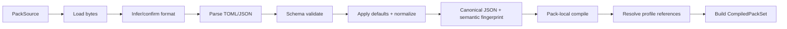
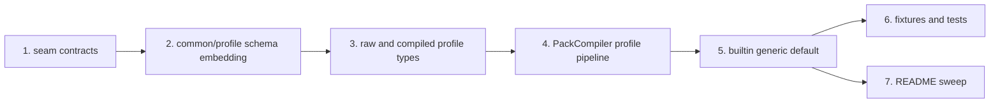

<!-- /autoplan restore point: /Users/spensermcconnell/.gstack/projects/atomize-hq-substrate/feat-lift-autoplan-restore-20260415-221924.md -->

# substrate-lift seam 1 spec — pack compiler (reviewed against landed seam 0)

## 0. Ground truth from the landed crate

This spec is intentionally anchored to the crate as it exists today, not to the earlier idealized design.

Observed state in the landed crate:

- `src/kernel/**` is real, tested, schema-backed, and publicly re-exported from `lib.rs`.
- `src/pack/**` is now real code, not a stub, but it currently covers only profile + topology compilation.
- `pack` is still `pub(crate)`, not public API.
- `PackKind`, `PackError`, and `CompiledProfile` already reserve the score/query/rule/recipe surface, but the raw/compiled modules and standalone compile entrypoints for those pack kinds do not exist yet.
- `schemas/pack/` currently contains `common.v1.json`, `profile.v1.json`, `boundary_taxonomy.v1.json`, and `component_map.v1.json`; the advanced pack schemas are still missing.
- `fixtures/pack/**` plus `tests/pack_schema.rs`, `tests/pack_compile.rs`, `tests/pack_fingerprints.rs`, and `tests/pack_topology.rs` now exercise the landed profile + topology compiler behavior.
- `src/app/runtime.rs`, `src/query/mod.rs`, and `src/topo/mod.rs` are still placeholders, so there is still no real downstream consumer loop.
- feature flags already include `substrate-profile`, `compat-v1`, and language flags, but no pack-specific feature flag yet.
- the CLI is still only a scaffold; no pack-loading path exists yet.

That means seam 1 should be defined as an **internal, contract-heavy compiler seam** that turns declarative pack inputs into immutable runtime objects, while preserving the existing public/API posture of the crate.

The key consequence is this:

> seam 1 should **not** make `pack` public yet, and it should **not** reach into repo walking, language parsing, scoring, or CLI behavior.

---

## 1. Mission

Seam 1 owns the **pack compiler**.

It is responsible for:

- loading declarative pack documents from disk or embedded builtins;
- validating them against hand-authored schemas;
- applying pack-local defaults and canonicalization;
- compiling them into immutable runtime objects;
- resolving profile references to other packs;
- computing deterministic source and semantic fingerprints;
- producing deterministic typed pack errors and pack diagnostics.

It is **not** responsible for:

- repo snapshots or git;
- AST parsing or tree-sitter;
- graph construction;
- detectors/facts;
- derived facts;
- Lift scoring math;
- query execution;
- patch application;
- CLI argument parsing.

A useful rule:

> seam 1 ends at **compiled declarative intent**.
> It does not execute the intent.

---

## 2. Why seam 1 is a separate seam

The landed seam 0 established a pattern:

- typed data contracts;
- embedded schemas;
- deterministic serialization/fingerprinting;
- strict validation at construction time.

Seam 1 should extend that pattern for all declarative-on-disk engine inputs.

It should be the only seam that knows:

- where a profile file lives;
- how a rule pack is parsed;
- how a recipe pack references a query pack;
- how a boundary taxonomy document is validated;
- how built-in profiles are embedded and named.

Later seams should consume `Compiled*` objects, not raw JSON/TOML.

---

## 3. Boundary with existing code

### Existing seam-0 primitives seam 1 should reuse

Use directly from `kernel`:

- `Fingerprint`
- `JsonPointer`
- `FieldPath`
- `StableId`
- `BoundaryId`
- `ComponentId`
- `RuleId`
- `QueryId`
- `RecipeId`
- `Severity`
- canonical JSON helpers

### Existing seam-0 primitives seam 1 should **not** force-fit

Do **not** use `Locator` as the primary pack-location primitive.

Reason: `Locator` requires a `RepoPath`, and seam 1 must be able to report diagnostics for:

- built-in embedded packs,
- arbitrary file-backed packs before repo snapshot semantics exist,
- inline test packs.

So seam 1 should introduce its own source-origin type and only convert to repo-relative kernel locators later when possible.

This is a real adjustment based on the landed seam 0 shape.

---

## 4. Exact module shape

```text
src/pack/
  mod.rs
  error.rs
  schema.rs
  source.rs
  names.rs
  refs.rs
  diagnostics.rs
  expr.rs
  compiler.rs
  builtin.rs

  raw/
    mod.rs
    common.rs
    profile.rs
    boundary_taxonomy.rs
    component_map.rs
    score_model.rs
    rule_pack.rs
    query_pack.rs
    recipe_pack.rs

  compiled/
    mod.rs
    header.rs
    profile.rs
    topology.rs
    score_model.rs
    rule_pack.rs
    query_pack.rs
    recipe_pack.rs
```

`src/pack/mod.rs` should re-export only the internal stable seam-1 surface:

```rust
pub(crate) mod builtin;
pub(crate) mod compiler;
pub(crate) mod diagnostics;
pub(crate) mod error;
pub(crate) mod expr;
pub(crate) mod names;
pub(crate) mod refs;
pub(crate) mod schema;
pub(crate) mod source;

pub(crate) mod raw;
pub(crate) mod compiled;

pub(crate) use compiled::{
    CompiledBoundaryTaxonomy, CompiledComponentMap, CompiledPackHeader, CompiledPackSet,
    CompiledProfile, CompiledQueryPack, CompiledRecipePack, CompiledRulePack,
    CompiledScoreModel,
};
pub(crate) use compiler::PackCompiler;
pub(crate) use error::{PackError, PackResult};
pub(crate) use names::PackName;
pub(crate) use refs::PackRef;
pub(crate) use source::{PackFormat, PackOrigin, PackSource};
```

### Hard rule

`pack` remains `pub(crate)` in seam 1.

No new public crate API should be added yet.

---

## 5. New dependencies seam 1 is allowed to add

Add only what seam 1 actually needs:

```toml
[dependencies]
toml = "0.8"
globset = "0.4"
```

Optional but **not required** for seam 1:

- `serde_path_to_error`
- `camino`
- `regex`

### Dependency rules

Seam 1 must **not** depend on:

- git tooling,
- tree-sitter,
- repo snapshot code,
- app-specific code,
- `anyhow`.

---

## 6. Exact internal Rust contracts

## 6.1 Common pack kinds

```rust
#[derive(Clone, Copy, Debug, Eq, PartialEq, Ord, PartialOrd, Hash, Serialize, Deserialize)]
#[serde(rename_all = "snake_case")]
pub(crate) enum PackKind {
    Profile,
    BoundaryTaxonomy,
    ComponentMap,
    ScoreModel,
    RulePack,
    QueryPack,
    RecipePack,
}
```

## 6.2 Pack name

Pack-level names are **not** kernel stable IDs.

Reason: seam 0 did not land a `PackId` type, and seam 1 does not need one to be correct.

```rust
#[derive(Clone, Debug, Eq, PartialEq, Ord, PartialOrd, Hash, Serialize, Deserialize)]
#[serde(try_from = "String", into = "String")]
pub(crate) struct PackName(String);
```

Canonical form:

- ASCII lowercase only
- segments separated by `/`
- each segment pattern: `[a-z][a-z0-9]*(?:[._-][a-z0-9]+)*`
- no empty segments
- no leading or trailing slash

Examples:

- `generic`
- `generic/default`
- `substrate/default`
- `rust/core`

Invalid:

- `Generic`
- `/generic`
- `generic/`
- `generic//default`
- `generic default`

## 6.3 Pack references

```rust
#[derive(Clone, Debug, Eq, PartialEq, Ord, PartialOrd, Hash, Serialize, Deserialize)]
#[serde(try_from = "String", into = "String")]
pub(crate) struct PackFileRef(String);

#[derive(Clone, Debug, Eq, PartialEq, Ord, PartialOrd, Hash, Serialize, Deserialize)]
#[serde(try_from = "String", into = "String")]
pub(crate) enum PackRef {
    Builtin(PackName),
    File(PackFileRef),
}
```

Canonical string forms:

- `builtin:<pack-name>`
- `file:<forward-slash-relative-path>`

Examples:

- `builtin:generic/default`
- `file:rules/security.v1.json`
- `file:profiles/default.toml`

Rules:

- `file:` refs must use forward slashes;
- `file:` refs must be logical relative paths, never absolute filesystem paths;
- `file:` refs must not contain empty segments, `.` segments, `..` segments, or backslashes;
- `file:` refs are resolved relative to the referring document directory only when the referring pack itself is file-backed;
- builtin and inline sources may only use `builtin:` references in v1;
- seam 1 does not support HTTP, registry, or environment references in v1.

Canonicalization rule:

- `file:rules/security.v1.json` is valid
- `file:./rules/security.v1.json` is invalid
- `file:../rules/security.v1.json` is invalid
- `file:/rules/security.v1.json` is invalid

`PackFileRef` is a pack-local logical path type. It is intentionally separate from `kernel::RepoPath`, because it is relative to the referring pack document, not repo root.

## 6.4 Pack format and origin

```rust
#[derive(Clone, Copy, Debug, Eq, PartialEq, Ord, PartialOrd, Hash)]
pub(crate) enum PackFormat {
    Json,
    Toml,
}

#[derive(Clone, Debug, Eq, PartialEq, Ord, PartialOrd, Hash)]
pub(crate) enum PackOrigin {
    Builtin { logical_name: String },
    File { display_path: String },
    Inline { logical_name: String },
}

#[derive(Clone, Debug)]
pub(crate) enum PackSource {
    Builtin {
        logical_name: &'static str,
        format: PackFormat,
        bytes: &'static [u8],
    },
    File {
        path: std::path::PathBuf,
        format_hint: Option<PackFormat>,
    },
    Inline {
        logical_name: String,
        format: PackFormat,
        bytes: Vec<u8>,
    },
}
```

`PackOrigin` is diagnostic/reporting identity.

It must **never** participate in semantic fingerprinting or stable entry IDs.

## 6.5 Pack diagnostics

Because kernel `Locator` is repo-relative, seam 1 needs its own diagnostic location type.

```rust
#[derive(Clone, Debug, Eq, PartialEq, Ord, PartialOrd, Hash, Serialize, Deserialize)]
pub(crate) struct PackLocation {
    pub origin: PackOrigin,
    #[serde(skip_serializing_if = "Option::is_none")]
    pub path: Option<JsonPointer>,
}

#[derive(Clone, Debug, Eq, PartialEq, Ord, PartialOrd, Hash, Serialize, Deserialize)]
pub(crate) struct PackRelatedLocation {
    pub location: PackLocation,
    pub message: String,
}

#[derive(Clone, Debug, Eq, PartialEq, Serialize, Deserialize)]
pub(crate) struct PackDiagnostic {
    pub code: DiagnosticCode,
    pub severity: Severity,
    pub message: String,
    #[serde(skip_serializing_if = "Option::is_none")]
    pub subject: Option<PackLocation>,
    #[serde(default, skip_serializing_if = "Vec::is_empty")]
    pub related: Vec<PackRelatedLocation>,
    #[serde(skip_serializing_if = "Option::is_none")]
    pub help: Option<String>,
}
```

Code pattern should mirror kernel style:

```text
pack.profile.duplicate_include
pack.schema.invalid_version
pack.refs.unknown_reference
pack.rule_pack.duplicate_rule_id
```

Determinism rule:

- `PackDiagnostic` ordering should mirror kernel diagnostic ordering rules as closely as possible;
- diagnostic codes must use `kernel::DiagnosticCode`, not free-form strings.

## 6.6 Pack errors

```rust
pub(crate) type PackResult<T> = Result<T, PackError>;

#[derive(Debug, thiserror::Error)]
pub(crate) enum PackError {
    #[error("pack I/O failure: {reason}")]
    Io { origin: String, reason: String },

    #[error("unsupported pack format")]
    UnsupportedFormat { origin: String },

    #[error("schema validation failure")]
    SchemaViolation {
        origin: String,
        schema_id: &'static str,
        diagnostics: Vec<PackDiagnostic>,
    },

    #[error("invalid pack name")]
    InvalidPackName { input: String },

    #[error("invalid pack reference")]
    InvalidPackRef { input: String },

    #[error("duplicate pack id")]
    DuplicatePackId { kind: PackKind, id: String },

    #[error("duplicate entry id")]
    DuplicateEntryId {
        pack_kind: PackKind,
        pack_id: String,
        entry_kind: &'static str,
        entry_id: String,
    },

    #[error("unknown pack reference")]
    UnknownPackReference {
        referring_pack: String,
        reference: String,
    },

    #[error("pack reference kind mismatch")]
    RefKindMismatch {
        reference: String,
        expected: PackKind,
        actual: PackKind,
    },

    #[error("cyclic pack reference")]
    CyclicReference { cycle: Vec<String> },

    #[error("glob compile failure")]
    GlobCompile { pattern: String, reason: String },

    #[error("expression compile failure")]
    ExpressionCompile {
        pack_id: String,
        path: JsonPointer,
        reason: String,
    },
}
```

Hard rule: seam 1 uses typed errors, not `anyhow`.

---

## 7. Raw document schemas and exact pack shapes

Seam 1 should add these schema files:

```text
schemas/pack/common.v1.json
schemas/pack/profile.v1.json
schemas/pack/boundary_taxonomy.v1.json
schemas/pack/component_map.v1.json
schemas/pack/score_model.v1.json
schemas/pack/rule_pack.v1.json
schemas/pack/query_pack.v1.json
schemas/pack/recipe_pack.v1.json
```

`src/pack/schema.rs` should embed each one with constants, exactly like seam 0 does for `kernel`.

## 7.1 Common schema

`schemas/pack/common.v1.json` should define shared `$defs`:

- `pack_name`
- `pack_ref`
- `pack_kind`
- `glob`
- `glob_list`
- `language_id`
- `severity`
- `json_pointer`
- `expr`
- `query_ref`
- `reserved_path_class`

### `pack_name`

Pattern:

```text
^[a-z][a-z0-9]*(?:[._-][a-z0-9]+)*(?:/[a-z][a-z0-9]*(?:[._-][a-z0-9]+)*)*$
```

### `pack_ref`

`oneOf`:

- `^builtin:[a-z][a-z0-9]*(?:[._-][a-z0-9]+)*(?:/[a-z][a-z0-9]*(?:[._-][a-z0-9]+)*)*$`
- `^file:[a-z0-9_][a-z0-9._/-]*$`

Semantic compile validation must still reject:

- absolute paths
- empty segments
- `.` segments
- `..` segments
- backslashes

### `language_id`

Enum in v1:

- `json`
- `toml`
- `yaml`
- `rust`
- `python`
- `javascript`
- `typescript`

### `reserved_path_class`

Enum in v1:

- `test`
- `docs`
- `ci`
- `migration`
- `security`
- `public_api`
- `generated`
- `vendor`

### `expr`

Shared expression AST used first by score-model compilation and optionally by rule packs.

Allowed operators in v1:

- `const_int`
- `const_bool`
- `field`
- `exists`
- `is_null`
- `add`
- `sub`
- `mul`
- `div`
- `max`
- `min`
- `eq`
- `ne`
- `gt`
- `ge`
- `lt`
- `le`
- `and`
- `or`
- `not`

Field references in expressions must use canonical kernel JSON Pointer strings.

## 7.2 Profile schema

Profiles are the top-level pack category.

### File format

- canonical on disk format: **TOML**
- schema validation target: JSON representation after TOML parse
- v1 profiles are restricted to TOML values representable losslessly as canonical JSON

### Raw shape

```toml
kind = "profile"
version = 1
id = "generic/default"
name = "Generic default profile"
description = "Default deterministic profile for generic repositories"

[apps]
enabled = ["score"]
default = "score"

[analysis]
languages = ["json", "toml", "yaml", "rust", "python", "javascript", "typescript"]
follow_symlinks = false
max_scope_depth = 2
```

### Required fields

- `kind = "profile"`
- `version = 1`
- `id`
- `name`

### Optional sections

- `description`
- `apps`
- `analysis`
- `topology`
- `score`
- `rules`
- `queries`
- `recipes`

### Compiled shape

```rust
pub(crate) struct CompiledProfile {
    pub header: CompiledPackHeader,
    pub apps: CompiledProfileApps,
    pub analysis: CompiledAnalysisDefaults,
    pub topology: CompiledProfileTopology,
    pub score: CompiledProfileScore,
    pub includes: CompiledProfileIncludes,
    pub diagnostics: Vec<PackDiagnostic>,
}

pub(crate) struct CompiledProfileApps {
    pub enabled: std::collections::BTreeSet<AppName>,
    pub default: AppName,
}

pub(crate) struct CompiledAnalysisDefaults {
    pub languages: std::collections::BTreeSet<LanguageId>,
    pub follow_symlinks: bool,
    pub max_scope_depth: u8,
}

pub(crate) struct CompiledProfileTopology {
    pub boundary_taxonomy: Option<PackRef>,
    pub component_map: Option<PackRef>,
    pub classes: CompiledPathClasses,
}

pub(crate) struct CompiledProfileScore {
    pub model: Option<PackRef>,
}

pub(crate) struct CompiledProfileIncludes {
    pub rule_packs: std::collections::BTreeSet<PackRef>,
    pub query_packs: std::collections::BTreeSet<PackRef>,
    pub recipe_packs: std::collections::BTreeSet<PackRef>,
}
```

## 7.3 Boundary taxonomy schema

### Raw shape

```json
{
  "$schema": "https://schemas.substrate.dev/lift/pack/boundary_taxonomy.v1.json",
  "kind": "boundary_taxonomy",
  "version": 1,
  "id": "generic/boundaries",
  "name": "Generic boundary taxonomy",
  "counting": { "mode": "distinct_minus_one" },
  "boundaries": [
    {
      "id": "runtime",
      "label": "Runtime",
      "include": ["services/runtime/**"],
      "exclude": []
    },
    {
      "id": "public_api",
      "label": "Public API",
      "include": ["api/**", "openapi/**"],
      "exclude": []
    }
  ]
}
```

### Compiled shape

```rust
pub(crate) struct CompiledBoundaryTaxonomy {
    pub header: CompiledPackHeader,
    pub counting_mode: BoundaryCountingMode,
    pub boundaries: std::collections::BTreeMap<BoundaryId, CompiledBoundary>,
    pub diagnostics: Vec<PackDiagnostic>,
}

pub(crate) struct CompiledBoundary {
    pub local_id: String,
    pub id: BoundaryId,
    pub label: String,
    pub include_patterns: Vec<String>,
    pub exclude_patterns: Vec<String>,
    pub include_matcher: globset::GlobSet,
    pub exclude_matcher: globset::GlobSet,
}
```

### Identity lemma

```text
boundary id lemma = "pack\0boundary_taxonomy\0<pack-id>\0boundary\0<local-boundary-id>"
```

### Important limitation

Seam 1 compiles glob patterns but does **not** prove global boundary non-overlap.

That must be checked later against an actual repo snapshot in the topology/classification seam.

## 7.4 Component map schema

### Raw shape

```json
{
  "$schema": "https://schemas.substrate.dev/lift/pack/component_map.v1.json",
  "kind": "component_map",
  "version": 1,
  "id": "generic/components",
  "name": "Generic component map",
  "counting": { "mode": "distinct" },
  "components": [
    {
      "id": "api",
      "label": "API",
      "include": ["api/**", "openapi/**"],
      "exclude": [],
      "tags": ["public"]
    }
  ]
}
```

### Compiled shape

```rust
pub(crate) struct CompiledComponentMap {
    pub header: CompiledPackHeader,
    pub counting_mode: ComponentCountingMode,
    pub components: std::collections::BTreeMap<ComponentId, CompiledComponent>,
    pub diagnostics: Vec<PackDiagnostic>,
}

pub(crate) struct CompiledComponent {
    pub local_id: String,
    pub id: ComponentId,
    pub label: String,
    pub include_patterns: Vec<String>,
    pub exclude_patterns: Vec<String>,
    pub tags: std::collections::BTreeSet<String>,
    pub include_matcher: globset::GlobSet,
    pub exclude_matcher: globset::GlobSet,
}
```

### Identity lemma

```text
component id lemma = "pack\0component_map\0<pack-id>\0component\0<local-component-id>"
```

## 7.5 Score model schema

Seam 1 should compile score models structurally but should not yet perform score evaluation.

### Raw shape

```json
{
  "$schema": "https://schemas.substrate.dev/lift/pack/score_model.v1.json",
  "kind": "score_model",
  "version": 1,
  "id": "generic/lift-v2",
  "name": "Generic Lift model v2",
  "vector_version": 2,
  "lift_score": {
    "op": "add",
    "args": [
      { "op": "field", "path": "/touch/edit_files" },
      { "op": "field", "path": "/touch/components_touched" }
    ]
  },
  "estimated_slices": {
    "op": "max",
    "args": [
      { "op": "const_int", "value": 1 },
      { "op": "field", "path": "/touch/components_touched" }
    ]
  },
  "triggers": [
    {
      "id": "many_files",
      "when": {
        "op": "gt",
        "lhs": { "op": "field", "path": "/touch/edit_files" },
        "rhs": { "op": "const_int", "value": 12 }
      }
    }
  ],
  "confidence": {
    "default": "high",
    "rules": [
      {
        "id": "missing_touch_inputs",
        "when": { "op": "is_null", "path": "/touch/edit_files" },
        "set": "low",
        "causes": ["missing_inputs"]
      }
    ]
  },
  "missing_input_rules": [
    {
      "field": "/touch/edit_files",
      "when": { "op": "is_null", "path": "/touch/edit_files" }
    }
  ]
}
```

### Compiled shape

```rust
pub(crate) struct CompiledScoreModel {
    pub header: CompiledPackHeader,
    pub vector_version: u32,
    pub lift_score: CompiledExpr,
    pub estimated_slices: CompiledExpr,
    pub triggers: Vec<CompiledTriggerRule>,
    pub confidence: CompiledConfidenceModel,
    pub missing_input_rules: Vec<CompiledMissingInputRule>,
    pub diagnostics: Vec<PackDiagnostic>,
}
```

### Important boundary

Seam 1 validates:

- expression shape,
- expression operator names,
- JSON Pointer syntax,
- duplicate trigger IDs,
- duplicate confidence rule IDs,
- duplicate missing-input field entries.

Seam 1 does **not** validate:

- whether every field path exists in a specific vector version implementation,
- whether the score model is semantically “good”,
- whether score behavior matches compatibility expectations.

That deeper semantic validation belongs in `app::score`.

## 7.6 Query pack schema

### Raw shape

```json
{
  "$schema": "https://schemas.substrate.dev/lift/pack/query_pack.v1.json",
  "kind": "query_pack",
  "version": 1,
  "id": "rust/core",
  "name": "Core Rust tree-sitter queries",
  "language": "rust",
  "engine": "tree_sitter",
  "queries": [
    {
      "id": "use_statement",
      "summary": "Matches Rust use declarations",
      "pattern": "(use_declaration) @use",
      "captures": [
        { "name": "use", "required": true }
      ]
    }
  ]
}
```

### Compiled shape

```rust
pub(crate) struct CompiledQueryPack {
    pub header: CompiledPackHeader,
    pub language: LanguageId,
    pub engine: QueryEngineKind,
    pub queries: std::collections::BTreeMap<QueryId, CompiledQueryDef>,
    pub diagnostics: Vec<PackDiagnostic>,
}
```

### Identity lemma

```text
query id lemma = "pack\0query_pack\0<pack-id>\0query\0<local-query-id>"
```

### Important boundary

Seam 1 validates only structural query-pack correctness.

Actual grammar/query compilation belongs in the later query seam.

## 7.7 Rule pack schema

### Raw shape

```json
{
  "$schema": "https://schemas.substrate.dev/lift/pack/rule_pack.v1.json",
  "kind": "rule_pack",
  "version": 1,
  "id": "generic/policy",
  "name": "Generic policy rules",
  "rules": [
    {
      "id": "architecture.cross_boundary_import",
      "summary": "Flags imports that cross configured boundaries",
      "severity": "warning",
      "scope": {
        "languages": ["rust"],
        "path_classes": ["public_api"]
      },
      "query": {
        "pack": "builtin:rust/core",
        "id": "use_statement"
      },
      "emit": [
        {
          "kind": "finding",
          "code": "architecture.cross_boundary_import",
          "message": "Import crosses boundary"
        }
      ]
    }
  ]
}
```

### Compiled shape

```rust
pub(crate) struct CompiledRulePack {
    pub header: CompiledPackHeader,
    pub rules: std::collections::BTreeMap<RuleId, CompiledRuleDef>,
    pub diagnostics: Vec<PackDiagnostic>,
}
```

### Identity lemma

```text
rule id lemma = "pack\0rule_pack\0<pack-id>\0rule\0<local-rule-id>"
```

### Important boundary

Seam 1 validates:

- rule IDs unique,
- referenced query pack refs are syntactically valid,
- referenced local query IDs are well-formed strings,
- severity enums valid,
- emit action shape valid.

Seam 1 does **not** validate that the referenced query actually exists unless compiling a fully resolved profile bundle.

## 7.8 Recipe pack schema

### Raw shape

```json
{
  "$schema": "https://schemas.substrate.dev/lift/pack/recipe_pack.v1.json",
  "kind": "recipe_pack",
  "version": 1,
  "id": "generic/core-recipes",
  "name": "Generic rewrite recipes",
  "recipes": [
    {
      "id": "rename_old_api",
      "summary": "Rename old_api to new_api",
      "query": {
        "pack": "builtin:rust/core",
        "id": "use_statement"
      },
      "transforms": [
        {
          "op": "replace_capture_text",
          "capture": "use",
          "text": "new_api"
        }
      ]
    }
  ]
}
```

### Compiled shape

```rust
pub(crate) struct CompiledRecipePack {
    pub header: CompiledPackHeader,
    pub recipes: std::collections::BTreeMap<RecipeId, CompiledRecipeDef>,
    pub diagnostics: Vec<PackDiagnostic>,
}
```

### Identity lemma

```text
recipe id lemma = "pack\0recipe_pack\0<pack-id>\0recipe\0<local-recipe-id>"
```

---

## 8. Compiled headers and bundle shape

### Compiled pack header

```rust
pub(crate) struct CompiledPackHeader {
    pub kind: PackKind,
    pub id: PackName,
    pub version: u32,
    pub name: String,
    pub description: Option<String>,
    pub schema_id: &'static str,
    pub origin: PackOrigin,
    pub source_fingerprint: Fingerprint,
    pub semantic_fingerprint: Fingerprint,
}
```

Rules:

- `source_fingerprint` = SHA-256 of source bytes exactly as loaded.
- `semantic_fingerprint` = SHA-256 of normalized canonical JSON after parse/defaults/canonicalization.
- formatting-only changes may change `source_fingerprint` but must not change `semantic_fingerprint`.

### Resolved compiled bundle

The main seam-1 product should be a resolved bundle object:

```rust
pub(crate) struct CompiledPackSet {
    pub profile: CompiledProfile,
    pub boundary_taxonomy: Option<CompiledBoundaryTaxonomy>,
    pub component_map: Option<CompiledComponentMap>,
    pub score_model: Option<CompiledScoreModel>,
    pub rule_packs: std::collections::BTreeMap<PackName, CompiledRulePack>,
    pub query_packs: std::collections::BTreeMap<PackName, CompiledQueryPack>,
    pub recipe_packs: std::collections::BTreeMap<PackName, CompiledRecipePack>,
    pub diagnostics: Vec<PackDiagnostic>,
    pub semantic_fingerprint: Fingerprint,
}
```

`CompiledPackSet` is the exact object later seams should consume.

---

## 9. Compiler phases and exact behavior



## 9.1 Phase 1 — load

Allowed sources:

- embedded builtins,
- file paths,
- inline test bytes.

Determinism rules:

- file bytes read exactly once per source;
- builtins must be embedded by `include_str!` / `include_bytes!`;
- no environment-variable interpolation;
- no remote network fetch.

## 9.2 Phase 2 — parse

Format rules:

- profiles parse as TOML only in v1;
- all other packs parse as JSON only in v1;
- format mismatch is an error, not heuristic fallback.

## 9.3 Phase 3 — schema validate

Validation order:

1. parse syntax,
2. validate `kind`,
3. validate `version`,
4. validate full document schema,
5. run semantic compile checks.

Schema validation errors should be turned into `PackDiagnostic`s grouped under `PackError::SchemaViolation`.

## 9.4 Phase 4 — normalize

Normalization rules:

- apply default values;
- convert TOML document to canonical JSON value;
- reject TOML constructs that cannot be represented losslessly in canonical JSON;
- sort set-like arrays ascending and dedupe;
- trim no strings silently;
- preserve exact user strings for summaries/messages;
- canonicalize empty option arrays to `[]` and optional scalars to `null` only when represented in JSON form;
- do not reorder arrays that are semantically ordered sequences.

Set-like arrays in v1:

- enabled apps
- languages
- include lists
- exclude lists
- tags
- confidence causes

Ordered arrays in v1:

- trigger rule sequence
- confidence rule sequence
- missing input rule sequence
- query captures sequence
- recipe transforms sequence
- rule emit sequence

## 9.5 Phase 5 — pack-local compile

Pack-local compile responsibilities:

- parse `PackName` and `PackRef` values;
- compile globs using `globset`;
- compile expression AST into internal enums;
- allocate entry stable IDs;
- detect duplicate local IDs;
- compute semantic fingerprint.

## 9.6 Phase 6 — profile resolution

Profile resolution responsibilities:

- load all referenced packs recursively from the selected profile;
- detect cycles;
- reject duplicate pack IDs with different semantic fingerprints;
- allow duplicate references to the same normalized resolved source and dedupe them;
- reject cross-origin duplicate pack IDs in v1, even when semantic fingerprints match;
- ensure referenced pack kinds match expected slots;
- resolve rule/query/recipe cross-pack references when building a bundle;
- include transitive pack references reachable from resolved rule and recipe packs, not only refs declared directly on the root profile.

### Resolution rule

Only `CompiledPackSet` performs cross-pack reference validation.

Individual pack compilation may leave external refs unresolved.

That separation keeps seam 1 composable and testable.

Resolution cache rule:

- traversal must be deterministic;
- the memoization key must be the normalized resolved source identity;
- builtin/file/inline origins are distinct identities in v1 and must never silently collapse into one another.

---

## 10. Determinism rules

These are seam-1 invariants.

1. Same source bytes + same embedded schema set + same built-in registry = same compiled output.
2. No pack ID or semantic fingerprint may depend on absolute filesystem paths.
3. `source_fingerprint` may depend on bytes; `semantic_fingerprint` must depend only on normalized document semantics.
4. All maps exposed by compiled forms must be `BTreeMap`-ordered.
5. All set-like arrays must be canonicalized to sorted unique form.
6. Cycle detection must report a deterministic cycle path ordering.
7. Duplicate-ID errors must name the same conflicting IDs regardless of load order.
8. Built-in registry iteration order must not affect outputs.
9. Pack compilation must not touch wall clock, hostname, env vars, randomness, or network.
10. `PackOrigin` must not leak into semantic fingerprints or stable entry IDs.

---

## 11. Acceptance criteria

The original broad Seam 1 intent is executed as ordered execution horizons within one seam family.

- `Phase A` = Seam 1
- `Phase B` = Seam 1.25
- `Phase C` = Seam 1.5
- `Phase D` = Seam 1.75

Seam 1 is not done as a one-shot mega-seam. It is complete only when each ordered horizon reaches its own promotion gate.

### 11.1 Phase A — compiler spine + profile foundation

- `src/pack/mod.rs` no longer contains only a stub.
- `schemas/pack/common.v1.json` and `schemas/pack/profile.v1.json` exist and are embedded via `src/pack/schema.rs`.
- `PackCompiler` can compile one standalone profile from builtin, file, and inline sources.
- the same profile compiled twice yields identical semantic fingerprint.
- TOML key order changes do not change profile semantic fingerprint.
- malformed `PackRef` strings are rejected, including absolute paths and dot-segment traversal refs.
- `builtin:generic/default` exists as a deliberately narrow builtin that does not require late-phase pack families.

#### 11.1.a Step 0 — scope challenge

Phase A is the first real implementation slice, so it needs the same scope discipline as the eng review, not just a wish list.

What already exists and must be reused:

| Sub-problem | Existing code | Phase A decision |
|---|---|---|
| schema embedding | `src/kernel/schema.rs` | mirror the same embed-and-access pattern, do not invent a second loader style |
| canonical JSON + semantic hashing | `src/kernel/canonical_json.rs`, `src/kernel/fingerprint.rs` | reuse for semantic fingerprints |
| machine-readable diagnostics | `src/kernel/diagnostic.rs`, `src/kernel/json_pointer.rs` | keep pack diagnostics typed and pointer-addressable |
| crate-internal seam boundary | `src/lib.rs`, `src/pack/mod.rs` | preserve `pub(crate) mod pack;`, no public API promotion |
| downstream runtime bootstrap | `src/app/runtime.rs` stub | explicitly defer to Phase D |

Scope decision for Phase A:

- keep Phase A profile-only
- do not add topology pack compilation yet
- do not add `expr.rs`, score-model, query, rule, or recipe compilation yet
- do not touch CLI loading, repo walking, or runtime bootstrap yet
- do not add new feature flags or any public crate API

Complexity check:

- Phase A still touches more than 8 files, but that is acceptable after reduction because this seam is almost entirely contracts, schema files, and deterministic compiler plumbing
- the scope reduction already happened here: topology, advanced pack families, and the runtime consumer were pushed to later horizons instead of pretending they fit in one first slice

Distribution check:

- Phase A does not introduce a new distributable artifact
- no release pipeline or install path changes are required in this phase

#### 11.1.b Phase A architecture

Phase A execution shape:

```text
PackSource
  ├── Builtin { logical_name, format, bytes }
  ├── File { path, format_hint }
  └── Inline { logical_name, format, bytes }
          |
          v
PackCompiler::load_source
          |
          v
infer format -> parse TOML/JSON -> schema validate
          |
          v
normalize profile document -> canonical JSON -> semantic fingerprint
          |
          v
compile refs/defaults/header -> CompiledProfile
          |
          +--> typed PackDiagnostic / PackError on every failure path
```

Module boundary for Phase A only:

```text
src/lib.rs
  └── pub(crate) mod pack
        ├── names.rs
        ├── refs.rs
        ├── source.rs
        ├── diagnostics.rs
        ├── error.rs
        ├── schema.rs
        ├── compiler.rs
        ├── builtin.rs
        ├── raw/
        │    ├── mod.rs
        │    ├── common.rs
        │    └── profile.rs
        └── compiled/
             ├── mod.rs
             ├── header.rs
             └── profile.rs
```

#### 11.1.c Exact implementation slices

| Slice | Files / modules | Deliverable | Done when |
|---|---|---|---|
| A1. seam contracts | `src/pack/mod.rs`, `names.rs`, `refs.rs`, `source.rs`, `diagnostics.rs`, `error.rs` | crate-internal seam surface exists with typed contracts | `mod.rs` is no longer a stub and all core types compile |
| A2. schema embedding | `src/pack/schema.rs`, `schemas/pack/common.v1.json`, `schemas/pack/profile.v1.json` | profile/common schemas embedded like kernel schemas | compiler can fetch both schemas without disk I/O |
| A3. raw + compiled profile types | `src/pack/raw/{mod.rs,common.rs,profile.rs}`, `src/pack/compiled/{mod.rs,header.rs,profile.rs}` | deterministic raw/compiled profile shapes | raw parse and compiled construction compile cleanly |
| A4. compiler spine | `src/pack/compiler.rs` | builtin/file/inline profile compile pipeline | load, parse, validate, normalize, fingerprint, compile all work for profiles |
| A5. narrow builtin | `src/pack/builtin.rs` | `builtin:generic/default` exists with only Phase-A guarantees | builtin profile compiles without any topology or advanced pack dependency |
| A6. fixtures + integration tests | `fixtures/pack/`, `tests/pack_schema.rs`, `tests/pack_compile.rs`, `tests/pack_fingerprints.rs` | contract and determinism coverage for every Phase-A branch | all required acceptance paths have tests |
| A7. docs sweep | `schemas/README.md`, `profiles/README.md`, `fixtures/README.md`, root `README.md` if needed | docs match the landed Phase-A behavior | no README still describes pack as purely reserved |

Implementation order:

1. Land A1.
2. Land A2.
3. Land A3.
4. Land A4.
5. Land A5.
6. Launch A6 and A7 once A4/A5 interfaces stop moving.

#### 11.1.d Test review — required coverage for Phase A

CODE PATH COVERAGE
===========================
[+] `PackName` / `PackFileRef` / `PackRef`
    ├── [REQUIRED] valid builtin ref parse
    ├── [REQUIRED] valid file ref parse
    ├── [REQUIRED] absolute-path rejection
    ├── [REQUIRED] dot-segment rejection
    └── [REQUIRED] builtin/inline source rejects `file:` refs

[+] Profile source loading
    ├── [REQUIRED] builtin source happy path
    ├── [REQUIRED] file source happy path
    ├── [REQUIRED] inline source happy path
    ├── [REQUIRED] unsupported format hard-fails deterministically
    └── [REQUIRED] unreadable file yields `PackError::Io`

[+] Profile parse + schema validation
    ├── [REQUIRED] valid TOML profile compiles
    ├── [REQUIRED] invalid TOML produces typed diagnostics
    ├── [REQUIRED] schema violation produces ordered diagnostics
    └── [REQUIRED] omitted optional fields normalize deterministically

[+] Fingerprinting + normalization
    ├── [REQUIRED] same profile twice => same semantic fingerprint
    ├── [REQUIRED] TOML key reorder => same semantic fingerprint
    ├── [REQUIRED] source fingerprint differs while semantic fingerprint matches
    └── [REQUIRED] builtin/file/inline semantic equivalence holds for the same logical document

USER FLOW COVERAGE
===========================
[+] Internal engine flow
    ├── [REQUIRED] select builtin profile -> compile -> inspect compiled header
    ├── [REQUIRED] select file-backed profile -> compile -> inspect compiled profile
    └── [REQUIRED] invalid profile -> diagnostic surfaced without panic

─────────────────────────────────
COVERAGE GOAL: 16/16 required paths covered before Phase A promotion
  Code paths: 13/13
  Internal flows: 3/3
QUALITY BAR: no `★` smoke-only tests for acceptance paths
GAPS ALLOWED AT PROMOTION: 0
─────────────────────────────────

Required test files:

- `tests/pack_schema.rs` for schema embedding, parse failures, and diagnostic shape
- `tests/pack_compile.rs` for builtin/file/inline compile paths and reference validation
- `tests/pack_fingerprints.rs` for semantic/source fingerprint invariants
- extend `tests/compile_matrix.rs` only if the new pack compiler needs to participate in existing crate-level matrix assertions

Recommended validation commands:

```bash
cargo fmt --all
cargo clippy -p substrate-lift --all-targets -- -D warnings
cargo test -p substrate-lift --test pack_schema -- --nocapture
cargo test -p substrate-lift --test pack_compile -- --nocapture
cargo test -p substrate-lift --test pack_fingerprints -- --nocapture
```

#### 11.1.e Failure modes for Phase A

| Codepath | Failure mode | Test required? | Error handling required? | Consumer sees |
|---|---|---|---|---|
| `PackFileRef` parse | absolute or traversal path accepted | yes | yes, `InvalidPackRef` | typed compile failure |
| schema validation | malformed profile accepted past validation | yes | yes, `SchemaViolation` with diagnostics | typed compile failure with locations |
| normalization | semantically equal TOML docs hash differently | yes | test-enforced invariant | failing determinism test |
| builtin registry | builtin profile drifts from embedded schema | yes | yes, compile-time or test-time hard fail | typed compile failure |
| diagnostic ordering | same invalid input yields unstable diagnostic ordering | yes | test-enforced invariant | flaky contract surface |

Critical gap rule:

- Phase A does not promote if any failure mode is both untested and capable of surfacing as a silent semantic drift

#### 11.1.f NOT in scope for Phase A

- boundary taxonomy compilation, component-map compilation, and topology ref resolution
- score-model expression AST and glob compilation
- query, rule, and recipe pack compilation
- transitive bundle resolution across pack families
- runtime bootstrap adapter in `src/app/runtime.rs`
- CLI flags or config wiring for pack loading
- any public export of the `pack` module

#### 11.1.g Worktree parallelization strategy

Dependency table:

| Step | Modules touched | Depends on |
|---|---|---|
| A1 seam contracts | `src/pack/` | — |
| A2 schema embedding | `src/pack/`, `schemas/pack/` | A1 |
| A3 raw + compiled profile types | `src/pack/raw/`, `src/pack/compiled/`, `src/pack/` | A1, A2 |
| A4 compiler spine | `src/pack/` | A1, A2, A3 |
| A5 builtin registry | `src/pack/`, `fixtures/pack/valid/` | A4 |
| A6 fixtures + tests | `fixtures/pack/`, `tests/` | A4, A5 |
| A7 docs sweep | `README.md`, `schemas/README.md`, `profiles/README.md`, `fixtures/README.md` | A2, A5 |

Parallel lanes:

- Lane A: A1 -> A2 -> A3 -> A4 -> A5 (sequential, shared `src/pack/`)
- Lane B: A6 (sidecar after A5, lives in `fixtures/pack/` and `tests/`)
- Lane C: A7 (sidecar after A5, lives in README surfaces)

Execution order:

- Run Lane A first until A5 is stable.
- Once the builtin profile shape and compiler surface stop moving, launch Lane B and Lane C in parallel worktrees.
- Merge B and C back into A before the Phase-A promotion gate.

Conflict flags:

- A1 through A5 all share `src/pack/`, so they are one lane only
- Lane B must not edit `src/pack/`; if missing test hooks require core changes, fold that work back into Lane A
- Lane C is safe only if doc updates stay in README surfaces and do not reopen contract debates

#### 11.1.h Phase A completion summary

- Step 0: scope accepted after reduction to profile-only compiler spine
- Architecture: Phase-A data flow and module diagram written
- Test Review: 16 required paths named, 0 gaps allowed at promotion
- Failure modes: 0 silent-drift gaps allowed
- NOT in scope: written
- What already exists: written
- Parallelization: 3 lanes, 2 sidecar lanes after 1 sequential core lane

Phase-A promotion gate:

1. `src/pack/mod.rs` is no longer a stub and remains crate-private.
2. `common.v1.json` and `profile.v1.json` are embedded via `src/pack/schema.rs`.
3. builtin, file, and inline profile sources all compile through the same `PackCompiler` spine.
4. `PackRef` rejects absolute and dot-segment traversal forms deterministically.
5. semantic fingerprints are stable across equivalent TOML documents.
6. every required Phase-A test above is present and passing.
7. no later-phase module or runtime bootstrap work leaked into this slice.

### 11.2 Phase B / Phase 2 — topology packs

Phase B starts from the landed Phase-A spine as it exists in this branch today.

This phase is not "more pack stuff" in the abstract. It is the first slice that turns the
profile's deferred `topology` refs into real compiled artifacts, while still refusing to
cross the seam into repo walking, path classification, or runtime bootstrap.

- boundary taxonomy and component map schemas exist and are embedded.
- `PackCompiler` can compile one standalone boundary taxonomy and one standalone component map.
- duplicate local boundary/component IDs are rejected deterministically.
- topology pack refs resolve from a selected profile without repo walking or classification logic.

#### 11.2.a Step 0 — scope challenge

Phase B must treat Phase A as the baseline, not reopen it.

What already exists and must be reused:

| Sub-problem | Existing code | Phase B decision |
|---|---|---|
| pack source loading | `src/pack/source.rs`, `src/pack/compiler.rs` | extend the same builtin/file/inline load path, do not invent a second source abstraction |
| typed pack refs | `src/pack/refs.rs` | keep `PackRef` and `PackFileRef` as the only topology reference syntax |
| profile topology selection | `src/pack/raw/profile.rs`, `src/pack/compiled/profile.rs` | reuse the existing `topology.boundary_taxonomy` and `topology.component_map` slots, do not redesign profile shape |
| deterministic diagnostics | `src/pack/diagnostics.rs`, `src/pack/error.rs` | continue using `PackDiagnostic`, `PackError`, and sorted diagnostics |
| semantic fingerprints | `src/kernel/canonical_json.rs`, `src/kernel/fingerprint.rs` | keep canonical-JSON hashing for topology pack semantics |
| typed stable IDs | `src/kernel/id.rs` | use `BoundaryId` and `ComponentId` via explicit identity lemmas, do not add new ad-hoc ID types |
| glob dependency and failure shape | `Cargo.toml`, `PackError::GlobCompile` | finally use `globset` for real compiled matchers in topology packs |
| profile compiler spine | `src/pack/compiler.rs::compile_profile` | preserve the existing load -> parse -> schema validate -> normalize -> fingerprint pattern instead of creating a second compiler style |

Scope decision for Phase B:

- add only the topology pack families: boundary taxonomy and component map;
- keep profile compilation behavior stable unless a change is required to resolve topology refs cleanly;
- add focused standalone JSON compilation entrypoints for topology packs, not a generic "compile any pack kind" dispatcher yet;
- add one crate-internal resolved topology result for a selected profile;
- allow `builtin:generic/default` to grow topology refs only after the referenced builtin topology packs exist;
- do not add score-model, query-pack, rule-pack, recipe-pack, expression compilation, or runtime bootstrap work.

Complexity check:

- this phase still touches more than 8 files, but that is acceptable because the work is still concentrated inside one compiler seam plus schema/tests/docs surfaces;
- the real smell is not file count, it is accidental semantic spillover into classification or bundle orchestration;
- if a change requires touching `src/topo/**`, `src/repo/**`, or `src/app/runtime.rs`, it is probably Phase D work and should be deferred.

Distribution check:

- Phase B does not introduce a new distributable artifact.
- No CLI entrypoint, release pipeline, or install path changes belong here.
- If topology packs become externally loadable in this slice, that is scope creep. The seam is still crate-internal.

#### 11.2.b Phase B architecture

Phase B execution shape:

```text
PackSource(JSON)
   |
   v
PackCompiler::load_source
   |
   v
infer/confirm JSON -> parse JSON -> schema validate
   |
   +--> normalize boundary taxonomy -> canonical JSON -> semantic fingerprint
   |         |
   |         +--> compile typed BoundaryId entries + globset matchers
   |
   +--> normalize component map -> canonical JSON -> semantic fingerprint
             |
             +--> compile typed ComponentId entries + globset matchers

CompiledProfile::topology refs
   |
   v
resolve_profile_topology(profile)
   |
   +--> resolve boundary_taxonomy ref -> compile/fetch exact pack kind
   +--> resolve component_map ref -> compile/fetch exact pack kind
   |
   v
ResolvedProfileTopology
```

The exact new crate-internal output should be explicit:

```rust
pub(crate) struct ResolvedProfileTopology {
    pub boundary_taxonomy: Option<CompiledBoundaryTaxonomy>,
    pub component_map: Option<CompiledComponentMap>,
    pub semantic_fingerprint: Fingerprint,
}
```

Phase-B entrypoints should be explicit and narrow:

```rust
impl PackCompiler {
    pub(crate) fn compile_boundary_taxonomy(
        &self,
        source: PackSource,
    ) -> PackResult<CompiledBoundaryTaxonomy>;

    pub(crate) fn compile_component_map(
        &self,
        source: PackSource,
    ) -> PackResult<CompiledComponentMap>;

    pub(crate) fn resolve_profile_topology(
        &self,
        profile: &CompiledProfile,
    ) -> PackResult<ResolvedProfileTopology>;
}
```

Rules:

- `CompiledProfile` still represents the selected intent and keeps deferred `PackRef` slots.
- `ResolvedProfileTopology` is the Phase-B handoff object. It is narrower than `CompiledPackSet` and exists only to close the topology gap cleanly.
- `ResolvedProfileTopology.semantic_fingerprint` is derived from canonical ordered topology semantics, not source path strings.
- `compile_profile` remains TOML-first and profile-only in this slice. Topology packs get sibling entrypoints, not a generic polymorphic compiler layer.
- `CompiledProfileTopology.classes` remains a placeholder in Phase B. Topology compilation is about typed artifacts and resolution, not runtime path classification yet.
- Phase B does not introduce bundle-wide rule/query/recipe closure. That remains Phase C.

Module boundary for Phase B only:

```text
src/pack/
  raw/
    boundary_taxonomy.rs
    component_map.rs
  compiled/
    topology.rs
  compiler.rs
  schema.rs
  builtin.rs
  mod.rs
```

Implementation shape inside those modules:

```text
src/pack/compiler.rs
  ├── compile_boundary_taxonomy()
  ├── compile_component_map()
  ├── resolve_profile_topology()
  ├── parse_json_bytes()
  ├── validate_boundary_taxonomy_document()
  └── validate_component_map_document()

src/pack/compiled/topology.rs
  ├── CompiledBoundaryTaxonomy
  ├── CompiledBoundary
  ├── CompiledComponentMap
  ├── CompiledComponent
  └── ResolvedProfileTopology
```

#### 11.2.c Resolution rules to lock now

Phase B needs a concrete answer for "how does a profile topology ref become a real pack?"

Lock these rules:

1. File-backed profiles resolve `file:` topology refs lexically relative to the profile file's parent directory only.
2. Builtin and inline profiles may resolve only `builtin:` topology refs in v1.
3. Resolution is explicit, never by directory scan, glob search, or repo-root discovery.
4. Boundary-taxonomy slots accept only `PackKind::BoundaryTaxonomy`.
5. Component-map slots accept only `PackKind::ComponentMap`.
6. Wrong-kind refs fail with `PackError::RefKindMismatch`.
7. Missing refs fail with `PackError::UnknownPackReference`.
8. Absolute resolved file paths may be used to load bytes, but they must not affect stable IDs or semantic fingerprints.
9. Inline profiles reject `file:` topology refs for the same reason Phase A rejected file-backed includes from inline sources, there is no stable base directory to resolve against.
10. `ResolvedProfileTopology.semantic_fingerprint` is derived from the resolved compiled artifacts in slot order: boundary taxonomy first, component map second, omitting absent slots.
11. Phase B must not cache compiled topology packs globally yet. Reuse may happen within one resolution call, but process-wide registries belong to the later bundle-resolution seam.

#### 11.2.d Phase B implementation slices

| Slice | Files / modules | Deliverable | Done when |
|---|---|---|---|
| B1. topology schemas | `src/pack/schema.rs`, `schemas/pack/{boundary_taxonomy.v1.json,component_map.v1.json}` | embed topology schemas using the existing kernel-style pattern | compiler can fetch both schema blobs without disk I/O and schema constants are exported beside the Phase-A profile/common constants |
| B2. raw + compiled topology contracts | `src/pack/raw/{mod.rs,boundary_taxonomy.rs,component_map.rs}`, `src/pack/compiled/{mod.rs,topology.rs}` | deterministic raw/compiled topology types land with identity lemmas reflected in code | raw deserialize and compiled structs build with typed IDs, sorted maps/sets, and diagnostics fields |
| B3. standalone topology compile | `src/pack/compiler.rs` | one boundary taxonomy and one component map compile from builtin/file/inline JSON sources | parse, validate, normalize, fingerprint, glob compile, and duplicate detection all work through focused entrypoints |
| B4. profile topology resolution | `src/pack/compiler.rs`, `src/pack/compiled/topology.rs` | the two profile topology slots resolve into `ResolvedProfileTopology` | selected profile can resolve zero, one, or two topology refs deterministically, with kind mismatch and missing-ref failures typed |
| B5. builtin topology packs | `src/pack/builtin.rs`, `fixtures/pack/valid/` if builtin payloads are mirrored there | `builtin:generic/boundaries` and `builtin:generic/components` exist, and `builtin:generic/default` may reference them | builtin profile topology resolution succeeds without file I/O and builtin names are frozen in tests |
| B6. fixtures + tests | `fixtures/pack/`, `tests/pack_schema.rs`, `tests/pack_compile.rs`, `tests/pack_fingerprints.rs`, `tests/pack_topology.rs` | every Phase-B branch is covered with deterministic assertions | all required Phase-B acceptance paths have tests and no acceptance path is smoke-only |
| B7. docs sweep | `README.md`, `schemas/README.md`, `profiles/README.md`, `fixtures/README.md` | docs match the landed Phase-B contract | README surfaces describe topology compilation and resolution accurately without implying repo classification exists |

Implementation order:

1. Land B1.
2. Land B2.
3. Land B3.
4. Launch B4 and B5 once the standalone topology compile surface in B3 stops moving.
5. Land B6 after B4 and B5 are both stable.
6. Land B7 as the last sidecar once builtin names, fixture names, and schema file names are frozen.

#### 11.2.e Test review — required coverage for Phase B

Phase B should not promote on "we compiled a couple JSON files."

CODE PATH COVERAGE
===========================
[+] Boundary taxonomy standalone compile
    ├── [REQUIRED] valid JSON -> typed `BoundaryId` map + compiled include/exclude `GlobSet`
    ├── [REQUIRED] malformed JSON -> typed `PackError::ParseFailure`
    ├── [REQUIRED] schema violation -> ordered `PackDiagnostic`s
    ├── [REQUIRED] duplicate local boundary id -> `PackError::DuplicateEntryId`
    ├── [REQUIRED] invalid include glob -> `PackError::GlobCompile`
    └── [REQUIRED] invalid exclude glob -> `PackError::GlobCompile`

[+] Component map standalone compile
    ├── [REQUIRED] valid JSON -> typed `ComponentId` map + sorted tag set + compiled `GlobSet`
    ├── [REQUIRED] malformed JSON -> typed `PackError::ParseFailure`
    ├── [REQUIRED] schema violation -> ordered `PackDiagnostic`s
    ├── [REQUIRED] duplicate local component id -> `PackError::DuplicateEntryId`
    ├── [REQUIRED] invalid include glob -> `PackError::GlobCompile`
    └── [REQUIRED] invalid exclude glob -> `PackError::GlobCompile`

[+] Fingerprinting + normalization
    ├── [REQUIRED] topology schema key reordering does not change semantic fingerprint
    ├── [REQUIRED] formatting-only changes can change source fingerprint while semantic fingerprint stays stable
    ├── [REQUIRED] equivalent builtin/file/inline topology documents hash to the same semantic fingerprint
    └── [REQUIRED] resolved topology fingerprint is stable when slot order and semantics are unchanged

[+] Profile topology resolution
    ├── [REQUIRED] file-backed profile resolves `file:` refs relative to the profile directory only
    ├── [REQUIRED] builtin profile resolves builtin refs only
    ├── [REQUIRED] inline profile rejects `file:` refs
    ├── [REQUIRED] missing topology ref -> `PackError::UnknownPackReference`
    ├── [REQUIRED] wrong-kind topology ref -> `PackError::RefKindMismatch`
    └── [REQUIRED] zero, one, or two topology slots resolve deterministically

USER FLOW COVERAGE
===========================
[+] Internal engine flow
    ├── [REQUIRED] compile standalone boundary taxonomy -> inspect compiled boundaries and header
    ├── [REQUIRED] compile standalone component map -> inspect compiled components and tags
    ├── [REQUIRED] compile profile -> resolve topology -> inspect `ResolvedProfileTopology`
    └── [REQUIRED] invalid topology input surfaces typed diagnostics without panic

─────────────────────────────────
COVERAGE GOAL: 20/20 required Phase-B paths covered before promotion
  Code paths: 16/16
  Internal flows: 4/4
QUALITY BAR: no `★` smoke-only tests for acceptance paths
GAPS ALLOWED AT PROMOTION: 0
─────────────────────────────────

Required test files:

- extend `tests/pack_schema.rs` for topology schema embedding and version constants
- extend `tests/pack_compile.rs` for standalone topology compile, parse/schema failures, and duplicate/glob failure paths
- extend `tests/pack_fingerprints.rs` for topology semantic/source fingerprint invariants
- add `tests/pack_topology.rs` for resolved-profile-topology success paths, slot-kind checks, and file-vs-builtin resolution rules
- extend `tests/compile_matrix.rs` only if topology resolution becomes part of an existing crate-level matrix assertion

Recommended validation commands:

```bash
cargo fmt --all
cargo clippy -p substrate-lift --all-targets -- -D warnings
cargo test -p substrate-lift --test pack_schema -- --nocapture
cargo test -p substrate-lift --test pack_compile -- --nocapture
cargo test -p substrate-lift --test pack_fingerprints -- --nocapture
cargo test -p substrate-lift --test pack_topology -- --nocapture
```

#### 11.2.f Failure modes for Phase B

| Codepath | Failure mode | Test required? | Error handling required? | Consumer sees |
|---|---|---|---|---|
| topology JSON parse | malformed bytes or invalid UTF-8 accepted past parse | yes | yes, `PackError::ParseFailure` with diagnostics | typed compile failure |
| topology schema validation | missing `kind`, wrong `version`, or wrong field shape compiles | yes | yes, `PackError::SchemaViolation` with sorted JSON-pointer diagnostics | typed compile failure with locations |
| boundary/component identity allocation | duplicate local IDs silently overwrite prior entries | yes | yes, `PackError::DuplicateEntryId` | typed compile failure |
| glob matcher build | invalid include/exclude pattern is deferred until later repo analysis | yes | yes, `PackError::GlobCompile` during compile | typed compile failure before any resolved topology exists |
| profile topology lookup | referenced pack not found or resolved relative to the wrong base directory | yes | yes, `PackError::UnknownPackReference` | typed topology-resolution failure |
| profile topology kind matching | boundary slot points at a component map or vice versa and still compiles | yes | yes, `PackError::RefKindMismatch` | typed topology-resolution failure |
| builtin topology registry | builtin pack names drift from the profile refs or payload kind | yes | yes, compile/test-time hard fail | failing builtin resolution test |
| semantic hashing | absolute source path leaks into topology semantic fingerprint | yes | test-enforced invariant | failing determinism test |
| resolved topology assembly | one slot succeeds and the other silently drops diagnostics or data | yes | yes, hard fail the full resolution step | no partial-success object handed downstream |

Critical gap rule:

- Phase B does not promote if any failure mode is both untested and capable of surfacing as silent topology drift.

#### 11.2.g NOT in scope for Phase B

- repo inventory or filesystem classification against real files
- boundary overlap detection against an actual snapshot
- component-to-boundary relationship inference
- path-class derivation beyond carrying compiled topology artifacts forward
- score-model, query-pack, rule-pack, and recipe-pack compilation
- full `CompiledPackSet` bundle orchestration
- runtime bootstrap or CLI loading

#### 11.2.h Worktree parallelization strategy

Dependency table:

| Step | Modules touched | Depends on |
|---|---|---|
| B1 topology schemas | `src/pack/`, `schemas/pack/` | — |
| B2 raw + compiled topology contracts | `src/pack/raw/`, `src/pack/compiled/`, `src/pack/` | B1 |
| B3 standalone topology compile | `src/pack/compiler`, `src/pack/` | B1, B2 |
| B4 profile topology resolution | `src/pack/compiler`, `src/pack/compiled/` | B3 |
| B5 builtin topology packs | `src/pack/builtin`, `fixtures/pack/valid/` | B3 |
| B6 fixtures + tests | `fixtures/pack/`, `tests/` | B4, B5 |
| B7 docs sweep | `README surfaces`, `schemas/`, `profiles/`, `fixtures/` docs | B5 |

Parallel lanes:

- Lane A: B1 -> B2 -> B3 (sequential core lane, shared `src/pack/` compiler contracts)
- Lane B: B4 (starts after B3, owns topology resolution logic in `src/pack/compiler` and `src/pack/compiled/`)
- Lane C: B5 (starts after B3, owns builtin topology payloads in `src/pack/builtin`)
- Lane D: B6 (starts after B4 + B5, owns fixtures and tests)
- Lane E: B7 (starts after B5, docs-only sidecar)

Execution order:

- Run Lane A first until standalone topology compilation is stable.
- Then launch Lane B and Lane C in parallel worktrees.
- Once B and C merge, launch Lane D.
- Lane E can launch as soon as builtin pack names and schema filenames are frozen, but it must not reopen contract design.

Conflict flags:

- Lane A is strictly sequential. B1 through B3 all share compiler contract surfaces.
- Lanes B and C are parallel only if B5 stays inside `src/pack/builtin` and fixture/doc surfaces. If B5 needs to reopen `src/pack/compiler.rs`, fold that change back into Lane A or B.
- Lane D must not change `src/pack/` except for missing test hooks discovered during implementation. If tests require compiler changes, stop and route them back to Lane B before continuing.
- Lane E is safe only if it remains a docs-only sweep. If docs work uncovers unresolved semantics, fix the semantics first in the owning lane rather than patching around them in prose.

#### 11.2.i Phase B completion summary

Phase-B completion summary:

- Step 0: scope accepted as topology-only compiler expansion
- Architecture: Phase-B data flow and module boundary diagram written
- Test Review: 20 required paths named, 0 gaps allowed at promotion
- Failure modes: 0 silent-drift gaps allowed
- NOT in scope: written
- What already exists: written
- Parallelization: 5 lanes, 2 parallel core-adjacent lanes after 1 sequential setup lane

Phase-B promotion gate:

1. `boundary_taxonomy.v1.json` and `component_map.v1.json` are embedded through `src/pack/schema.rs`.
2. `PackCompiler` can compile standalone boundary-taxonomy and component-map packs from builtin, file, and inline JSON sources through focused Phase-B entrypoints.
3. `BoundaryId` and `ComponentId` are allocated deterministically from the identity lemmas already defined in this spec.
4. invalid topology globs fail during compile, not later during repo analysis.
5. a selected `CompiledProfile` can resolve zero, one, or two topology refs into a crate-internal `ResolvedProfileTopology`.
6. `builtin:generic/boundaries` and `builtin:generic/components` exist before any builtin profile depends on them.
7. every required Phase-B test above is present and passing.
8. no Phase-B change requires touching `src/topo/**`, `src/repo/**`, or `src/app/runtime.rs`.

### 11.3 Phase C / Phase 3 — advanced pack families + bundle resolution

Phase C starts from the landed Phase-B spine as it exists in this branch today.

This is the first phase where the spec has to stop sounding elegant and start being
operationally sharp. The goal is not "add the remaining enum variants." The goal is
to close the already-landed contract gap honestly: profiles can already name
score/query/rule/recipe packs, but the compiler still cannot turn those refs into one
deterministic crate-internal `CompiledPackSet`.

Phase C is where that becomes real.

#### 11.3.a Step 0 — scope challenge

What already exists and must be reused:

| Sub-problem | Existing code | Phase C decision |
|---|---|---|
| deferred advanced refs on profiles | `src/pack/raw/profile.rs`, `src/pack/compiled/profile.rs` | keep `score.model`, `rules.packs`, `queries.packs`, and `recipes.packs` as the authoritative Phase-C entry surface; do not invent a second bundle-root config shape |
| pack kind universe | `src/pack/raw/common.rs::PackKind` | fill in the already-landed `ScoreModel`, `QueryPack`, `RulePack`, and `RecipePack` variants instead of redesigning the pack kind model |
| typed error vocabulary | `src/pack/error.rs` | reuse `DuplicatePackId`, `DuplicateEntryId`, `UnknownPackReference`, `RefKindMismatch`, `CyclicReference`, and `ExpressionCompile`; do not create bundle-only ad hoc errors |
| common schema seed | `schemas/pack/common.v1.json` | extend the existing `expr` and `query_ref` defs; do not fork a second "advanced common" schema |
| deterministic compile pipeline | `src/pack/compiler.rs` | reuse the landed load -> parse -> schema validate -> normalize -> canonicalize -> compile pipeline for every new pack kind |
| topology resolution precedent | `src/pack/compiler.rs`, `src/pack/compiled/topology.rs` | build Phase-C bundle resolution on the same normalized-source identity, fingerprint, and kind-checking rules already used for topology resolution |
| crate boundary | `src/lib.rs`, `src/pack/mod.rs` | keep `pack` crate-private and keep Phase C inside `src/pack/**` plus schemas, fixtures, tests, and docs |

Scope decision for Phase C:

- add only `score_model`, `query_pack`, `rule_pack`, and `recipe_pack` structural compilation plus bundle resolution into `CompiledPackSet`;
- keep all four advanced pack families JSON-only in v1;
- add one crate-internal bundle-resolution entrypoint, `PackCompiler::resolve_profile_pack_set(&CompiledProfile)`, rather than a generic "compile any pack" dispatcher;
- keep standalone compile entrypoints for each advanced pack kind so the seam stays composable and testable in isolation;
- allow standalone rule and recipe packs to carry unresolved external query refs, then close those refs only when building a `CompiledPackSet`;
- add a Phase-C builtin score model only if a builtin profile actually references it;
- do not add builtin query/rule/recipe packs just to make the registry look bigger;
- keep runtime bootstrap, score evaluation, tree-sitter query compilation, rule execution, and recipe execution out of this phase.

Complexity and blast radius for Phase C:

- Phase C necessarily touches more than 8 files because the missing surface spans schemas, raw contracts, compiled contracts, compiler entrypoints, fixtures, and tests.
- That is acceptable here because the blast radius stays inside `src/pack/**`, `schemas/pack/**`, `fixtures/pack/**`, dedicated test files, and README surfaces.
- The scope reduction already happened by keeping the first real consumer loop in Phase D.
- If this phase starts slipping, `rule_pack` and `recipe_pack` are still the first slip candidates, not bundle resolution itself.

Distribution check:

- Phase C does not introduce a new distributable artifact.
- There is no new binary, package, container image, or install surface in this phase.
- If implementation starts pulling in CLI discovery, repo auto-loading, or external pack distribution, that is scope creep and should be pushed to later seams.

#### 11.3.b Phase C architecture

Phase C execution shape:

```text
selected profile source
        |
        v
compile_profile(source)
        |
        +--> compiled profile
        |
        +--> resolve_profile_topology(profile)        [reuse landed Phase-B path]
        |
        v
resolve_profile_pack_set(profile)
        |
        +--> resolve optional score model
        +--> resolve direct query packs
        +--> resolve direct rule packs
        |       |
        |       +--> enqueue transitive query refs
        |
        +--> resolve direct recipe packs
        |       |
        |       +--> enqueue transitive query refs
        |
        +--> detect cycles / kind mismatches / duplicate pack ids
        +--> canonicalize ordered bundle semantics
        |
        v
CompiledPackSet
  ├── profile
  ├── boundary_taxonomy?
  ├── component_map?
  ├── score_model?
  ├── query_packs
  ├── rule_packs
  ├── recipe_packs
  ├── diagnostics
  └── semantic_fingerprint
```

Phase-C entrypoints should be explicit and narrow:

```rust
impl PackCompiler {
    pub(crate) fn compile_score_model(
        &self,
        source: PackSource,
    ) -> PackResult<CompiledScoreModel>;

    pub(crate) fn compile_query_pack(
        &self,
        source: PackSource,
    ) -> PackResult<CompiledQueryPack>;

    pub(crate) fn compile_rule_pack(
        &self,
        source: PackSource,
    ) -> PackResult<CompiledRulePack>;

    pub(crate) fn compile_recipe_pack(
        &self,
        source: PackSource,
    ) -> PackResult<CompiledRecipePack>;

    pub(crate) fn resolve_profile_pack_set(
        &self,
        profile: &CompiledProfile,
    ) -> PackResult<CompiledPackSet>;
}
```

Module boundary for Phase C:

```text
src/pack/
  expr.rs
  compiler.rs
  schema.rs
  builtin.rs                      [optional score-model builtin only]

  raw/
    score_model.rs
    query_pack.rs
    rule_pack.rs
    recipe_pack.rs

  compiled/
    score_model.rs
    query_pack.rs
    rule_pack.rs
    recipe_pack.rs
    mod.rs                        [exports CompiledPackSet]
```

Architecture rules to lock before coding:

1. `resolve_profile_pack_set` consumes a compiled profile, not raw source bytes.
2. `profile.score.model` may resolve only to `PackKind::ScoreModel`.
3. `profile.queries.packs` may resolve only to `PackKind::QueryPack`.
4. `profile.rules.packs` may resolve only to `PackKind::RulePack`.
5. `profile.recipes.packs` may resolve only to `PackKind::RecipePack`.
6. Rule and recipe defs may reference query packs structurally through `query_ref`, and those refs expand the bundle closure.
7. Standalone pack compilation leaves external refs unresolved on purpose.
8. Bundle traversal order must be deterministic and key-based, never filesystem-discovery-order-based.
9. The memoization key for resolution remains the normalized resolved source identity.
10. The same normalized source may be deduped within one resolution call.
11. Cross-origin duplicate pack IDs still fail in v1, even if semantic fingerprints match.
12. `CompiledPackSet.semantic_fingerprint` must depend only on canonical ordered bundle semantics, never on origin display strings or discovery order.

Bundle-resolution algorithm to implement, in order:

1. Start from one already-compiled profile.
2. Reuse Phase-B topology resolution unchanged for topology slots.
3. Seed a deterministic queue from `score.model`, `queries.packs`, `rules.packs`, and `recipes.packs`.
4. Resolve each ref by expected kind only, using existing builtin/file/inline source rules.
5. Compile each newly discovered pack with its focused pack-kind entrypoint.
6. When compiling rule or recipe packs, enqueue transitive `query_ref` dependencies.
7. Memoize by normalized resolved source identity inside one call.
8. Reject cross-origin duplicate pack IDs even if payload semantics happen to match.
9. Assemble the final bundle into ordered `BTreeMap` / `BTreeSet` surfaces.
10. Compute the bundle semantic fingerprint only from canonical ordered bundle semantics.

#### 11.3.c Code quality and contract hygiene

This phase is at high risk of becoming clever in the wrong places. Do not do that.

Code-quality rules for Phase C:

- do not add a generic pack dispatcher, registry trait, or plugin abstraction just because four pack kinds now exist;
- keep every advanced pack family on the same explicit compiler pattern Phase A and B already use;
- keep `src/pack/compiler.rs` as the single integration choke point for bundle closure;
- keep raw contracts in `src/pack/raw/**`, compiled contracts in `src/pack/compiled/**`, and schema embedding in `src/pack/schema.rs`;
- do not duplicate query-ref parsing or expression validation logic across pack families; that belongs in `expr.rs` plus shared schema defs;
- keep diagnostics machine-readable and pointer-addressable, never stringly typed or pack-family-specific in format;
- keep `CompiledPackSet` a compiler output object, not a runtime service locator or app-logic container;
- do not introduce any dependency from new Phase-C modules into `src/app/**`, `src/query/**`, `src/topo/**`, `src/repo/**`, `src/graph/**`, or `src/facts/**`.

ASCII diagram maintenance requirements:

- `src/pack/compiler.rs` should gain one inline ASCII comment showing the Phase-C bundle-resolution flow once the implementation lands.
- `src/pack/compiled/mod.rs` should gain a short bundle-shape diagram if the exported compiled surface becomes non-obvious.
- If any nearby diagrams in pack modules become stale during Phase C, they must be updated in the same change.

#### 11.3.d Exact implementation slices

| Slice | Files / modules | Deliverable | Done when |
|---|---|---|---|
| C1. expression compiler + common-schema finalization | `src/pack/expr.rs`, `src/pack/schema.rs`, `schemas/pack/common.v1.json` | one explicit expression compiler exists for score-model expressions and shared query-ref validation | unsupported ops, bad JSON pointers, malformed node shapes, and query-ref shape errors fail with typed errors |
| C2. score-model contracts | `src/pack/raw/score_model.rs`, `src/pack/compiled/score_model.rs`, `schemas/pack/score_model.v1.json`, `src/pack/compiler.rs` | standalone score-model compile works from builtin/file/inline JSON | duplicate trigger, confidence, and missing-input entries fail deterministically |
| C3. query-pack contracts | `src/pack/raw/query_pack.rs`, `src/pack/compiled/query_pack.rs`, `schemas/pack/query_pack.v1.json`, `src/pack/compiler.rs` | standalone query-pack compile works with typed query IDs and capture metadata | duplicate query IDs, unsupported engines, and invalid capture shapes fail deterministically |
| C4. rule-pack + recipe-pack contracts | `src/pack/raw/{rule_pack.rs,recipe_pack.rs}`, `src/pack/compiled/{rule_pack.rs,recipe_pack.rs}`, `schemas/pack/{rule_pack.v1.json,recipe_pack.v1.json}`, `src/pack/compiler.rs` | standalone rule/recipe compile works with structural query refs and typed emit/transform definitions | invalid severity, bad emit shape, bad transform shape, and duplicate local IDs fail deterministically |
| C5. bundle resolution | `src/pack/compiler.rs`, `src/pack/compiled/mod.rs` | one `CompiledPackSet` is built from a selected profile using deterministic closure rules | optional score model, direct includes, transitive query closure, cycle detection, duplicate detection, and bundle fingerprinting all work through one owned path |
| C6. fixtures + optional builtins | `fixtures/pack/**`, `src/pack/builtin.rs` | valid, invalid, and canonical fixtures exist for every advanced pack family and bundle-resolution edge case | builtin score model is added only if a builtin profile needs it, and no decorative builtins land |
| C7. tests + docs sweep | `tests/{pack_schema.rs,pack_compile.rs,pack_fingerprints.rs,pack_bundle.rs,pack_topology.rs}`, `README.md`, `schemas/README.md`, `profiles/README.md`, `rules/README.md`, `recipes/README.md`, `fixtures/README.md` | Phase-C behavior is fully covered and documented | docs describe structural compile + bundle resolution accurately without implying runtime execution exists |

Implementation order:

1. Land C1 first so every advanced pack shares one expression and common-schema contract.
2. Land C2 and C3 next, because rule and recipe packs depend on those shapes being stable.
3. Land C4 once query-pack shape is frozen.
4. Land C5 only after standalone compile for all four advanced families stops moving.
5. Land C6 after C5 so fixtures mirror the final contract instead of churning during core implementation.
6. Land C7 last, after fixture names, bundle semantics, and schema filenames are stable enough to document honestly.

#### 11.3.e Test review — required coverage for Phase C

This is the promotion gate for Phase C.

Write the QA-facing artifact to:

- `~/.gstack/projects/atomize-hq-substrate/{user}-{branch}-phase-c-test-plan-{datetime}.md`

Required coverage diagram:

```text
[+] Expression compiler
    ├── [REQUIRED] valid arithmetic / comparison / boolean trees compile
    ├── [REQUIRED] unsupported operator -> `PackError::ExpressionCompile`
    ├── [REQUIRED] invalid JSON Pointer -> `PackError::ExpressionCompile`
    └── [REQUIRED] arity / field-shape mismatches fail deterministically

[+] Score model compile
    ├── [REQUIRED] builtin/file/inline happy path
    ├── [REQUIRED] duplicate trigger id -> `PackError::DuplicateEntryId`
    ├── [REQUIRED] duplicate confidence rule id -> `PackError::DuplicateEntryId`
    ├── [REQUIRED] duplicate missing-input field -> `PackError::DuplicateEntryId`
    └── [REQUIRED] semantic/source fingerprint split stays stable

[+] Query pack compile
    ├── [REQUIRED] valid query pack happy path
    ├── [REQUIRED] duplicate query id -> `PackError::DuplicateEntryId`
    ├── [REQUIRED] unsupported engine or bad shape -> typed schema/compile failure
    └── [REQUIRED] capture ordering / required flags preserve semantics deterministically

[+] Rule pack compile
    ├── [REQUIRED] valid rule pack with structural query ref
    ├── [REQUIRED] duplicate rule id -> `PackError::DuplicateEntryId`
    ├── [REQUIRED] invalid severity / emit shape fails deterministically
    └── [REQUIRED] standalone rule-pack compile does not pretend external query refs are resolved

[+] Recipe pack compile
    ├── [REQUIRED] valid recipe pack with structural query ref
    ├── [REQUIRED] duplicate recipe id -> `PackError::DuplicateEntryId`
    ├── [REQUIRED] invalid transform op / shape fails deterministically
    └── [REQUIRED] transform sequence ordering is preserved semantically

[+] Bundle resolution
    ├── [REQUIRED] profile score-model ref resolves into `CompiledPackSet`
    ├── [REQUIRED] direct query/rule/recipe includes resolve by expected kind
    ├── [REQUIRED] rule-pack query refs pull transitive query-pack closure
    ├── [REQUIRED] recipe-pack query refs pull transitive query-pack closure
    ├── [REQUIRED] missing ref -> `PackError::UnknownPackReference`
    ├── [REQUIRED] wrong-kind ref -> `PackError::RefKindMismatch`
    ├── [REQUIRED] cycle across packs -> `PackError::CyclicReference`
    ├── [REQUIRED] cross-origin duplicate pack id -> `PackError::DuplicatePackId`
    ├── [REQUIRED] same resolved source referenced twice dedupes deterministically
    └── [REQUIRED] bundle semantic fingerprint is stable across discovery order
```

Required test file plan:

- extend `tests/pack_schema.rs` for advanced-pack schema embedding and fixture validation;
- extend `tests/pack_compile.rs` for standalone score/query/rule/recipe compile success and failure paths;
- extend `tests/pack_fingerprints.rs` for score-model and bundle-order determinism invariants;
- keep `tests/pack_topology.rs` as a regression suite, because Phase C bundle resolution reuses Phase-B topology rules;
- add `tests/pack_bundle.rs` for closure, cycle, duplicate, wrong-kind, and dedupe coverage;
- touch `tests/compile_matrix.rs` only if `CompiledPackSet` becomes part of an existing crate-level compile assertion.

Required validation commands before Phase-C promotion:

```bash
cargo fmt --all
cargo clippy -p substrate-lift --all-targets -- -D warnings
cargo test -p substrate-lift --test pack_schema -- --nocapture
cargo test -p substrate-lift --test pack_compile -- --nocapture
cargo test -p substrate-lift --test pack_fingerprints -- --nocapture
cargo test -p substrate-lift --test pack_topology -- --nocapture
cargo test -p substrate-lift --test pack_bundle -- --nocapture
```

#### 11.3.f Performance and determinism review

Phase C is still primarily a correctness seam, but there are two performance traps worth killing now:

- repeated bundle traversal over already-resolved refs, which turns deterministic closure into quadratic sludge;
- accidental dependence on insertion order, directory iteration order, or origin display strings, which turns correctness bugs into flaky performance bugs.

Performance rules for Phase C:

- keep one per-call memo map keyed by normalized resolved source identity;
- keep one per-call seen-id map keyed by `PackName` plus origin provenance for duplicate detection;
- use ordered maps and sets for all bundle assembly surfaces;
- do not add a process-global cache or registry in this phase;
- do not recompile the same resolved source twice inside one bundle-resolution call;
- do not perform repo walking, query execution, or scoring work in this phase;
- treat any bundle-semantic fingerprint drift caused by load order as a correctness bug, not a perf optimization tradeoff.

Phase-C performance is acceptable only if bundle closure work scales with the number of unique referenced packs, not with repeated revisits to the same pack graph.

#### 11.3.g Failure modes for Phase C

| Codepath | Failure mode | Test required? | Error handling required? | Consumer sees |
|---|---|---|---|---|
| `expr.rs` compiler | invalid expression tree compiles or fails ambiguously | yes | yes, `PackError::ExpressionCompile` with path-aware diagnostics | typed compile failure at the pack-local path |
| score-model compile | duplicate trigger, confidence, or missing-input entry silently overwrites prior state | yes | yes, `PackError::DuplicateEntryId` | typed compile failure |
| query-pack compile | malformed capture or unsupported engine shape leaks into compiled output | yes | yes, schema or typed compile failure | no partial compiled query pack |
| rule or recipe standalone compile | external query refs look resolved even though closure has not happened yet | yes | yes, unresolved refs stay structural until bundle resolution | explicit deferred state, never false success |
| bundle resolution | rule or recipe pack carries a query ref of the wrong pack kind | yes | yes, `PackError::RefKindMismatch` during bundle resolution | typed bundle-resolution failure |
| bundle resolution | transitive query closure is incomplete | yes | yes, hard fail bundle resolution | no partially-resolved `CompiledPackSet` |
| bundle resolution | cycle across profile-included packs | yes | yes, `PackError::CyclicReference` | deterministic cycle report |
| bundle resolution | builtin, file, and inline pack IDs collide across origins | yes | yes, `PackError::DuplicatePackId` | typed bundle-resolution failure |
| bundle fingerprinting | semantic fingerprint depends on discovery order or origin display strings | yes | test-enforced invariant | failing determinism test |

Critical gap rule:

- Phase C does not promote if any failure mode above is both untested and capable of producing silent semantic drift.

#### 11.3.h NOT in scope for Phase C

- tree-sitter query compilation or execution in `src/query/**`
- score evaluation against real work-lift vectors
- rule execution, finding emission, or any runtime policy loop
- recipe application or patch generation
- `src/app/runtime.rs` bootstrap work
- repo walking, topology classification, or any `src/topo/**` implementation
- CLI discovery or pack-management commands
- remote registries, environment interpolation, or other non-local pack sources

#### 11.3.i Worktree-parallel execution strategy

Dependency table:

| Step | Modules touched | Depends on |
|---|---|---|
| C1 expression compiler + common schema | `src/pack/expr.rs`, `src/pack/schema.rs`, `schemas/pack/` | — |
| C2 score-model contracts | `src/pack/raw/`, `src/pack/compiled/`, `src/pack/compiler.rs`, `schemas/pack/` | C1 |
| C3 query-pack contracts | `src/pack/raw/`, `src/pack/compiled/`, `src/pack/compiler.rs`, `schemas/pack/` | C1 |
| C4 rule-pack + recipe-pack contracts | `src/pack/raw/`, `src/pack/compiled/`, `src/pack/compiler.rs`, `schemas/pack/` | C1, C3 |
| C5 bundle resolution | `src/pack/compiler.rs`, `src/pack/compiled/`, `tests/pack_bundle.rs` | C2, C3, C4, landed Phase-B topology code |
| C6 fixtures | `fixtures/pack/` | C5 contract shape stable |
| C7 tests | `tests/`, `fixtures/pack/` | C5, C6 |
| C8 docs sweep | `README.md`, `schemas/README.md`, `profiles/README.md`, `rules/README.md`, `recipes/README.md`, `fixtures/README.md` | C5 contract text stable |

Parallel lanes:

- Lane A: C1 -> C2 -> C3 -> C4 -> C5 (sequential core lane, one owner for `src/pack/compiler.rs`)
- Lane B: C6 (fixture sidecar after C5 freezes schema names, builtin names, and bundle behavior)
- Lane C: C7 (test sidecar after C5 and C6 are stable enough to stop renaming fixtures)
- Lane D: C8 (docs-only sidecar after C5 contract text stops moving)

Execution order:

- Run Lane A first until C5 lands and the bundle contract stops moving.
- Once C5 is stable, launch Lane B and Lane D in parallel worktrees.
- Launch Lane C once fixture filenames from Lane B are frozen.
- Merge Lane D first if it stays docs-only, then merge B, then merge C so the final test pass sees the finished fixture set and docs already describe the actual landed behavior.

Conflict flags:

- `src/pack/compiler.rs` is the integration choke point for Phase C and should have one owner at a time.
- `schemas/pack/common.v1.json` is another conflict hotspot because C1 touches defs shared by every later slice.
- Lane B must not reopen `src/pack/compiler.rs`; if fixture work uncovers missing hooks, route that back to Lane A before continuing.
- Lane C may overlap `fixtures/pack/` only for test consumption, not fixture redesign. If tests require fixture reshaping, finish that in Lane B first.
- Lane D is safe only if it remains a docs-only sweep. If docs work uncovers unresolved semantics, fix the semantics first in the owning lane rather than papering over them in prose.

#### 11.3.j Phase C completion summary

- Step 0: scope accepted as advanced structural packs plus deterministic bundle resolution only
- Architecture: Phase-C data flow, module boundary, and bundle-resolution algorithm written
- Code quality: explicit compiler ownership and no-generic-dispatcher rules locked
- Test Review: coverage diagram written, 0 promotion gaps allowed
- Performance Review: per-call memoization and deterministic ordering rules locked
- Failure modes: 0 silent-drift gaps allowed
- NOT in scope: written
- What already exists: written
- Parallelization: 4 lanes, 3 sidecar lanes after 1 sequential core lane
- Test artifact: write to `~/.gstack/projects/atomize-hq-substrate/{user}-{branch}-phase-c-test-plan-{datetime}.md`

Phase-C promotion gate:

1. all four advanced pack schemas are embedded through `src/pack/schema.rs`;
2. standalone compile entrypoints exist for score, query, rule, and recipe packs;
3. `resolve_profile_pack_set` produces a deterministic `CompiledPackSet`;
4. transitive query closure from rule and recipe packs is enforced;
5. cycles, duplicate pack IDs, wrong-kind refs, invalid expressions, and malformed advanced-pack payloads all fail with typed errors;
6. every required Phase-C validation command above passes;
7. no Phase-C implementation change touches `src/app/runtime.rs`, `src/query/**`, `src/topo/**`, `src/repo/**`, `src/graph/**`, or `src/facts/**`.

### 11.4 Phase D — first consumer loop

- at least one non-test downstream crate module consumes compiled pack output through a crate-internal bootstrap adapter.
- the consumer path fails loudly with typed diagnostics on missing or wrong-kind refs.
- the consumer path does not read raw pack documents directly.

### 11.5 Boundary cleanliness

- `pack` depends only on:
  - `kernel`,
  - `serde`,
  - `serde_json`,
  - `serde_jcs`,
  - `thiserror`,
  - `toml`,
  - `globset`,
  - `jsonschema`.
- the crate manifest still carries workspace `sha2`, but Phase C should continue routing hashing through `kernel::{sha256_bytes, sha256_canonical_json}` rather than calling hashing primitives directly from new pack code.
- `pack` does not depend on:
  - `repo`,
  - `lang`,
  - `graph`,
  - `facts`,
  - `derive`,
  - any `app::*`,
  - `cli`.

### 11.6 Fixture coverage

Fixtures across the staged rollout must exist for:

- valid profile TOML
- invalid profile TOML
- valid boundary taxonomy
- invalid boundary taxonomy
- valid component map
- invalid component map
- valid score model
- invalid score model
- valid query pack
- invalid query pack
- valid rule pack
- invalid rule pack
- valid recipe pack
- invalid recipe pack
- valid bundle root profile that resolves score/query/rule/recipe closure
- wrong-kind advanced-pack reference
- profile with missing referenced pack
- profile with wrong-kind reference
- transitive rule-pack -> query-pack closure
- transitive recipe-pack -> query-pack closure
- same-source duplicate ref dedupe
- cross-origin duplicate pack ID rejection
- cyclic reference graph
- semantic fingerprint stability across key order
- source fingerprint difference with semantic fingerprint equality
- bundle semantic fingerprint stability across discovery order
- traversal rejection for invalid `file:` refs
- canonical-equivalent ref rejection where normalization would otherwise be ambiguous

### 11.7 Built-ins

- `builtin:generic/default` exists in tests or fixtures and only promises the phase-appropriate pack surface already landed.
- Phase C should add `builtin:generic/lift-v2` only if a builtin profile actually references that score model.
- builtin query/rule/recipe packs are optional in Phase C and should land only for a concrete profile or Phase-D consumer path.
- if `substrate-profile` is enabled, at least one built-in Substrate profile is loadable once the staged dependencies it references exist.
- if `substrate-profile` is disabled, generic built-ins still work.

---

## 12. Invariants

1. `pack` remains crate-private in seam 1.
2. Seam 1 compiles declarative inputs; it does not execute them.
3. Pack schemas are the source of truth for raw document shape.
4. Compiled pack types are immutable data objects.
5. Profile resolution is deterministic and cycle-safe.
6. Cross-pack reference validation occurs only in resolved bundle compilation.
7. Formatting changes must not change semantic fingerprints.
8. Built-in registry contents are explicit and finite.
9. Stable entry IDs are derived from pack ID + local entry ID, never absolute paths.
10. Pack compiler diagnostics are typed and machine-readable.
11. Seam 1 does not require a repo snapshot.
12. Seam 1 does not require any language adapter.
13. Seam 1 does not know how to score, match, rewrite, or classify code.

---

## 13. Falsification questions

If any answer below is “yes”, seam 1 is not clean enough.

1. Can pack compilation succeed with a malformed `builtin:` or `file:` reference?
2. Can the same semantic profile compile to different fingerprints because TOML keys were reordered?
3. Can a built-in pack and file-backed pack with the same `id` silently override each other?
4. Can stable rule/query/recipe/component/boundary IDs depend on source file path?
5. Can bundle output depend on filesystem directory iteration order?
6. Can a profile reference a pack of the wrong kind without a deterministic error?
7. Can a pack-local compile perform repo scanning or language parsing?
8. Can a schema-valid but semantically invalid glob slip through without compile failure?
9. Can unresolved external refs be silently dropped when building a `CompiledPackSet`?
10. Can pack compiler diagnostics require human log parsing instead of machine-readable fields?
11. Can pack origin strings affect semantic fingerprints?
12. Can a cycle in pack references produce non-deterministic error reporting?
13. Can a rule/query/recipe pack compile depend on CLI feature flags?
14. Can the seam be used only inside Substrate because generic built-ins are missing?
15. Can pack compiler code depend on `repo`, `lang`, `graph`, or `app::*` modules?

---

## 14. Risks and mitigations

### Risk 1 — seam 1 becomes a second app/config layer

If pack files start encoding runtime behavior that should belong in app seams, the compiler becomes a junk drawer.

Mitigation:
- keep pack categories declarative;
- no execution logic in seam 1;
- app-specific semantics remain in app seams.

### Risk 2 — over-validating future semantics too early

If seam 1 tries to prove full query correctness, score-model field compatibility, or recipe safety now, it will depend on seams that do not exist yet.

Mitigation:
- seam 1 performs structural compilation only;
- deeper semantic checks happen in later seams.

### Risk 3 — leaking filesystem-specific paths into stable outputs

Mitigation:
- keep `PackOrigin` out of IDs and semantic fingerprints;
- derive stable entry IDs from pack ID + local ID only.

### Risk 4 — glob overlap is mistaken for a seam-1 responsibility

Mitigation:
- seam 1 compiles globs;
- topology seam later checks actual overlaps against real repo inventory.

### Risk 5 — too many file formats

Mitigation:
- profile uses TOML only;
- all other packs use JSON only in v1.

### Risk 6 — schema/readme drift

The current `schemas/README.md` still says commit 1 reserves the directory only, which is already outdated after seam 0.

Mitigation:
- update `schemas/README.md`, `profiles/README.md`, `rules/README.md`, and `recipes/README.md` as part of seam 1.

### Risk 7 — `pack` becomes public too early

Mitigation:
- keep `pack` crate-private until runtime/app seams stabilize.

---

## 15. In scope / out of scope

### In scope for seam 1

- pack source loading
- schema embedding
- TOML profile parsing
- JSON pack parsing
- pack refs
- pack names
- pack-local diagnostics
- semantic fingerprints
- source fingerprints
- glob compilation
- expression AST compilation
- profile resolution
- bundle construction into `CompiledPackSet`
- duplicate/cycle/kind-mismatch validation
- built-in generic profile support
- optional built-in Substrate profile support behind feature flag

### Out of scope for seam 1

- repo-relative path matching against actual files
- query execution against syntax trees
- score evaluation
- rule execution
- recipe application
- patch generation
- contract diffing
- broad app-runtime integration beyond the narrow Phase-D bootstrap adapter
- CLI subcommands for pack management
- environment-variable interpolation
- remote registries or HTTP loading
- YAML-based pack documents
- auto-discovery of `lift.toml` from a repo root

A note on that last point:

> Seam 1 may compile a selected profile file, but automatic repo-level profile discovery belongs later, likely at app runtime / repo substrate integration.

---

## 16. Specific implementation items

### 16.1 Phase A code changes

Replace the Phase-A stub with only the modules required by the profile foundation:

- `src/pack/mod.rs`
- `src/pack/error.rs`
- `src/pack/schema.rs`
- `src/pack/source.rs`
- `src/pack/names.rs`
- `src/pack/refs.rs`
- `src/pack/diagnostics.rs`
- `src/pack/compiler.rs`
- `src/pack/builtin.rs`
- `src/pack/raw/mod.rs`
- `src/pack/raw/common.rs`
- `src/pack/raw/profile.rs`
- `src/pack/compiled/mod.rs`
- `src/pack/compiled/header.rs`
- `src/pack/compiled/profile.rs`

Explicitly deferred from Phase A:

- `src/pack/expr.rs`
- topology-pack raw/compiled modules
- score-model, query-pack, rule-pack, and recipe-pack raw/compiled modules
- `src/app/runtime.rs` bootstrap work

### 16.2 Phase A schema files

Add and embed only:

- `schemas/pack/common.v1.json`
- `schemas/pack/profile.v1.json`

Explicitly defer all other pack schemas to their later horizons.

### 16.3 Phase A fixture layout

```text
fixtures/pack/
  valid/
    profile_generic_default.toml
    profile_generic_default.json
    profile_generic_default.inline.json
  invalid/
    profile_bad_ref.toml
    profile_absolute_ref.toml
    profile_traversal_ref.toml
    profile_schema_violation.toml
    profile_invalid_toml.toml
  canonical/
    profile_a.toml
    profile_b.toml
    expected_profile_semantic_sha256.txt
    expected_profile_source_sha256.txt
```

### 16.4 Phase A tests

Add integration tests such as:

- `tests/pack_schema.rs`
- `tests/pack_compile.rs`
- `tests/pack_fingerprints.rs`

And only extend `tests/compile_matrix.rs` if the pack compiler becomes part of an existing crate-level assertion path.

### 16.5 Phase A README updates

Update:

- `README.md` if the root crate docs mention pack as purely reserved
- `schemas/README.md`
- `profiles/README.md`
- `fixtures/README.md`

So they describe actual Phase-A behavior rather than only reserved directories.

### 16.6 Phase B code changes

Add or extend only the modules needed for topology packs:

- `src/pack/mod.rs`
- `src/pack/compiler.rs`
- `src/pack/schema.rs`
- `src/pack/builtin.rs`
- `src/pack/raw/mod.rs`
- `src/pack/raw/boundary_taxonomy.rs`
- `src/pack/raw/component_map.rs`
- `src/pack/compiled/mod.rs`
- `src/pack/compiled/topology.rs`

Explicitly defer from Phase B:

- `src/pack/expr.rs`
- score-model raw/compiled modules
- query-pack raw/compiled modules
- rule-pack raw/compiled modules
- recipe-pack raw/compiled modules
- `src/topo/**` repo-backed classification logic
- `src/app/runtime.rs` bootstrap work

### 16.7 Phase B schema files

Add and embed:

- `schemas/pack/boundary_taxonomy.v1.json`
- `schemas/pack/component_map.v1.json`

Do not pull score-model, query-pack, rule-pack, or recipe-pack schemas into this phase.

### 16.8 Phase B fixture layout

```text
fixtures/pack/
  valid/
    boundary_taxonomy_generic.json
    component_map_generic.json
    profile_topology_file_backed.toml
  invalid/
    boundary_taxonomy_duplicate_id.json
    boundary_taxonomy_bad_glob.json
    component_map_duplicate_id.json
    component_map_bad_glob.json
    profile_topology_missing_ref.toml
    profile_topology_wrong_kind.toml
  canonical/
    boundary_taxonomy_order_a.json
    boundary_taxonomy_order_b.json
    component_map_order_a.json
    component_map_order_b.json
```

### 16.9 Phase B tests

Extend or add:

- `tests/pack_schema.rs`
- `tests/pack_compile.rs`
- `tests/pack_fingerprints.rs`
- `tests/pack_topology.rs`

And only touch `tests/compile_matrix.rs` if topology resolution becomes part of an existing crate-level compile assertion.

### 16.10 Phase B README updates

Update:

- `README.md`
- `schemas/README.md`
- `profiles/README.md`
- `fixtures/README.md`

So they describe actual Phase-B topology behavior once those contracts land, without implying that repo classification or runtime consumption already exists.

### 16.11 Phase C code changes

Add or extend only the modules needed for advanced structural packs and bundle resolution:

- `src/pack/mod.rs`
- `src/pack/compiler.rs`
- `src/pack/schema.rs`
- `src/pack/expr.rs`
- `src/pack/builtin.rs` if a builtin score model is actually referenced
- `src/pack/raw/mod.rs`
- `src/pack/raw/score_model.rs`
- `src/pack/raw/query_pack.rs`
- `src/pack/raw/rule_pack.rs`
- `src/pack/raw/recipe_pack.rs`
- `src/pack/compiled/mod.rs`
- `src/pack/compiled/score_model.rs`
- `src/pack/compiled/query_pack.rs`
- `src/pack/compiled/rule_pack.rs`
- `src/pack/compiled/recipe_pack.rs`

Explicitly defer from Phase C:

- `src/app/runtime.rs`
- `src/query/**`
- `src/topo/**`
- `src/graph/**`
- `src/facts/**`
- `src/derive/**`
- CLI pack discovery or management work

### 16.12 Phase C schema files

Add and embed:

- `schemas/pack/score_model.v1.json`
- `schemas/pack/query_pack.v1.json`
- `schemas/pack/rule_pack.v1.json`
- `schemas/pack/recipe_pack.v1.json`

Also tighten `schemas/pack/common.v1.json` only as needed for shared `expr` and `query_ref` constraints.

Do not create a new schema generation layer, a new common-schema version, or runtime-only schemas in this phase.

### 16.13 Phase C fixture layout

```text
fixtures/pack/
  valid/
    score/
      generic_lift_v2.json
    queries/
      rust_core.json
    rules/
      generic_policy.json
    recipes/
      generic_core_recipes.json
    bundle/
      profile_advanced_file_backed.toml
  invalid/
    score_model_bad_expr.json
    score_model_duplicate_trigger.json
    query_pack_duplicate_id.json
    rule_pack_bad_query_ref.json
    rule_pack_invalid_severity.json
    recipe_pack_bad_transform.json
    bundle_cycle_profile.toml
    bundle_duplicate_pack_id_cross_origin.toml
  canonical/
    score_model_order_a.json
    score_model_order_b.json
    bundle_order_a/
    bundle_order_b/
```

### 16.14 Phase C tests

Extend or add:

- `tests/pack_schema.rs`
- `tests/pack_compile.rs`
- `tests/pack_fingerprints.rs`
- `tests/pack_topology.rs` as a regression suite
- `tests/pack_bundle.rs`

And only touch `tests/compile_matrix.rs` if `CompiledPackSet` becomes part of an existing crate-level compile assertion.

### 16.15 Phase C README updates

Update:

- `README.md`
- `schemas/README.md`
- `profiles/README.md` if builtin/default profile semantics widen
- `rules/README.md`
- `recipes/README.md`
- `fixtures/README.md`

So they describe structural advanced-pack compilation and bundle resolution accurately, without implying that query execution, score evaluation, recipe execution, or runtime bootstrap already exist.

---

## 17. Suggested merge order inside Phase A



Parallelization note:

- steps 1 through 5 are a single sequential lane because they all touch `src/pack/`
- steps 6 and 7 are the first safe parallel sidecars once step 5 lands

That order gives you a useful `CompiledProfile` path early without pretending the rest of the pack control plane is already in scope.

---

## 18. Recommended decisions to lock now

1. `pack` stays crate-private in seam 1.
2. Profiles use TOML; all other packs use JSON in v1.
3. `PackOrigin` is separate from kernel `Locator`.
4. Pack semantic fingerprints are canonical-JSON based.
5. Pack source origins never affect semantic fingerprints or stable IDs.
6. Stable entry IDs use existing kernel typed IDs and seam-1-defined identity lemmas.
7. Cross-pack reference resolution happens only when building `CompiledPackSet`.
8. Seam 1 validates structure and references, not downstream execution semantics.
9. Generic built-ins are required; Substrate built-ins are optional and feature-gated.
10. The seam-1 deliverable consumed by later seams is `CompiledPackSet`.

## AUTOPLAN PHASE 0 — INTAKE AND CEO STEP 0

### Working Summary

Here's what I'm working with:

- plan under review: `crates/lift/lift_seam1_spec_reviewed.md`
- branch: `feat/lift`
- base branch: `main`
- actual crate state checked from code, not assumed from the doc:
  - `src/kernel/**` is real and tested
  - `src/pack/mod.rs` is still a stub
  - `src/lib.rs` keeps `pack` crate-private
  - `schemas/kernel/primitives.v1.json` plus kernel embedding/tests exist
  - `schemas/README.md` is stale
  - `profiles/`, `rules/`, `recipes/`, and `fixtures/` are still mostly reserved placeholders
- UI scope: no
  - this spec uses words like `component` and `form`, but they refer to pack/compiler data, not user-facing screens or flows
  - `/plan-design-review` is skipped for this run

### 0A. Premise Challenge

Premise 1: seam 1 should be an internal, crate-private compiler seam.

- verdict: mostly valid
- why: the crate surface is still scaffold-heavy, and keeping `pack` private preserves freedom to reshape contracts without freezing public API too early

Premise 2: seam 1 should compile all declarative pack categories in one seam, including profiles, taxonomy, component maps, score models, queries, rules, recipes, built-ins, and bundle resolution.

- verdict: challenged
- why: this jumps from a `src/pack/mod.rs` stub to most of the control plane in one seam
- risk: the crate can finish a huge amount of internal infrastructure and still not move one end-to-end user workflow

Premise 3: seam 1 success can be defined primarily by schema coverage, determinism, fingerprints, and seam purity.

- verdict: challenged
- why: those are engineering quality bars, not product outcome bars
- risk: the plan can be "correct" and still strategically premature if nothing downstream consumes `CompiledPackSet` in a real flow

Premise 4: seam 1 needs a separate `PackOrigin` / `PackLocation` stack because kernel `Locator` is repo-relative.

- verdict: challenged, but narrower than Premise 2
- why: the need is plausible, but the doc currently treats it as settled before demonstrating a concrete seam-1 failure with `RepoPath` + `Locator`
- safer framing: prove the gap with a builtin/inline diagnostic case, then introduce the minimum new type needed

Premise 5: `builtin:generic/default` should already span eight apps, many languages, topology classes, scoring, rules, queries, and recipes.

- verdict: challenged
- why: broad generic defaults are usually where first-run trust dies
- risk: "works everywhere a little" is a bad wedge for an engine that needs deterministic credibility

Premise 6: runtime integration, CLI discovery, and repo-level profile discovery can all wait for later seams.

- verdict: partly valid, partly dangerous
- valid: full public CLI and repo auto-discovery do not need to ship now
- dangerous: if absolutely no downstream consumer is exercised in this seam, the abstraction hardens without product pressure

### 0B. Existing Code Leverage

| Sub-problem | Existing code | Reuse posture |
|---|---|---|
| Canonical JSON normalization | `src/kernel/canonical_json.rs` | Reuse directly |
| SHA-256 fingerprinting | `src/kernel/fingerprint.rs` | Reuse directly |
| Typed stable IDs for boundaries/components/rules/queries/recipes | `src/kernel/id.rs` | Reuse directly |
| JSON Pointer and field paths | `src/kernel/json_pointer.rs` | Reuse directly |
| Severity and diagnostic structure patterns | `src/kernel/diagnostic.rs` | Reuse patterns directly |
| Schema embedding pattern | `src/kernel/schema.rs` | Reuse directly |
| Schema validation test style | `tests/kernel_identity_schema.rs` | Reuse directly |
| Repo-relative path handling | `src/kernel/path.rs` and `src/kernel/locator.rs` | Reuse where possible, only add new origin types for builtin/inline gaps |
| CLI entry surface | `src/bin/lift.rs`, `src/cli/args.rs` | Reuse scaffold only, but do not expand CLI scope in this seam |
| Pack compiler modules | `src/pack/mod.rs` | No existing runtime logic |
| Topology / query / score downstream consumers | `src/topo/mod.rs`, `src/query/mod.rs`, `src/app/score/**` | Present as seam placeholders, not real consumers yet |

What already exists:

- The kernel already solved the hard parts around deterministic identity, canonical serialization, typed IDs, JSON-pointer addressing, and schema embedding.
- The strongest implementation leverage is to extend those patterns, not to invent a second parallel contract system unless the builtin/inline use case proves it necessary.
- The weakest part of the current crate is not contract machinery. It is absence of a real downstream consumer path.

### 0C. Dream State Mapping

```text
  CURRENT STATE                         THIS PLAN (as written)                     12-MONTH IDEAL
  kernel seam landed,                   full declarative pack control plane        profile- or repo-intent in,
  pack is a stub,                       compiled into immutable pack objects       trusted lift outputs out,
  app/runtime/query/topology            with strong determinism and schemas        with authoring, debugging,
  seams are mostly placeholders         but no real consumer in seam 1            migration, and distribution loops
```

Dream-state read:

- the 12-month ideal is not "beautiful compiler internals"
- it is "builders can author or infer intent, run one command, and trust the result"
- this plan moves toward that ideal on determinism and contracts, but away from it on adoption pressure because it still ends before a visible user outcome

### 0C-bis. Implementation Alternatives

APPROACH A: Full control-plane seam
  Summary: Ship the spec largely as written, including all pack kinds, bundle resolution, built-ins, fixtures, schema inventory, and README sweep.
  Effort:  XL
  Risk:    High
  Pros:
  - locks down a unified pack contract early
  - gives later seams a very complete compiled bundle surface
  - maximizes determinism and schema rigor immediately
  Cons:
  - huge blast radius from a stub starting point
  - no real product-pressure loop in this seam
  - highest chance of hardening the wrong abstraction
  Reuses:
  - kernel determinism primitives and schema/testing patterns

APPROACH B: Profile-first compiler with one exercised consumer boundary
  Summary: Build the compiler spine, but narrow seam 1 to the minimal pack categories needed to prove one downstream consumer path, likely profile + one topology or score-related dependency chain.
  Effort:  M
  Risk:    Medium
  Pros:
  - preserves the internal compiler seam idea
  - forces one real exit criterion beyond schema correctness
  - keeps follow-on seams honest about what must actually work
  Cons:
  - defers some elegant "complete platform" design
  - may require explicitly stating which pack kinds are phase-1A vs later
  - makes the current doc less symmetrical
  Reuses:
  - all kernel primitives, schema embedding pattern, existing test harness structure

APPROACH C: Contract-foundation only
  Summary: Limit seam 1 to names, refs, source/origin, error surface, schema embedding, and profile parsing, leaving rule/query/recipe/component/score packs for later seams.
  Effort:  S
  Risk:    Low
  Pros:
  - smallest diff
  - least chance of over-design
  - easy to verify against current crate maturity
  Cons:
  - risks pushing real integration uncertainty downstream
  - may under-deliver relative to the README's seam map
  - could create a second round of pack contract churn soon after
  Reuses:
  - kernel almost entirely, with minimal new compiler code

RECOMMENDATION: Choose Approach B because it keeps the seam honest. It still builds the compiler, but it ties success to one exercised consumer path instead of rewarding seam purity alone.

### 0D. Selective Expansion Analysis

Mode selected: `SELECTIVE EXPANSION`

Why this mode:

- this is an enhancement to an existing seam plan, not a greenfield product concept
- the spec already has strong structure; the problem is calibration, not ambition
- the right move is to hold the compiler direction, then cherry-pick only the expansions that are truly load-bearing

Complexity check:

- the current plan touches well over 8 files and introduces more than 2 new modules/types
- by the CEO skill's own rubric, that is a smell and needs challenge

Minimum set of changes that still achieves the stated goal:

- real `src/pack/` module tree
- pack names/refs/errors/source model
- schema embedding for the first truly needed pack kinds
- deterministic compile path with semantic/source fingerprints
- fixture-backed tests proving determinism and cross-pack resolution for the narrowed scope
- README/schema directory cleanup only for surfaces actually shipped in seam 1

Expansion scan:

| Candidate | Decision | Why |
|---|---|---|
| Keep all 8 pack kinds in seam 1 | challenged | too much control-plane surface before one real consumer exists |
| Require one exercised consumer of `CompiledPackSet` in seam 1 exit criteria | accepted | this closes the biggest product-risk gap inside the same blast radius |
| Prove whether `PackLocation` is necessary before freezing it | accepted | explicit-over-clever and avoids duplicate contract stacks |
| Narrow `builtin:generic/default` to a smaller first-use slice | accepted | prevents noisy broad defaults from faking maturity |
| Add remote/distributed registry support now | deferred | product-important, but outside the 1-day blast-radius rule for this seam |
| Add CLI pack management now | deferred | useful later, but not necessary to validate the seam itself |

### 0E. Temporal Interrogation

```text
  HOUR 1 (foundations):     The implementer needs to know which pack kinds are truly in seam 1 and whether one consumer path is mandatory.
  HOUR 2-3 (core logic):    They will hit ambiguity around whether to mint a new location/diagnostic contract or reuse kernel patterns.
  HOUR 4-5 (integration):   They will discover that "compiled" can still mean late semantic failure unless one downstream consumer is actually exercised.
  HOUR 6+ (polish/tests):   They will wish the plan had said exactly which fixture matrices are required for determinism vs wrong-kind vs cycle vs semantic-equality/source-difference.
```

### 0F. Mode Selection Confirmation

- selected mode: `SELECTIVE EXPANSION`
- selected implementation approach under this mode: `APPROACH B`
- reason: highest completeness without rewarding a control-plane land grab

## CEO DUAL VOICES — OUTSIDE REVIEW

### CLAUDE SUBAGENT (CEO — strategic independence)

- `[High]` Wrong problem framing: the spec is too infrastructure-first for a crate that still lacks one downstream user-visible flow. Fix: narrow seam 1 around the first shippable loop, not the full compiler surface.
- `[High]` Premises are more assumed than proven around `PackOrigin` / `PackLocation`. Fix: prove kernel `Locator` fails on a real seam-1 case before introducing a second location stack.
- `[Medium-High]` Six-month regret: you can ship a beautiful pack subsystem with no practical consumer. Fix: require one downstream workflow to consume `CompiledPackSet` in practice.
- `[Medium]` Alternatives were not explored enough. Fix: compare the current full-control-plane path with narrower rollout options.
- `[Medium]` Competitive risk is underweighted. Fix: anchor the roadmap to one distinctive workflow, not the compiler abstraction itself.

### CODEX SAYS (CEO — strategy challenge)

- The doc optimizes an internal compiler, not a user outcome.
- The seam scope is platform-first to a reckless degree, effectively most of the control plane at once.
- The plan keeps packs central but unusable as a product surface by leaving runtime integration, CLI, and discovery out of scope.
- There is no distribution story beyond `builtin:` and `file:`.
- `builtin:generic/default` is too broad to be trustworthy as a default wedge.
- "Compiled" still allows late semantic failure, which weakens the product promise.
- Authoring ergonomics, migration, and debugging loops are under-specified.
- The broader business wedge may need to be more opinionated and less universal than this plan assumes.

### CEO DUAL VOICES — CONSENSUS TABLE

═══════════════════════════════════════════════════════════════
  Dimension                           Claude  Codex  Consensus
  ──────────────────────────────────── ─────── ─────── ─────────
  1. Premises valid?                   No      No      CONFIRMED challenge
  2. Right problem to solve?           No      No      CONFIRMED challenge
  3. Scope calibration correct?        No      No      CONFIRMED challenge
  4. Alternatives sufficiently explored?No     No      CONFIRMED challenge
  5. Competitive/product risks covered?No      No      CONFIRMED challenge
  6. 6-month trajectory sound?         No      No      CONFIRMED challenge
═══════════════════════════════════════════════════════════════

Confirmed means both outside voices challenged the current direction on the same axis.

## Decision Audit Trail

| # | Phase | Decision | Classification | Principle | Rationale | Rejected |
|---|-------|----------|----------------|-----------|-----------|----------|
| 1 | Phase 0 | Treat UI scope as absent and skip design review | Mechanical | P3 Pragmatic | This is a backend compiler seam. The spec's "component" language refers to pack data, not screens or UX. | Running design review on a non-UI spec |
| 2 | Phase 0 | Constrain review blast radius to `crates/lift` plus the seam file, not the full branch diff | Mechanical | P3 Pragmatic | The branch diff against `main` is enormous and unrelated. The user explicitly redirected this run to the corrected seam file in this crate. | Letting unrelated repo churn distort the review |
| 3 | Phase 1 | Use `SELECTIVE EXPANSION` mode | Mechanical | P3 Pragmatic / P5 Explicit | The plan is an existing seam enhancement that needs recalibration, not either a hotfix or a moonshot. | `HOLD SCOPE` because it ignores strategic risk, `EXPANSION` because it rewards more surface area |
| 4 | Phase 1 | Prefer Approach B over A or C | Taste | P1 Completeness / P5 Explicit | It is the cleanest way to keep the compiler seam intact while forcing one real consumer path. | A: full control-plane seam, C: too narrow and likely to defer real integration uncertainty |

### Premise Gate Result

User confirmation:

- keep the broad Seam 1 intent
- do not force it into one mega-seam
- phase it across ordered execution horizons

Auto-decision applied after the user's confirmation:

- choose the four-step execution horizon
- use `Phase A/B/C/D` labels in the CEO artifact while preserving the seam numbering alias (`1 / 1.25 / 1.5 / 1.75`)
- reason: more explicit boundaries, cleaner promotion criteria, lower chance of hidden mega-seams

## Phase 1 CEO Review Sections

### Section 1: Architecture Review

What I examined:

- the seam spec's declared module shape in `src/pack/`
- the current crate reality in `src/lib.rs`, `src/pack/mod.rs`, `src/app/runtime.rs`, `src/topo/mod.rs`, `src/query/mod.rs`, and `src/app/score/mod.rs`
- the crate README seam map and where seam 1 fits in the larger architecture

Primary finding:

- the one-shot seam was over-coupled to future seams because it tried to define nearly every declarative surface before a consumer existed
- the phased rollout fixes the biggest architectural problem by making the control plane arrive in layers instead of as one indivisible abstraction dump

Required architecture diagram:

```text
CURRENT
=======
kernel  --->  pack(stub)
  |            |
  |            └── no runtime consumer
  |
  ├── app/runtime (stub)
  ├── topo (stub)
  ├── query (stub)
  └── app/score (mostly stub, compat helper only)

PHASED TARGET
=============
kernel
  |
  v
pack/core (Phase A: names, refs, sources, errors, profile compile)
  |
  +--> pack/topology (Phase B: boundary_taxonomy, component_map)
  |
  +--> pack/advanced (Phase C: score/query/rule/recipe structural compile + bundle resolution)
  |
  v
app/runtime/profile_bootstrap (Phase D: first crate-internal consumer)
```

System beauty check:

- the strongest architectural move is not adding more pack kinds
- it is making each phase end at a contract that a later seam can actually consume without reopening raw-file semantics

### Section 2: Error & Rescue Map

What I examined:

- the compiler phases in section 9
- the typed `PackError` surface in section 6.6
- the current kernel error/diagnostic pattern used in `src/kernel/error.rs` and `src/kernel/diagnostic.rs`

Main result:

- the planned error surface is directionally strong because it uses typed errors instead of `anyhow`
- the gap was not error taxonomy breadth
- the gap was when those errors become observable to a real downstream consumer

Error & Rescue Registry:

| METHOD/CODEPATH | WHAT CAN GO WRONG | EXCEPTION CLASS | RESCUED? | RESCUE ACTION | USER/CONSUMER SEES |
|---|---|---|---|---|---|
| `PackCompiler::load_source` | file missing / unreadable | `PackError::Io` | Y | bubble with `origin` context | typed compile failure |
| `PackCompiler::infer_format` | unsupported format hint / extension mismatch | `PackError::UnsupportedFormat` | Y | deterministic hard fail | typed compile failure |
| `PackCompiler::parse_profile_toml` | TOML syntax invalid | `PackError::SchemaViolation` or parse-mapped diagnostic | Y | emit structured diagnostics | typed compile failure with diagnostics |
| `PackCompiler::parse_json_pack` | invalid JSON | `PackError::SchemaViolation` or parse-mapped diagnostic | Y | emit structured diagnostics | typed compile failure with diagnostics |
| `PackCompiler::compile_globs` | malformed glob | `PackError::GlobCompile` | Y | fail compile early | typed compile failure |
| `PackCompiler::compile_expr` | bad operator / malformed AST | `PackError::ExpressionCompile` | Y | fail compile early with pointer path | typed compile failure |
| `PackCompiler::resolve_profile_refs` | missing pack / wrong kind / cycle | `UnknownPackReference` / `RefKindMismatch` / `CyclicReference` | Y | fail bundle build deterministically | typed compile failure |
| `app::runtime::profile_bootstrap` | receives broken compiled set | propagated `PackError` + diagnostics | Y | surface diagnostics, do not silently default | bootstrap failure, no raw fallback |

CEO judgment:

- no major taxonomy gap remains after phasing
- the real rescue requirement is "no raw document fallback" once the Phase D consumer exists

### Section 3: Security & Threat Model

What I examined:

- pack loading surfaces (`builtin`, `file`, `inline`)
- explicit out-of-scope rules around env interpolation, HTTP loading, remote registries, and CLI management

Findings:

- this seam is relatively low external attack surface because it is intentionally internal and local
- the main security risks are contract confusion and unsafe future expansion, not internet-facing exposure

Threat table:

| Threat | Likelihood | Impact | Mitigation |
|---|---|---|---|
| path confusion via `file:` refs | Medium | Medium | keep forward-slash-only, relative-only ref validation |
| hidden remote fetch / env interpolation creep | Low | High | keep explicitly out of scope in this staged rollout |
| wrong-kind pack wired into later runtime | Medium | Medium | deterministic `RefKindMismatch` during bundle resolution |
| silent fallback from compiled packs to raw docs in runtime bootstrap | Medium | High | forbid raw fallback in Phase D consumer |

No new high-severity security blocker surfaced, but the runtime bootstrap must fail closed, not degrade into implicit raw config handling.

### Section 4: Data Flow & Interaction Edge Cases

What I examined:

- the compile pipeline from `PackSource` to `CompiledPackSet`
- the new phased consumer loop

Required data-flow diagram:

```text
INPUT SOURCE ──▶ LOAD BYTES ──▶ PARSE ──▶ SCHEMA VALIDATE ──▶ NORMALIZE
   │                │             │            │                  │
   │                │             │            │                  ├── duplicate set items
   │                │             │            │                  ├── key reorder
   │                │             │            │                  └── semantic-equality/source-difference
   │                │             │            ├── wrong kind/version
   │                │             │            └── invalid raw shape
   │                │             ├── TOML/JSON syntax invalid
   │                │             └── format mismatch
   │                ├── file missing
   │                └── unsupported format
   v
SEMANTIC FINGERPRINT ──▶ PACK-LOCAL COMPILE ──▶ BUNDLE RESOLUTION ──▶ PROFILE BOOTSTRAP
                              │                        │                     │
                              ├── bad refs             ├── cycle            ├── typed diagnostics surfaced
                              ├── bad glob             ├── missing pack      └── no raw fallback
                              └── bad expr             └── wrong kind
```

Unhandled edge-case gap fixed by the phased plan:

- originally there was no explicit handoff from compiled data to a consumer
- now Phase D names the first adapter boundary, which closes the biggest "what happens after compile?" ambiguity

### Section 5: Code Quality Review

What I examined:

- current crate patterns: small focused kernel modules, typed wrappers, deterministic tests, explicit docs
- proposed new pack module surface

Findings:

- the spec matches current crate taste better after phasing because it stops trying to introduce a huge abstraction family in one commit-sized seam
- the highest code-quality risk is parallel-contract drift between kernel and pack

Code quality decisions:

- keep reusing kernel typed IDs, canonical JSON, and schema embedding patterns
- require proof before introducing `PackLocation` as a separate contract
- keep `pack` crate-private throughout the staged rollout

### Section 6: Test Review

What I examined:

- current crate tests in `tests/kernel_identity_schema.rs`, `tests/compile_matrix.rs`, `tests/cli_help.rs`
- proposed fixture inventory in section 16.3
- phased rollout acceptance/promotion gates

New test surface introduced by the phased plan:

```text
NEW DATA FLOWS
==============
- builtin/file/inline source -> compile profile
- profile -> optional topology refs
- full pack family -> CompiledPackSet
- CompiledPackSet -> ProfileBootstrap

NEW CODEPATHS
=============
- PackName parse / PackRef parse
- format inference and parse split
- schema embed + validation
- normalization + fingerprint split
- duplicate id detection
- wrong-kind / cycle detection
- runtime bootstrap consumption path

NEW ERROR/RESCUE PATHS
======================
- missing file ref
- malformed TOML/JSON
- schema violations
- malformed glob
- malformed expr
- missing pack ref
- wrong-kind ref
- cyclic refs
- runtime bootstrap compile failure
```

CEO test judgment:

- the original spec had decent fixture ambition but weak promotion logic
- the phased plan now needs per-phase promotion gates, which the CEO plan artifact provides
- no further CEO-level test-scope issue remains after that change

### Section 7: Performance Review

What I examined:

- the compile pipeline shape
- the absence of repo walking, parser execution, or scoring math in this seam

Findings:

- performance risk is low-to-medium in this staged rollout because the work is bounded to file parse, schema validation, normalization, glob compilation, and bundle resolution
- likely slowest path is repeated bundle resolution across many packs, not any single profile parse

No major performance blocker at plan stage. Deterministic correctness is still the right priority over micro-optimization here.

### Section 8: Observability & Debuggability Review

What I examined:

- planned diagnostic model and typed errors
- the need to make later failures explainable when a downstream consumer first appears

Findings:

- observability is acceptable if pack diagnostics remain machine-readable and are surfaced intact through `ProfileBootstrap`
- the main future operability risk is hiding diagnostic origins once runtime bootstrap arrives

Recommendation applied:

- Phase D consumer should surface compiled diagnostics directly rather than translating them into opaque runtime strings

### Section 9: Deployment & Rollout Review

What I examined:

- seam rollout order
- current crate stubs vs staged introduction

Findings:

- there is no production rollout risk in the normal app-deployment sense because this is an internal crate seam
- the real rollout risk is promotion drift, where later phases assume earlier contracts are frozen when they are not

Required rollout flow:

```text
Phase A land -> validate deterministic profile compile
      |
      v
Phase B land -> validate topology packs without repo logic
      |
      v
Phase C land -> validate full structural pack family and bundle resolution
      |
      v
Phase D land -> validate first runtime consumer uses compiled packs only
```

### Section 10: Long-Term Trajectory Review

What I examined:

- README seam map
- the corrected spec's long-term destination
- outside-voice strategic concerns

Findings:

- long-term trajectory is now sound if the staged sequence is obeyed
- reversibility is `4/5` after phasing, because crate-private pack contracts can still change between stages
- the biggest 1-year risk remains broad generic defaults that pretend to understand arbitrary repos

Dream state delta:

- before this review, the plan moved strongly toward a beautiful internal compiler but weakly toward product validation
- after the phased correction, it still aims at the same end state, but now each stage has a chance to prove that the abstraction deserves to survive

### Section 11: Design & UX Review

Skipped, no UI scope detected.

## NOT in scope

- remote/distributed pack registry semantics, deferred because they are product-important but outside this seam's execution radius
- public CLI pack management, deferred because the compiler surface should be proven internally first
- repo-level auto-discovery of profile files, deferred because it adds runtime/product semantics before the compiler stabilizes
- score evaluation math, deferred because this rollout is about structural compilation, not app scoring behavior
- query execution, rule execution, and recipe application, deferred because they belong to later engine/app seams

## Failure Modes Registry

| CODEPATH | FAILURE MODE | RESCUED? | TEST? | USER/CONSUMER SEES? | LOGGED? |
|---|---|---|---|---|---|
| source load | missing file ref | Y | Planned | typed compile error | Yes via diagnostics |
| parse | malformed TOML/JSON | Y | Planned | typed compile error | Yes via diagnostics |
| normalize | semantic/source fingerprint mismatch bug | N | Planned | internal test failure | Yes via tests |
| compile | bad glob / bad expr | Y | Planned | typed compile error | Yes via diagnostics |
| bundle resolution | wrong-kind / missing / cycle | Y | Planned | typed compile error | Yes via diagnostics |
| runtime bootstrap | raw fallback sneaks in | N | Planned critical | potentially silent drift if untested | Must be asserted in tests |

Critical gap assessment:

- the only true critical gap is raw-fallback drift in the first consumer loop
- this is why the Phase D consumer must consume `ProfileBootstrap` only, never raw documents

## Scope Expansion Decisions

- Accepted:
  - preserve broad Seam 1 intent
  - phase delivery across ordered execution horizons
  - require one real downstream consumer by the end of the staged series
  - narrow the first generic built-in
  - prove `PackLocation` before freezing it
- Deferred:
  - remote/distributed registry semantics
  - CLI pack management
  - broader authoring ergonomics and migration workflows
- Skipped:
  - one-shot mega-seam delivery of the entire control plane

## Diagrams Produced

- system architecture
- compiler data flow
- staged rollout flow

## Stale Diagram Audit

- current crate README seam map remains directionally accurate
- this review adds no contradiction to that map, but it does require the Seam 1 implementation plan to become explicitly phased instead of one-shot

### Completion Summary

```text
  +====================================================================+
  |            MEGA PLAN REVIEW — COMPLETION SUMMARY                   |
  +====================================================================+
  | Mode selected        | SELECTIVE EXPANSION                         |
  | System Audit         | seam was too broad for current crate state  |
  | Step 0               | phased broad intent accepted                |
  | Section 1  (Arch)    | 1 major issue fixed by phased rollout       |
  | Section 2  (Errors)  | 8 error paths mapped, 0 unresolved gaps     |
  | Section 3  (Security)| 0 high-severity blockers                    |
  | Section 4  (Data/UX) | 1 major handoff ambiguity fixed             |
  | Section 5  (Quality) | 1 major contract-drift risk contained       |
  | Section 6  (Tests)   | Diagram produced, promotion gates added     |
  | Section 7  (Perf)    | 0 major blockers                            |
  | Section 8  (Observ)  | 1 runtime-surfacing requirement             |
  | Section 9  (Deploy)  | staged promotion risk noted                 |
  | Section 10 (Future)  | Reversibility: 4/5, debt items: 3           |
  | Section 11 (Design)  | SKIPPED (no UI scope)                       |
  +--------------------------------------------------------------------+
  | NOT in scope         | written (5 items)                           |
  | What already exists  | written                                     |
  | Dream state delta    | written                                     |
  | Error/rescue registry| 8 methods, 0 critical gaps                 |
  | Failure modes        | 6 total, 1 critical gap                    |
  | TODOS.md updates     | 0 proposed yet, backlog tracked in review   |
  | Scope proposals      | 5 accepted, 3 deferred, 1 skipped           |
  | CEO plan             | written, reviewed, concerns persisted       |
  | Outside voice        | ran (codex + claude subagent)               |
  | Lake Score           | 4/4 recommendations chose complete option   |
  | Diagrams produced    | 3                                           |
  | Stale diagrams found | 0                                           |
  | Unresolved decisions | 0                                           |
  +====================================================================+
```

## CEO Reviewer Concerns

The CEO plan artifact survived three rounds of adversarial review and improved materially, but these concerns remain open and should stay visible:

- the fractional seam numbering needs one explicit line defining that these are ordered execution horizons within the original broad Seam 1, not separate unrelated seams
- `ProfileBootstrap`, `CompiledPackSet`, `kernel Locator`, and `bundle resolution` should stay concretely defined wherever the execution artifact is promoted
- if Phase C starts behaving like a hidden mega-seam, the first slip candidates should be `rule_pack` and `recipe_pack`, not the first consumer loop
- each phase should preserve a rollback note stating which contracts are stable and which may still change without invalidating prior acceptance

**Phase 1 complete.** Codex: 8 concerns. Claude subagent: 5 issues. Consensus: 6/6 confirmed challenges, 0 disagreements. Passing to Phase 3.

## Phase 2 Design Review

Skipped, no UI scope.

## Phase 3 Engineering Review

### Step 0: Scope Challenge

What I examined in code:

- `src/lib.rs` keeps `pack` crate-private and all likely consumers (`topo`, `query`, `app::runtime`) are still placeholders
- `src/pack/mod.rs` is still a stub
- seam-0 kernel already provides deterministic diagnostics, diagnostic codes, JSON pointers, fingerprints, stable IDs, and schema embedding patterns
- `README.md` states the engine should consume compiled packs rather than raw config files

Engineering conclusion:

- broad intent is still acceptable
- but the plan had to become authoritative as phased contract text, not just a review note
- that correction is now reflected in the normative acceptance criteria and reference rules above

### CLAUDE SUBAGENT (eng — independent review)

- `[High]` `file:` resolution was underspecified enough to create correctness and security risk. Fixed by introducing `PackFileRef` semantics, traversal bans, and source-kind limits.
- `[Medium]` Pack diagnostics were weaker than kernel diagnostics. Fixed by switching to `DiagnosticCode` and typed related locations.
- `[Medium]` TOML normalization to canonical JSON was underspecified. Fixed by explicitly requiring lossless JSON-compatible TOML in v1.
- `[Medium]` Recursive resolution lacked a memoization identity. Fixed by adding normalized-source identity rules and cross-origin duplicate rejection.
- `[Medium]` Fixture coverage missed nil/empty/equivalence stress cases. Fixed by expanding fixture expectations and the eng test artifact.

### CODEX SAYS (eng — architecture challenge)

- The plan still behaved like a mega-seam because phased rollout lived in commentary while acceptance criteria still demanded the whole control plane at once. Fixed by rewriting section 11 into phased acceptance horizons.
- `file:` refs were still too loose at both contract and schema level. Fixed by tightening `PackRef` rules and common-schema guidance.
- Duplicate-pack dedupe lacked coherent provenance. Fixed by rejecting cross-origin duplicate IDs in v1 and only deduping the same normalized resolved source.
- Dependency closure for rule/recipe pack query refs was ambiguous. Fixed by making transitive closure explicit in bundle resolution.
- The generic builtin was still too broad. Fixed by narrowing the profile example and builtin acceptance text to phase-appropriate scope.

### ENG DUAL VOICES — CONSENSUS TABLE

═══════════════════════════════════════════════════════════════
  Dimension                           Claude  Codex  Consensus
  ──────────────────────────────────── ─────── ─────── ─────────
  1. Architecture sound?               No      No      CONFIRMED challenge
  2. Test coverage sufficient?         No      No      CONFIRMED challenge
  3. Performance risks addressed?      Partial Partial CONFIRMED medium risk
  4. Security threats covered?         Partial Yes     DISAGREE (low-medium)
  5. Error paths handled?              No      No      CONFIRMED challenge
  6. Deployment risk manageable?       Yes     Yes     CONFIRMED manageable
═══════════════════════════════════════════════════════════════

### Section 1: Architecture Review

Required ASCII dependency graph:

```text
kernel
  ├── canonical_json
  ├── fingerprint
  ├── json_pointer
  ├── diagnostic
  ├── id
  └── schema
        |
        v
pack/core
  ├── names
  ├── refs
  ├── source
  ├── diagnostics
  ├── error
  ├── schema
  └── compiler
        |
        +--> pack/topology
        |      ├── boundary_taxonomy
        |      └── component_map
        |
        +--> pack/advanced
        |      ├── score_model
        |      ├── query_pack
        |      ├── rule_pack
        |      └── recipe_pack
        |
        v
app::runtime::profile_bootstrap
```

Architecture findings:

- the strongest coupling boundary is now explicit: `app::runtime` consumes compiled output through a bootstrap adapter instead of raw documents
- the highest residual architecture risk is still Phase C scope size
- if Phase C slips, `rule_pack` and `recipe_pack` are the first candidates to defer within the broad intent, not the runtime consumer

### Section 2: Code Quality Review

What I examined:

- current kernel style in `src/kernel/*`
- current placeholder modules in `src/pack/mod.rs`, `src/app/runtime.rs`, `src/topo/mod.rs`, `src/query/mod.rs`
- the revised contract text in sections 6, 7, 9, and 11

Findings:

- the plan now better matches the crate's established taste: typed wrappers, explicit validation, deterministic contracts
- the biggest avoided quality failure was creating a second weaker diagnostic system; that is now corrected
- the next quality trap to guard against is letting `ProfileBootstrap` become a junk drawer for later app semantics

### Section 3: Test Review

CODE PATH COVERAGE
===========================
[+] `PackName` / `PackFileRef` / `PackRef`
    ├── [GAP] valid builtin ref parse
    ├── [GAP] valid file ref parse
    ├── [GAP] absolute-path rejection
    ├── [GAP] dot-segment rejection
    └── [GAP] builtin/inline source rejects `file:` refs

[+] Profile compile pipeline
    ├── [GAP] builtin profile happy path
    ├── [GAP] file-backed profile happy path
    ├── [GAP] inline profile happy path
    ├── [GAP] TOML key reorder semantic stability
    ├── [GAP] source fingerprint differs while semantic fingerprint matches
    └── [GAP] omitted optional sections normalize deterministically

[+] Advanced/bundle resolution
    ├── [GAP] wrong-kind slot reference
    ├── [GAP] cycle detection
    ├── [GAP] cross-origin duplicate pack rejection
    ├── [GAP] transitive rule/recipe -> query dependency closure
    └── [GAP] large shared-reference graph traversal stability

[+] Runtime bootstrap
    ├── [GAP] compiled pack set -> bootstrap adapter happy path
    ├── [GAP] missing ref fails loudly
    ├── [GAP] wrong-kind ref fails loudly
    └── [GAP] raw fallback forbidden

USER FLOW COVERAGE
===========================
[+] Internal builder flow
    ├── [GAP] select builtin profile -> compile -> bootstrap
    ├── [GAP] select file-backed profile -> resolve deps -> bootstrap
    └── [GAP] diagnostic surfacing path for invalid profile pack

─────────────────────────────────
COVERAGE: 0/19 paths tested in the current seam plan artifact
  Code paths: 0/16
  Internal flows: 0/3
QUALITY:  ★★★: 0  ★★: 0  ★: 0
GAPS: 19 paths need tests
─────────────────────────────────

Interpretation:

- this is a planning-stage review, so zero existing tests is expected
- the important output is that every required path is now named and written into the eng test-plan artifact:
  - `/Users/spensermcconnell/.gstack/projects/atomize-hq-substrate/spensermcconnell-feat-lift-eng-review-test-plan-20260416-092133.md`

### Section 4: Performance Review

Findings:

- the main performance risk is recursive resolution under shared fan-out, not parsing a single pack
- the plan now names deterministic traversal and memoization identity, which removes the biggest hidden complexity
- no meaningful caching plan is needed beyond normalized-source memoization inside bundle resolution

### "NOT in scope" section

Already written above. No change from the CEO pass.

### "What already exists" section

Already written above. Eng review confirms that seam-0 kernel is still the main leverage surface.

### Failure modes

For each new codepath identified in the test review diagram:

| CODEPATH | FAILURE MODE | TEST COVERS? | ERROR HANDLING EXISTS? | USER/CONSUMER SEES |
|---|---|---|---|---|
| `PackFileRef::parse` | absolute or traversal path accepted | Planned | Planned | compile failure |
| profile TOML normalization | semantically equal docs hash differently | Planned | N/A, test-enforced | test failure |
| bundle resolution | cross-origin duplicates silently dedupe | Planned | Planned | compile failure |
| transitive dependency closure | referenced query pack not loaded | Planned | Planned | compile failure |
| runtime bootstrap | raw fallback bypasses compiled output | Planned critical | must exist | silent drift if omitted |

Critical gap:

- raw fallback in runtime bootstrap remains the one issue that becomes dangerous if left untested

### Worktree parallelization strategy

Dependency table:

| Step | Modules touched | Depends on |
|------|-----------------|------------|
| Phase A compiler spine | `src/pack/`, `schemas/pack/`, `fixtures/pack/`, `tests/` | — |
| Phase B topology packs | `src/pack/`, `schemas/pack/`, `fixtures/pack/`, `tests/` | Phase A |
| Phase C advanced pack families | `src/pack/`, `schemas/pack/`, `fixtures/pack/`, `tests/` | Phase A, Phase B |
| Phase D runtime bootstrap | `src/app/runtime*`, `src/pack/`, `tests/` | Phase C |
| README / reserved-dir docs sweep | `README.md`, `schemas/README.md`, `profiles/README.md`, `rules/README.md`, `recipes/README.md`, `fixtures/README.md` | Phase A semantics stabilized |

Parallel lanes:

- Lane A: Phase A -> Phase B -> Phase C -> Phase D (sequential, shared `src/pack/`)
- Lane B: docs sweep (can run after Phase A semantics settle)

Execution order:

- Launch Lane A as the main implementation lane.
- Launch Lane B in parallel after Phase A lands and the contract text stops moving.

Conflict flags:

- Any attempt to parallelize Phase A/B/C across separate worktrees will collide on `src/pack/` and `schemas/pack/`
- docs sweep is the only safe sidecar lane

### Completion Summary

- Step 0: Scope Challenge — broad intent accepted, converted from mega-seam into staged execution horizons
- Architecture Review: 3 issues found and resolved in plan text
- Code Quality Review: 2 issues found and resolved in plan text
- Test Review: diagram produced, 19 gaps identified for implementation
- Performance Review: 1 issue found and resolved via explicit memoization identity
- NOT in scope: written
- What already exists: written
- TODOS.md updates: 0 proposed, deferred backlog tracked in review artifacts instead
- Failure modes: 1 critical gap flagged
- Outside voice: ran (`codex` + Claude subagent)
- Parallelization: 2 lanes, 1 parallel / 1 sequential
- Lake Score: 5/5 recommendations chose the complete option

### Additional Decision Audit Trail Rows

| 5 | Phase 3 | Make phased horizons normative in section 11, not advisory in appended review notes | Mechanical | P5 Explicit | If the phases matter, they must live in acceptance criteria, not commentary. | Leaving the original mega-seam acceptance criteria untouched |
| 6 | Phase 3 | Introduce `PackFileRef` semantics and traversal bans | Mechanical | P1 Completeness / P5 Explicit | This closes a determinism and safety hole with a small explicit contract. | Keeping raw `String` file refs |
| 7 | Phase 3 | Reuse `DiagnosticCode` in pack diagnostics | Mechanical | P4 DRY / P5 Explicit | The kernel already solved typed machine-readable diagnostics. | Free-form pack diagnostic codes |
| 8 | Phase 3 | Reject cross-origin duplicate pack IDs in v1 | Taste | P5 Explicit | Simpler and safer than inventing provenance-merging rules now. | Silent semantic dedupe across builtin/file origins |
| 9 | Phase 3 | Keep Phase C broad but make `rule_pack` and `recipe_pack` the first slip candidates if needed | Taste | P3 Pragmatic | Preserves broad intent while protecting the first consumer loop. | Splitting the plan into even more numbered seams immediately |
| 10 | Phase 3 | Build Phase C on the already-landed deferred profile refs instead of inventing a second bundle-root config surface | Mechanical | P4 DRY / P5 Explicit | `score.model` plus the `rules/queries/recipes.packs` sections already exist in the landed profile contract. Phase C should honor them directly. | Adding a parallel bundle manifest just for advanced packs |
| 11 | Phase 3 | Make `resolve_profile_pack_set(&CompiledProfile)` the single cross-pack closure gate | Mechanical | P5 Explicit | One owned bundle-resolution boundary keeps standalone compile composable and makes cycle, kind, and duplicate checks deterministic. | Spreading cross-pack validation across individual pack compilers |
| 12 | Phase 3 | Keep generic builtins narrow in Phase C, score-model only if a builtin profile actually needs it | Taste | P3 Pragmatic | The builtin registry should prove real usage, not swell to look complete. | Adding builtin query/rule/recipe packs without a consumer |

**Phase 3 complete.** Codex: 6 concerns. Claude subagent: 5 issues. Consensus: 4/6 confirmed, 1 disagreement, 1 medium-risk partial alignment.

## GSTACK REVIEW REPORT

| Review | Trigger | Why | Runs | Status | Findings |
|--------|---------|-----|------|--------|----------|
| CEO Review | `/plan-ceo-review` | Scope & strategy | 2 | issues_open | mode: SELECTIVE_EXPANSION, 1 critical gap |
| Codex Review | `/codex review` | Independent 2nd opinion | 0 | — | — |
| Eng Review | `/plan-eng-review` | Architecture & tests (required) | 2 | issues_open | 25 issues, 1 critical gap |
| Design Review | `/plan-design-review` | UI/UX gaps | 0 | — | — |

- **CROSS-MODEL:** CEO and Eng outside voices both converged on the same structural problem, the original spec behaved like a mega-seam and had to be made normatively phased.
- **UNRESOLVED:** 0
- **VERDICT:** APPROVED VIA `/autoplan`, but CEO and ENG remain `issues_open` by design because the implementation still must preserve the no-raw-fallback bootstrap rule and the staged promotion gates.
