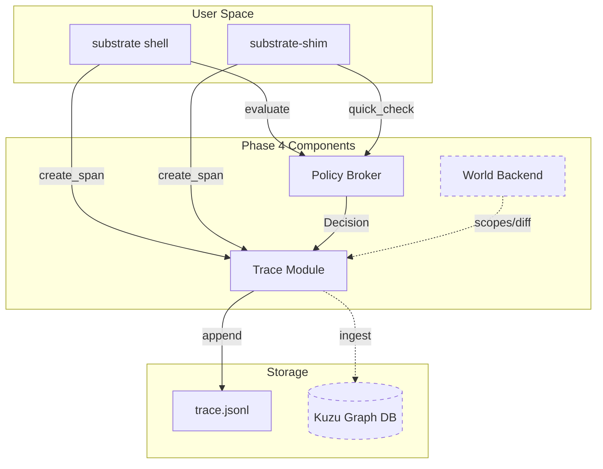
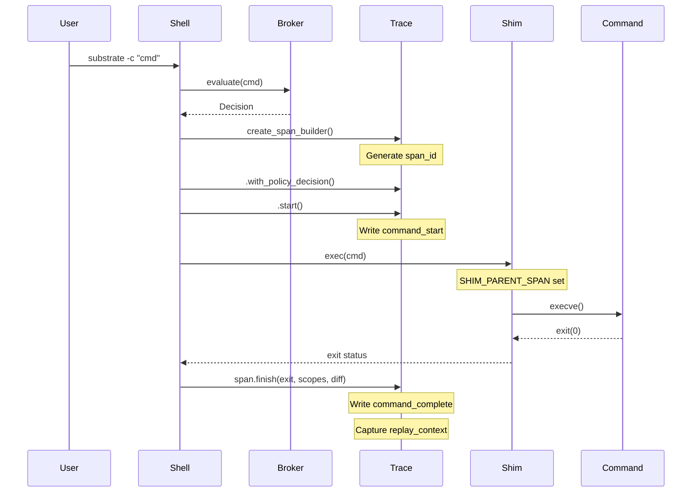

# Substrate Trace Module

## Overview

The Substrate Trace module (`crates/trace`) provides comprehensive span-based tracing for command execution across the Substrate ecosystem. It captures detailed execution context, policy decisions, and system state to enable command replay, security auditing, and graph-based analysis of command relationships.

### Key Features

- **Extended JSONL Schema**: Rich span format with policy decisions, graph edges, and replay context
- **Session Correlation**: Automatic parent-child span linking across nested executions
- **Policy Integration**: Captures broker decisions (allow/deny/restrict) in spans
- **Replay Context**: Preserves environment state for deterministic command replay
- **Graph Support**: Optional Kuzu database integration for relationship analysis
- **Component Attribution**: Tracks whether spans originate from shell, shim, or other components

## Quick Usage Guide

### Enabling Trace

Trace functionality is only active when Phase 4 features are enabled:

```bash
# Enable Phase 4 features (includes trace)
export SUBSTRATE_WORLD=enabled

# Run commands - spans are automatically generated
substrate -c "npm install"
```

### Trace Output Location

By default, traces are written to:
- `~/.substrate/trace.jsonl` (default)
- Or path specified in `SHIM_TRACE_LOG` environment variable

### Viewing Traces

```bash
# View latest span
tail -1 ~/.substrate/trace.jsonl | jq .

# Filter by session
jq 'select(.session_id == "ses_xxx")' ~/.substrate/trace.jsonl

# Find denied commands
jq 'select(.policy_decision.action == "deny")' ~/.substrate/trace.jsonl
```

### Span Schema

```json
{
  "ts": "2024-01-01T00:00:00Z",
  "event_type": "command_complete",
  "session_id": "ses_xxx",
  "span_id": "spn_xxx",
  "parent_span": "spn_yyy",
  "component": "shell|shim",
  "world_id": "wld_xxx",
  "policy_id": "default",
  "agent_id": "human|claude|cursor",
  "cwd": "/projects/foo",
  "cmd": "npm install",
  "exit": 0,
  "scopes_used": ["fs.write:/projects/foo/node_modules"],
  "fs_diff": {
    "writes": ["node_modules/..."],
    "mods": ["package-lock.json"],
    "deletes": []
  },
  "replay_context": {
    "env_hash": "abc123...",
    "umask": 22,
    "locale": "en_US.UTF-8",
    "policy_commit": "def456..."
  },
  "policy_decision": {
    "action": "allow",
    "reason": null,
    "restrictions": null
  }
}
```

## Architecture

### Component Integration



### Span Lifecycle



### Key Design Decisions

1. **Lazy Initialization**: Trace only initializes when `SUBSTRATE_WORLD=enabled`, keeping Phase 1-3 functionality unchanged.

2. **Environment-Based Correlation**: Parent span IDs are passed via `SHIM_PARENT_SPAN` environment variable, enabling correlation across process boundaries without IPC.

3. **Policy Decision Embedding**: Broker decisions are converted to trace-friendly format and embedded in spans for audit trails.

4. **Replay Context**: Captures sufficient environment state (PATH, env hash, umask, locale) to enable deterministic replay in future worlds.

5. **Feature-Gated Graph**: Kuzu integration is behind the `graph` feature flag to keep base dependencies minimal.

6. **Component Attribution**: Spans identify their origin (shell vs shim) via environment detection, crucial for understanding execution flow.

7. **Placeholder Integration**: `scopes_used` and `fs_diff` are currently empty, awaiting world backend integration (PR#10).

### Module Structure

```
crates/trace/
├── Cargo.toml          # Dependencies, kuzu feature flag
└── src/
    └── lib.rs          # Core implementation
        ├── Span        # JSONL schema structs
        ├── SpanBuilder # Fluent API for span creation
        ├── ActiveSpan  # In-flight span tracking
        ├── TraceOutput # JSONL file writer
        └── kuzu_integration # Feature-gated graph DB
```

### Integration Points

1. **Shell** (`crates/shell/src/lib.rs`):
   - Initializes trace in `run_shell()`
   - Creates spans in `execute_command()`
   - Captures policy decisions from broker
   - Sets `SHIM_PARENT_SPAN` for child processes

2. **Shim** (`crates/shim/src/exec.rs`):
   - Imports ready but not yet creating spans
   - Will create spans for direct shim executions
   - Inherits `SHIM_PARENT_SPAN` from parent

3. **Broker** (`crates/broker`):
   - Decisions are converted to `PolicyDecision` format
   - Restrictions are stringified for trace storage

## Future Enhancements

### PR#10: Overlayfs & Network Filtering
- Populate `scopes_used` with actual filesystem/network access
- Capture `fs_diff` from overlayfs changes
- Track network connections and data transfer

### PR#11: LD_PRELOAD Telemetry
- Enhanced syscall interception for Linux worlds
- More granular scope tracking
- Library call attribution

### PR#12-14: Graph Intelligence
- Full Kuzu integration with query interface
- Graph-based security analysis
- Command dependency visualization
- Replay orchestration

## Testing

```bash
# Run unit tests
cargo test -p substrate-trace

# Test with Phase 4 enabled
SUBSTRATE_WORLD=enabled cargo run --bin substrate -- -c "echo test"

# Verify trace generation
tail -1 ~/.substrate/trace.jsonl | jq .

# Test with graph feature
cargo test -p substrate-trace --features graph
```

## Configuration

### Environment Variables

- `SUBSTRATE_WORLD=enabled` - Enable Phase 4 features including trace
- `SHIM_TRACE_LOG=/path/to/trace.jsonl` - Custom trace output location
- `SHIM_PARENT_SPAN=spn_xxx` - Parent span ID (set automatically)
- `SUBSTRATE_AGENT_ID=claude` - Identify AI agent (defaults to "human")
- `SHIM_FSYNC=1` - Force filesystem sync after each span write

### Performance Considerations

- Span creation overhead: < 1ms
- JSONL append: O(1) with buffered writes
- Graph ingestion: Async when implemented
- No performance impact when `SUBSTRATE_WORLD` is not enabled