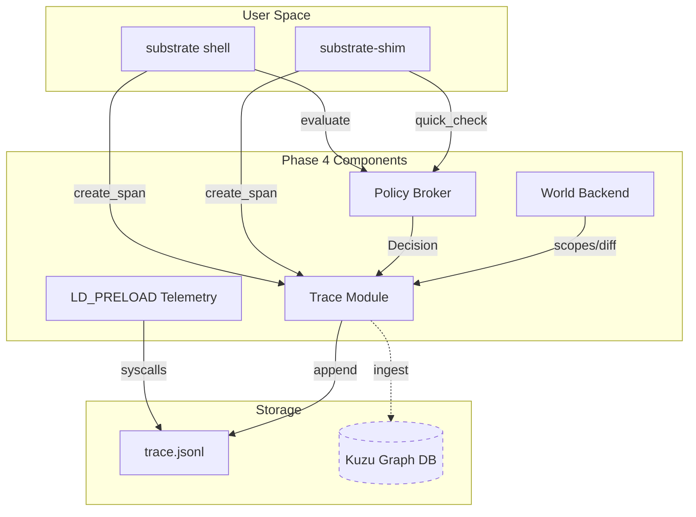
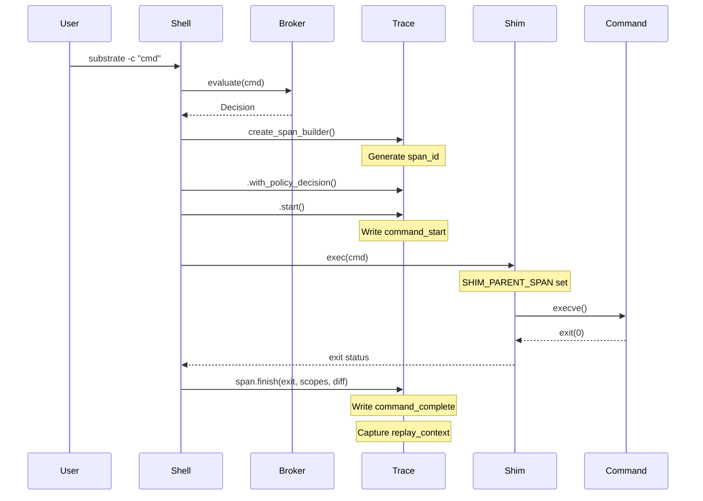

# Substrate Trace Module

## Overview

The Substrate Trace module (`crates/trace`) provides comprehensive span-based tracing for command execution across the Substrate ecosystem. It captures detailed execution context, policy decisions, and system state to enable command replay, security auditing, and graph-based analysis of command relationships.

Canonical trace schema/correlation vocabulary (Phase 8 cross-cutting spines for LLM/agents/router/workflows):
- Source of truth: `docs/project_management/packs/active/world_process_exec_tracing_parity/SCHEMA.md` for the pack-level schema and `docs/project_management/adrs/draft/ADR-0028-in-world-process-execution-tracing-parity.md` for the ADR decision record.
- Phase 8 registry/progress: `docs/project_management/packs/PHASE_8_CROSS_CUTTING_DECISION_REGISTRY.md`

### Key Features

- **Extended JSONL Schema**: Rich span format with policy decisions, graph edges, and replay context
- **Session Correlation**: Automatic parent-child span linking across nested executions
- **Policy Integration**: Captures broker decisions (allow/deny/restrict) in spans
- **Replay Context**: Preserves environment state for deterministic command replay
- **Graph Support**: Optional Kuzu database integration for relationship analysis
- **Component Attribution**: Tracks whether spans originate from shell, shim, or other components

## Quick Usage Guide

### Enabling Trace

Trace functionality is active by default whenever you launch the Substrate shell: the CLI calls `ensure_world_ready` and sets `SUBSTRATE_WORLD=enabled` on Linux, macOS (Lima), and Windows (WSL). If you need to emit spans from a custom wrapper or test harness, export the variables manually before launching the command:

```bash
export SUBSTRATE_WORLD=enabled
substrate -c "npm install"
```

### Trace Output Location

By default, traces are written to:
- `~/.substrate/trace.jsonl` (default)
- Or path specified in `SHIM_TRACE_LOG` environment variable

### Viewing Traces

```bash
# View latest span
tail -1 ~/.substrate/trace.jsonl | jq .

# Filter by session
jq 'select(.session_id == "ses_xxx")' ~/.substrate/trace.jsonl

# Find denied commands
jq 'select(.policy_decision.action == "deny")' ~/.substrate/trace.jsonl
```

### Record Families (Phase 8; heterogeneous JSONL)

`trace.jsonl` is an append-only JSONL log containing multiple record families. All records MUST carry:
- `ts` (RFC3339 UTC timestamp)
- `event_type` (string)
- `session_id` (shell trace session id)

Phase 8 introduces/locks additional cross-feature correlation fields (e.g., `orchestration_session_id`, `run_id`, `backend_id`, router/workflow/toolbox ids). These fields are not limited to command spans; they appear on other record families appended to `trace.jsonl` (router derived events, structured agent events, toolbox tool-call events, etc.). See ADR-0028 for the canonical field vocabulary and the per-family required/optional matrix.

Operator note (non-negotiable):
- Do not rely on heuristic joins. Prefer explicit join keys (`session_id`, `orchestration_session_id`, `run_id`, explicit cause refs) as defined in ADR-0028/Phase 8 contracts.
- Trace is safe-by-default: do not mirror raw third-party JSONL/NDJSON agent logs into `trace.jsonl` by default. Treat raw wrapper logs and any payloads that may contain secrets as per-session artifacts, and apply redaction/caps rules per ADR-0028 and the Phase 8 secrets rubric.
- Live shell-owned orchestrator session ownership is persisted separately from trace under `~/.substrate/run/agent-hub/sessions/*.json` (parent orchestration session record) plus `~/.substrate/run/agent-hub/participants/*.json` (child runtime participant record; `handles/*.json` remains legacy compatibility input only). The child participant record is authoritative-live only while the shell still retains the attached UAA control boundary, and production status/toolbox discovery must resolve through the parent record plus the live runtime participant snapshot instead of treating legacy handle files as truth. Trace remains the canonical historical event log; the runtime store only provides current-session discovery and precedence for operator surfaces.

### Command Span Schema (`command_start` / `command_complete`)

The current runtime already lands these fields on completion spans:
- `span_id`
- `parent_span` captured at span start
- `parent_cmd_id` when available
- `duration_ms`
- `policy_decision` when known at start
- `world_fs_strategy_primary`
- `world_fs_strategy_final`
- `world_fs_strategy_fallback_reason`
- `outcome` on deny completions

```json
{
  "ts": "2024-01-01T00:00:00Z",
  "event_type": "command_complete",
  "session_id": "ses_xxx",
  "span_id": "spn_xxx",
  "parent_span": "spn_yyy",
  "component": "shell|shim",
  "world_id": "wld_xxx",
  "policy_id": "default",
  "policy_resolution_mode": "snapshot_v1|legacy_local",
  "policy_snapshot_schema": 1,
  "policy_snapshot_hash": "abc123...",
  "agent_id": "human|claude|cursor",
  "cwd": "/projects/foo",
  "cmd": "npm install",
  "exit": 0,
  "duration_ms": 123,
  "parent_cmd_id": "cmd_yyy",
  "world_fs_strategy_primary": "overlay",
  "world_fs_strategy_final": "host",
  "world_fs_strategy_fallback_reason": "none",
  "scopes_used": ["fs.write:/projects/foo/node_modules"],
  "fs_diff": {
    "writes": ["node_modules/..."],
    "mods": ["package-lock.json"],
    "deletes": [],
    "display_path": {
      "/mnt/c/projects/foo/node_modules": "C:\\projects\\foo\\node_modules"
    }
  },
  "replay_context": {
    "env_hash": "abc123...",
    "umask": 22,
    "locale": "en_US.UTF-8",
    "policy_commit": "def456..."
  },
  "policy_decision": {
    "action": "allow",
    "reason": null,
    "restrictions": null
  }
}
```

### World Process Telemetry (`world_process_*`)

`world_process_*` is the canonical subprocess exec/exit telemetry family introduced by ADR-0028. Linux-backed executions emit these records; on other platforms, the contract is degrade-only and is summarized through shell completion fields such as `process_events_status` and `process_events_reason` instead of `world_process_*` records. The authoritative schema and protocol live in [SCHEMA.md](/Users/spensermcconnell/__Active_Code/atomize-hq/substrate/docs/project_management/packs/active/world_process_exec_tracing_parity/SCHEMA.md) and [PROTOCOL.md](/Users/spensermcconnell/__Active_Code/atomize-hq/substrate/docs/project_management/packs/active/world_process_exec_tracing_parity/PROTOCOL.md).

Event names:
- `world_process_start`
- `world_process_exit`

Required join keys:
- `session_id`
- `world_id`
- `parent_span`
- `parent_cmd_id` when available

Record posture:
- `argv` is redacted or explicitly omitted.
- `env` is allowlist-only and redacted.
- `process_events_status` and `process_events_reason` describe degrade/truncation behavior at the protocol layer.
- Canonical trace omission for builtin and preexec command bodies remains non-negotiable; `builtin_command` records must omit raw command bodies even when wrap or preexec-related routing is active.

### Phase 8 Additive Correlation (selected fields; operator-facing summary)

These are canonical cross-feature correlation identifiers. Details and required/optional classification live in ADR-0028.

- `session_id`: shell trace session id (present on all records appended to canonical trace).
- `orchestration_session_id`: multi-agent orchestration session id; required on any agent/LLM/workflow/toolbox/router record that participates in orchestration joins.
- `run_id`: unit-of-work identifier inside an orchestration session; required on structured agent events and other run-scoped families.
- `agent_id`: actor/principal identifier (`human` for direct operator actions; agent inventory id for agent-driven records).
- `backend_id`: backend identifier in `<kind>:<name>` form (e.g., `cli:codex`, `api:openai`) when a specific backend is involved.
- `world_id`: world boundary identity; required on in-world telemetry families (e.g., `world_process_*`) and any record that describes an in-world boundary/session.

Emission rule:
- `AgentEvent` keeps backward-compatible additive lineage fields: `participant_id`, `parent_participant_id`, and `resumed_from_participant_id`.
- Runtime-owned producers must emit a real `orchestration_session_id` or suppress the agent-event row entirely; they must not synthesize a process-global fallback id.
- Legacy trace rows may omit `participant_id`, `parent_participant_id`, and `resumed_from_participant_id`; consumers that ignore these additive fields continue to work unchanged.

### Agent Identity-Tuple Fields

Agent-hub successor telemetry keeps adapter identity separate from semantic identity:

- `backend_id`: derived adapter identifier in `<kind>:<agent_id>` form. This remains the allowlist and adapter-selection token.
- `client`: pure-agent client identity for successor agent-hub records.
- `router`: routing surface for the record. Pure-agent records use `agent_hub`; nested gateway-backed records use `substrate_gateway`.
- `protocol`: protocol family for the record, such as `uaa.agent.session`.
- `provider`: nested gateway-backed provider identity only; pure-agent records omit it.
- `auth_authority`: nested gateway-backed auth authority only; pure-agent records omit it.
- `parent_run_id`: nested gateway-backed trace correlation only; points at the parent pure-agent `run_id`.
- `world_id`: world boundary identifier for world-scoped pure-agent records and in-world telemetry families.
- `world_generation`: generation counter for the active world-scoped pure-agent session or world-backed execution when an authoritative shared-world binding proof exists.

Boundary note:
- The trace can carry `orchestration_session_id`, `world_id`, and `world_generation` for explicit shared-owner world executions, but trace remains historical audit output only.
- Projection of the active shared-world binding into shell-owned runtime state remains PLAN-04.
- Replacement/invalidation semantics for prior generations remain PLAN-05; consumers must not infer global invalidation from trace fields alone.

`uaa.agent.session` is currently a Substrate-local normalized protocol-family id, not an automatic claim of upstream Unified Agent API wire or API compatibility. In the current repo, pure-agent records are stamped with that label by [agent_events.rs](/Users/spensermcconnell/__Active_Code/atomize-hq/substrate/crates/common/src/agent_events.rs:17), and `substrate agent status` / orchestrator-selection logic consumes the same label in [agents_cmd.rs](/Users/spensermcconnell/__Active_Code/atomize-hq/substrate/crates/shell/src/execution/agents_cmd.rs:25).

The shell-owned UAA runtime translates external `agent_api` wrapper events into canonical `agent_event` trace rows with:
- `router=agent_hub`
- `protocol=uaa.agent.session`
- `provider` omitted
- `auth_authority` omitted

Bootstrap and lifecycle rows for the first host orchestrator caller path are emitted through the same canonical `agent_event` family; raw wrapper output stays outside `trace.jsonl`.

Runtime-owned shell rows follow the same rule. Host stream chunks, shell command-completion events, and world-restart alerts emit `agent_event` rows only when a live parent orchestration session exists; otherwise stdout/stderr and operator-facing terminal messaging continue without appending an orchestration-scoped trace row.

Operator-facing omission rules:
- Pure-agent records keep `client`, `router`, and `protocol`, and omit `provider` plus `auth_authority`.
- Nested gateway-backed records may add `provider` and `auth_authority`, but they must omit `world_id` and `world_generation`.
- Nested gateway-backed `agent_event` records carry `parent_run_id` in trace; status consumers ignore stale historical nested rows and fail closed only on malformed selected-surface parent correlation.
- Host-scoped pure-agent records omit `world_id` and `world_generation`.

### Router-Derived Event Families (workflow router daemon; Phase 8)

The workflow-router daemon appends derived events to `trace.jsonl` (append-only). v1 uses explicit `event_type` values (see router DR-0016):
- `workflow_router_rule_match`
- `workflow_router_request_enqueued`
- `workflow_router_request_denied`
- `workflow_router_request_pending_approval`
- `workflow_router_action_enqueued`
- `workflow_router_action_executed`
- `workflow_router_cursor_gap_detected`

All router-derived events MUST include stable join keys (no heuristic joins). At minimum, expect:
- `workspace_id`, `request_id`, `idempotency_key`, `rule_id`
- one explicit cause reference: `source_span_id` and/or `source_cmd_id` (preferred: `source_span_id` when available)

Router trigger posture (v1):
- The router is allowlist-driven for triggers; only specific trace event families/event_types are eligible to trigger routing actions (see router decision register; DR-0007).

Example filters:

```bash
# View only workflow-router derived events
jq 'select(.component == "workflow-router")' ~/.substrate/trace.jsonl

# Show router derived events for a request_id
jq 'select(.request_id == "req_xxx")' ~/.substrate/trace.jsonl
```

### Toolbox Tool-Call Event Families (internal orchestration toolbox; Phase 8)

The internal orchestration toolbox (ADR-0026) appends tool-call audit records to `trace.jsonl` so control-plane activity is attributable and joinable without heuristics.

v1 uses explicit `event_type` values:
- `toolbox_tool_call_start`
- `toolbox_tool_call_complete`

At minimum, expect stable join keys on these records (see ADR-0028 for the authoritative matrix):
- `tool_call_id` (primary join key for start ⇄ complete)
- `orchestration_session_id`, `run_id`
- `agent_id`, `role` (v1 caller is the orchestrator)
- `backend_id`
- tool identity: `toolbox_version`, `tool_name`

Safe-by-default note:
- Tool-call records omit full request args and full response bodies in v1 (`args_omitted=true`, `result_omitted=true`). Treat tool I/O payloads as potentially sensitive; only capture them under an explicit future debug/trace mode with redaction/caps.

Example filters:

```bash
# Show toolbox tool-call audit records
jq 'select(.component == "agent-toolbox")' ~/.substrate/trace.jsonl

# Follow one tool_call_id from start to completion
jq 'select(.tool_call_id == "tcall_xxx")' ~/.substrate/trace.jsonl
```

### Reserved Workflow/Toolbox Correlation Fields (Phase 8)

Phase 8 reserves/adds correlation identifiers so future workflow/toolbox trace families can be introduced additively without reshaping existing records:
- Workflow: `workflow_run_id`, `workflow_node_id`
- Toolbox/tool calls: `tool_call_id`

These fields may appear on non-span records even when command spans remain unchanged.

### World Lifecycle Alerts (Agent Hub; Phase 8)

Agent Hub emits structured alert events to make world session reuse and restart behavior operator-verifiable. These alerts are appended to `trace.jsonl` as structured agent events (not command spans).

Current scope boundary:
- These alerts are observational trace records, not the authoritative live-state registry for shared-world bindings.
- A `world_generation` value in trace or on an alert does not by itself define replacement/invalidation semantics for prior-generation participants; that contract remains PLAN-05.

Key machine-detectable alert codes:
- `data.code="world_restarted"`: emitted when the hub auto-restarts the world (e.g., due to world-relevant drift).
- `data.code="world_restart_required"`: emitted when drift is detected under a fail-closed posture (no implicit restart; operator action required).

Reason taxonomy (v1; non-empty string) is defined by Agent Hub core decisions (DR-0008), e.g.:
- `policy_snapshot_changed`
- `workspace_root_changed`
- `world_fs_policy_changed`
- `net_policy_changed`
- `execution_scope_changed`

Example filters:

```bash
# Show world lifecycle alerts
jq 'select(.kind == "alert" and .data.code? and (.data.code == "world_restarted" or .data.code == "world_restart_required"))' ~/.substrate/trace.jsonl
```

### Policy Snapshot Metadata (No Raw Policy Content)

The current field semantics for `policy_resolution_mode` and related snapshot metadata are defined in this document. The archived
`docs/project_management/_archived/world-agent-policy-snapshot/policy-snapshot-spec.md` is historical background only.
See the field notes below for the current consumer-facing meaning.

Command completion spans record snapshot metadata without logging raw policy contents:

- `policy_resolution_mode` (string): always present on `command_complete` spans; `snapshot_v1` when the host attached a `PolicySnapshotV1` to a world-agent request, otherwise `legacy_local`.
- `policy_snapshot_schema` (number, optional): snapshot schema version when `policy_resolution_mode == "snapshot_v1"`.
- `policy_snapshot_hash` (string, optional): stable SHA-256 hex digest of the serialized snapshot when `policy_resolution_mode == "snapshot_v1"`.

### Replay Strategy Telemetry

`replay_strategy` entries emitted by `crates/replay/src/replay/executor.rs` mirror the replay summary and warning copy:

- `origin_reason` stores the exact human-readable fragment shown in the replay summary or host warning.
- `origin_reason_code` keeps replay-local values (`flag_world`, `flag_no_world`, `env_disabled`, `flip_world`, `recorded_origin`) and extends with the effective-disable values `world_disabled_override_env`, `world_disabled_workspace_patch`, `world_disabled_global_patch`, and `world_disabled_unknown`.
- `world_disable_source` is optional and only appears for the effective-disable values above.
- `world_disable_source` uses `key`, `layer`, and `value_display` always, with optional `env` or `path_display` only when the source is known.
- The runtime normalizes `source_unknown` to `layer: unknown` and omits `env` and `path_display` in that case.
- Replay-local opt-outs do not emit `world_disable_source`.

Verbose replay outputs (`--replay-verbose` or JSON mode) print `[replay] scopes: [...]` adjacent
to the world strategy line so the CLI summary mirrors the `scopes_used` array above. When the
shell falls back to host execution it now prefixes warnings with `shell world-agent path (...)`
to keep them distinct from `[replay] warn: ...` diagnostics emitted by the replay runtime
(agent fallback, copy-diff retries, isolation opt-outs). Replay prefers the world-agent path
(`/run/substrate.sock`) when it responds; verbose output shows `[replay] world strategy: agent (...)` and
the runtime emits a single `[replay] warn: agent replay unavailable (<cause>); falling back to local backend. Run `substrate world doctor --json` or set SUBSTRATE_WORLD_SOCKET to point at a healthy agent socket. The warning appears before falling back to local isolation/copy-diff when the socket is unhealthy. Replay appends a
`replay_strategy` telemetry entry for each run so traces capture the chosen backend and any
fallback reasons. The entry now records the recorded origin/transport from the span plus the
selected origin after CLI/env/flip overrides. The `fallback_reason` mirrors the warning text above
(socket path included) and `copydiff_root*` fields appear when copy-diff retries log
`[replay] warn: copy-diff ...` lines:

For host-only transport debugging (systemd/socket reachability), prefer `substrate host doctor --json`.

```json
{
  "ts": "2025-12-04T17:00:00Z",
  "event_type": "replay_strategy",
  "session_id": "ses_demo",
  "cmd_id": "spn_demo",
  "component": "replay",
  "strategy": "copy-diff",
  "recorded_origin": "world",
  "recorded_origin_source": "span",
  "target_origin": "host",
  "recorded_transport": {
    "mode": "unix",
    "endpoint": "/run/substrate.sock",
    "socket_activation": true
  },
  "origin_reason": "--flip-world",
  "origin_reason_code": "flip_world",
  "fallback_reason": "agent socket missing (/run/substrate.sock)",
  "agent_socket": "/run/substrate.sock",
  "copydiff_root": "/tmp/substrate-1000-copydiff",
  "copydiff_root_source": "/tmp",
  "netns": "substrate-spn_demo"
}
```
Strategy values include `agent`, `world-backend`, `overlay`, `fuse`, and `copy-diff`; `copydiff_root*`
fields appear only when that fallback is used.

- Windows adds an optional `fs_diff.display_path` map that pairs canonical paths (e.g., `/mnt/c/...`) with native Windows representations; Linux and macOS omit this field. The map is populated by the `world-windows-wsl` backend and available whenever a diff is returned.
- `transport.mode` reflects the active connector: `unix` for native Linux and Lima guests, `named_pipe` when routed through the Windows forwarder, and `tcp` only when an explicit fallback is selected.
- `transport.socket_activation` is emitted on Linux when the world-agent socket originated from systemd socket activation (`true`) versus direct/manual binds (`false`). Non-Linux transports omit this field.
- `execution_origin` on command_complete spans identifies where the command actually ran (`host` vs `world`). `replay_context` also includes the recorded origin/transport plus host/user/shell/term and anchor/world-root/caging hints (`SUBSTRATE_ANCHOR_*`, `SUBSTRATE_WORLD_ROOT_*`, `SUBSTRATE_CAGED`) so replays can honor the original environment.

## Architecture

### Component Integration


```mermaid
graph TB
    subgraph "User Space"
        Shell[substrate shell]
        Shim[substrate-shim]
    end
    
    subgraph "Phase 4 Components"
        Broker[Policy Broker]
        Trace[Trace Module]
        World[World Backend]
        Telemetry[LD_PRELOAD Telemetry]
    end
    
    subgraph "Storage"
        JSONL[trace.jsonl]
        Kuzu[(Kuzu Graph DB)]
    end
    
    Shell -->|evaluate| Broker
    Shim -->|quick_check| Broker
    
    Shell -->|create_span| Trace
    Shim -->|create_span| Trace
    
    Broker -->|Decision| Trace
    World -->|scopes/diff| Trace
    Telemetry -->|syscalls| JSONL
    
    Trace -->|append| JSONL
    Trace -.->|ingest| Kuzu
    
    style Kuzu stroke-dasharray: 5 5
```

### Span Lifecycle


```mermaid
sequenceDiagram
    participant User
    participant Shell
    participant Broker
    participant Trace
    participant Shim
    participant Command
    
    User->>Shell: substrate -c "cmd"
    Shell->>Broker: evaluate(cmd)
    Broker-->>Shell: Decision
    
    Shell->>Trace: create_span_builder()
    Note over Trace: Generate span_id
    Shell->>Trace: .with_policy_decision()
    Shell->>Trace: .start()
    Note over Trace: Write command_start
    
    Shell->>Shim: exec(cmd)
    Note over Shim: SHIM_PARENT_SPAN set
    
    Shim->>Command: execve()
    Command-->>Shim: exit(0)
    
    Shim-->>Shell: exit status
    
    Shell->>Trace: span.finish(exit, scopes, diff)
    Note over Trace: Write command_complete
    Note over Trace: Capture replay_context
```

### Key Design Decisions

1. **Initialization Strategy**: The shell and shim call `substrate_trace::init_trace()` during startup so spans are recorded even when `SUBSTRATE_WORLD` is disabled; world-specific metadata (policy decisions, fs_diff) is appended when isolation is active.

2. **Environment-Based Correlation**: Parent span IDs are passed via `SHIM_PARENT_SPAN` environment variable, enabling correlation across process boundaries without IPC.

3. **Policy Decision Embedding**: Broker decisions are converted to trace-friendly format and embedded in spans for audit trails.

4. **Replay Context**: Captures sufficient environment state (PATH, env hash, umask, locale) to enable deterministic replay in future worlds.

5. **Feature-Gated Graph**: Kuzu integration is behind the `graph` feature flag to keep base dependencies minimal.

6. **Component Attribution**: Spans identify their origin (shell vs shim) via environment detection, crucial for understanding execution flow.

7. **World Integration Complete**: `scopes_used` and `fs_diff` are now populated via world backend integration (PR#10 ✅).

### Module Structure

```
crates/trace/
├── Cargo.toml          # Dependencies, kuzu feature flag
└── src/
    └── lib.rs          # Core implementation
        ├── Span        # JSONL schema structs
        ├── SpanBuilder # Fluent API for span creation
        ├── ActiveSpan  # In-flight span tracking
        ├── TraceOutput # JSONL file writer
        └── kuzu_integration # Feature-gated graph DB
```

### Integration Points

1. **Shell** (`crates/shell/src/lib.rs`):
   - Initializes trace in `run_shell()`
   - Creates spans in `execute_command()`
   - Captures policy decisions from broker
   - Sets `SHIM_PARENT_SPAN` for child processes

2. **Shim** (`crates/shim/src/exec.rs`):
   - Imports ready but not yet creating spans
   - Will create spans for direct shim executions
   - Inherits `SHIM_PARENT_SPAN` from parent

3. **Broker** (`crates/broker`):
   - Decisions are converted to `PolicyDecision` format
   - Restrictions are stringified for trace storage

4. **Telemetry Library** (`crates/telemetry-lib/`):
   - LD_PRELOAD syscall interception inside worlds/VMs
   - Writes syscall events directly to trace.jsonl
   - Maintains session correlation via environment variables
   - Complements span-level tracing with syscall-level detail

5. **Replay Module** (`crates/replay/`):
   - Consumes trace.jsonl for deterministic replay
   - Reconstructs environment from replay_context
   - Enables regression testing and debugging

## REPL Observability

Interactive sessions now emit lightweight status events so operators can see which REPL engine is active and how much work it processed. Two JSON records are appended per session:

- `repl_status` (`stage: "start"`) – written when the interactive loop boots. Captures `repl_mode` (`"async"` or `"sync"`), whether CI mode is active, if worlds are disabled, and the target shell binary.
- `repl_status` (`stage: "stop"`) – emitted on exit with per-session counters: `metrics.input_events`, `metrics.agent_events`, and `metrics.commands_executed`. These counters help spot busy-spin regressions (e.g., a high `input_events`/`agent_events` ratio when idle).

In addition, `command_start` / `command_complete` log entries now include a `repl_mode` field whenever the shell is in interactive mode, making it easier to correlate command history with the REPL implementation that executed it.

## Recent Enhancements

### ✅ PR#10 Complete: Overlayfs & Network Filtering  
- `scopes_used` populated with actual filesystem/network access
- `fs_diff` captures overlayfs changes with smart truncation  
- Network scope tracking via nftables integration
- Unified FsDiff type in substrate-common

### ✅ PR#11 Complete: LD_PRELOAD Telemetry
- Syscall-level interception via `crates/telemetry-lib/`
- Intercepts exec*, file ops, network calls inside worlds/VMs
- Session correlation through fork/exec boundaries
- Docker-tested Linux compatibility

### ✅ PR#12 Complete: Replay Module
- Trace replay engine for regression testing (`crates/replay/`)
- Deterministic command replay with environment reconstruction
- Output comparison with non-deterministic element handling
- Batch testing and HTML regression reports

## Future Enhancements

### PR#13-14: Graph Intelligence
- Full Kuzu integration with query interface
- Graph-based security analysis
- Command dependency visualization
- Replay orchestration

## Testing

```bash
# Run unit tests
cargo test -p substrate-trace

# Test with Phase 4 enabled
SUBSTRATE_WORLD=enabled cargo run --bin substrate -- -c "echo test"

# Verify trace generation
tail -1 ~/.substrate/trace.jsonl | jq .

# Test with graph feature
cargo test -p substrate-trace --features graph
```

## Configuration

### Environment Variables

- `SUBSTRATE_WORLD=enabled` - Enable Phase 4 features including trace
- `SHIM_TRACE_LOG=/path/to/trace.jsonl` - Custom trace output location
- `SHIM_PARENT_SPAN=spn_xxx` - Parent span ID (set automatically)
- `SUBSTRATE_AGENT_ID=claude` - Identify AI agent (defaults to "human")
- `SHIM_FSYNC=1` - Force filesystem sync after each span write

### Performance Considerations

- Span creation overhead: < 1ms
- JSONL append: O(1) with buffered writes
- Graph ingestion: Async when implemented
- No performance impact when `SUBSTRATE_WORLD` is not enabled
