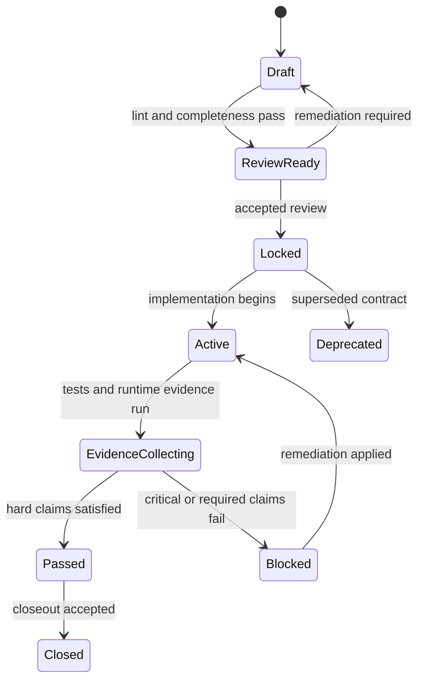

# Code-Intelligence Contracts And Gates

Status: canonical design document for executable contracts, evidence, verdicts, and gate semantics inside the code-intelligence program.

This document defines how the code-intelligence program treats locked contracts as authoritative execution truth and how implementation code, tests, docs, traces, and tool output attach as evidence.

---

## 0. Scope

This document is scoped to the code-intelligence program described in [docs/code-intelligence-program.md](/Users/spensermcconnell/.codex/worktrees/9b83/substrate/docs/code-intelligence-program.md).

It is not:

- a source of truth for all of Substrate
- a replacement for the crate-ownership map in the program doc
- a replacement for the workstream/worktree orchestration design
- a claim that Substrate should replace JSON Schema, CUE, OpenAPI, Storybook, OPA, or similar ecosystems with one universal validator

This design is a cross-cutting overlay across the code-intelligence program.

It exists so that the program can answer questions like:

- did the implementation satisfy the reviewed contract
- did the tests actually observe the required claims
- did generated docs or exported artifacts drift from the locked contract
- can a lane, gate, or seam close, or is it blocked

---

## 1. Source-of-truth hierarchy

Use these documents in this order.

1. [docs/code-intelligence-program.md](/Users/spensermcconnell/.codex/worktrees/9b83/substrate/docs/code-intelligence-program.md)
   Owns program-wide crate ownership, dependency rules, and rollout sequencing.

2. This document
   Owns the contract/evidence/verdict/gate model across the code-intelligence program.

3. [docs/code-intelligence-workstream-orchestration.md](/Users/spensermcconnell/.codex/worktrees/9b83/substrate/docs/code-intelligence-workstream-orchestration.md)
   Owns the planning/materialization capability built on top of those contract and gate semantics.

4. [crates/lift/README.md](/Users/spensermcconnell/.codex/worktrees/9b83/substrate/crates/lift/README.md)
   Owns Lift-local architecture and Lift-owned export surfaces.

5. Manual operator artifacts such as [ORCH_PLAN.md](/Users/spensermcconnell/.codex/worktrees/9b83/substrate/ORCH_PLAN.md)
   These remain evidence and precedent, not the canonical contract model.

If this document conflicts with the program doc on crate ownership, the program doc wins.

If this document conflicts with the orchestration doc on workstream-specific artifact flow, the orchestration doc wins for that capability while this document still owns the general contract/evidence/gate semantics.

---

## 2. Executive decision

The code-intelligence program should adopt a Substrate-native executable contract layer.

The important meaning is:

- a reviewed and locked contract is the authoritative execution truth
- implementation code, tests, docs, traces, and tool runs are evidence
- verdicts are produced by evaluating that evidence against locked claims
- runtime gates consume those verdicts rather than treating "tests passed" as the only acceptance signal

The important non-meaning is:

- this is not a new top-level program decomposition
- this is not a new Cargo workspace root
- this is not a reason for every crate to invent its own contract system
- this is not a universal validator that replaces existing schema, policy, API, or UI ecosystems

The winning shape is:

```text
locked contract
  -> claim set
  -> evidence records from program surfaces
  -> verdict
  -> runtime gate decision
  -> closeout, block, or remediation path
```

---

## 3. Why this exists

The code-intelligence program already depends on schema-backed artifacts, deterministic outputs, explicit gates, and merged-tree acceptance.

What was still missing is a durable way to say:

- what exactly was promised
- which claims are hard requirements
- what evidence counts
- what was observed versus merely assumed
- why a gate passed or blocked

This layer solves that without changing the broader ownership split:

- `lift` still owns repository intelligence
- `effort` still owns static planning
- `exec` still owns runtime state and gate execution

The contract layer is the membrane across them, not a replacement for them.

---

## 4. Ownership model

### `kernel`

`kernel` owns the minimum shared contract primitives needed across the program.

That includes:

- contract and claim identifiers
- contract and evidence refs
- deterministic JSON/fingerprint helpers
- envelope metadata
- shared diagnostics and severity primitives

`kernel` does not own:

- Lift-specific repo/path/symbol/query semantics
- planning semantics
- runtime gate execution
- adapter-specific logic for OpenAPI, CUE, Storybook, or similar tools

### `lift`

Lift is a contract subject and evidence producer.

Lift owns:

- Lift-local contract subjects such as impact, reuse, topology, score, policy, contract, index, query, and rewrite surfaces
- Lift-produced evidence and export artifacts that peer crates can consume
- repo-derived facts that support claim evaluation

Lift does not own:

- the cross-program contract lifecycle
- general verdict semantics
- runtime gate state

### `intake`

`intake` owns task-shaping contracts and evidence around task-brief completeness.

That includes:

- forcing-question coverage
- premise challenge completion
- out-of-scope capture
- normalized task-brief quality claims

### `context`

`context` owns context-packet evidence, not the whole contract system.

That includes:

- retrieval provenance
- freshness and trust evidence
- packet completeness against declared context requirements

### `effort`

`effort` consumes locked contracts and emits static plan artifacts that can themselves be evaluated.

That includes:

- plan-quality claims
- lane ownership and forbidden-surface claims
- validation-wall intent
- handoff packet completeness claims

`effort` does not own:

- runtime verdict persistence
- final gate execution

### `exec`

`exec` owns runtime evaluation, gate decisions, and checkpointed closeout state.

That includes:

- evidence collection during execution
- verdict materialization
- gate execution against required claims
- waivers and blocked-state recording
- checkpointed gate history

`exec` does not own:

- planning semantics
- Lift repo intelligence
- replacing external validator ecosystems with custom reimplementations

---

## 5. Design rules

These rules are program-wide.

1. Locked contracts are authoritative.
   Tests, code, docs, traces, and generated artifacts are witnesses, not the source of truth.

2. Keep the shared kernel small.
   Only move truly shared contract primitives into `kernel`.

3. Contract semantics and runtime decisions stay distinct.
   Contract definitions and claim meaning are not the same thing as `exec` gate execution.

4. Evidence must be explicit.
   A claim is not satisfied just because some nearby test happened to pass.

5. Adapters are not authorities.
   OpenAPI, JSON Schema, Storybook, CUE, OPA, and similar systems are adapter targets or evidence engines, not the owning program contract by default.

6. Determinism is mandatory.
   The same locked contract and the same evidence set must produce the same canonical verdict bytes and fingerprints.

7. Missing required evidence is a real result.
   `not_observed` is not silently treated as success for required claims.

8. Scores are advisory unless policy says otherwise.
   Hard gate failures block even if the aggregate score looks good.

9. Runtime gates consume verdicts.
   Gate execution should not bypass the contract layer and rely only on lane-local green checks.

10. This layer remains an overlay across the program.
    It must not become a second competing top-level architecture.

---

## 6. Core model

### Contract

A contract is a machine-readable, reviewed, locked artifact that defines a boundary, operation, component, workflow, or runtime closeout surface.

Examples:

- a Lift operation
- a task-brief completeness surface
- a context-packet quality surface
- a lane handoff contract
- a validation-wall contract
- a seam closeout contract

### Claim

A claim is one required or optional assertion inside a contract.

Examples:

- input or output shape must match schema
- a report field must remain bounded or present
- a plan must declare owned and forbidden surfaces
- a runtime must not write outside an allowed area
- a seam cannot close while a critical claim remains unresolved

### Evidence

Evidence is an observed fact produced by implementation runs, tests, docs generation, traces, snapshots, or other tool output.

Examples:

- input and output records
- CLI stdout, stderr, and exit code
- write-set or network trace data
- generated artifact fingerprints
- lane handoff packets
- merged-tree validation records

### Verdict

A verdict is the evaluation result of one evidence set against one locked contract.

Typical statuses:

- `pass`
- `fail`
- `blocked`
- `warning`
- `not_observed`
- `not_applicable`
- `waived`
- `flaky`

### Gate decision

A gate decision is the runtime decision that consumes verdicts and execution policy.

In this program, `GateDecisionV1` remains an `exec` runtime artifact.

This document defines what it should consume and how it should reason about claims.
It does not move runtime gate ownership away from `exec`.

---

## 7. Artifact families

These artifacts are the intended direction for the cross-program contract layer.

### Shared kernel primitives

- `ContractIdV1`
- `ClaimIdV1`
- `EvidenceIdV1`
- `VerdictIdV1`
- `WaiverIdV1`
- `ContractRefV1`
- `EvidenceRefV1`

### Cross-program contract artifacts

- `ContractV1`
- `ClaimV1`
- `CoverageRequirementV1`
- `EvidenceRecordV1`
- `CoverageRecordV1`
- `VerdictV1`
- `WaiverV1`

### Runtime integration artifacts

- `GateDecisionV1`
- `CheckpointV1`
- `ArtifactManifestV1`

The important boundary is:

- `ContractV1`, `ClaimV1`, `EvidenceRecordV1`, `CoverageRecordV1`, `VerdictV1`, and `WaiverV1` define the contract/evidence model
- `GateDecisionV1` remains the runtime decision artifact already owned by `exec`

---

## 8. Lifecycle and semantics

Recommended contract lifecycle:



Recommended contract statuses:

- `draft`
- `review_ready`
- `locked`
- `active`
- `passed`
- `blocked`
- `closed`
- `deprecated`

Recommended claim severities:

- `critical`
- `major`
- `minor`
- `advisory`

Recommended verdict policy:

```text
block if any critical claim fails
block if required evidence is missing
block if weighted score falls below the declared minimum
otherwise pass
```

Scores are useful for operator and agent steering.
They are not allowed to override a critical failure by themselves.

---

## 9. Adapter model and non-goals

The code-intelligence program should not build a universal validator from scratch.

It should own:

- contract identity
- claim model
- evidence model
- verdict model
- gate semantics
- reporting and remediation outputs

It should use existing ecosystems as adapters or evidence engines where they fit.

Examples:

- JSON Schema for portable shape validation
- CUE or CEL for richer invariant evaluation
- OPA or Cedar for policy-specific evaluation
- OpenAPI or AsyncAPI as emitters or drift-check inputs for API surfaces
- Storybook, Playwright, or similar tools for UI evidence
- trace and replay artifacts where those are the right runtime evidence surfaces

This means:

- generated docs are not silently authoritative
- code-derived schemas are not silently authoritative
- adapter outputs can be compared against locked contracts for drift

---

## 10. Relationship to workstream orchestration

This layer plugs into the orchestration capability described in [docs/code-intelligence-workstream-orchestration.md](/Users/spensermcconnell/.codex/worktrees/9b83/substrate/docs/code-intelligence-workstream-orchestration.md).

The relationship is:

- `effort` may consume locked contracts as planning inputs
- lane plans and handoff packets may carry claim surfaces that must later be observed
- validation walls are natural contract consumers
- `exec` records runtime evidence, materializes verdicts, and emits gate decisions

The orchestration capability should treat contract semantics as an input and runtime gate behavior as an execution responsibility.

It should not:

- redefine the general contract model inside the orchestration doc
- treat lane-local green tests as sufficient closeout proof by default
- silently bypass verdict evaluation when closing a gate

---

## 11. Relationship to existing Substrate crates

This contract layer lives beside existing Substrate crates such as `common`, `trace`, and `replay`.

It does not automatically replace them.

The rule is:

- if an existing crate already owns a wider product contract or trace surface, keep using it unless the code-intelligence program explicitly needs a narrower program-local artifact
- if runtime evidence is already available from existing trace or replay surfaces, prefer adapting that evidence instead of cloning it
- any overlap must be made explicit in the owning crate docs and implementation plan

In short:

- `kernel` is not a license to duplicate every shared type in the repo
- `VerdictV1` is not a license to replace all existing runtime result models
- `GateDecisionV1` here still belongs to `exec`

---

## 12. Rollout alignment

This layer should be landed through the existing `A0` to `A6` rollout rather than as a separate independent program.

### A0

Extract the minimum shared kernel primitives:

- identifiers
- refs
- diagnostics
- severity
- deterministic fingerprints and JSON helpers

### A1

Adopt those primitives inside Lift where appropriate and identify the first Lift contract subjects and evidence surfaces.

### A2

Let `intake` define task-brief completeness claims and evidence expectations.

### A3

Let `context` define provenance, trust, and freshness evidence for context packets.

### A4

Freeze the minimum Lift export and contract-evidence surfaces needed by peer crates.

### A5

Let `effort` consume locked contracts and emit plan artifacts that can be checked for completeness, ownership, and gate readiness.

### A6

Let `exec` own verdict persistence, gate execution, waivers, checkpointed gate history, and closeout or blocked decisions.

The key rollout rule is:

> land the minimum shared contract primitives early, but keep full runtime gate execution with `exec`

---

## 13. Acceptance criteria

The contracts-and-gates layer is on the intended path when all are true:

1. locked contracts are clearly distinguished from evidence
2. shared contract primitives stay small enough to fit naturally inside `kernel`
3. Lift, intake, context, effort, and exec do not each invent competing contract models
4. verdicts are deterministic for the same contract and evidence inputs
5. missing required evidence can block a gate
6. runtime gate decisions consume verdicts rather than bypassing them
7. external validator ecosystems are used as adapters, not silently promoted to program authority
8. orchestration closeout semantics can explain why a gate passed or blocked in claim-level terms

---

## 14. Falsification questions

If any answer below becomes "yes", this design is drifting.

1. Can one crate bypass shared primitives and define its own incompatible contract identity model?
2. Can generated docs or code-derived schemas silently replace the locked contract as the source of truth?
3. Can `effort` or `lift` start owning runtime gate execution?
4. Can `exec` bypass verdict evaluation and close gates using only ad hoc pass/fail checks?
5. Can required claims succeed without explicit evidence or an explicit waiver?
6. Can adapters such as OpenAPI or Storybook become the owning contract model by default?
7. Can the same locked contract and evidence set produce different verdict bytes or fingerprints?
8. Can a reader mistake this document for a second competing top-level program architecture?

---

## 15. Short version

- the code-intelligence program should adopt a Substrate-native contract/evidence/verdict/gate layer
- this layer is a cross-cutting overlay, not a competing replacement for the program architecture
- `kernel` owns the minimum shared primitives
- `lift`, `intake`, `context`, and `effort` produce or consume contract-shaped artifacts and evidence
- `exec` owns runtime verdict persistence and gate execution
- external validator ecosystems remain adapters and evidence engines
- locked contracts are authoritative; code, tests, docs, traces, and tool output are evidence
