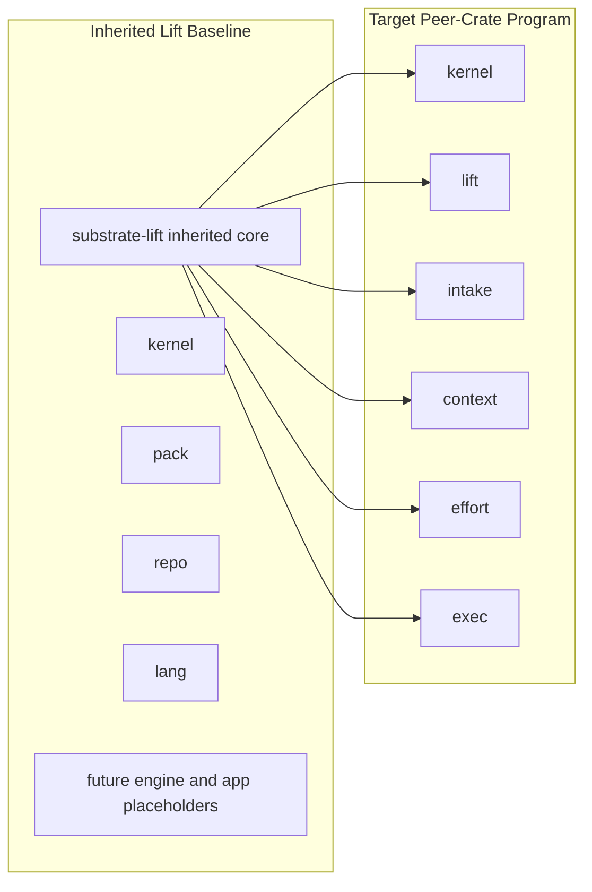
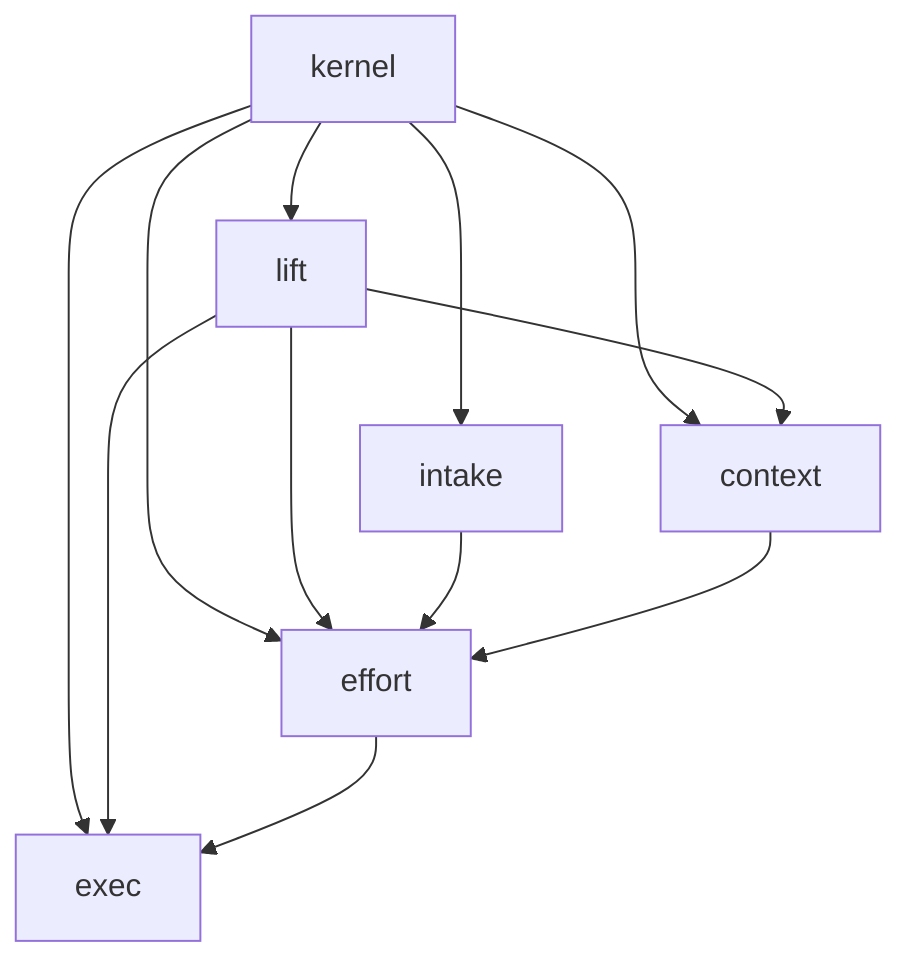

# Code-Intelligence Program

This document is the top-level source of truth for the code-intelligence program inside the `substrate` repository.

It owns:

- crate ownership across the code-intelligence program
- cross-crate artifact and contract families
- dependency and boundary rules
- sequencing and parallel landing rules
- the mapping from the old Lift-centered roadmap to the new peer-crate program

It does not replace crate-local implementation specs. Lift-local details remain in the Lift docs referenced below.

---

## 0. Scope and topology

This program lives **inside** the `substrate` repository and **inside** the parent Substrate Cargo workspace.

It is a logical sub-workspace / program, not a separate Cargo workspace root.

That means:

- the parent repo root remains the Cargo workspace root
- code-intelligence crates live under `crates/` beside the other Substrate crates
- this document governs the code-intelligence program only, not all of Substrate

### Physical crate layout

The intended physical crate layout is:

```text
crates/
  lift/
  kernel/
  intake/
  context/
  effort/
  exec/
```

Directory names follow the existing repo convention.

Cargo package names use the `substrate-*` prefix:

- `crates/lift` -> `substrate-lift`
- `crates/kernel` -> `substrate-kernel`
- `crates/intake` -> `substrate-intake`
- `crates/context` -> `substrate-context`
- `crates/effort` -> `substrate-effort`
- `crates/exec` -> `substrate-exec`

### Current inherited baseline

This program is not starting from zero.

Its inherited baseline is the previously Lift-centered plan whose landed work is recorded in:

- [crates/lift/lift_seam0_spec.md](/Users/spensermcconnell/.codex/worktrees/9b83/substrate/crates/lift/lift_seam0_spec.md)
- [crates/lift/lift_seam1_spec_reviewed.md](/Users/spensermcconnell/.codex/worktrees/9b83/substrate/crates/lift/lift_seam1_spec_reviewed.md)
- [crates/lift/lift_seam2_spec_reviewed.md](/Users/spensermcconnell/.codex/worktrees/9b83/substrate/crates/lift/lift_seam2_spec_reviewed.md)
- [crates/lift/lift_seam3_spec_reviewed.md](/Users/spensermcconnell/.codex/worktrees/9b83/substrate/crates/lift/lift_seam3_spec_reviewed.md)

Those documents capture the Lift seams that already landed before the workspace pivot.

The important implication is:

> the code-intelligence program is a repartitioning of already-landed Lift foundations into a peer-crate architecture

---

## 1. Source-of-truth hierarchy

Use these documents in this order.

### 1. This document

This file is the authority for:

- code-intelligence program scope
- crate ownership
- cross-crate contracts
- dependency rules
- rollout sequencing
- what replaced what

### 2. Lift crate-local architecture

[crates/lift/README.md](/Users/spensermcconnell/.codex/worktrees/9b83/substrate/crates/lift/README.md) is the authority for Lift-only architecture, seams, and Lift-owned internals.

### 3. Landed Lift seam details

The `lift_seam*_spec*.md` files remain the detailed truth for the Lift seams already landed.

If this document and a Lift-local document disagree on a cross-crate ownership question, this document wins.

If this document and a Lift seam spec disagree on an already-landed Lift internal detail, the seam spec wins unless the program intentionally changed ownership and this document says so explicitly.

---

## 2. Why the program changed

The earlier Lift-centered plan was useful for landing the initial code-intelligence engine foundations.

It is no longer the right top-level program map.

The new direction is:

- Lift remains the repo / code-intelligence engine
- context assembly is not a Lift app responsibility
- intake, context, effort, and exec become peer crates
- the shared cross-crate contracts move into a minimal kernel crate

This is not a reversal of the landed Lift work.

It is a change in the top-level partitioning of responsibilities.

---

## 3. Ownership model

### `lift`

Lift owns repository intelligence and Lift-owned app surfaces.

That includes:

- existing-code leverage discovery
- dependency and codepath inventory
- structural repository intelligence
- test topology detection
- reuse / impact / policy / contract / query / rewrite / index surfaces
- repo-local prior-artifact resolution
- the engine seams already charted in the Lift crate docs

Lift does not own:

- context packet assembly
- intake forcing-question logic
- static work decomposition as a general peer-crate service
- execution-state orchestration as a general peer-crate service

### `kernel`

`kernel` owns the smallest truly shared contracts needed across the code-intelligence program.

It exists to prevent duplicate definitions of IDs, artifact references, diagnostics, envelopes, and deterministic JSON/fingerprint helpers.

### `intake`

`intake` owns task shaping.

That includes:

- forcing questions
- premise challenge
- alternatives generation
- out-of-scope capture
- completeness axes by task type
- normalized task brief assembly

### `context`

`context` owns context assembly.

That includes:

- retrieval policy
- scope selection
- trust and freshness filtering
- provider composition
- context packet assembly

### `effort`

`effort` owns static work decomposition.

That includes:

- work graph definition
- dependency lanes
- parallelization candidates
- critical path reporting
- modular handoff packets

### `exec`

`exec` owns runtime execution state.

That includes:

- state transitions
- gate evaluation
- checkpointing
- resumability
- stale review detection
- artifact write manifests

---

## 4. Design rules

These rules are program-wide.

1. Artifact contracts before integration.
   Cross-crate integration happens through stable artifacts and schema-backed contracts, not deep imports of another crate's internals.

2. Keep the shared kernel small.
   Do not move Lift-specific repo/path/symbol/query concepts into `kernel` unless another peer crate genuinely needs them.

3. Lift stays repo-local.
   Lift remains about repository intelligence, not memory scope assembly, task shaping, or runtime execution state.

4. Execution is dynamic, effort is static.
   `effort` defines the graph. `exec` runs the graph.

5. Compile-time and runtime stay distinct.
   Pack compilation, repo snapshotting, parsing, graphing, fact derivation, and runtime state machines remain separate concerns.

6. Schema-first at crate boundaries.
   Every cross-crate artifact gets a hand-authored Draft 2020-12 schema.

7. Determinism is mandatory.
   The same inputs must produce the same canonical bytes and fingerprints.

8. Parallel landing starts after contract freeze.
   A downstream crate may start once the minimal contracts it consumes are frozen.

9. Directory names and package names are intentionally different.
   Repo directories follow local crate naming convention; Cargo package names use `substrate-*`.

10. This program remains inside the parent Substrate Cargo workspace.
    Any future change to that topology must be called out explicitly rather than implied.

---

## 5. Current decomposition and target decomposition

The inherited Lift baseline can be thought of as:



This is a conceptual decomposition of responsibilities.

It does not mean the program was ever required to become a separate Cargo workspace root.

---

## 6. Artifact families

These are the contract families the program should converge on.

### Shared kernel artifacts

- `ArtifactRefV1`
- `EnvelopeMetaV1`
- `DiagnosticV1`
- `FingerprintV1`
- `RunIdV1`
- `TaskIdV1`
- `PlanIdV1`
- `CheckpointIdV1`
- `ArtifactIdV1`

### Intake artifacts

- `IntakeRequestV1`
- `TaskBriefV1`
- `ForcingQuestionV1`
- `PremiseChallengeV1`
- `AlternativeV1`
- `CompletenessAxisV1`
- `IntakeBundleV1`

### Context artifacts

- `ContextRequestV1`
- `RetrievalPolicyV1`
- `ContextItemV1`
- `ContextPacketV1`

### Effort artifacts

- `EffortRequestV1`
- `WorkGraphV1`
- `WorkNodeV1`
- `WorkEdgeV1`
- `LanePlanV1`
- `CriticalPathReportV1`
- `HandoffPacketV1`

### Exec artifacts

- `ExecutionStateV1`
- `GateDecisionV1`
- `CheckpointV1`
- `ArtifactManifestV1`
- `ResumePlanV1`

### Lift artifacts to stabilize early

These should be frozen before full Lift completion so peer crates can consume Lift by artifact:

- `ImpactReportV1`
- `ReuseReportV1`
- `TestTopologyV1`
- `RepoIndexSummaryV1`

---

## 7. Relationship to existing Substrate crates

This program lives in the same repository as existing Substrate crates such as `common`, `trace`, and `replay`.

This document does not assume those crates are replaced automatically by the code-intelligence program.

The rule is:

- if an existing Substrate crate already owns a shared runtime or trace contract for the wider product, keep using it unless the code-intelligence program explicitly defines a narrower or separate contract family
- if `kernel` introduces a new shared contract, it must be because the contract is specifically needed across the code-intelligence peer crates
- overlap with existing crates must be made explicit in the owning crate docs and implementation plan, not left implicit

In short:

- `kernel` is not a license to duplicate all shared types already present elsewhere in Substrate
- `exec` is not a license to silently replace existing replay or runtime crates
- any convergence with `common`, `trace`, or `replay` must be intentional and documented

---

## 8. Dependency rules

### Allowed high-level directions



### Boundary rules

1. Peer crates should consume Lift through artifacts first, not through deep internal imports.

2. `context` may consume Lift-produced artifact refs, but Lift does not regain ownership of context assembly.

3. `effort` may consume intake bundles, context packets, and Lift signals, but it does not mutate execution state.

4. `exec` consumes graphs and handoff packets; it does not redefine planning semantics.

5. `kernel` should not absorb Lift-internal repo/path/symbol/query semantics by default.

6. Crate-local provider traits may exist inside Lift first, but cross-crate coupling should freeze at schema-backed artifact boundaries.

---

## 9. Roadmap namespaces

To avoid mixing the old Lift seam lineage with the new peer-crate roadmap, use two namespaces.

### Program roadmap

Use `A0`, `A1`, `A2`, ... for the cross-crate code-intelligence program.

### Lift-local roadmap

Keep the Lift-local seam lineage in the Lift docs and seam specs.

This document does not rename the previously landed Lift seam documents.

It does define a new program-level rollout namespace so the workspace pivot is easy to reason about.

---

## 10. Program rollout

### A0 — extract `kernel`

Mission:
create the smallest shared contracts crate needed by the code-intelligence peer crates.

Owns:

- IDs for runs, tasks, plans, checkpoints, and artifacts
- artifact refs
- envelope metadata
- deterministic diagnostics
- canonical JSON helpers
- fingerprint helpers

Does not own:

- Lift-specific repo/path/symbol/query contracts
- parsed units
- work graphs
- execution-state semantics

### A1 — bridge Lift to `kernel`

Mission:
adopt the shared kernel contracts inside Lift where appropriate without finishing all of Lift first.

Owns:

- Lift adoption of shared IDs, diagnostics, and artifact refs where appropriate
- early Lift artifact contract freeze

Does not own:

- full Lift completion
- peer-crate orchestration

### A2 — land `intake`

Mission:
create the task-shaping crate.

Depends on:

- `kernel`

Does not require:

- full Lift completion

### A3 — land `context`

Mission:
create the context-assembly crate.

Depends on:

- `kernel`

May start with:

- fake or static providers
- stubbed checkpoint-like inputs

### A4 — freeze early Lift export contracts

Mission:
make Lift a clean producer of stable artifacts for peer crates.

Likely scope:

- `ImpactReportV1`
- `ReuseReportV1`
- `TestTopologyV1`
- `RepoIndexSummaryV1`

### A5 — land `effort`

Mission:
create the static work-decomposition crate.

Depends on:

- frozen intake contracts
- preferably frozen context packet contracts
- optional Lift artifact refs

### A6 — land `exec`

Mission:
create the runtime execution-state crate.

Depends on:

- frozen work graph and handoff packet contracts

Does not depend on:

- Lift internals

### A7+ — continue Lift and peer crates in parallel

After the peer-crate program exists, continue both tracks:

- Lift track: adapters, graph/scope, runtime topology/classification, query runtime, rule/fact runtime, derive/provenance, patch planning, export/index, Lift-owned apps
- peer-crate track: richer context providers, deeper intake completeness, smarter effort decomposition, fuller exec gates and checkpoint flows

---

## 11. Parallel landing rules

The safe start conditions are:

- `A2` and `A3` may begin once `A0` is stable
- `A4` may begin once the minimum Lift export contracts are understood well enough to freeze
- `A5` may begin once `IntakeBundleV1` is frozen
- `A6` may begin once `WorkGraphV1` and `HandoffPacketV1` are frozen
- Lift may continue in parallel as soon as `A1` is stable enough to prevent contract churn from leaking outward

The key rule is:

> do not finish all of Lift before starting the new peer crates

The program should instead:

- extract the minimum shared kernel first
- keep Lift moving where it unblocks peer crates
- start the peer crates as soon as their consumed contracts are stable

---

## 12. What replaced what

This section is the canonical mapping from the old top-level plan to the new program.

### Replaced

The old top-level idea that Lift would remain the umbrella container for future context, planning, and execution concerns is replaced.

Specifically replaced at the program level:

- Lift-as-top-level-workspace-roadmap
- Lift-owned context packet assembly as the primary future direction
- the expectation that full Lift completion must precede peer-crate work

### Preserved

Preserved from the earlier Lift work:

- the landed Lift seams 0 through 3
- Lift's identity as the repository intelligence engine
- Lift's engine-first structure around kernel, pack, repo, and lang foundations

### Newly introduced

New at the program level:

- `kernel` as the shared contract crate
- `intake` as task-shaping ownership
- `context` as context-assembly ownership
- `effort` as static work-decomposition ownership
- `exec` as runtime execution-state ownership
- `A0/A1/...` as the program-level rollout namespace

---

## 13. Program-wide acceptance criteria

The code-intelligence program is on the intended path when all of these are true:

1. there is one clear cross-crate source of truth for code-intelligence program ownership and sequencing
2. Lift remains the repo/code-intelligence engine and does not absorb peer responsibilities back in
3. peer crates consume Lift through artifact contracts rather than deep internal module imports
4. every cross-crate artifact is schema-backed
5. deterministic fingerprints exist for all top-level cross-crate artifacts
6. `intake` and `context` can land before Lift is complete
7. `effort` and `exec` consume earlier artifacts rather than reinventing earlier logic
8. the code-intelligence program remains clearly distinguished from the parent Substrate Cargo workspace

---

## 14. Program-wide falsification questions

If any answer below becomes "yes", the program is drifting.

1. Can a peer crate bypass `kernel` and define its own artifact-ref shape?
2. Can Lift silently reabsorb context, intake, effort, or exec ownership?
3. Can `effort` start owning runtime state?
4. Can `exec` start replanning the work graph?
5. Can `context` start defining planning semantics instead of composing packets?
6. Can peer crates require Lift internals instead of Lift artifacts?
7. Can the same inputs produce different artifact bytes or fingerprints?
8. Can a reader mistake this program for a separate Cargo workspace because the topology is not stated clearly?

---

## 15. Short version

- this program lives inside the `substrate` repo and inside the parent Cargo workspace
- it is a logical code-intelligence sub-workspace, not a separate Cargo workspace root
- Lift remains a peer crate and the repository intelligence engine
- new peer crates land under `crates/kernel`, `crates/intake`, `crates/context`, `crates/effort`, and `crates/exec`
- package names use `substrate-*`, directory names follow repo convention
- start with `A0` by extracting the minimal shared `kernel`
- do not finish all of Lift before starting peer crates
- freeze cross-crate contracts early and land crates in parallel once their inputs are stable
