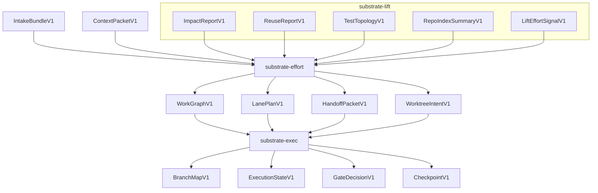

# Code-Intelligence Workstream Orchestration

Status: canonical design document for workstream/worktree orchestration inside the code-intelligence program.

This document defines the intended ownership split, contract families, and rollout shape for deterministic multi-workstream planning and worktree materialization inside the `substrate` repository.

---

## 0. Scope

This document is scoped to the code-intelligence program described in [docs/code-intelligence-program.md](/Users/spensermcconnell/.codex/worktrees/9b83/substrate/docs/code-intelligence-program.md).

It is not:

- a source of truth for all of Substrate
- a Lift crate-local architecture doc
- a host orchestrator replacement spec
- a frozen operator workflow copied directly from one manual `ORCH_PLAN.md`

This design lives inside the parent Substrate Cargo workspace.

The intended crate homes remain:

```text
crates/lift     -> substrate-lift
crates/effort   -> substrate-effort
crates/exec     -> substrate-exec
```

This feature is a program capability built across those peer crates. It is not a `lift orchestrate` app.

---

## 1. Source-of-truth hierarchy

Use these documents in this order.

1. [docs/code-intelligence-program.md](/Users/spensermcconnell/.codex/worktrees/9b83/substrate/docs/code-intelligence-program.md)
   Owns program-wide crate ownership, dependency rules, and rollout sequencing.

2. This document
   Owns the workstream/worktree orchestration design within that program.

3. [crates/lift/README.md](/Users/spensermcconnell/.codex/worktrees/9b83/substrate/crates/lift/README.md)
   Owns Lift-local architecture and Lift-owned export surfaces.

4. Manual operator artifacts such as [ORCH_PLAN.md](/Users/spensermcconnell/.codex/worktrees/9b83/substrate/ORCH_PLAN.md) and [HOST_ORCHESTRATOR_INTENDED_BEHAVIOR_TRUTH.md](/Users/spensermcconnell/.codex/worktrees/9b83/substrate/HOST_ORCHESTRATOR_INTENDED_BEHAVIOR_TRUTH.md)
   These are important references, but they are not the canonical contract for this feature.

If this document conflicts with a proposal doc, this document wins.

If this document conflicts with the broader code-intelligence program doc on crate ownership, the program doc wins.

---

## 2. Executive decision

The earlier `lift orchestrate` idea is retired.

The aligned ownership split is:

```text
lift    -> repository intelligence signals and artifacts
intake  -> task shaping and normalized task brief
context -> context packet assembly
effort  -> static work decomposition and parallel workstream planning
exec    -> runtime execution state, gates, checkpoints, and worktree materialization
```

So the feature is:

```text
Parallel Workstream Orchestration
  static planner: crates/effort
  worktree/runtime materializer: crates/exec
  repo-intelligence provider: crates/lift
```

Short version:

> Lift says what is touched, risky, reusable, connected, testable, and likely to conflict.  
> Effort turns that into a deterministic work graph, lane plan, and worker handoff surface.  
> Exec materializes worktrees, records branch/runtime state, evaluates gates, and manages resumable runtime truth.

This preserves the program rule that Lift remains the repository/code-intelligence engine and does not absorb planning or execution ownership back into itself.

---

## 3. Why build it

This is a high-value layer because it addresses real multi-agent execution failures without requiring an LLM in the core planning loop.

The first version should be valuable even when it is purely deterministic and static.

The planner should help operators and future runtimes answer:

- what can be split into parallel lanes honestly
- what must serialize
- what files or surfaces each lane owns
- what must be frozen before a parallel window opens
- what checks and stop conditions each worker must honor
- how worktrees should be materialized once a static plan exists

This is a planning and runtime-coordination capability, not an agent launcher.

---

## 4. Relationship to manual orchestration precedent

[ORCH_PLAN.md](/Users/spensermcconnell/.codex/worktrees/9b83/substrate/ORCH_PLAN.md) is a strong reference because it records a real workflow that worked in practice.

It is not a normative field-by-field contract for this feature.

The canonical planner should extract the durable invariants from that precedent, not clone its exact shape.

### What should be preserved from manual precedent

- explicit source lock or equivalent authoritative baseline
- explicit parent/integration authority
- lane ownership boundaries
- blocked conditions
- explicit merge and gate ordering
- a final merged-tree validation wall
- worker-visible handoff constraints

### What should remain open until validated

- exact artifact names
- exact schema field names
- exact gate naming conventions
- exact branch naming conventions
- exact hotspot/freeze representation
- exact validation wall representation

### Design rule

Use manual orchestration docs as operator evidence, not as frozen product schema.

This document intentionally avoids saying that the new contracts must “mirror” or “encode” `ORCH_PLAN.md` exactly.

---

## 5. Relationship to host orchestrator truth

[HOST_ORCHESTRATOR_INTENDED_BEHAVIOR_TRUTH.md](/Users/spensermcconnell/.codex/worktrees/9b83/substrate/HOST_ORCHESTRATOR_INTENDED_BEHAVIOR_TRUTH.md) remains the authority for the durable host-session model.

This orchestration layer must not redefine that durable session model.

The relationship is:

- this feature may eventually produce artifacts consumed by a durable host orchestration session
- this feature does not redefine the meaning of `agent start`, `turn`, `reattach`, `parked_resumable`, or related host-session semantics
- `exec` should integrate as a state and artifact owner, not as a hidden prompt wrapper

Potential future mapping is allowed, but not required for the first versions:

```text
ExecutionStateV1 run
  -> one durable orchestration session
lane handoff packet
  -> one worker allocation or one future agent turn
worktree allocation
  -> one lane-specific execution workspace
checkpoint
  -> durable execution-state artifact
```

---

## 6. Ownership model

### `lift`

Lift produces planning inputs, not plans.

Lift owns:

- path and symbol impact
- repo index summary
- test topology
- reuse opportunities
- contract and policy findings
- score and effort signal reports

Lift does not own:

- work graph semantics
- lane scheduling
- worktree protocols
- runtime gate state
- checkpointing
- worker lifecycle

### `effort`

`effort` is the static planner.

Effort owns:

- work graph semantics
- work nodes and edges
- dependency graph
- conflict graph
- lane plan
- parallel windows
- critical path
- worker handoff packets
- worktree intent artifacts
- static freeze and ownership surfaces if they are needed

Effort does not own:

- runtime execution state
- `git worktree add`
- branch creation
- merge execution
- gate persistence
- checkpointing

### `exec`

`exec` is the runtime and mutation owner.

Exec owns:

- source lock enforcement
- branch/worktree materialization
- branch map runtime truth
- gate decisions
- checkpoint state
- resumability
- stale review detection
- artifact write manifests

Exec does not own:

- work graph semantics
- lane planning
- context assembly
- Lift repo intelligence

### `intake` and `context`

These remain supporting inputs:

- `intake` provides task shaping and the normalized task brief
- `context` provides context packet assembly

They do not own lane planning or runtime materialization.

---

## 7. Top-level flow



The planner itself performs no LLM calls and no repository mutation.

---

## 8. Artifact families

This section distinguishes between likely first-class artifacts and still-provisional artifacts.

### 8.1 Frozen direction

These artifact families are part of the intended architecture and should exist in some form.

#### Lift-owned planning inputs

- `ImpactReportV1`
- `ReuseReportV1`
- `TestTopologyV1`
- `RepoIndexSummaryV1`
- `LiftEffortSignalV1`

`LiftEffortSignalV1` is the missing bridge artifact that turns Lift score and repository intelligence into planning input without exposing Lift internals.

#### Effort-owned static planning outputs

- `EffortRequestV1`
- `WorkGraphV1`
- `WorkNodeV1`
- `WorkEdgeV1`
- `LanePlanV1`
- `CriticalPathReportV1`
- `HandoffPacketV1`
- `WorktreeIntentV1`

#### Exec-owned runtime outputs

- `BranchMapV1`
- `ExecutionStateV1`
- `GateDecisionV1`
- `CheckpointV1`
- `ArtifactManifestV1`

### 8.2 Provisional artifacts

These are useful candidate abstractions, but their exact names and shapes should not be treated as frozen yet.

- `OwnershipMapV1`
- `FreezeMapV1`
- `ParallelWindowV1` as a standalone artifact rather than a `LanePlanV1` substructure
- `ValidationWallV1`

The design intent behind them is valid.

The exact artifact boundary is still open and should be validated against more than one orchestration pattern before being frozen.

### 8.3 Artifact direction rules

1. Lift artifacts are consumed by `effort` through schemas and artifact refs, not deep internal imports.
2. `effort` outputs immutable plans.
3. `exec` consumes those plans and may refuse to materialize them, but does not silently replan them.
4. Worktree allocation and branch state belong to runtime artifacts, not planning artifacts.

---

## 9. Core contract intent

This section describes what the main artifacts are for without freezing every field shape yet.

### `LiftEffortSignalV1`

Purpose:
bridge Lift score and repository intelligence into effort planning.

Likely content:

- score or size estimate
- estimated slices
- confidence
- triggers
- missing inputs
- touched files/components/boundaries
- contract-surface counts
- risk flags
- evidence refs

Must not contain:

- lane plans
- worktree allocation
- runtime state

### `EffortRequestV1`

Purpose:
bind the task brief, context packet, Lift artifact refs, and explicit planning constraints into one planning request.

Likely content:

- task brief ref
- context packet ref
- Lift artifact refs
- max parallel lanes
- planning strategy
- source-lock requirement
- parallelization constraints

### `WorkGraphV1`

Purpose:
encode the static work graph.

Likely content:

- work nodes
- dependency edges
- risk classes
- owned/read/forbidden surfaces
- evidence refs

### `LanePlanV1`

Purpose:
partition the work graph into serialized and parallelizable lanes with merge and gate structure.

Likely content:

- lane ids
- node assignments
- owned/read/forbidden surfaces
- merge order
- required checks
- stop conditions
- parallel windows

### `HandoffPacketV1`

Purpose:
communicate one lane's scoped assignment to a worker, human, or future runtime.

Likely content:

- lane id
- goal
- owned surfaces
- read-only context surfaces
- forbidden surfaces
- required checks
- acceptance criteria
- stop conditions
- return contract shape

### `WorktreeIntentV1`

Purpose:
describe requested runtime materialization without claiming it already happened.

Likely content:

- worktree root hint
- base ref
- lane ids
- branch hints
- path hints
- cut-from references

### `BranchMapV1`

Purpose:
record runtime truth after materialization.

Likely content:

- run id
- base head
- branch names
- worktree paths
- cut SHAs
- accepted SHAs
- merge SHAs
- runtime status

### `ExecutionStateV1`

Purpose:
record orchestration runtime state for a planned run.

Important boundary:

`ExecutionStateV1` here must be treated as the code-intelligence orchestration runtime artifact, not as an implicit replacement for every other `ExecutionState` concept elsewhere in Substrate.

If broader convergence is desired later, it must be made explicit.

---

## 10. Deterministic planning rules

The first planner should be heuristic but deterministic.

No LLM.
No solver.
No repo mutation.

### Inputs

- `TaskBriefV1` or an equivalent normalized hand-authored brief
- optional `ContextPacketV1`
- Lift artifact refs
- explicit user constraints

### Planner stages

1. Normalize inputs into candidate surfaces, work nodes, and constraints.
2. Build candidate work nodes from task brief, Lift signals, test topology, policy/contract surfaces, and high-trust context items.
3. Build a conflict graph.
4. Build a dependency graph.
5. Classify safe parallelism conservatively.
6. Partition nodes into lanes deterministically.
7. Generate lane-level gates, checks, and blocked conditions.
8. Emit handoff packets and worktree intents.

### Initial node classes

```text
implementation
test
docs
contract
migration
config
review_gate
validation_wall
```

### Initial conflict classes

```text
hard_same_file
hard_generated_or_lockfile
hard_migration
hard_frozen_surface
medium_same_contract_surface
medium_same_schema_or_config
medium_public_api_producer_consumer
soft_same_component
soft_same_boundary
```

### Initial dependency classes

```text
must_precede
producer_before_consumer
contract_before_implementation
implementation_before_tests
runtime_before_docs
freeze_before_parallel_window
validation_after_all
```

### Safe parallelism rule

A lane pair is parallel-safe only if all of these are true:

- no hard conflict edge exists
- no unfulfilled dependency path exists between the lanes
- both lanes have explicit ownership boundaries
- any shared hotspot is either frozen or read-only for the window
- low-confidence Lift signals are not controlling shared contract or migration surfaces

---

## 11. Worktree materialization protocol

Worktree materialization belongs to `exec`, not `effort`.

### Static planning step

`effort plan` writes static artifacts only.

It may emit:

- `WorkGraphV1`
- `LanePlanV1`
- `HandoffPacketV1`
- `WorktreeIntentV1`
- `CriticalPathReportV1`

It must not:

- create worktrees
- create branches
- run tests
- start agents
- mutate the repo

### Runtime materialization step

`exec materialize` consumes `WorktreeIntentV1` and related plan artifacts.

It may:

- verify source lock
- resolve the base head and accepted gate tips
- create worktrees
- create or bind branches
- write `BranchMapV1`
- checkpoint materialization state

It must not:

- change lane planning semantics
- silently repartition lanes
- infer planning intent from directory state alone

### Initial implementation choice

The first worktree materializer may use the system `git` executable.

Reason:

- manual worktree protocols already exist in this repo
- the worktree lifecycle is runtime mutation, not Lift-local analysis
- command-backed materialization is easy to audit and can emit exact command manifests

Future implementations may replace or wrap that approach.

---

## 12. MVP sequence

### MVP 1: static planner

Lives in `crates/effort`.

Inputs:

- one normalized task brief
- optional context packet
- one or more Lift artifact refs or fixture equivalents
- explicit constraints such as `max_parallel_lanes`

Outputs:

- `WorkGraphV1`
- `LanePlanV1`
- `HandoffPacketV1`
- `WorktreeIntentV1`
- `CriticalPathReportV1`

Must prove:

- deterministic graph assembly
- deterministic lane partitioning
- hard conflict serialization
- conservative parallel window generation
- handoff packet generation

### MVP 2: worktree materializer

Lives in `crates/exec`.

Consumes:

- `WorktreeIntentV1`
- relevant plan refs

Outputs:

- command manifest dry-run
- `BranchMapV1`
- checkpoint after materialization

### Later integration

Only after the two MVPs are stable:

- durable execution/session integration
- richer gate persistence
- richer checkpoint semantics
- worker runtime integration

---

## 13. Relationship to program rollout

This feature spans three code-intelligence program rollout points.

### A4

Freeze the minimum Lift export contracts needed by planning:

- `ImpactReportV1`
- `ReuseReportV1`
- `TestTopologyV1`
- `RepoIndexSummaryV1`
- `LiftEffortSignalV1`

### A5

Land `crates/effort` and the static planner.

### A6

Land `crates/exec` and worktree/runtime materialization.

This keeps the feature aligned with the program rule:

```text
effort defines the graph
exec runs the graph
```

---

## 14. Acceptance criteria

The feature is on track when all are true:

1. Lift does not own orchestration planning.
2. `effort` can plan lanes from schema-backed artifacts without importing Lift internals.
3. `exec` can materialize a worktree plan without replanning it.
4. Every top-level output has deterministic canonical JSON bytes and a fingerprint.
5. The same inputs produce the same lane plan and worktree intent.
6. Hard-conflict paths never appear in parallel lanes.
7. Low-confidence Lift signals never silently parallelize risky work.
8. Handoff packets include ownership, read context, forbidden surfaces, checks, stop conditions, and return contract.
9. Worktree materialization is opt-in and never happens during static planning.
10. Runtime state transitions live in `exec`, not `effort`.

---

## 15. Invariants

1. Planning is static and deterministic.
2. Planning performs no LLM calls.
3. Planning performs no repo mutation.
4. Lift artifacts are consumed through schemas and artifact refs.
5. `effort` defines work graph semantics.
6. `exec` does not replan work graphs.
7. `context` assembles context packets but does not define planning semantics.
8. Worktree creation is a runtime mutation owned by `exec`.
9. Parent or gate authority remains explicit.
10. Workers never own final acceptance.
11. Workstreams have explicit owned and forbidden surfaces.
12. Parallel lanes require disjoint ownership or explicitly frozen shared surfaces.
13. Merge order is deterministic and topologically valid.
14. A need to touch a frozen hotspot becomes a blocked condition, not silent replanning.

---

## 16. Falsification questions

If any answer becomes "yes", the design is drifting.

1. Can Lift produce a lane plan directly instead of a planning input artifact?
2. Can `effort` import Lift internals instead of consuming Lift artifacts?
3. Can `exec` change the work graph because runtime state changed?
4. Can `context` decide lane boundaries?
5. Can static planning create worktrees or branches?
6. Can a worker lane omit owned or forbidden surfaces?
7. Can two lanes edit the same hard-conflict file in parallel?
8. Can a low-confidence risky change be parallelized without an explicit override?
9. Can branch-map state be inferred from directories instead of durable exec artifacts?
10. Can gate acceptance become lane-local only rather than merged-tree truth?
11. Can workers write parent-owned run state such as `.runs/**`?
12. Can final acceptance happen without one merged validation wall?
13. Can a plan depend on nondeterministic ordering from maps, filesystem reads, or artifact refs?
14. Can one manual `ORCH_PLAN.md` shape force artifact design without broader validation?

---

## 17. Final recommendation

Build this layer, but do not build it as `lift orchestrate`.

The aligned shape is:

```text
Lift   -> deterministic repo-intelligence artifacts
Effort -> deterministic workstream/lane/handoff/worktree-intent plans
Exec   -> worktree materialization plus runtime gate/checkpoint state
```

The practical value of the earlier worktree orchestration idea is real.

The durable lesson is not that one manual `ORCH_PLAN.md` should become the product surface.

The durable lesson is that the code-intelligence program needs:

- a static planner in `crates/effort`
- a runtime materializer/state owner in `crates/exec`
- Lift-produced planning inputs that can be consumed without deep Lift imports

That is the shape this document freezes.
