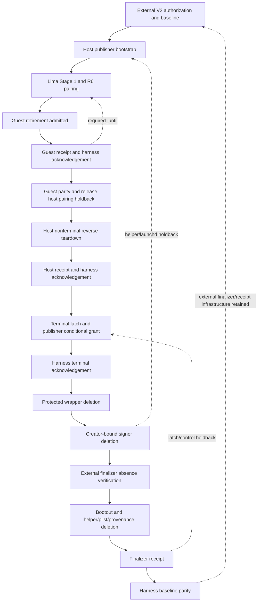

# R3 macOS/Lima evidence retirement and exact orphan recovery planning foundation

**Date:** 2026-08-13
**Status:** advisory planning/research; unaccepted contract proposal; not implementation authority
**Scope:** prospective evidence-only retirement plus one exact failed-attempt recovery decision
**Prohibited interpretation:** this document does not amend the frozen R3 contracts, authorize product changes, authorize the recovery, authorize native evidence, or authorize MAC-CLOSEOUT.

## Executive decision

Adopt **Candidate D** as the proposed structural decision and **Candidate C** as the proposed operational order, subject to the user decisions in §11.

Candidate D is necessary because the landed resource dependency DAG and the landed three-file launchd retirement journal do not preserve a callable, independently authorized executor through protected-wrapper deletion, signer deletion, bootout, helper deletion, and crash recovery. The proposed amendment keeps the terminal latch, conditional grant, survivor set, and separate finalizer, but adjusts them as follows:

1. The latch is an inhibition and recovery join, never an authority root.
2. The publisher-signed grant is conditional, countersigned by the harness, and binds an exact finalizer image, capability digest, external physical identities, and survivor set.
3. The survivor set is a separate authority/holdback graph with `required_until` on every component; it is not inferred by reversing the resource DAG.
4. The finalizer is a **separate evidence-harness executable**, staged in a root-owned external authority directory before baseline capture and retained through final parity. It is not the broad publisher helper, is not installed by product bootstrap, is not a retirement target, and has no Keychain-delete operation.

No suitable closed post-Keychain finalizer exists in the landed source. Creating the narrowly bounded evidence finalizer is therefore a required prospective amendment, not an already-authorized implementation detail.

Candidate C is necessary because the failed attempt has `test_retirement_commitment = null`, the fourteen generic-password records that could have authenticated its normal lineage are already deleted, and no prospective type may retroactively authorize it. Recovery must either establish a callable creator-bound deletion identity or obtain one deliberate, one-time, preplanned operator authorization. Live truth does **not** presently establish a callable creator-bound route. The retained helper image has no retirement entrypoint even though the internal exact-delete function exists.

---

## 1. Live source and preserved-state binding

### 1.1 Landed product source

Rebound on 2026-08-13 without changing the repository:

| Fact | Live observation |
|---|---|
| Repository | `/Users/spensermcconnell/__Active_Code/atomize-hq/substrate` |
| Branch | `feat/internal-host-orchestrator-world-dispatch-bootstrap` |
| `HEAD` | `879a8c680ba14cd93b79ba2c1a2ed598e9687c90` |
| `HEAD^{tree}` | `b201ce8f058b438ec6e8665c84b09abf0388404f` |
| Remote ref | `origin/feat/internal-host-orchestrator-world-dispatch-bootstrap` |
| Remote tip | `879a8c680ba14cd93b79ba2c1a2ed598e9687c90` |
| Relation | local `HEAD` equals remote ref |

The product-source checkpoint in the task is current.

### 1.2 Advisory versus authority

The approach review at `docs/guidance/2026-08-13-r3-macos-retirement-chatgpt-pro-approach-review.md` was untracked at both the initial and final repository checks. Its SHA-256 at intake was:

`7f7add2bce8e2bca32bc36bed32483050ad8475902052b7ef241cab2a2ecbe9c`

It is advisory input only. It was not overwritten, staged, or treated as landed authority.

The authoritative existing R3 contract remains `llm-last-mile/runtime-refactor/03-phase-slice-map.md`, `04-contracts-and-gates.md`, and `05-debug-regression-ledger.md`. The R3 documentation packet is sequential/frozen and changes to frozen architecture require a new explicit authority boundary ([phase map, lines 2313–2326](../../llm-last-mile/runtime-refactor/03-phase-slice-map.md#L2313-L2326)). This artifact proposes that boundary; it does not exercise it.

### 1.3 Safely revalidated failed-attempt facts

No Keychain API, `security` command, signer lookup, signer reference acquisition, signing operation, or signer mutation was run.

| Fact | Safe observation |
|---|---|
| Evidence ID | `EVIDENCE:R3-MAC-IMP-01` (task binding) |
| Failed root | exists; directory, `0700`, owner `spensermcconnell:staff`, dev `16777230`, inode `529586911` |
| Selected prefix | exists; directory, `0700`, owner `spensermcconnell:staff`, dev `16777230`, inode `529602704` |
| Scope ID | `019ff983-39ca-7182-9db8-b86aa66fa443` (task and external cleanup-log binding) |
| Launchd publisher | `launchctl print system/com.substrate.lifecycle.publisher.v1` returned service-not-found/status 113 |
| Fourteen generic records | external cleanup log enumerates fourteen exact accounts, fourteen status-0 deletes, then `-25300` final absence; the product-equivalent later log again observed generic absence |
| Signer | external cleanup logs last observed exactly one key; not re-queried |
| Selected macOS control binary | SHA-256 `41abe3f17c1f02f3bf0fedda913a6ab41e25661b369a8039be6316a54a4877be`; ad-hoc CDHash `6ee1d19f9e9740aff4f36a1905d444535a6c2ce4` |
| Selected macOS helper binary | SHA-256 `e639b962ca9a989a7c57b420884b263877e17dd45a977d99c3e0d1c4c4062b95`; ad-hoc CDHash `fe500fcdc45dfcad7212d739150f8b9080dcdbed` |
| Lima `substrate` | `Running`, VZ/AArch64, Lima 2.1.1; host-agent PID observed |
| SecurityAgent/lifecycle cleanup processes | no matching SecurityAgent or lifecycle process was observed; the other exact PIDs were the Lima host agent and its SSH mux |
| Evidence mirror | clean detached worktree `/Users/spensermcconnell/.codex/worktrees/49bb/substrate` at `729e444c7dc8c136269409952ff2325bd810bd0f`, tree `207ae70479b2a48e6a1b6b4833e571802b5afce7` |

The fourteen deleted accounts are:

1. `<scope>:publisher-bootstrap-intent`
2. `mac-publisher-bootstrap-attempt-locator-v1:867e3eb52bd54718ab5a0d5573498c6b5a5e5009d7fc3ee6a26d9178db2d1520`
3. `<scope>:publisher-service-state`
4. `<scope>:lima-stage-one-capsule`
5. `<scope>:current-anchor`
6. `mac-control-admission-authority.v1`
7. `<scope>:r6-pairing-predecessor-1`
8. `<scope>:r6-pairing-continuation-1`
9. `<scope>:r6-pairing-activation-1`
10. `<scope>:r6-pairing-tombstone-1`
11. `<scope>:r6-pairing-predecessor-2`
12. `<scope>:r6-pairing-continuation-2`
13. `<scope>:r6-pairing-activation-2`
14. `<scope>:r6-pairing-predecessor-state`

They are historical completed effects. They must never be recreated to make recovery look like normal retirement.

---

## 2. Repository-derived gap analysis

### 2.1 Landed partial retirement schema

Repository facts:

* `PublisherBootstrapAuthorizationV1` has an optional `test_retirement_commitment`; the canonical bootstrap core forces that field to null ([managed_artifact.rs, lines 667–704](../../crates/common/src/managed_artifact.rs#L667-L704), [lines 1465–1474](../../crates/common/src/managed_artifact.rs#L1465-L1474)).
* The direct macOS bootstrap constructor always supplies `None`; it has no evidence-harness input from which to derive a non-null commitment ([macos_client.rs, lines 114–232](../../crates/shell/src/execution/managed_lifecycle/macos_client.rs#L114-L232)).
* R6 ticket issuance also explicitly supplies `guest_test_retirement_commitment: None` ([substrate-lifecycle-macos.rs, lines 16109–16129](../../src/bin/substrate-lifecycle-macos.rs#L16109-L16129)). Ticket, guest intent, hello, transcript, and anchor joins propagate the optional value, but no live constructor populates it.
* The landed host authorization/receipt/acknowledgement and guest reservation/authorization/receipt/acknowledgement types are compact placeholders. They omit the contract’s exhaustive component observations, ordered DAG/holdbacks, exact executor identities, durable state generations, admission time, expiry recovery, finalizer identity, terminal grant/latch, and parity joins ([managed_artifact.rs, lines 644–872](../../crates/common/src/managed_artifact.rs#L644-L872)).
* `canonical_guest_publisher_test_retirement_ticket_core_v1` clears the ticket signature but does **not** clear `guest_test_retirement_commitment`, contrary to the frozen contract’s null-slot core rule ([managed_artifact.rs, lines 1702–1710](../../crates/common/src/managed_artifact.rs#L1702-L1710); [contract, lines 9065–9072](../../llm-last-mile/runtime-refactor/04-contracts-and-gates.md#L9065-L9072)).
* Existing retirement validators mostly validate digest shape and signatures. `GuestPublisherRetirementReservationV1.state` is merely nonempty; it is not a closed enum or CAS transition. The validators do not establish the full joins required by the frozen prose ([managed_artifact.rs, lines 5825–5869](../../crates/common/src/managed_artifact.rs#L5825-L5869)).
* `LifecyclePublisherProtectedStateV1` has no terminal latch, terminal grant hash, harness acknowledgement hash, finalizer identity, or terminal phase ([managed_artifact.rs, lines 320–330](../../crates/common/src/managed_artifact.rs#L320-L330)).

### 2.2 Actual R6 state and commitment propagation

The landed R6 protocol is stronger than the retirement placeholders and provides a model worth reusing, not conflating:

* Predecessor CAS: `Available -> PairingEffectPrepared -> PairingEffectStarted -> Consumed`; `Superseded` is a separate expired-unused outcome. `PairingEffectStarted` records the admission timestamp. Expiry rejects fresh admission but cannot revoke an already-admitted exact effect.
* Host record: `sessions_opened -> operator_proof_verified -> guest_state_root_durable -> hello_durable -> transcript_durable -> ticket_consumed`; `pre_intent_closed` is a separate pre-effect terminal. The exact allowed transitions are encoded at [managed_artifact.rs, lines 3383–3425](../../crates/common/src/managed_artifact.rs#L3383-L3425).
* Guest intent: `PairingIntentDurable -> HelloDurable -> TranscriptDurable`, followed by an exact consumption marker and materialized guest anchor. The commitment is copied from ticket to intent, hello, and transcript and exact-joined on replay ([substrate-lifecycle-linux.rs, lines 2750–2938](../../src/bin/substrate-lifecycle-linux.rs#L2750-L2938), [lines 3120–3250](../../src/bin/substrate-lifecycle-linux.rs#L3120-L3250)).

The retirement amendment should copy R6’s **admission-expiry versus admitted-recovery rule**, canonical CAS discipline, and byte-identical replay rules. It must not reuse R6 ticket/record types as retirement authority.

### 2.3 Actual service-state retirement ordering and restart gap

The fixed macOS service-state route does the following:

1. Revalidates current control admission and the Keychain service-state receipt.
2. CASes `installed -> retirement_precommitted`.
3. Runs exact `launchctl bootout system/com.substrate.lifecycle.publisher.v1`.
4. Proves the registration absent.
5. For each path, CAS-advances the deletion cursor **before** unlink, then unlinks and fsyncs the parent. The order is plist, helper, provenance.
6. Proves all three paths and launchd registration absent.
7. CASes `retirement_precommitted -> retired`.

This matches the frozen ordinary ordering ([contract, lines 9647–9669](../../llm-last-mile/runtime-refactor/04-contracts-and-gates.md#L9647-L9669)) and the implementation ([substrate-lifecycle-macos.rs, lines 2194–2345](../../src/bin/substrate-lifecycle-macos.rs#L2194-L2345)). It is not sufficient for terminal evidence retirement:

* Every invocation starts with current control admission, so it is not callable after current-anchor/control records are gone.
* Bootout occurs before file deletion, so a crash after bootout requires an external caller to restart the helper by its on-disk path.
* Once the cursor has authorized helper deletion and the helper is unlinked, a crash cannot restart that helper.
* The route never deletes the software signer or the remaining lifecycle Keychain records.
* The `retired` record itself remains in the Keychain.

The ordinary service-state journal is valuable as a sub-journal but cannot be the terminal-authority contract.

### 2.4 Exact signer implementation and callability

The created key is a permanent software P-256 private key in the explicitly opened legacy System Keychain. Creation sets key type, size, permanence, application tag, label, and `canSign`, plus add-only `kSecUseKeychain`. It supplies neither `kSecAttrAccess` nor `kSecAttrAccessControl`. Reads use a one-element `kSecMatchSearchList`; exact deletion uses a validated transient key reference in one-element `kSecMatchItemList`; query dictionaries carry `kSecUseAuthenticationUIFail` ([substrate-lifecycle-macos.rs, lines 18585–19065](../../src/bin/substrate-lifecycle-macos.rs#L18585-L19065)).

`retire_mac_system_keychain_software_signer_v1(scope_id)`:

* takes the protected-state account lock;
* refuses deletion while the protected wrapper exists;
* derives the fixed scoped tag;
* calls the exact delete helper, which rechecks final absence.

This is the correct primitive ordering ([substrate-lifecycle-macos.rs, lines 14511–14529](../../src/bin/substrate-lifecycle-macos.rs#L14511-L14529)). It has **no call site and no CLI/XPC route**. The main executable admits only bootstrap FD3, service-state install/retire FD3, publisher service mode, and stage-one/post-PM relays ([substrate-lifecycle-macos.rs, lines 529–595](../../src/bin/substrate-lifecycle-macos.rs#L529-L595)). `retire_mac_test_publisher_v1` is also unwired and calls a receipt shortcut that intentionally fails under the R5 authority rules.

The selected retained helper is ad-hoc signed with designated requirement `cdhash H"fe500fcdc45dfcad7212d739150f8b9080dcdbed"`. The original installed helper is absent and its exact code identity is not independently recoverable from the remaining live product state without trusting deleted provenance. Even if external evidence proves it was identical, the retained executable exposes no signer-retirement operation. Therefore creator-bound deletion is **not presently callable**.

### 2.5 Actual component DAG deficiencies

The landed host bootstrap component set contains exactly seven roles: executor, plist, Mach service, signer, protected state, bootstrap intent, and service state ([macos_client.rs, lines 376–508](../../crates/shell/src/execution/managed_lifecycle/macos_client.rs#L376-L508)). It omits the fixed install-provenance file even though service retirement deletes it. It also does not enumerate control admission, attempt locator, Lima capsule, R6 predecessor/continuation/activation/state/tombstone records, host pairing records, retained prefix, external evidence authority, or coupled Lima/forwarder state.

The macOS post-PM role table produces 27 manifest roles when the Lima instance is included: staged workspace, layout sentinel, guest lifecycle executor, known-hosts entry, group, private home, publisher directory, two publisher units, publisher key/anchor/intent, three product binaries, two world units, two world service states, six directories, group membership, and the instance. Coupled observations add the publisher endpoint, world socket, forward socket, SSH forwarder, Stage-1 marker, and temporary control tree. The frozen role table confirms these categories ([contract, lines 9670–9693](../../llm-last-mile/runtime-refactor/04-contracts-and-gates.md#L9670-L9693)).

An implementation must generate a closed exhaustive ledger from the union of:

1. host bootstrap components;
2. host Keychain/account records actually created for the attempt;
3. host fixed files/registration/provenance;
4. all 27 manifest roles;
5. coupled endpoints/processes/markers/temp trees;
6. selected-prefix and isolated-build artifacts created after baseline; and
7. external authority infrastructure explicitly excluded from retirement because it existed at baseline.

No component may disappear merely because it is not represented by the current seven-role helper.

### 2.6 Finalizer availability

No suitable pre-existing finalizer exists:

* `substrate-lifecycle-control` is an intended-principal-owned coordinator that invokes the fixed root helper through `sudo`; it is not a privileged finalizer.
* `substrate-lifecycle-macos` is the broad helper and imports Keychain deletion/signing capabilities; it is also a retirement target.
* `substrate-lifecycle-linux retire-test-publisher` is an unjournaled recursive deletion stub for three files/a directory and is not an acceptable guest retirement path ([substrate-lifecycle-linux.rs, lines 3483–3508](../../src/bin/substrate-lifecycle-linux.rs#L3483-L3508)).
* The installer and `lima-warm.sh` are broad provisioning wrappers, not closed terminal executors.

The amendment must introduce the evidence-only external finalizer described in §4.4. This is the minimum architecture change strictly required by the blocker.

---

## 3. Primary-source Keychain research

### 3.1 Documented facts

1. Apple documents `kSecUseAuthenticationUIFail` as returning `errSecInteractionNotAllowed` when user authentication is required, and now recommends `LAContext.interactionNotAllowed` instead ([Apple: `kSecUseAuthenticationUIFail`](https://developer.apple.com/documentation/security/ksecuseauthenticationuifail)).
2. `SecKeychainOpen` only takes a path and returns a keychain reference; it has no per-call authentication-UI argument ([Apple: `SecKeychainOpen`](https://developer.apple.com/documentation/security/seckeychainopen%28_%3A_%3A%29)). For legacy Keychain Services, `SecKeychainSetUserInteractionAllowed(false)` is the process-level control that makes calls which would automatically display missing/unlock UI return an error ([Apple: `SecKeychainSetUserInteractionAllowed`](https://developer.apple.com/documentation/security/seckeychainsetuserinteractionallowed%28_%3A%29)).
3. On macOS, `kSecMatchSearchList` constrains search to the supplied keychains, and `kSecMatchItemList` is the documented way to constrain `SecItemDelete` to a previously returned transient item reference ([Apple: search list](https://developer.apple.com/documentation/security/ksecmatchsearchlist), [Apple: item list](https://developer.apple.com/documentation/security/ksecmatchitemlist), [Apple: delete](https://developer.apple.com/documentation/security/secitemdelete%28_%3A%29)).
4. Legacy macOS `kSecAttrAccess` is a `SecAccess` ACL and is mutually exclusive with `kSecAttrAccessControl` ([Apple: `kSecAttrAccess`](https://developer.apple.com/documentation/security/ksecattraccess)). If creation does not explicitly set an access instance, Keychain Services uses default access. Default restricted operations trust the calling application, while an untrusted application may require confirmation ([Apple: `SecAccessCreate`](https://developer.apple.com/documentation/security/secaccesscreate%28_%3A_%3A_%3A%29)).
5. ACL authorization keys separately cover signing, deleting an item, reading an item, and deleting a keychain item; they are not one undifferentiated permission ([Apple: ACL authorization keys](https://developer.apple.com/documentation/security/acl-authorization-keys)). ACL inspection is available through `SecKeychainItemCopyAccess`, `SecAccessCopyACLList`, `SecACLCopySimpleContents`, and authorization enumeration ([Apple: item access](https://developer.apple.com/documentation/security/seckeychainitemcopyaccess%28_%3A_%3A%29), [Apple: ACL list](https://developer.apple.com/documentation/security/secaccesscopyacllist%28_%3A_%3A%29), [Apple: ACL authorizations](https://developer.apple.com/documentation/security/secaclgetauthorizations)).
6. Apple’s code-signing guide says the designated requirement is the identity used to decide whether code is the “same code”; components can share Keychain access by explicitly sharing a designated requirement. Ad-hoc code has no cryptographic signing identity and identifies only that particular program; a `cdhash` requirement is exact to one CodeDirectory ([Apple: code-signing tasks](https://developer.apple.com/library/archive/documentation/Security/Conceptual/CodeSigningGuide/Procedures/Procedures.html#//apple_ref/doc/uid/TP40005929-CH4-SW26), [Apple: requirement language](https://developer.apple.com/library/archive/documentation/Security/Conceptual/CodeSigningGuide/RequirementLang/RequirementLang.html), [Apple TN3127](https://developer.apple.com/documentation/technotes/tn3127-inside-code-signing-requirements)).

### 3.2 Why SecurityAgent may have appeared

The observed behavior is not explained by the documented contract for the query flag. It must remain an unresolved behavioral contradiction until a disposable experiment isolates it.

| Candidate boundary | Documented/repository assessment |
|---|---|
| Open System Keychain | **Possible but unproved.** `SecKeychainOpen` has no query UI-fail parameter. A locked-keychain/unlock path is governed by legacy interaction policy, not necessarily the later item query. The logs show open succeeded before the key query; timing/process tracing is needed. |
| Item ACL evaluation | **Likely candidate.** No explicit ACL was supplied, so default creator-bound access applies. Delete and sign are distinct ACL operations. A non-trusted executable can prompt. |
| Key lookup | **Possible.** The exact query asks for attributes and a `SecKey` reference. Apple documents the UI-fail result, but the failed attempts show UI anyway. We cannot infer which suboperation triggered it from status-only logs. |
| Obtaining `SecKey` reference | **Possible but undocumented as a separate prompt point.** `kSecReturnRef` returns a key object; the query and any access-object materialization must be instrumented separately. |
| Public-key derivation/attributes | **Possible.** The landed lookup calls `SecKeyCopyAttributes`, `SecKeyCopyPublicKey`, and external public representation after acquiring the private-key reference. These calls do not carry the original query dictionary. |
| Signing | **Known restricted operation.** Default access explicitly treats signing as sensitive. It can prompt for a non-trusted executable. |
| Deletion | **Known ACL operation and observed candidate.** Exact `kSecMatchItemList` bounds identity, but bounding identity does not grant deletion authority. |
| `sudo` boundary | **Not sufficient and not itself SecurityAgent.** `sudo` can independently prompt in Terminal and changes the process/euid boundary. It does not make an unrelated binary creator-equivalent, and root alone is not lifecycle authority. |
| Incorrect/effectively incomplete query | **Still possible, not the whole explanation.** Both the legacy cleanup query and the product-equivalent item-list query opened SecurityAgent. The latter used the documented exact-delete shape, so query shape alone cannot establish authorization. |

The product currently sets only `kSecUseAuthenticationUIFail`; it does not set `LAContext.interactionNotAllowed` and does not temporarily disable legacy Keychain UI for the process. Adding both controls is a prospective defense and diagnostic, not proof that current behavior is understood.

### 3.3 What identity the key actually uses

Repository fact: the key creation dictionary has no explicit `kSecAttrAccess`/trusted-app list. Apple’s documented default therefore indicates creator-bound legacy access for restricted operations. Inference: the creator was the launchd-installed `substrate-lifecycle-macos` image running as root, and its ad-hoc designated requirement was probably an exact CDHash requirement.

What is **not** established:

* the actual saved ACL entries and operation tags on this live key;
* whether delete uses the same trusted-app list as sign for this item;
* whether the creator’s exact CDHash was `fe500f...` rather than another build;
* whether path, audit session, launchd context, or partition-ID data also participates;
* whether a byte-identical retained copy at a different path would satisfy the saved trusted-app rule.

The Team ID, signing identifier, entitlements, path, and root euid are not individually sufficient. The retained image has no Team ID and its designated requirement is exact CDHash. Apple documents that a shared designated requirement can make components equivalent; it does not document “same Team ID” or “same identifier” alone as a universal Keychain-ACL equivalence rule. Exact CodeDirectory identity matters for this ad-hoc build unless disposable ACL inspection proves otherwise.

### 3.4 Safe disposable surrogate experiment — specification only

**Not run. Separate explicit approval is required.** The experiment must use no product tag, scope, service, path, binary, key, record, launchd label, Lima instance, or evidence mirror.

#### Fixed isolation

At approval time allocate one UUIDv7 `N` and derive:

```text
ROOT=/Users/spensermcconnell/.codex/evidence/r3-keychain-surrogate/N
TAG=com.atomize.substrate.r3-keychain-surrogate.N:signing-key
LABEL=com.atomize.substrate.r3-keychain-surrogate.N
CREATOR_ID=com.atomize.substrate.r3-keychain-surrogate.creator.N
OTHER_ID=com.atomize.substrate.r3-keychain-surrogate.other.N
```

`creator.c` and `other.c` must embed `TAG`, `LABEL`, and allowed operations at compile time. They must reject every argument except one of `create`, `lookup-ref`, `copy-access`, `sign`, or `delete-exact`; accept no tag/path/keychain from argv, stdin, environment, or cwd; open and path-check only `/Library/Keychains/System.keychain`; and log only status, code identity, public SPKI hash, ACL authorization names, and item count. They must call `SecKeychainSetUserInteractionAllowed(false)` before any Keychain call, use an `LAContext` with `interactionNotAllowed`, retain `kSecUseAuthenticationUIFail`, and restore the prior process UI setting on exit.

#### Exact build/identity commands

The approved runner substitutes the allocated absolute `ROOT` and generated sources, then runs only:

```bash
/usr/bin/xcrun --sdk macosx clang -std=c17 -Wall -Wextra -Werror \
  -framework Security -framework CoreFoundation -framework LocalAuthentication \
  "$ROOT/creator.c" -o "$ROOT/creator-a"
/bin/cp -p "$ROOT/creator-a" "$ROOT/creator-a-retained"
/usr/bin/codesign --force --sign - --identifier "$CREATOR_ID" "$ROOT/creator-a"
/bin/cp -p "$ROOT/creator-a" "$ROOT/creator-a-byte-identical"
/usr/bin/xcrun --sdk macosx clang -std=c17 -Wall -Wextra -Werror \
  -framework Security -framework CoreFoundation -framework LocalAuthentication \
  "$ROOT/other.c" -o "$ROOT/other-b"
/usr/bin/codesign --force --sign - --identifier "$OTHER_ID" "$ROOT/other-b"
/usr/bin/codesign -d --verbose=4 -r- "$ROOT/creator-a" "$ROOT/creator-a-byte-identical" "$ROOT/other-b"
/usr/bin/shasum -a 256 "$ROOT/creator-a" "$ROOT/creator-a-byte-identical" "$ROOT/other-b"
```

The copy used for byte identity must be made **after** signing, as shown. The pre-sign copy is retained only to prove signing changed the file and is never executed.

#### Exact effect sequence

After a separate, visible `sudo -k; sudo -v` whose terminal password prompt is expected and is not SecurityAgent:

```bash
/usr/bin/sudo -n env -i PATH=/usr/bin:/bin "$ROOT/creator-a" create
/usr/bin/sudo -n env -i PATH=/usr/bin:/bin "$ROOT/creator-a" copy-access
/usr/bin/sudo -n env -i PATH=/usr/bin:/bin "$ROOT/creator-a" sign
/usr/bin/sudo -n env -i PATH=/usr/bin:/bin "$ROOT/creator-a-byte-identical" delete-exact

/usr/bin/sudo -n env -i PATH=/usr/bin:/bin "$ROOT/creator-a" create
/usr/bin/sudo -n env -i PATH=/usr/bin:/bin "$ROOT/other-b" lookup-ref
/usr/bin/sudo -n env -i PATH=/usr/bin:/bin "$ROOT/other-b" copy-access
/usr/bin/sudo -n env -i PATH=/usr/bin:/bin "$ROOT/other-b" sign
/usr/bin/sudo -n env -i PATH=/usr/bin:/bin "$ROOT/other-b" delete-exact
/usr/bin/sudo -n env -i PATH=/usr/bin:/bin "$ROOT/creator-a" delete-exact
```

Expected behavior: creator and signed byte-identical copy complete without UI; the distinct-CDHash binary either succeeds by a documented ACL rule revealed in the captured ACL or returns a noninteractive error. **Any SecurityAgent/authorization UI is unexpected in this no-UI phase and is an immediate stop. Do not approve it.**

An optional third phase may deliberately set UI allow for `other-b delete-exact` to characterize one expected prompt. That phase requires its own explicit approval, exact screenshot/text expectations, and a fresh surrogate key. It must never target the orphan.

#### Rollback and stop

The only normal rollback is `creator-a delete-exact` for the exact compiled tag followed by creator-side `lookup-ref` proving `errSecItemNotFound`. Then fsync the experiment journal and leave the experiment directory retained. No broad Keychain query or cleanup command is allowed.

Stop immediately on:

* any unexpected UI;
* more than one exact match;
* System Keychain path mismatch;
* creator failure to sign/delete;
* ACL inspection requiring UI;
* a non-surrogate tag/label in any observation;
* sudo timestamp loss after effect admission;
* a leftover surrogate whose creator cannot remove it noninteractively.

On stop, terminate only the exact experiment process/UI without approval, preserve the surrogate state, and require a new decision. Do not attempt automatic cleanup.

---

## 4. Proposed prospective terminal-authority amendment

This section is a concrete proposed amendment. It does not change V1 authority until separately accepted and implemented.

### 4.1 Contract decision on the four ChatGPT Pro proposals

| Proposal | Decision | Adjustment |
|---|---|---|
| Terminal latch | **Keep** | Inhibition/recovery join only; fixed root-owned on-host state; no independent grant of deletion authority. |
| Conditional finalizer grant | **Keep** | Publisher signs before signer deletion; harness countersigns before wrapper deletion; binds exact finalizer and complete remaining state; never claims a future absence as an observed fact. |
| Terminal survivor set | **Keep** | Make it a separate typed holdback graph with `required_until`, not a prose list or reversed resource DAG. |
| Separate finalizer | **Keep, narrow further** | New evidence-only external binary, pre-baseline and retained after parity; no Keychain-delete/sign operation and no caller-selected paths/actions. |

### 4.2 Resource dependency DAG versus authority/holdback graph

`dependency_component_ids` answers “what must exist before this resource can be created or operated.” It does not answer “what must remain callable while another component is removed.” Add:

```text
required_until: enum
  GuestRetirementAcknowledged
  GuestParityRecorded
  UnusedReservationAcknowledged
  HostNonTerminalRetirementAcknowledged
  TerminalGrantAcknowledged
  ProtectedWrapperAbsent
  SignerAbsent
  PublisherServiceAbsent
  FinalizerReceiptDurable
  BaselineParityRecorded

holdback_component_ids: [component_id]
terminal_survivor: bool
```

The validator must reject cycles in the resource DAG and separately reject unsatisfied, missing, duplicate, or contradictory holdbacks. A component can have no creation dependency and still be required until a late phase.

### 4.3 Terminal survivors

The exact prospective terminal set is:

| Survivor | `required_until` | Reason |
|---|---|---|
| Guest lifecycle executor and guest retirement journal | `GuestRetirementAcknowledged` | Complete/replay guest teardown and receipt. |
| Host pairing record for each admitted guest | `GuestRetirementAcknowledged` | Authenticate guest scope and receipt. |
| Host pairing record for unused reservation | `UnusedReservationAcknowledged` (new equivalent phase) | Prove the guest was never admitted. |
| Host helper image + launchd registration + plist + provenance | `SignerAbsent` | Preserve creator-bound delete and its restart path. |
| Protected wrapper/current anchor | `TerminalGrantAcknowledged` | Sign/authorize the terminal handoff. |
| Software signer | `ProtectedWrapperAbsent` and until exact delete | Enforce wrapper-before-signer ordering. |
| Terminal latch | `FinalizerReceiptDurable` | Fail closed and join exact terminal recovery. |
| Selected-prefix control coordinator | `FinalizerReceiptDurable` | Invoke/replay the fixed finalizer; not authority itself. |
| External finalizer image and finalizer signing key | `BaselineParityRecorded` and retained thereafter | Restart after signer/helper deletion; pre-baseline infrastructure. |
| External receipt directory and retained descriptors | `BaselineParityRecorded` and retained thereafter | Durable authorization, grant, ack, receipts, parity. |

### 4.4 Exact creator and finalizer identities

#### Creator-bound Keychain executor

Prospective bootstrap must explicitly create the signer with a `kSecAttrAccess` whose restricted/delete/sign ACL trusts one exact `SecTrustedApplication` derived from the installed fixed helper’s designated requirement. The authorization records:

* helper SHA-256, file dev/inode, root:wheel/mode, CDHash, full designated requirement, signing identifier, Team ID if any, entitlements digest, and source/build identity;
* canonical serialized ACL digest, trusted-application requirement bytes/digest, prompt selector, and exact ACL authorization set;
* the fact that helper, selected-prefix copy, and any restart copy either do or do not satisfy that requirement.

No default/implicit access is permitted for the prospective evidence key. Product-null bootstraps may retain current behavior only if the separately accepted migration decision says so; evidence retirement requires explicit creator ACL.

#### External finalizer

Canonical identity name: `substrate-r3-macos-evidence-finalizer`.

Before baseline capture, the harness creates one root-owned external authority root:

```text
<external-root>/authority/      root:wheel 0700
<external-root>/authority/substrate-r3-macos-evidence-finalizer  root:wheel 0555
<external-root>/authority/finalizer-ed25519.key  root:wheel 0400
<external-root>/receipts/       intended-principal 0700
```

The external root, both parent directories, finalizer image, and key are measured with no-follow descriptors; the exact dev/inode/generation where available, owner/group/mode, path, SHA-256, CodeDirectory/DR, source commit/tree/ref, build command/toolchain, public key, and parent identities are in the precommit. They are included in baseline and intentionally survive parity.

The finalizer accepts only `--r3-macos-evidence-finalize-fd 3`, an inherited `SOCK_STREAM` FD, and no further argv/stdin/env/cwd input. Its compiled capability digest allows only:

1. verify V2 authorization, publisher terminal grant, harness ack, latch, finalizer identity, and exact current journal generation;
2. open/path-check the System Keychain and perform **read-only** exact signer-absence lookup with legacy UI globally disabled for the process, `LAContext.interactionNotAllowed`, one-element search list, and UI-fail;
3. observe exact generic-record absence using the precommitted account list, never delete a Keychain item;
4. `launchctl bootout` only the fixed service and treat exact not-found as idempotent success;
5. delete only the precommitted exact plist/helper/provenance identities and terminal latch, each after cursor CAS and each followed by parent fsync;
6. write/sign/fsync `PublisherTestRetirementFinalizerReceiptV2` in the exact external receipt directory;
7. replay only the byte-identical admitted attempt.

It has no command runner, caller paths, recursive delete, install/bootstrap, arbitrary launchd label, signer use/delete, product uninstall, Lima, publisher upgrade, or generalized cleanup capability.

### 4.5 Terminal latch, grant, and acknowledgement

Fixed latch path:

```text
/Library/Application Support/Substrate/lifecycle-v1/terminal-latches/<scope-sha256>.v2.json
```

The helper creates it atomically with `O_NOFOLLOW`/same-filesystem temp or unnamed-file linkage, fsyncs file and parent, and CASes its hash into protected state before emitting the grant. Any helper startup that sees a latch rejects every nonterminal operation.

`PublisherTestRetirementTerminalGrantV2` is publisher-signed while wrapper and signer exist. It binds:

* authorization/core/commitment hashes;
* scope/evidence/attempt/nonce;
* admitted time and expiry;
* current protected-state generation/counter/hash;
* complete survivor/holdback graph and current observations;
* exact list of Keychain records still present and their removal order;
* creator ACL/DR digest and signer public SPKI/tag identity;
* exact finalizer/capability/key/external-directory identities;
* exact terminal latch path/physical identity/hash;
* the conditional statement: finalizer may act only after wrapper and signer are independently observed absent.

The harness validates the grant, writes/fsyncs it, signs `PublisherTestRetirementTerminalAcknowledgementV2`, writes/fsyncs the ack and parent, and sends the exact ack hash back. The helper CASes the ack hash into protected state and latch. Missing, late, different-directory, post-expiry pre-admission, or retroactively generated grant/ack is rejected.

Authority transitions:

| Interval | Sole accepted authority |
|---|---|
| Before terminal admission | V2 precommit + current protected publisher state |
| After terminal admission, before wrapper deletion | Same plus durable latch/grant/harness ack |
| After wrapper deletion, before signer deletion | Latch + publisher-signed grant + harness ack + exact admitted terminal journal; normal publisher authority is disabled |
| After signer deletion | Same immutable trio plus exact signer-absence observation by the finalizer and finalizer code/key identity |
| After helper/launchd deletion | Finalizer journal/receipt plus immutable trio; no publisher action remains |
| Parity | Harness-signed baseline-parity record over finalizer receipt and exhaustive before/after manifests |

Root, sudo, a path, label, tag, surviving signer, or ancestry is never sufficient.

### 4.6 Admission expiry and restart

Fresh admission is allowed only when `now < expires_at` and the state is pre-effect. The helper CASes `TerminalPrepared`, then `TerminalAdmitted { admitted_at }`; `admitted_at` must be inside the signed window. Once admitted, expiry cannot revoke the exact effect. A restart after expiry may only replay the same authorization/grant/ack/component identities and advance the existing journal. It cannot issue new authority, change finalizer, change components, or allocate another attempt.

Before `TerminalAdmitted`, expiry returns a preserving rejection and leaves all resources unchanged. `TerminalPrepared` may roll back to `HostNonTerminalAcknowledged` only if no terminal effect occurred and the rollback is CASed before expiry handling. This mirrors the landed R6 prepared/started distinction.

### 4.7 External receipt identity and durability

Every authorization stores separate `external_authority_directory_identity` and `external_receipt_directory_identity` objects:

```text
absolute_path
parent_absolute_path
file_system_id
device_id
inode
generation_or_birthtime
owner_uid
group_gid
mode
is_symlink=false
mount_flags
opened_descriptor_identity_sha256
```

The harness retains opened directory descriptors from before bootstrap through parity. Every record is canonical JSON, written to an absent fixed leaf through the retained directory FD, file-fsynced, parent-fsynced, re-opened no-follow, byte-compared, hashed, and only then referenced by a later signature/CAS. Directory replacement or descriptor/path divergence is preserving-blocked.

### 4.8 Product-null and migration behavior

Do not mutate signed V1 wire semantics in place.

* V1 product bootstrap with null commitment remains decodable and cannot invoke any retirement route.
* Current non-null V1 placeholders are not executable prospective authority; the implementation must reject them with `AUTHORITY_REQUIRED`/version mismatch rather than reinterpret them.
* Prospective evidence requires a V2 bootstrap authorization and V2 R6 ticket family from the start. The V2 canonical core explicitly clears both commitment and signature fields.
* There is no V1-to-V2 migration for an admitted attempt and no late commitment insertion.
* Product mode requires null V2 retirement commitment and rejects retirement/grant/latch/finalizer fields.
* The failed old attempt remains V1/null and is permanently outside this protocol.

### 4.9 Prospective host state machine

| State | Durable fact | Next allowed state(s) | Preserving stop examples |
|---|---|---|---|
| `Absent` | no evidence authority admitted | `AuthorizationDurable` | external identity mismatch |
| `AuthorizationDurable` | harness V2 auth fsynced before bootstrap | `PublisherBound` | late/expired/missing commitment |
| `PublisherBound` | bootstrap exact-joins auth/core | `GuestReservationsBound` | product-null, altered core |
| `GuestReservationsBound` | exactly one reservation per declared guest | `GuestsResolved` | duplicate/unlisted reservation |
| `GuestsResolved` | every reservation is acknowledged retired or unused | `HostNonTerminalPrepared` | admitted guest lacks receipt |
| `HostNonTerminalPrepared` | reverse plan and before observations CASed | `HostNonTerminalEffects` | DAG/holdback conflict |
| `HostNonTerminalEffects` | all nonterminal effects individually journaled | `HostNonTerminalReceiptDurable` | ambiguous effect |
| `HostNonTerminalReceiptDurable` | publisher receipt external/fsynced | `HostNonTerminalAcknowledged` | receipt/hash mismatch |
| `HostNonTerminalAcknowledged` | harness ack external/fsynced and publisher-CASed | `TerminalPrepared` | late/different ack |
| `TerminalPrepared` | latch and conditional grant durable | `TerminalAdmitted` or safe rollback pre-effect | expiry before admission |
| `TerminalAdmitted` | admitted time inside window; exact recovery forever | `ProtectedWrapperAbsent` | alternate retry |
| `ProtectedWrapperAbsent` | wrapper deletion/final absence journaled | `SignerAbsent` | key identity/UI uncertainty |
| `SignerAbsent` | creator delete + finalizer independent absence | `PublisherServiceAbsent` | unexpected UI/duplicate key |
| `PublisherServiceAbsent` | bootout definite, three files absent, cursor complete | `FinalizerReceiptDurable` | file identity drift |
| `FinalizerReceiptDurable` | external finalizer receipt signed/fsynced | `BaselineParityRecorded` | missing external durability |
| `BaselineParityRecorded` | harness-signed exhaustive parity | terminal success | any unexplained residue |
| `PreservingBlocked` | exact honest blocker + last unambiguous state | exact same retry only | no widening |

### 4.10 Prospective guest and reservation state machines

#### Admitted guest

| State | Rule |
|---|---|
| `Reserved` | V2 host authorization preallocates exact reservation and null-core digest. |
| `TicketCommitted` | Host ticket differs from null core only by commitment and signature. |
| `GuestRetirementAdmitted` | Guest CASes admitted time before any teardown; expiry thereafter cannot revoke exact recovery. |
| `GuestEffectsPrepared` | Exhaustive guest reverse plan and observations durable. |
| `GuestEffectsApplied` | Stop/disable endpoints first; remove leaves before parents; journal every effect. |
| `GuestReceiptDurable` | Guest signs receipt before deleting its signing key/executor; external host relay fsyncs it. |
| `GuestAcknowledged` | Harness signs ack; guest/host records bind it. |
| `GuestParityRecorded` | Guest state is absent/equivalent; host may release pairing-record holdback. |
| `PreservingBlocked` | Ambiguous/mismatched state remains intact. |

#### Exact unused-reservation branch

`Reserved -> UnusedProofDurable -> UnusedAcknowledged` is allowed only when the exact host record is still pre-effect, predecessor is `Available` or safely rolled-back `PairingEffectPrepared`, no operator proof/effect-admission timestamp exists, no guest intent/key/hello/transcript/consumption marker exists, and the ticket/commitment core is exact. The publisher signs the proof; the harness fsyncs and signs the acknowledgement. Any `PairingEffectStarted`, operator-proof, guest artifact, or uncertain guest reachability rejects “unused” and requires admitted-guest resolution or preserving block. The current `state == "Reserved"` JSON helper is not sufficient.

### 4.11 Complete removal order

The generated exhaustive component ledger must topologically validate this serial order:

1. Resolve every guest reservation (retired or proven unused).
2. For each admitted guest: stop/disable publisher and world service/socket states; prove publisher/world endpoints absent; write guest receipt; obtain harness ack; remove guest pairing signing key/anchor/intent/consumption artifacts only after receipt; remove units and daemon-reload state; remove product binaries, staged workspace, layout sentinel, membership then group, leaf directories then parents; retain guest lifecycle executor until guest ack; prove guest parity.
3. Stop host SSH forwarder; prove forward socket absent; restore/remove exact known-hosts entry and temporary control tree.
4. Stop/remove Lima instance only after all guest receipts/parity; prove absent with exact machine/instance binding.
5. Remove host nonterminal R6 records only after guest ack; keep the exact pairing record(s) until then.
6. Remove host nonterminal Keychain records in precommitted order, retaining current wrapper, signer, control admission needed for the active helper, service-state record, latch, helper/plist/provenance, selected-prefix control, and external authority.
7. Write publisher host receipt; obtain and record harness acknowledgement.
8. Create/fsync latch; publisher signs conditional finalizer grant; harness fsyncs/countersigns; helper records ack.
9. Delete protected wrapper/current anchor; prove exact absence through the still-running creator helper.
10. Delete all remaining generic records except no record required solely to fake post-delete authority; prove exact list absent while helper is callable.
11. Exact-delete signer with creator-bound helper; verify exact absence. Any UI stops.
12. External finalizer independently proves wrapper, generic records, and signer absent; bootout fixed launchd service; prove absent.
13. Finalizer cursor-precommits and deletes plist, helper, provenance in dependency-safe order; fsyncs parents; deletes latch last; writes/signs/fsyncs finalizer receipt.
14. Harness removes attempt-created selected-prefix/build artifacts and any remaining coupled state using their separate precommitted harness authority, not the finalizer.
15. Harness performs exhaustive baseline parity and signs/fsyncs the parity record.

Guest-before-host and the pairing-record holdback are mandatory. The service-state V1 plist/helper/provenance order is not reused blindly; the V2 finalizer order is generated from the holdback graph and must preserve the helper until signer absence.

---

## 5. Exact orphan-recovery decision record

### 5.1 Permanent binding and non-generalization

Canonical decision ID: `R3-MAC-ORPHAN-RECOVERY:EVIDENCE-R3-MAC-IMP-01:019ff983-39ca-7182-9db8-b86aa66fa443:v1`.

The recovery authorization schema must hard-code/bind all of:

* evidence ID, failed root, selected prefix, scope ID;
* exact fourteen deleted accounts and cleanup-log artifact hashes;
* exact signer service/label/tag/class/key type/size/public-key fingerprint once proven;
* retained control/helper hashes, file identities, CDHashes/DRs;
* Lima instance `substrate`, its exact current machine identity and Stage-1 marker only after safe read-only inventory;
* launchd label and absent observation;
* evidence mirror path, commit `729e444c7dc8c136269409952ff2325bd810bd0f`, tree, and clean status;
* a single recovery nonce, one effect lineage, one exact external recovery directory;
* an empty list of caller-selectable targets/actions.

The parser must reject any other evidence/scope/tag/instance/path/account/component and must have no generic “orphan,” “uninstall,” or “cleanup” command.

### 5.2 Why prospective authority cannot apply

The old bootstrap and R6 ticket were product-null. The external V2 authorization did not exist before bootstrap. The protected wrapper, control admission, bootstrap intent, attempt locator, service-state record, capsule, and R6 records are already gone. Creating a V2 commitment now would be late, retroactive, signed by neither the original harness nor the now-unavailable protected state, and contradicted by the canonical null core. Therefore prospective precommit can never authorize this attempt.

Recovery authority is a separate human decision about one already-existing object. Its schemas, executable route, journal, receipt, and signature domains must be different from prospective retirement.

### 5.3 Acceptable and rejected recovery trust roots

| Trust root | Decision |
|---|---|
| Exact saved ACL proves a callable retained executable satisfies the creator trusted-app requirement, plus exact external creator-image provenance | **Acceptable in principle**, but not presently established/callable. |
| One deliberate operator authorization after exact surrogate characterization and explicit approval of one expected prompt | **Acceptable only by separate user decision.** |
| Harness/operator signature over the one recovery decision and journal | **Required as scope binding**, but cannot by itself authorize Keychain deletion. |
| Root/euid 0, sudo, admin account | **Rejected as lifecycle authority.** They are execution prerequisites only. |
| Tag, label, scope, path, service label, Lima name | **Rejected.** Identity selectors are not authority. |
| Surviving key/public key | **Rejected.** Possession/existence is not deletion authority. |
| Source ancestry or current landed branch | **Rejected.** It does not authorize the old effect. |
| Deleted generic records recreated from logs | **Rejected.** That would synthesize retroactive authority. |
| Previous cleanup helpers or broad `security` CLI | **Rejected.** They already produced unexpected UI and are not exact creator-bound product routes. |
| Product uninstall/general orphan cleanup | **Rejected.** Scope expansion and unsafe precedent. |

### 5.4 Required read-only identification facts

All must come from external artifacts, safe filesystem/process/launchd/Lima observations, or an explicitly approved surrogate. None may require opening the live key:

1. Exact cleanup-log hashes and the fourteen accounts/status sequence.
2. Original bootstrap/provenance/anchor/ticket artifacts sufficient to derive the signer application tag and public SPKI fingerprint.
3. Original installed helper SHA-256/CDHash/DR and proof it created the key.
4. Retained helper/control SHA-256/CDHash/DR/file identity and proof of byte/code equivalence or non-equivalence.
5. Selected-prefix exhaustive inventory and which items were baseline/pre-existing versus attempt-created.
6. Exact launchd absent observation and fixed file absence/presence without Keychain access.
7. Lima exact instance directory, status, machine identity, Stage-1 marker, guest component inventory, and ownership using read-only `limactl`/guest commands only after the recovery task authorizes that inventory.
8. External mirror exact path/commit/tree/status and an invariant that it remains unchanged until parity.
9. Exhaustive residual component ledger with expected baseline state for each item.

If the public SPKI fingerprint or original creator identity cannot be recovered externally, the recovery is `PermanentlyBlocked`; the live key may not be queried merely to identify what should be deleted.

### 5.5 Treatment of the fourteen records

The recovery journal imports the external cleanup result as a hash-bound historical observation: `DeletedBeforeRecovery`. It neither claims the prospective protocol deleted them nor recreates them. Recovery verifies the cleanup artifacts and exact list, records that live re-query is prohibited because it may prompt, and carries their expected absence into final parity. The final authorized deletion process may use its already-open exact Keychain context to confirm absence only if the surrogate proved the operation noninteractive and the operator-approved plan names it. Otherwise the final parity record states “absence established by prior exact deletion/final-absence log,” not “freshly queried.”

### 5.6 Creator-bound route determination

**Current decision: unavailable.**

The retained helper’s ad-hoc DR is exact CDHash, but the original installed helper identity is no longer live, the actual ACL is uninspected, and the retained helper exposes no exact-delete command or XPC route. A rebuilt recovery tool has a different CDHash; giving it the same signing identifier, Team ID, or entitlements would not satisfy an exact ad-hoc CDHash requirement. Reinstalling the helper/plist/service or injecting code into the retained binary would create/recreate product state and is rejected.

This may change only if read-only external evidence proves an already-existing unchanged callable route or the surrogate proves an explicitly shared DR that the retained route actually exposes. Source inspection currently proves no such route.

### 5.7 Deliberate one-time operator authorization

If the user separately accepts operator authorization, it means:

* a new recovery-only executable is built from reviewed exact source with the orphan tag/scope compiled in and no inputs other than `--execute-fd 3`;
* its image/hash/DR/capability digest and external journal are approved before it runs;
* `sudo` authentication occurs visibly first and is distinguished from Keychain authorization;
* exactly one SecurityAgent prompt is expected only at the predeclared `SecItemDelete(kSecMatchItemList=[exact_ref])` boundary, after exact reference/attributes/public fingerprint were obtained under the same admitted process without UI;
* the prompt text/process/key label must match the approved screenshot/template; the user may approve once or cancel;
* approval grants deletion of only the exact orphan key, not trust-always, ACL change, broad Keychain access, later retry, product uninstall, or other cleanup;
* the tool immediately verifies exact final absence without another prompt and writes/fsyncs the result.

The two previous prompts were unexpected because the no-UI plan predicted none, they occurred during cleanup queries, and no prompt text/process/effect boundary had been precommitted. An expected prompt exists only after this decision is signed, surrogate behavior is known, and the exact boundary is displayed to the user before launch.

### 5.8 One-attempt recovery state machine

| State | Durable meaning | Allowed next state |
|---|---|---|
| `Frozen` | No live-key action; preserved state bound | `Identified` or `PermanentlyBlocked` |
| `Identified` | All external/safe facts exact; residual ledger complete | `ResearchSatisfied` or `PermanentlyBlocked` |
| `ResearchSatisfied` | Surrogate establishes UI/ACL behavior; no surrogate residue | `RecoveryAuthorizationDurable` |
| `RecoveryAuthorizationDurable` | User-signed exact one-attempt authorization and journal fsynced | `SignerEffectAdmitted` |
| `SignerEffectAdmitted` | One nonce/effect lineage, executor identity, expected prompt policy CASed before key access | `SignerReferenceValidated`, `Cancelled`, or `PermanentlyBlocked` |
| `SignerReferenceValidated` | Exactly one item, exact attributes/SPKI/tag in same process; no UI yet | `SignerDeleteStarted` |
| `SignerDeleteStarted` | Point of no new attempt; planned prompt may now occur | `SignerAbsent`, `Cancelled`, or `PermanentlyBlocked` |
| `SignerAbsent` | Exact delete success + exact final absence in same process | `ResidualCleanupPrepared` |
| `ResidualCleanupPrepared` | Exact non-Keychain reverse plan journaled | `ResidualCleanupApplied` |
| `ResidualCleanupApplied` | Lima/prefix/files/process residue removed through separately approved fixed effects | `BaselineParityRecorded` |
| `BaselineParityRecorded` | Exhaustive parity signed/fsynced; mirror still old | `MirrorRefreshEligible` |
| `MirrorRefreshEligible` | Only state permitting a separate mirror refresh effect | terminal success after refresh receipt |
| `Cancelled` | User cancelled before successful delete; no new attempt under this record | terminal blocked |
| `PermanentlyBlocked` | No acceptable creator/operator authority or unbounded UI/identity | terminal blocked |

“One attempt” means one durable authorization, one nonce, one executor image, and one entry into `SignerDeleteStarted`. Process restart before `SignerEffectAdmitted` is allowed with byte-identical inputs. After `SignerEffectAdmitted`, exact replay is permitted only where the journal and no-effect observation are unambiguous. After `SignerDeleteStarted`, process loss, ambiguous UI outcome, or inability to prove exact absence ends this authorization; it does not allocate a second prompt or attempt.

### 5.9 External recovery journal and crash classification

Use a recovery-only root distinct from prospective retirement:

```text
.../EVIDENCE-R3-MAC-IMP-01/<failed-root-digest>/orphan-recovery-v1/<recovery-nonce>/
```

Before any effect, retain no-follow directory descriptors and fsync:

* `MacExactOrphanRecoveryAuthorizationV1`
* `MacExactOrphanResidualManifestV1`
* `MacExactOrphanRecoveryJournalV1` generation 1
* reviewed recovery executable identity/capability record
* operator prompt policy and surrogate receipt hashes

Every state transition is a canonical generation-CAS record with previous hash, file fsync, parent fsync, reopen/compare, and operator/harness signature where indicated. The recovery tool writes no repository file.

| Boundary/effect | Crash/retry classification |
|---|---|
| Authorization/journal write/fsync | Retry only exact absent-or-byte-identical leaf. |
| Before `SignerEffectAdmitted` | No effect; exact process retry allowed before expiry/user revocation. |
| Admission CAS/fsync | If CAS durable, only same nonce/executor/policy can continue. |
| System Keychain open/path check | No item effect; error or UI stops. |
| Exact lookup/reference/attribute/SPKI | No mutation; duplicate/mismatch/UI permanently blocks this authorization. |
| Delete-started CAS/fsync | Irreversible attempt boundary. |
| Prompt displayed | Cancel -> `Cancelled`; unexpected text/process/count -> `PermanentlyBlocked`; no blind retry. |
| `SecItemDelete` return before absence check | Ambiguous on process loss; no second prompt/attempt. A separately reviewed no-UI absence-only recovery may run only if already precommitted. |
| Final absence observation | If exact and journal write crashes, same process or precommitted absence-only executable may re-observe only under proven no-UI behavior. |
| Non-Keychain effect cursor CAS | Cursor before effect; retry exact observation/effect only. |
| Lima stop/delete | Stop, prove state; delete only after guest residual receipt; ambiguous machine identity blocks. |
| Prefix file/dir removal | Leaf-before-parent with exact physical identity, fsync each parent; foreign entry blocks. |
| Parity record write/fsync | Mirror remains pinned; exact write retry only. |
| Mirror refresh | Separate final effect after parity; crash records old/new/ambiguous and never claims parity refresh without exact commit/tree. |

### 5.10 Baseline parity before mirror refresh

The parity verifier compares the pre-attempt baseline manifest to an exhaustive current manifest and requires:

* exact signer absence proven by the successful delete process and final absence observation;
* the fourteen records treated as prior exact deletes, not recreated;
* launchd label, helper, plist, provenance, lifecycle state/latch absent;
* Lima instance, guest files/units/keys/anchors/intents/sockets/groups/membership/known-hosts/forwarder/temp tree restored to baseline;
* selected prefix and isolated build outputs restored to baseline while the recovery journal remains as allowed external evidence;
* repository source checkout unchanged and clean except advisory artifacts expressly excluded from product evidence;
* mirror `/Users/spensermcconnell/.codex/worktrees/49bb/substrate` still clean at `729e444c...` while parity is signed.

Only then may a separately authorized action refresh the mirror. The parity record binds both the old mirror commit and the expected new commit/tree; the refresh writes its own receipt. A failed parity leaves the mirror intentionally pinned.

### 5.11 Exact recovery stop conditions

Immediately stop, preserve, and report on any:

* inability to recover signer public fingerprint or original creator identity from non-live artifacts;
* unbounded Keychain step or need to query the orphan merely to identify it;
* UI before the preplanned boundary, different prompt text/process/key, multiple prompts, “always allow,” ACL-change, or trust-change UI;
* duplicate/mismatched key, tag, label, class, key size/type, public fingerprint, or keychain path;
* creator-bound route that requires rebuilding, reinstalling, relaunching product service, code injection, or state recreation;
* user cancellation, sudo expiry after effect admission, process loss after delete-started, or ambiguous delete/final absence;
* residual component outside the exact ledger;
* need to recreate any of the fourteen records;
* need to turn recovery into reusable cleanup/uninstall;
* parity failure or mirror movement before parity.

If neither a callable creator-bound route nor separately approved one-time operator authorization is established, the honest terminal result is `PermanentlyBlocked`. That is an accepted outcome, not permission to widen scope.

---

## 6. Consolidated state-transition tables

### 6.1 Cross-protocol ordering

| Protocol | Admission root | Destructive boundary | Terminal proof |
|---|---|---|---|
| Prospective host V2 | pre-bootstrap harness auth + publisher commitment | `TerminalAdmitted` CAS | finalizer receipt + harness parity |
| Prospective guest V2 | preallocated host reservation + null-core guest auth | `GuestRetirementAdmitted` CAS | guest receipt/ack/parity |
| Unused reservation V2 | exact pre-effect host reservation | none | publisher unused proof + harness ack |
| Exact orphan recovery V1 | one human decision bound to old attempt | `SignerDeleteStarted` | recovery receipt + harness parity |

These types and state stores must not decode each other.

### 6.2 Honest blocked-state mapping

| Condition | Result |
|---|---|
| Missing implementation authority or unaccepted amendment | `AUTHORITY_REQUIRED` |
| New authority root/general cleanup/product uninstall required | `BLOCKED_SCOPE_EXPANSION` |
| Native Keychain/UI/platform behavior not safely bounded | `BLOCKED_NATIVE_EVIDENCE` for prospective validation; `PermanentlyBlocked` for this one recovery authorization |
| Ambiguous effect but exact state preserved | `PreservingBlocked` with last durable generation |
| Prospective/recovery trust models would need to merge | planning stop; no implementation |

---

## 7. Resource-DAG and authority-holdback ordering



The solid edges are operational/resource order. The dotted edges are authority holdbacks. A reverse topological resource walk alone cannot derive the dotted edges.

---

## 8. Schema and type change inventory

### 8.1 New prospective V2 types

| Type | Required core fields |
|---|---|
| `PublisherBootstrapAuthorizationV2` | V1 core plus exact external authority/receipt identities, finalizer identity/key/capability, exhaustive component ledger, holdback graph, optional V2 retirement commitment |
| `PublisherTestRetirementCommitmentV2` | authorization digest, harness key/algo, null bootstrap-core digest, external identities, component/DAG/holdback digests, exactly bounded reservations, finalizer digest |
| `PublisherRetirementComponentV2` | component/role/target/physical identity, source/build identity, baseline/before/intended-after, disposition, dependencies, holdbacks, `required_until`, durability and observer |
| `GuestPublisherRetirementReservationV2` | closed state enum/generation, ticket null-core digest, host-pairing component, exhaustive guest component digest, challenge/expiry/admission fields |
| `PublisherTestRetirementAuthorizationV2` | evidence/source/platform/build/baseline/dispatch scope, bootstrap null core, exhaustive ledgers, counter limit, expiry/nonce, exact external/finalizer identities, signature |
| `GuestPublisherPairingTicketV2` | V1 pairing fields plus optional V2 commitment; canonical core clears commitment and signature |
| `GuestPublisherTestRetirementAuthorizationV2` | ticket null core, exact reservation, host record digest, guest build/machine/platform scope, components/DAG/holdbacks, expiry/admission, external directory, harness signature |
| `GuestPublisherRetirementJournalV2` | closed states/generation/previous hash, effect cursors, observations, admitted time |
| `GuestPublisherTestRetirementReceiptV2` / `AcknowledgementV2` | full before/after component observations, final anchor/key states, artifact hashes/physical identities, signatures |
| `GuestPublisherReservationUnusedProofV2` / `AcknowledgementV2` | exact pre-effect state proofs and negative guest-artifact observations |
| `PublisherTestRetirementJournalV2` | host state machine, generations, admission, effect cursors, grant/ack/latch/finalizer joins |
| `PublisherTestRetirementReceiptV2` / `AcknowledgementV2` | host nonterminal before/after component observations, remaining terminal-survivor set, external artifact identities/hashes, publisher and harness signatures |
| `PublisherTestRetirementTerminalLatchV2` | scope/attempt/generation, authorization/grant/ack/finalizer hashes, phase, previous hash |
| `PublisherTestRetirementTerminalGrantV2` / `TerminalAcknowledgementV2` | §4.5 fields and signatures |
| `PublisherTestRetirementFinalizerIdentityV2` | image/file/code/source/build/capability/key/root/parent identities |
| `PublisherTestRetirementFinalizerReceiptV2` | absence observations, bootout/file cursors, latch removal, finalizer identity, previous hashes, finalizer signature |
| `PublisherBaselineParityRecordV2` | baseline/final exhaustive manifests, allowed retained external infrastructure, finalizer/receipt/ack hashes, harness signature |

### 8.2 New recovery-only types

Use a separate namespace/signature domain and no shared decoder:

* `MacExactOrphanRecoveryAuthorizationV1`
* `MacExactOrphanResidualManifestV1`
* `MacExactOrphanRecoveryJournalV1`
* `MacExactOrphanPromptPolicyV1`
* `MacExactOrphanSignerObservationV1`
* `MacExactOrphanRecoveryReceiptV1`
* `MacExactOrphanBaselineParityRecordV1`
* `MacExactOrphanMirrorRefreshReceiptV1`

Every type repeats the immutable failed-attempt binding and has no arbitrary path/tag/action fields.

### 8.3 Compatibility treatment

* Export V1 types for historical decode/tests only.
* Correct the guest null-core bug only in the new V2 canonical function; do not silently change V1 signed bytes.
* Reject V1 non-null retirement commitments on executable retirement routes.
* Add explicit owner/version validation to every V2 validator.
* Keep product bootstrap null in both V1 and V2 product mode.
* No conversion function from recovery types to prospective types or vice versa.

---

## 9. Kill-point and regression matrix

### 9.1 Prospective durability/effect matrix

Every row requires before and after kill injection, exact restart, alternate-input rejection, and final invariant checks.

| Boundary | Required restart result |
|---|---|
| External authority file write / file fsync / parent fsync / reopen/hash | absent or byte-identical authority only; no bootstrap before complete durability |
| Baseline manifest capture/sign/fsync | exact recapture or stop on drift |
| Bootstrap commitment validation/CAS | product-null cannot become evidence mode |
| Each guest reservation allocation/CAS | no duplicate/rebound reservation |
| Guest terminal admission CAS | expiry rejects fresh; admitted exact effect resumes |
| Each guest stop/disable/remove CAS/effect/observation | cursor-before-effect; ambiguous preserves |
| Guest receipt serialize/write/fsync/hash | guest signing key/executor survive |
| Guest harness ack write/fsync/guest+host CAS | pairing holdback remains until complete |
| Unused proof/ack | any guest effect rejects unused branch |
| Host nonterminal plan/CAS and every effect | exact reverse plan only |
| Host receipt and harness ack durability | wrapper/signer/helper survive |
| Latch create/write/fsync/parent fsync/CAS | normal routes fail closed after latch visible |
| Terminal grant serialize/sign/write/fsync/hash | no wrapper deletion before harness ack |
| Harness terminal ack sign/write/fsync/helper CAS | alternate/late ack rejected |
| `TerminalAdmitted` CAS and admission timestamp | expired admitted effect remains recoverable |
| Wrapper delete cursor/delete/final absence | grant/latch/helper survive |
| Each remaining generic record cursor/delete/absence | no recreation; signer/helper survive |
| Signer delete-started CAS | creator identity and exact item revalidated |
| `SecItemDelete` / final absence | unexpected UI stops; duplicate/mismatch stops |
| Finalizer signer-absence read | no delete capability; any UI stops |
| Launchd bootout / absence | helper files untouched until definite absence |
| Each plist/helper/provenance cursor/unlink/parent fsync | finalizer remains externally restartable |
| Latch unlink/parent fsync | only after fixed files absent and receipt prepared |
| Finalizer receipt write/fsync/sign/parent fsync | exact replay from external journal |
| Selected-prefix/build cleanup | separate harness authority and exact inventory |
| Final manifest/parity sign/write/fsync | no evidence success or later manual attempt before parity |

### 9.2 Positive, negative, and golden-vector suites

Positive:

* product-null V1/V2 bootstrap succeeds and retirement routes are unreachable;
* V2 evidence happy path with one admitted guest;
* exact unused reservation path;
* crash/restart at every kill point, including after expiry once admitted;
* byte-identical finalizer restart after wrapper/signer/helper deletion;
* baseline parity with external authority/finalizer retained because present in baseline.

Negative:

* missing/late/retroactive commitment; V1 commitment on V2 route; null evidence commitment;
* changed ticket core, signature-only versus commitment difference, duplicate reservation;
* component omitted/duplicated, DAG cycle, holdback cycle, impossible `required_until`;
* guest-after-host ordering, early pairing-record deletion, early helper/launchd deletion;
* grant without ack, ack in different directory, expired fresh admission, alternate admitted retry;
* wrapper absent without grant/latch, signer deletion while wrapper present;
* finalizer with Keychain-delete symbol/capability, arbitrary path/action, changed image/key/parent;
* directory replacement/symlink/inode drift, file cursor skip, ambiguous launchd observation;
* UI at any prospective no-UI Keychain operation;
* recovery schema accepted by prospective route or prospective schema accepted by recovery route.

Golden vectors:

* V1 bootstrap core remains byte-for-byte stable with null commitment;
* V2 bootstrap/ticket null cores clear exactly the optional commitment and signature fields specified by schema;
* all authorizations, commitments, grants, acks, latches, journals, receipts, parity records, and recovery records have canonical JSON/signature/digest vectors;
* DR/ACL serialization vectors include an ad-hoc exact-CDHash creator and reject same identifier/different CDHash;
* physical directory/file identity vectors include replacement and symlink attacks;
* state-machine vectors cover every allowed and forbidden edge.

### 9.3 Recovery-specific regressions

* exact permanent binding rejects one changed nibble in evidence/root/scope/tag/hash/instance/mirror;
* fourteen prior deletes import only as historical observations and cannot become create effects;
* retained helper with no route is classified uncallable even if its CDHash matches external provenance;
* expected prompt is accepted only at delete boundary and only once; previous/unexpected prompt shape stops;
* cancel, sudo loss, process loss before/after delete return, and ambiguous final absence have distinct terminal classifications;
* parity must precede mirror refresh; refresh cannot backfill parity;
* no generalized target, tag, service, path, cleanup, or uninstall input can be decoded.

---

## 10. Explicitly deferred work

* Product uninstall and reusable orphan cleanup.
* Publisher upgrades, multi-install ownership, and final-anchor product retirement.
* Secure Enclave/Data Protection Keychain/user LaunchAgent signer hardening already deferred by R3.
* General finalizer framework outside this one evidence protocol.
* Windows/Linux product-retirement redesign beyond fixtures needed to keep canonical types coherent.
* Native/privileged surrogate execution until explicit approval.
* Recovery implementation or live recovery until its own authority.
* Prospective implementation, validation, landing, manual evidence, and MAC-CLOSEOUT.
* Mirror refresh before exact recovery parity.

---

## 11. Stop conditions and unresolved user decisions

### 11.1 Decisions required before any implementation

1. Accept or reject Candidate D and this V2/non-migrating contract direction.
2. Accept or reject the new external pre-baseline evidence finalizer and root-owned authority subdirectory.
3. Accept or reject explicit creator ACL construction for prospective evidence keys.
4. Accept or reject Candidate C ordering.
5. Approve or reject the disposable System-Keychain surrogate plan; no experiment is implied by accepting the document.
6. If the creator route remains unavailable after the surrogate, accept or reject one preplanned operator-authorized prompt for the exact orphan.
7. Confirm that the external finalizer/key/receipt infrastructure is a baseline-retained harness exception, not a product component to retire.

### 11.2 Planning stop conclusions

The trust models remain separate; the Keychain question can be bounded by a disposable surrogate without touching the orphan; and the broader change is limited to the exact terminal evidence blocker. A prospective safe finalizer has been identified at the contract level, but no pre-existing implementation exists.

Implementation must stop and return to planning if:

* the external finalizer cannot remain outside the product DAG and present in baseline;
* its capability cannot exclude Keychain delete and arbitrary paths/actions;
* explicit creator ACL cannot make the prospective signer deletion noninteractive;
* recovery requires any prospective record or recreated product state;
* the actual exhaustive ledger cannot be generated without broad product-uninstall semantics;
* frozen R3 documents cannot be amended under a new explicit planning authority.

---

## 12. Recommended serial task decomposition

Accept Candidate D structurally and Candidate C operationally. Do not parallelize the two implementations and do not dispatch a successor from this artifact.

1. **Planning/research and contract decision** — review/accept this advisory; if accepted, separately authorize amendment of frozen R3 contract/control artifacts and golden schemas. No code.
2. **Exact one-attempt recovery** — separately authorize read-only identification, surrogate only if separately approved, then one exact recovery implementation/run decision. No prospective code.
3. **Baseline parity and mirror refresh** — verify recovery parity first; refresh the pinned mirror only through a separate effect/receipt.
4. **Prospective retirement implementation** — separately authorize V2 host/guest schemas, explicit ACL, terminal latch/grant/ack, holdback graph, and external finalizer.
5. **Focused validation and landing** — independent review, golden vectors, kill matrix, platform-safe tests, and normal landing authority.
6. **Later operator-run manual evidence attempt** — one fresh precommitted evidence attempt, only after landing and a new operator authority.
7. **MAC-CLOSEOUT** — only through its existing gate after accepted native evidence.

No step auto-authorizes the next.

---

## 13. Suggested later kickoff prompts — **NOT YET AUTHORIZED**

### 13.1 Exact recovery task prompt

> Work only in `/Users/spensermcconnell/__Active_Code/atomize-hq/substrate` and the exact external failed-attempt root bound by `R3-MAC-ORPHAN-RECOVERY:EVIDENCE-R3-MAC-IMP-01:019ff983-39ca-7182-9db8-b86aa66fa443:v1`. This is a separately authorized exact one-attempt recovery task, not prospective retirement, product uninstall, generalized cleanup, native evidence, or MAC-CLOSEOUT. Read the accepted recovery decision record and rebind repository, evidence root, scope, selected prefix, Lima instance, fourteen-deletion log, retained images, and pinned mirror. Do not query the live key until all read-only facts, the approved surrogate receipt, exact recovery executable identity, external journal, prompt policy, and user authorization are durable. Never recreate the fourteen records. If creator-bound callability is not proven, stop unless the user has explicitly authorized the one expected prompt. Any unexpected UI, identity drift, ambiguous delete, or scope expansion is an immediate permanent block. Perform no mirror refresh until an independently verified baseline-parity record is durable.

### 13.2 Prospective implementation task prompt

> Work only in `/Users/spensermcconnell/__Active_Code/atomize-hq/substrate` under the separately accepted R3 terminal-authority amendment. Implement only the prospective V2 evidence-retirement protocol: non-migrating host/guest wire types, exhaustive component DAG plus authority holdbacks, explicit creator-bound Keychain ACL, terminal latch, publisher conditional grant, harness acknowledgement, pre-baseline external finalizer, guest-before-host teardown, unused-reservation branch, external receipts, finalizer receipt, baseline parity, and the closed state/kill matrices. Product mode must remain null and no V1/precommit-less attempt may enter the route. Do not implement or call orphan recovery, product uninstall, native evidence, or MAC-CLOSEOUT. Run GitNexus impact analysis before every symbol edit, stop on high/critical risk for user review, and run change detection before any requested commit. No task is dispatched or landed without separate authority.

---

## Final reconciliation

This proposal was reconciled against the live remote-equal source, the landed V1 types and validators, the actual macOS bootstrap constructor, actual R6 ticket/host/guest transitions, actual launchd retirement cursor, exact System-Keychain key creation/lookup/delete code, retained failed-attempt binaries and external cleanup logs, live launchd/Lima/process observations, and the frozen R3 contract/ledger. The ChatGPT Pro review was used only as a hypothesis generator. Where Apple documentation does not explain the observed SecurityAgent behavior, the result is explicitly unresolved and routed to a disposable, separately approved surrogate rather than asserted or tested on the orphan.

---

## 14. Accepted-direction hardening correction — controlling proposal

**Status:** docs-only corrected planning foundation for explicit acceptance. This section records no implementation, experiment, live recovery, cleanup, evidence, mirror refresh, or `MAC-CLOSEOUT` authority.

**Supersession:** for prospective chronology, receipt semantics, finalizer authority, Keychain capability proof, recovery experimentation, serial gates, stop states, and validation, this section controls over contrary language in the Executive decision and §§3.4, 4, 6–9, and 11–13. In particular, it retires the earlier destructive-before-receipt host order, the ambiguous `GuestEffectsApplied` state, any grant based on claimed future absence, any finalizer private signing key, any statement that the finalizer cannot perform its one exact signer deletion, and any sequence that begins prospective implementation before preserved-orphan parity. Repository-derived facts, the immutable failed-attempt binding, and the prohibition on retroactive prospective authority remain unchanged.

### 14.1 Direction and permanently separated lanes

**Adjust, do not pivot.** Candidate D remains conditionally sound for a fresh prospective V2 evidence-retirement protocol. Candidate C is the required operational order: preserve the failed precommit-less attempt; complete a separately authorized rollback-safe disposable Keychain experiment; separately authorize one exact recovery posture; prove exact preserved-orphan baseline parity; close the prospective contract using the capability result; and only then consider separately authorized prospective implementation.

Prospective retirement and the preserved-orphan recovery are distinct authority systems. They share no schema owner/version, route, executable, journal, parser, signature domain, idempotency key, authority record, or target decoder. Recovery cannot synthesize or consume a V2 commitment, receipt, acknowledgement, CAS binding, or finalization request. The finalizer cannot perform incident recovery. Neither lane is product uninstall, publisher upgrade, multi-install ownership, or generalized orphan cleanup.

### 14.2 Normative prospective invariants

1. **External durability.** Before any publisher evidence, protected teardown state, component parent, service registration, lifecycle Keychain record, or signer is deleted, the still-authorized publisher signs the exact pre-removal receipt; the external harness durably writes, fsyncs, reopens no-follow, byte-compares, and hashes it; the harness signs and independently makes its acknowledgement durable by the same standard; and the surviving protected CAS verifies and binds both exact hashes. Memory-only acknowledgement or receipt-only durability is insufficient.
2. **Successor acceptance.** An actor may not delete state needed for its own retry, signing, journaling, or successor invocation until the successor has independently verified and durably accepted the complete canonical authority capsule, current CAS head, exact effect plan, and retry state. The surviving host accepts the guest capsule before guest removal. The finalizer accepts the host capsule before any host removal that could strand the publisher.
3. **Receipt chronology.** A publisher-signed pre-removal receipt contains only authorization, identities, counters, before/quiesced observations, and a frozen plan. It never claims later absence or parity. Post-removal absence belongs only to a separately named harness parity proof. A parity proof cannot retroactively authorize an earlier deletion.
4. **Contiguous terminal ownership.** Once the finalizer durably accepts the host capsule, the publisher performs no further mutation. The finalizer exclusively owns one frozen contiguous terminal host-removal suffix until effects complete or a preserving stop is durably classified.
5. **No authority origination.** The finalizer requires the exact publisher signature, externally durable harness acknowledgement, independently verified live-CAS binding, and exact precommitted identities. It cannot mint, widen, repair, or substitute any of them.

### 14.3 Corrected artifact chronology

| Phase | Artifact and meaning |
|---|---|
| Guest pre-removal | A guest-publisher-signed pre-removal receipt binds authorization, before/quiesced observations, exact component identities, and the frozen guest plan. |
| Guest durability | A harness-signed durability acknowledgement is emitted only after the exact guest receipt is durably persisted and revalidated. |
| Guest post-removal | A separately named harness parity proof records actual after-state and is bound by surviving host CAS. |
| Host pre-removal | A host-publisher-signed pre-removal receipt binds guest terminal joins, current protected state, exact caller/finalizer identities, before/quiesced observations, and the frozen host plan. |
| Host durability | A harness-signed durability acknowledgement is independently durable before host CAS binds it. |
| Finalizer admission | A canonical finalization request carries the already-authoritative bytes and frozen effect order. It is not another authority source. |
| Host post-removal | A harness parity proof and terminal acknowledgement bind actual after-state, the finalizer response, and the finalizer journal head. |

Every receipt, acknowledgement, request, journal generation, response, parity proof, and terminal acknowledgement uses a closed owner/version, canonical encoding, strict unknown-field rejection, and content hash. Pre-removal receipts and post-removal parity proofs are different types and signature domains.

### 14.4 Corrected guest state machine

| State | Durable predicate and permitted behavior |
|---|---|
| `GuestPrepared` | Authorization, exhaustive target DAG/holdbacks, baseline, identities, counter, and before observations are protected-CAS-bound. |
| `GuestQuiescePrepared` | The exact reversible stop/disable effect and expected observation are journaled before effect. |
| `GuestQuiesced` | Ordinary dispatch is stopped, but retirement signing, handoff, and retry remain callable. No target leaf, parent, protected state, signer, or executor is deleted. |
| `GuestPreRemovalReceiptSigned` | The still-authorized guest signs only the canonical before/quiesced receipt and frozen plan. |
| `GuestReceiptExternallyDurable` | The harness independently verifies and makes the exact receipt durable. |
| `GuestAcknowledgementExternallyDurable` | The harness signs and independently makes its acknowledgement durable before delivery. |
| `GuestAcknowledgementCASBound` | Guest protected CAS verifies and binds both hashes; deletion remains prohibited. |
| `GuestHandoffHostBound` | The surviving host independently verifies and durably copies the complete guest capsule, guest CAS head, plan, and retry state. |
| `GuestRemoving` | The host-surviving executor alone runs the frozen guest suffix with prepared/invoked/observed cursors. |
| `GuestRemoved` | Every authorized guest target has its final observation; this is not parity. |
| `GuestParityExternallyDurable` | The harness proves the exact guest scope against baseline and durably signs/persists the result. |
| `GuestParityHostBound` | Surviving host CAS verifies and binds guest parity; only now may the pairing holdback release and host retirement begin. |

An unused reservation follows the same chronology: publisher-signed exact pre-effect proof, externally durable proof, externally durable harness acknowledgement, protected-CAS binding, then any pairing-record restoration/removal. Timeout or in-memory acknowledgement is insufficient.

### 14.5 Corrected host state machine

| State | Durable predicate and permitted behavior |
|---|---|
| `HostPrepared` | Authorization, guest terminal joins, exhaustive target DAG/holdbacks, baseline, caller/finalizer/signer identities, signer access-control digest, counter, lock identity, and before observations are protected-CAS-bound. |
| `HostQuiescePrepared` | The exact reversible inhibition is journaled before effect. |
| `HostQuiesced` | Ordinary publisher operations fail closed while retirement signing, finalizer handoff, current lock, latch, journal, and retry capability survive. No destructive removal has occurred. |
| `HostPreRemovalReceiptSigned` | The still-authorized publisher signs only the canonical before/quiesced receipt and frozen plan. |
| `HostReceiptExternallyDurable` | The harness independently verifies and makes the receipt durable. |
| `HostAcknowledgementExternallyDurable` | The harness signs and independently makes the acknowledgement durable before delivery. |
| `HostAcknowledgementCASBound` | Host protected CAS verifies and binds both exact hashes; deletion remains prohibited. |
| `HostFinalizationRequestFrozen` | One canonical request binds all authority bytes, the live-CAS precondition, exact identities, fixed targets, and exact effect order; host CAS binds its digest. |
| `HostFinalizerAccepted` | The finalizer attests the caller and itself, independently verifies live CAS, claims the request digest, and fsyncs the full capsule and predecessor head into its surviving root journal. This is the irreversible commit point. |
| `HostRemoving` | The finalizer alone executes the contiguous frozen terminal suffix with prepared/invoked/observed cursors. |
| `HostEffectsComplete` | Every finalizer-owned target is observed in its precommitted final state and one immutable response is durably journaled. |
| `HarnessResidualRemoving` | The harness may separately remove only precommitted harness-owned attempt artifacts; these targets never enter the finalizer API. |
| `HostParityExternallyDurable` | The harness proves exact target-scope baseline parity and durably persists the parity proof and terminal acknowledgement. |
| `HostTerminalAcknowledgementBound` | The surviving finalizer journal verifies and binds parity, acknowledgement, response, and journal head. |
| `HostComplete` | Immutable terminal success; same request digest returns the same response without inspecting new objects. |

No host deletion is allowed before `HostFinalizerAccepted`. Quiescence is not deletion. `HostEffectsComplete` is not parity or terminal success.

### 14.6 External finalizer closed boundary

The finalizer is pre-baseline external evidence infrastructure, not a product component. It is a root-owned, narrowly capable, non-authoritative, dual-authorized executor of one frozen host terminal-removal suffix. Its executable, launchd route, endpoint, configuration, journal root, relevant parent/file physical identities, code identity, source/build identity, endpoint ownership/mode, intended-principal caller identity, protocol version, and fixed capability digest must be literal accepted contract inputs before implementation. This planning correction intentionally does not invent those not-yet-accepted literal constants.

The privilege transition is only the precommitted root launchd service starting the precommitted executable. No sudo, setuid, caller-selected executable, mutable configuration, direct product invocation, or install/update/remove route is allowed. The only caller is the precommitted external evidence coordinator running as the exact intended principal.

Before decoding authority bytes, both peers authenticate the fixed endpoint plus peer audit credentials, effective UID/account, process-start identity, executable physical identity, code identity, and image hash. They repeat the identity join after the full request and EOF and before durable acceptance. Endpoint permissions are only a preliminary filter.

Each connection is normalized to FD3 and carries exactly one length-prefixed canonical document followed by request EOF. The accepted maximum, owner/version, duplicate/unknown-field policy, and response framing are frozen contract constants before implementation. No stdin, ambient environment, cwd, extra argv, second frame, trailing byte, path indirection, or missing EOF is accepted. The response is one canonical frame followed by EOF.

Before `HostFinalizerAccepted`, the finalizer independently reads and verifies live protected CAS, the publisher signature, the durable harness acknowledgement, the exact CAS-bound hashes/request digest, guest parity binding, authorization window at first acceptance, current lock identity, caller/finalizer identities, target membership, effect order, and absence of a different claimed digest. It then durably claims one idempotency tuple and copies all canonical authority bytes, peer attestations, target identities, CAS checkpoint, retry state, and predecessor journal head into its fixed root journal. The journal is no-follow, root-owned, per-scope locked, hash-chained, generation-CASed, file- and parent-fsynced, and remains available after every publisher component disappears.

The API accepts no arbitrary path, command, launchd label, account, tag, Keychain predicate, operation, environment-derived target, plugin, dynamic library, network route, product uninstall, upgrade, or recovery input. Targets and actions are recomputed only from the closed component roles and fixed compiled allowlist. The finalizer may affect only the precommitted publisher service/endpoint, exact lifecycle records, protected wrapper/current anchor, the one exact signer, the exact lock when attempt-created and no longer needed, fixed helper/plist/provenance/bootstrap artifacts, created-empty parents, and latch-last ordering. Harness-owned prefix/build artifacts remain outside this API.

The component DAG and holdbacks may refine but never invert these edges: host quiescence and finalizer acceptance precede all host-publisher removal; the protected wrapper/current anchor is observed absent before signer deletion; the exact current-anchor lock and terminal latch remain reacquirable through signer final-absence observation; helper/plist/provenance removal follows signer absence; the latch is the last publisher target removed; and the external finalizer, journal, coordinator, and receipt infrastructure survive through terminal acknowledgement and `HostComplete` as measured pre-baseline evidence infrastructure.

For every destructive target the finalizer durably records `EffectPrepared` before invocation, `EffectInvoked` before the call, and `EffectObserved` only after exact final-state observation. A crash before invocation may retry; a crash after invocation without observation must re-observe before any reinvocation. Ambiguous or mismatched state is preserving-blocked. A caller disconnect after `HostFinalizerAccepted` never rolls back, widens, or transfers ownership; an identical committed caller may rejoin the same digest. An alternate digest is rejected. Expiry is checked at first acceptance only; an accepted request remains replayable to convergence.

The finalizer has **no private signing key** and cannot sign receipts or originate authority. Adding one is prohibited unless a later larger amendment defines why it is necessary, its provisioning and access control, every signed domain, and its own retirement protocol. The immutable finalizer response is authenticated by the precommitted journal/CAS chain and is incorporated into the harness-signed parity proof and terminal acknowledgement.

The closed channel accepts only the same-digest finalization request/rejoin and, after `HostEffectsComplete`, the exact harness terminal acknowledgement for that request. It has no caller-selected action field. Before acceptance it can return only a no-effect stop. After acceptance it returns either an in-progress/rejoin classification or the immutable `EffectsComplete` response with request digest and journal head. Only after the finalizer journal binds the harness parity proof and terminal acknowledgement may it return immutable `HostComplete`; `EffectsComplete` alone is never reported as terminal success.

### 14.7 Mandatory prospective Keychain capability gate

Candidate D remains conditional on a separately authorized native-macOS disposable experiment proving that the **exact prospective finalizer identity**, using the exact planned access-control posture, can noninteractively delete only the exact prospective signer and deterministically re-observe absence while it cannot sign, export, alter ACL/trusted applications, delete another key, or broaden its target. Root privilege is not assumed sufficient. Any SecurityAgent activation, window, prompt, ambiguous status, identity drift, or residual surrogate fails the gate.

Failure pivots only the terminal signer-deletion mechanism. It does not broaden the finalizer, merge the recovery lane, authorize product uninstall, or authorize a prompt. The prospective contract cannot close and implementation cannot begin until the chosen replacement mechanism has equally closed authority and crash semantics.

### 14.8 Recovery experiment and live-orphan boundary

The disposable experiment requires its own exact authorization and rollback-safe native-macOS environment. It uses only fresh surrogate identities and no product or failed-attempt tag, account, path, service, executable, launchd label, Lima instance, evidence root, or mirror. Before creating a surrogate, it durably captures the experiment baseline and the preserved failed-attempt facts without querying the live signer. The rollback plan must prove exact baseline restoration without human approval; otherwise the System-Keychain arms do not run.

The precommitted matrix separately tests: query-level UI failure; fresh-process process-level interaction denial as the first Security-framework call plus query-level UI failure; a wrong identity; an already-absent retry; and the exact prospective finalizer's delete-only capability. Each arm uses a fresh surrogate except the absent retry, records bounded SecurityAgent process/window/log evidence, and has a closed rollback. Creator-recovery and prospective-finalizer conclusions remain separate. Experiment success grants no live recovery or implementation authority.

No credential, password, Touch ID, `Allow`, `Always Allow`, ACL edit, trusted-application edit, or persistent authorization change is permitted in the experiment. Any UI, duplicate/mismatched item, suppression failure before query, unaccounted process, rollback failure, or baseline drift stops and preserves the exact state.

If the experiment does not establish a callable creator-authorized no-UI route for the old signer, recovery remains stopped unless the user later supplies one exact operator authorization that binds the old key, executor/code identity, machine/build/session, operation, invocation, expected prompt text and SecurityAgent/code identity, and exactly one prompt. Cancellation, mismatch, a second prompt, `Always Allow`, persistent ACL/trust change, or any prompt on a no-UI route permanently stops that authorization.

### 14.9 Closed serial gates

| Gate | Required durable closure | Still prohibited |
|---|---|---|
| `G0 Freeze` | Preserve the old signer, attempt state, external logs, mirror pin, and no-effects posture. | Experiment, live recovery, implementation, evidence. |
| `G1 Planning acceptance` | Explicitly accept the corrected invariants, state machines, lane separation, finalizer contract, experiment plan, and stop states. | Experiment, live recovery, implementation. |
| `G2 Experiment authorization` | Separately authorize one rollback-safe disposable experiment packet. | Live-orphan mutation and prospective implementation. |
| `G3 Experiment closure` | Independent receipts prove per-arm results and exact baseline restoration; creator and prospective-finalizer conclusions are separate. | Live recovery until a route is separately selected and authorized. |
| `G4 Recovery authorization` | Bind one exact old-attempt route, executor, journal, UI posture, targets, retry semantics, and stop policy. | Prospective authority and generalized cleanup. |
| `G5 Preserved-orphan parity` | Durable recovery receipt and independent exact target-scope parity proof; any later mirror movement has separate authority and receipt. | Prospective contract closure before parity. |
| `G6 Prospective contract closure` | Final V2 schemas/domains, literal routes/identities/constants, target ledger, capability evidence, kill matrix, and review wall are accepted in authoritative docs. | Production implementation. |
| `G7 Implementation authorization` | A later bounded task names exact source/test path and symbol fences and review/landing gates. | Native evidence, mirror refresh, and `MAC-CLOSEOUT`. |
| `G8 Native evidence` | A fresh operator-run attempt satisfies the pre-existing evidence gates. | `MAC-CLOSEOUT` until separately authorized. |

No gate dispatches or authorizes its successor.

### 14.10 Closed stops and destructive-edge review

Before finalizer acceptance, every identity, authority, durability, peer, framing, CAS, target, capability, or baseline mismatch is a no-effect preserving stop. After acceptance, the same-request journal is the sole rejoin authority; alternate input, target drift, unexplained absence/presence, ambiguous effect, UI, lock loss, journal corruption, or parity failure stops without widening.

The closed classifications are `SafePreAcceptanceStop` (no accepted request and no effect), `RejoinAcceptedRequest` (same digest only), `IdentityOrAuthorityStop`, `InteractionStop`, `AmbiguousEffectStop`, and `TerminalParityFailure`. None grants rollback, alternate input, target discovery, cleanup widening, recovery conversion, or success.

| Injected destructive edge | Required result |
|---|---|
| Before guest receipt/acknowledgement durability or guest CAS binding | No guest removal; byte-identical same-state retry or preserving stop. |
| After guest CAS binding but before surviving-host acceptance | No guest removal; the guest signing/handoff route remains available. |
| Before host receipt/acknowledgement durability, host CAS binding, or finalizer acceptance | No host removal; exact retry or `SafePreAcceptanceStop`. |
| After finalizer acceptance but before an effect invocation | Finalizer journal retains exclusive ownership and resumes the same digest. |
| After `EffectInvoked` but before `EffectObserved` | Re-observe first; never blindly reinvoke. |
| Caller disconnect after finalizer acceptance | No rollback or ownership return; committed finalizer continues or same-digest rejoin occurs. |
| Signer delete or absence check produces UI/ambiguity | `InteractionStop` or `AmbiguousEffectStop`; never approve, broaden, or claim absence. |
| `HostEffectsComplete` before parity/terminal acknowledgement | Return only immutable effects response; never `HostComplete`. |
| Parity or terminal acknowledgement mismatch | `TerminalParityFailure`; no evidence success, mirror movement, or closeout. |
| Same-digest retry after `HostComplete` | Return the byte-identical terminal response without inspecting new targets. |

The required later fault matrix injects before and after every file write/fsync/parent-fsync/reopen/hash, signature, acknowledgement delivery, CAS, peer re-attestation, EOF boundary, journal claim, lock acquisition/reacquisition, `EffectPrepared`, `EffectInvoked`, effect return, `EffectObserved`, caller disconnect, service bootout/absence, Keychain delete/final absence, unlink/parent-fsync, finalizer response, harness residual removal, parity proof, and terminal acknowledgement. Every row proves one of: no effect before acceptance, byte-identical rejoin, observe-before-reinvoke, deterministic terminal replay, or explicit preserving stop. It also rejects unknown fields, alternate digests, path/identity substitution, arbitrary action/label/predicate input, cross-lane schema decoding, destructive-before-ack ordering, and any SecurityAgent/UI branch.

### 14.11 No-effects conclusion

This correction makes the plan suitable for explicit acceptance and a later contract-closure task. It does not itself authorize or record source/test/configuration changes, a build, installation, launchd registration, experiment, live Keychain query or mutation, orphan recovery, cleanup, evidence, mirror refresh, manual evidence commands, or `MAC-CLOSEOUT`. The signer, prefix, publisher state, Lima state, failed-attempt artifacts, and mirror remain preserved unless a later exact authority says otherwise.
