# Agent Drift Analyzer Current Checkpoint Logic

This document explains how the current `agent-drift-analyzer` checkpoint pipeline works today,
including the `v0.4` checkpoint-analysis seam, which parts still depend on cumulative checkpoint
windows, and how analyzer output feeds the sentinel.

It is a code-reading aid for the current implementation, not a target-state design doc.

## Code Map

- `crates/agent-drift-analyzer/src/lib.rs`
- `crates/agent-drift-analyzer/src/context/mod.rs`
- `crates/agent-drift-analyzer/src/inference/mod.rs`
- `crates/agent-drift-analyzer/src/checkpoint/mod.rs`
- `crates/agent-drift-analyzer/src/checkpoint/schema.rs`
- `crates/agent-drift-analyzer/src/checkpoint/export.rs`
- `crates/agent-drift-analyzer/src/scoring/wrong_plan_branch.rs`
- `crates/agent-drift-analyzer/src/scoring/truth_grounding_gap.rs`
- `crates/agent-drift-analyzer/src/scoring/dead_end_thrash.rs`
- `crates/agent-drift-sentinel/src/operator_surface.rs`

## Resolution 1: Stack-Level Data Flow

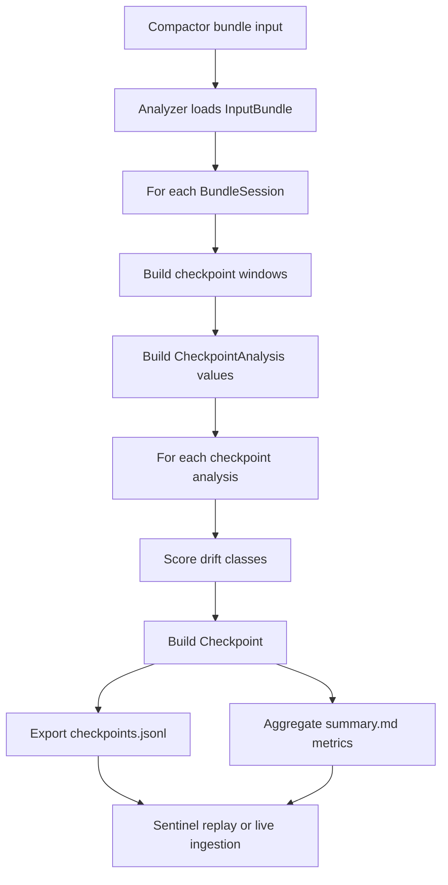

## Resolution 2: Per-Session Analyzer Flow

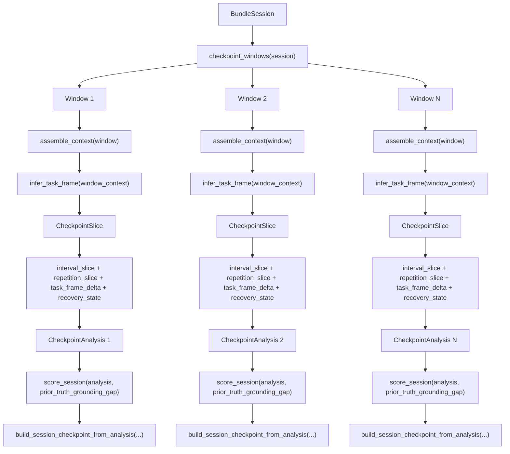

## Resolution 3: Bundle And Context Surfaces

This is the object-model view of the analyzer input bundle, per-session bundle, and derived context
object.

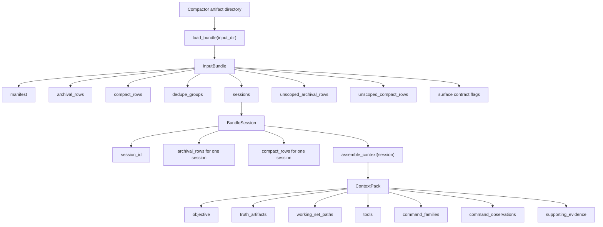

## Resolution 4: How Checkpoint Windows Are Built

The key current behavior is that each checkpoint window is a cumulative prefix, not an isolated
interval.

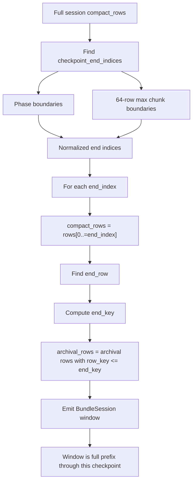

## Resolution 5: What Goes Into a Checkpoint

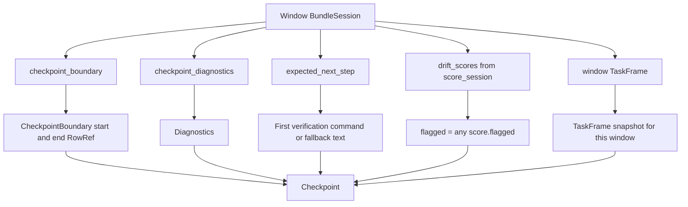

## Resolution 6: Diagnostics Now Route Through `CheckpointAnalysis`

The exported diagnostics are now computed from the checkpoint-analysis seam. The windowing model is
still cumulative, but diagnostics read explicit interval and recovery fields rather than
recomputing a prior window ad hoc inside the checkpoint builder.

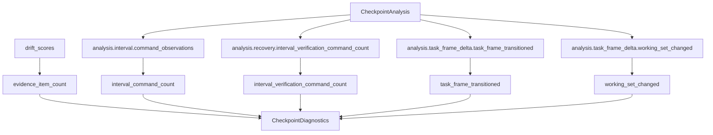

## Resolution 7: Task-Frame Assembly

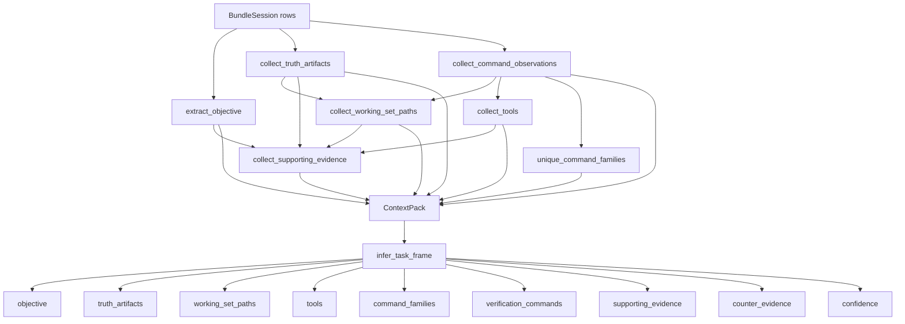

## Resolution 8: Scoring Orchestration

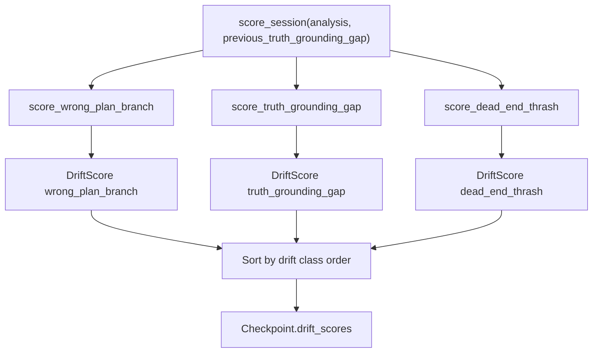

## Resolution 9: `wrong_plan_branch`

Current behavior: expected scope still comes from the current checkpoint task frame, but the
scorer only inspects command observations from the explicit interval slice.

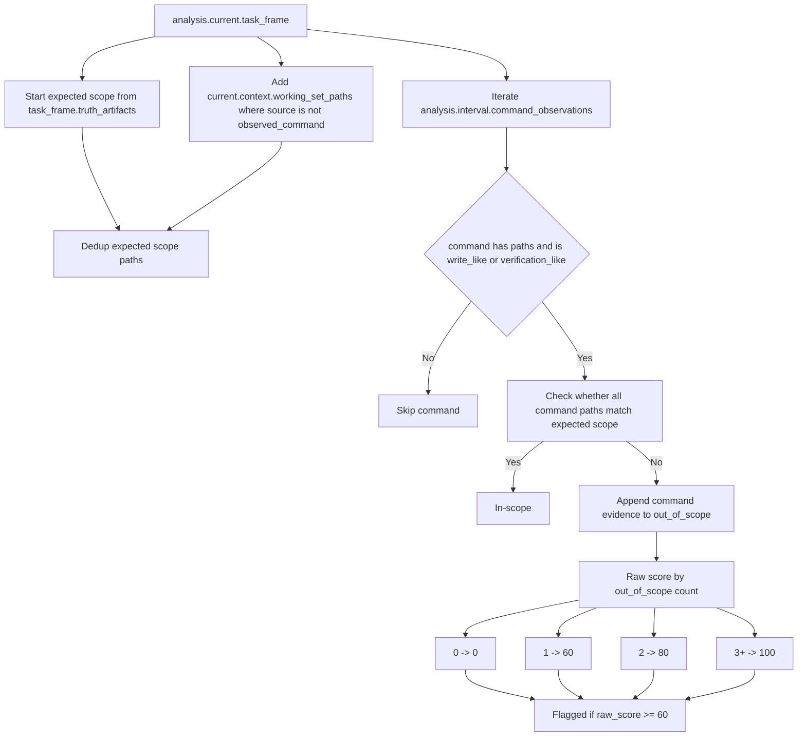

## Resolution 10: `truth_grounding_gap`

Current behavior: this scorer treats truth-grounding as a hybrid signal. It computes active state
from the latest interval and carries forward prior flagged evidence as explicit historical context.

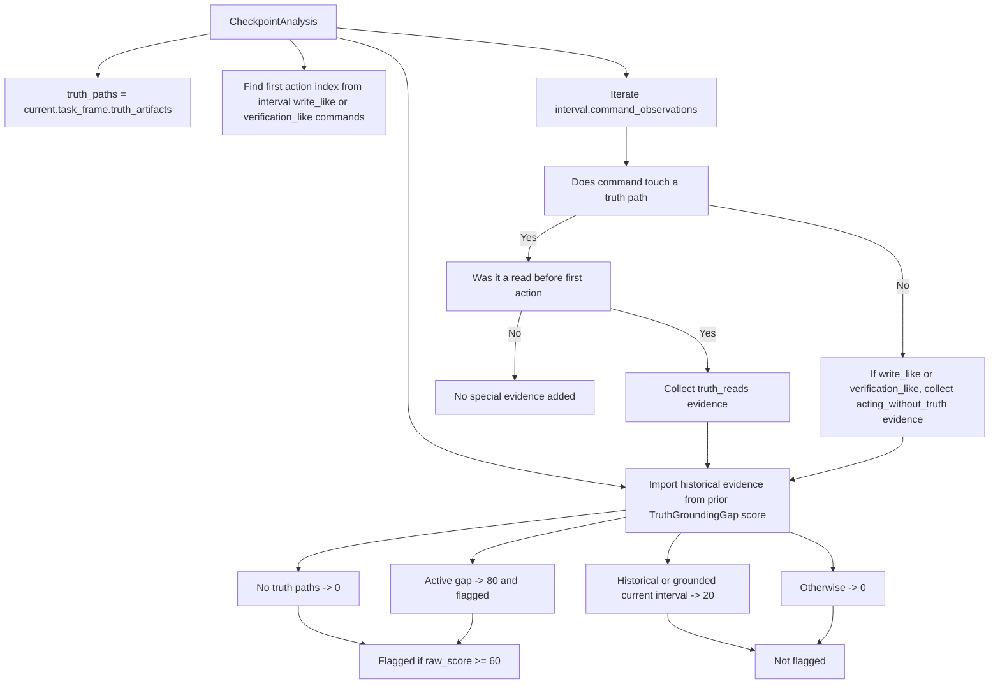

## Resolution 11: `dead_end_thrash`

Current behavior: this scorer still reads repetition-preserving archival history from the current
checkpoint prefix, but active flagging is gated by explicit recovery state from the latest
interval. A latest interval only counts as clean recovery when it includes verification-like work,
does not add new repeated-loop evidence, and does not keep issuing out-of-scope write or
verification commands.

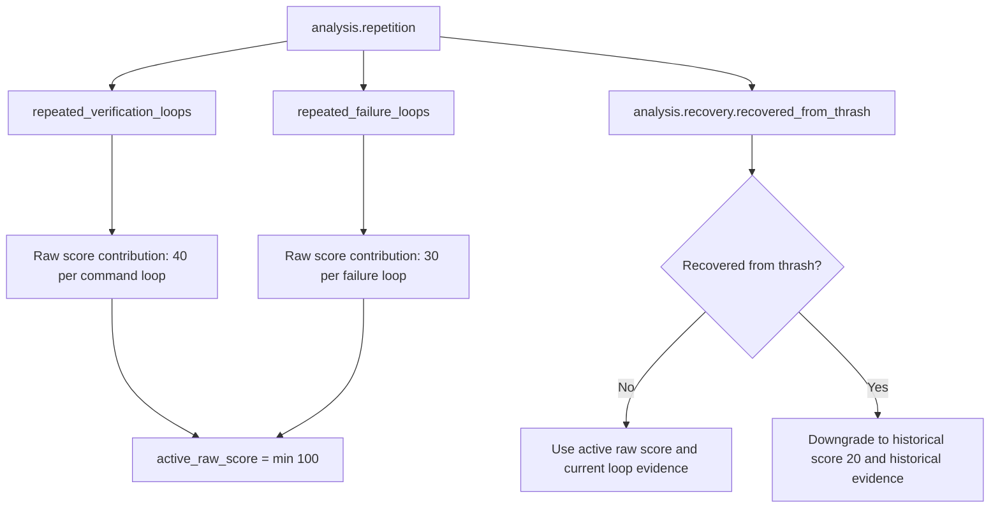

## Resolution 12: Exported Summary Metrics

`summary.md` is generated from emitted checkpoints. It aggregates checkpoint-level results rather
than recomputing drift on its own.

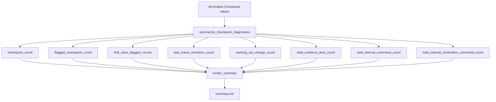

## Resolution 13: Sentinel Consumption

The sentinel does not rescore drift. It consumes checkpoint output, runs scheduler policy, and then
classifies each checkpoint as either `Visible` or `Silent`.

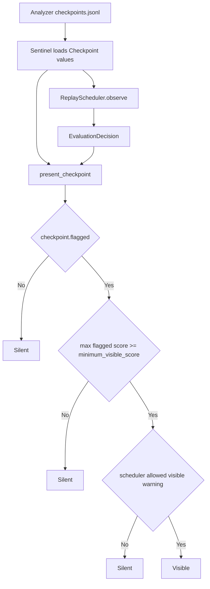

## Current Semantics To Keep In Mind

- Checkpoint windows are still cumulative prefixes.
- `CheckpointAnalysis` is now the internal seam that carries current, previous, interval,
  repetition, task-frame-delta, and recovery semantics for each checkpoint.
- Checkpoint diagnostics come from that seam's interval and recovery fields.
- `wrong_plan_branch` scores only the latest interval, while expected scope still comes from the
  current checkpoint task frame.
- `truth_grounding_gap` is a hybrid signal: the active flag comes from the latest interval, while
  earlier grounding gaps are preserved as historical evidence.
- `dead_end_thrash` still derives loop history from repetition-preserving archival evidence, but
  the active flag clears after a clean verification interval via explicit recovery semantics.
- `summary.md` is a rollup of emitted checkpoint state, not an independently recomputed notion of
  current recovery.
- The sentinel currently exposes only `Visible` versus `Silent`; it does not have a first-class
  recovered or historical-only presentation state.
