# Agent Drift Analyzer Current Checkpoint Logic

This document explains how the current `agent-drift-analyzer` checkpoint pipeline works today,
including where the analyzer is interval-aware, where it is still cumulative, and how its output
feeds the sentinel.

It is a code-reading aid for the current implementation, not a target-state design doc.

## Code Map

- `crates/agent-drift-analyzer/src/lib.rs`
- `crates/agent-drift-analyzer/src/context/mod.rs`
- `crates/agent-drift-analyzer/src/inference/mod.rs`
- `crates/agent-drift-analyzer/src/checkpoint/mod.rs`
- `crates/agent-drift-analyzer/src/checkpoint/schema.rs`
- `crates/agent-drift-analyzer/src/checkpoint/export.rs`
- `crates/agent-drift-analyzer/src/scoring/wrong_plan_branch.rs`
- `crates/agent-drift-analyzer/src/scoring/ignoring_repo_truth.rs`
- `crates/agent-drift-analyzer/src/scoring/dead_end_thrash.rs`
- `crates/agent-drift-sentinel/src/operator_surface.rs`

## Resolution 1: Stack-Level Data Flow

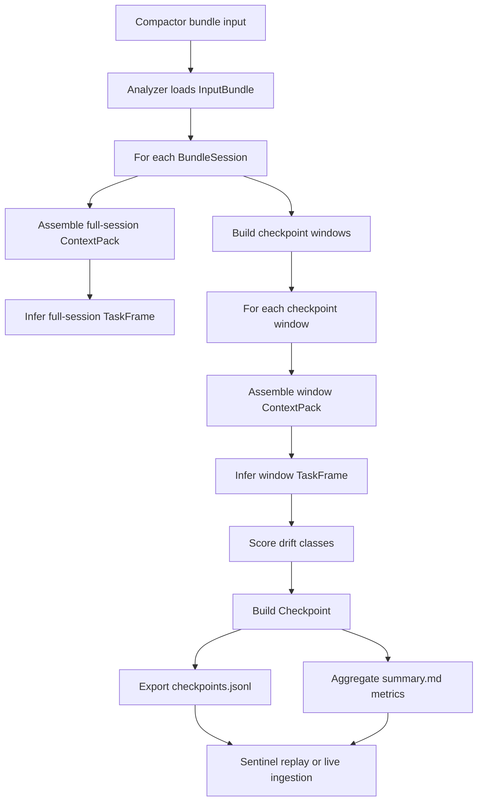

## Resolution 2: Per-Session Analyzer Flow

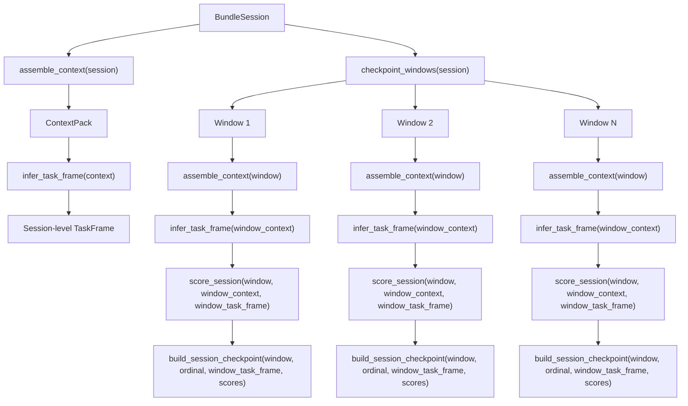

## Resolution 3: Bundle And Context Surfaces

This is the object-model view of the analyzer input bundle, per-session bundle, and derived context
object.

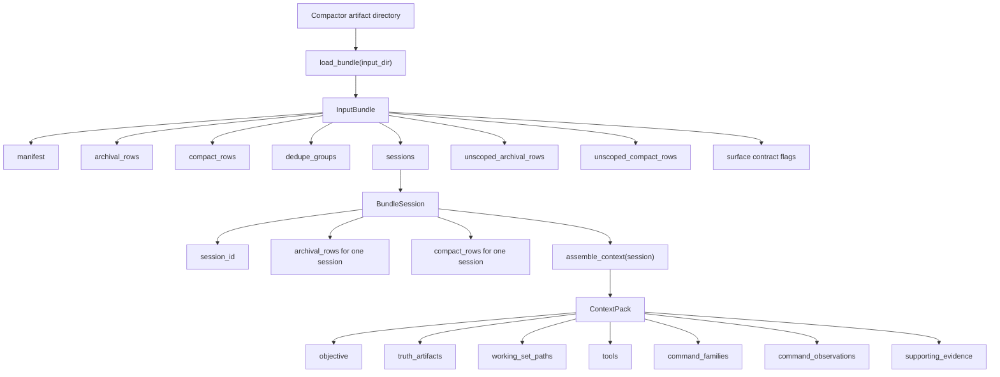

## Resolution 4: How Checkpoint Windows Are Built

The key current behavior is that each checkpoint window is a cumulative prefix, not an isolated
interval.

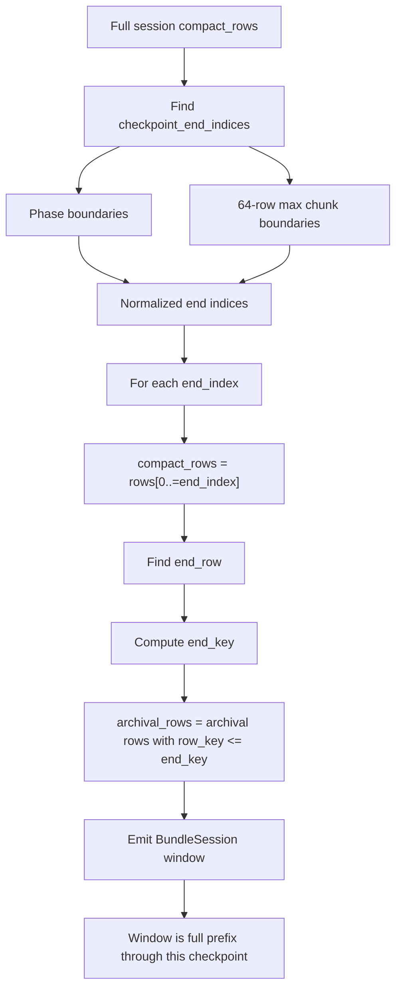

## Resolution 5: What Goes Into a Checkpoint

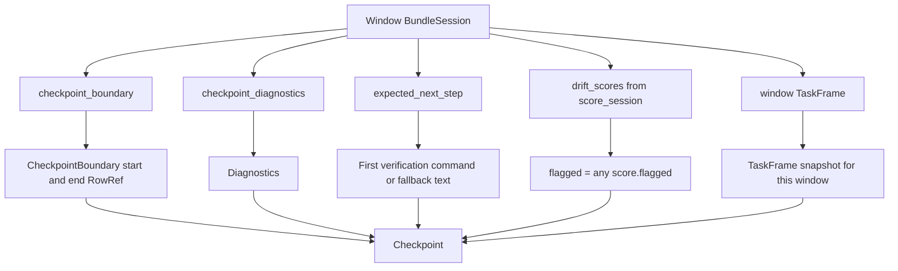

## Resolution 6: Diagnostics Are Interval-Aware

The checkpoint diagnostics are the one part of the current checkpoint builder that already compares
the current prefix window against the previous checkpoint window.

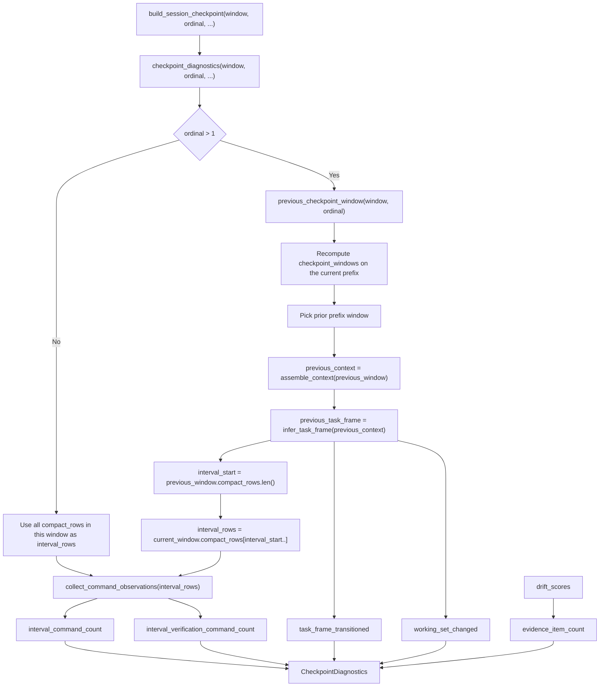

## Resolution 7: Task-Frame Assembly

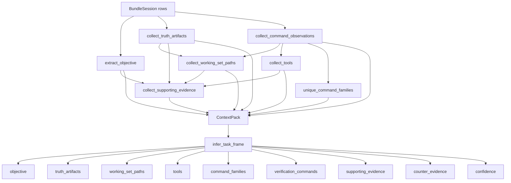

## Resolution 8: Scoring Orchestration

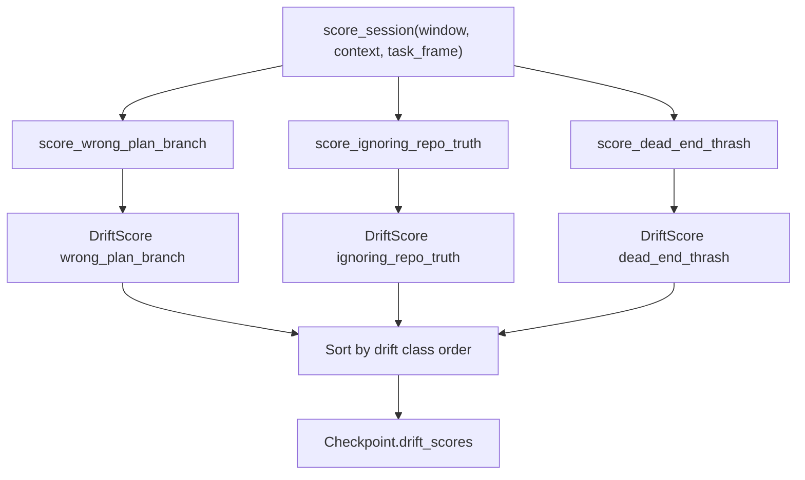

## Resolution 9: `wrong_plan_branch`

Current behavior: this scorer reads the current window context, but that context was assembled from
the cumulative prefix window.

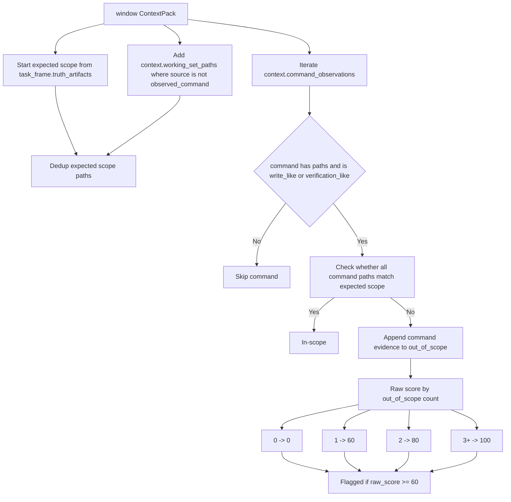

## Resolution 10: `ignoring_repo_truth`

Current behavior: this scorer also reads the cumulative prefix command stream and asks whether the
session acted before reading likely truth artifacts.

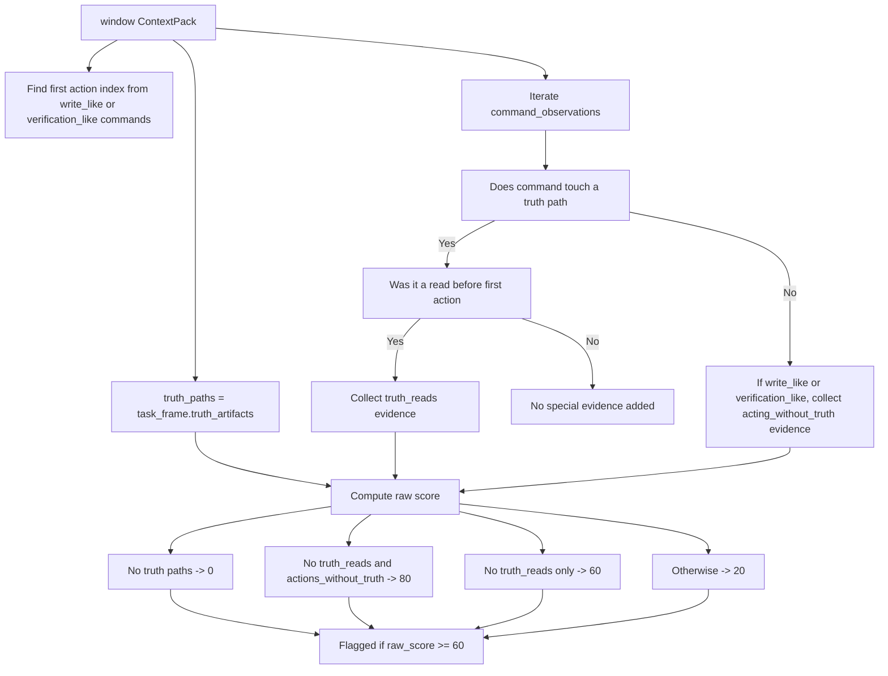

## Resolution 11: `dead_end_thrash`

Current behavior: this scorer intentionally reads the repetition-preserving archival surface, but it
does so from the cumulative archival prefix associated with the current checkpoint.

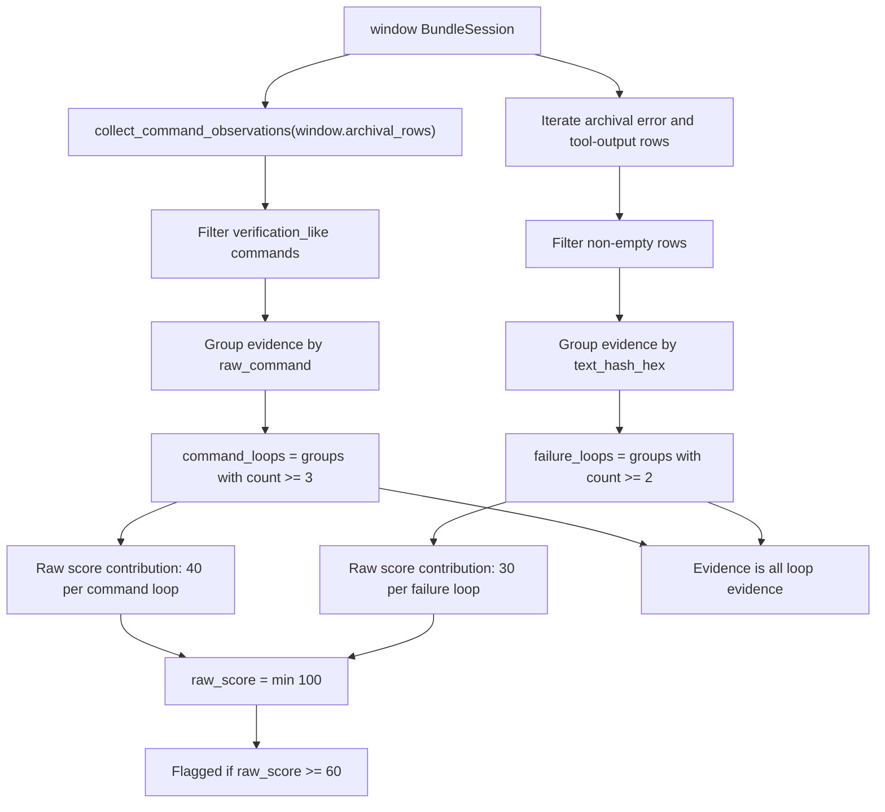

## Resolution 12: Exported Summary Metrics

`summary.md` is generated from emitted checkpoints. It aggregates checkpoint-level results rather
than recomputing drift on its own.

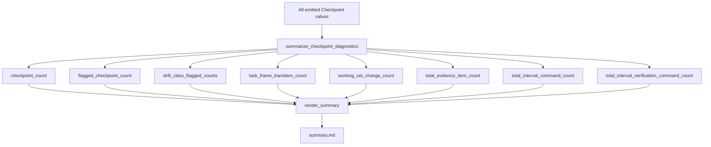

## Resolution 13: Sentinel Consumption

The sentinel does not rescore drift. It consumes checkpoint output, runs scheduler policy, and then
classifies each checkpoint as either `Visible` or `Silent`.

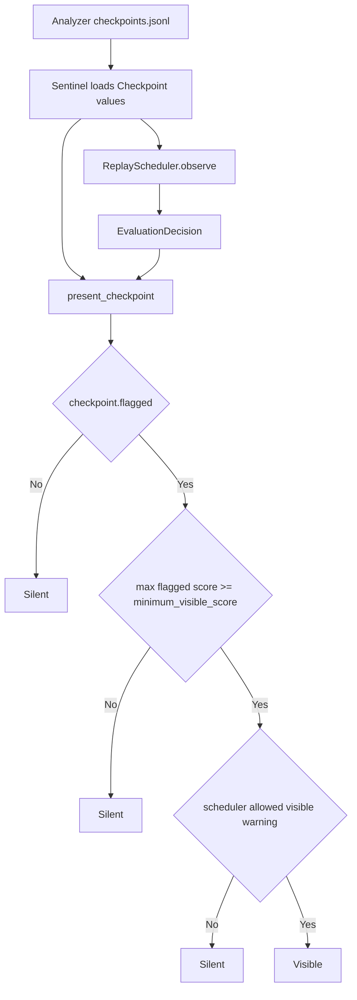

## Current Semantics To Keep In Mind

- Checkpoint windows are cumulative prefixes.
- Checkpoint diagnostics compare the current prefix against the previous checkpoint and are
  interval-aware.
- `wrong_plan_branch` and `ignoring_repo_truth` currently score against cumulative command
  observations because their input context is built from the cumulative prefix.
- `dead_end_thrash` currently scores against cumulative archival history because it scans the
  checkpoint's archival prefix.
- `summary.md` is a rollup of emitted checkpoint state, not an independently recomputed notion of
  current recovery.
- The sentinel currently exposes only `Visible` versus `Silent`; it does not have a first-class
  recovered or historical-only presentation state.
