# Phase 4 Continuation - Session 5

## 🚀 Quick Start for Next Session

Continue Phase 4 implementation of the Substrate project. Excellent progress has been made with PR#10-12 complete, including overlayfs/networking, LD_PRELOAD telemetry, and replay module. Ready to proceed with PR#13 (Kuzu graph database integration).

**Current Working Directory**: `/Users/spensermcconnell/__Active_Code/atomize-hq/substrate`

## 📋 Session 4 Accomplishments (2025-09-03)

### ✅ Major Achievements
1. **Fixed build warnings**: Reduced from 45 to ~34 warnings by fixing unused imports, variables, and unreachable code
2. **Module renaming**: Successfully renamed HRM → Replay (HRM reserved for future "Hierarchical Reasoning Model")
3. **Documentation updates**: Updated TRACE.md with current architecture state
4. **Code cleanup**: Improved code quality and maintainability

### 🏗️ Architecture Status Update
- **All core modules implemented and tested**:
  - ✅ PR#10: Overlayfs filesystem diff + nftables network filtering  
  - ✅ PR#11: LD_PRELOAD telemetry library (syscall interception)
  - ✅ PR#12: Replay module (trace replay and regression testing)
- **Integration working**: Shell + Shim + Broker + World + Telemetry + Replay
- **Trace system operational**: Full span lifecycle with policy decisions and telemetry

## 📚 Essential Documentation
1. **Master Plan**: `docs/project_management/future/implementation_phase4_merged.md`
2. **Progress Tracking**: `docs/project_management/future/PHASE_4_PROGRESS.md` 
3. **Trace System**: `docs/TRACE.md` (UPDATED with current state)
4. **Telemetry Guide**: `docs/TELEMETRY.md`
5. **Project Instructions**: `CLAUDE.md`
6. **Broker System**: `docs/BROKER.md`

## 🎯 Next Priority: PR#13 - Kuzu Graph Database Integration

According to the master plan, implement graph database integration for command relationship analysis.

### Implementation Goals for PR#13
1. **Create Kuzu integration** (`crates/trace/src/graph.rs`):
   - Graph schema for commands, files, and relationships
   - Trace ingestion pipeline from JSONL to graph
   - Query interface for relationship analysis
   - Graph-based security analysis

2. **Key components to build**:
   - Node types: Commands, Files, Networks, Agents, Policies
   - Edge types: Executes, Reads, Writes, Connects, Inherits
   - Batch ingestion from trace.jsonl files  
   - Query API for graph traversal and analysis

3. **Integration points**:
   - Feature-gated behind `graph` feature in trace Cargo.toml
   - Async ingestion to avoid blocking trace writes
   - RESTful query API for external tools

### Current Architecture State

```mermaid
graph TB
    subgraph "Complete ✅"
        Shell[Shell]
        Shim[Shim] 
        Broker[Broker]
        Trace[Trace]
        World[World Backend]
        Telemetry[Telemetry Lib]
        Replay[Replay Module]
    end
    
    subgraph "Next: PR#13"
        Kuzu[(Kuzu Graph DB)]
    end
    
    Shell --> Broker
    Shell --> Trace
    Shim --> Trace
    Broker --> Trace
    World --> Trace
    Telemetry --> Trace
    Replay --> Trace
    Trace -.-> Kuzu
```



## 💡 Implementation Notes for PR#13 (Kuzu Graph)

### Suggested File Structure
```
crates/trace/src/
├── lib.rs              # Main trace API
├── graph.rs            # NEW: Kuzu integration
└── schema/             # NEW: Graph schema
    ├── nodes.rs        # Node definitions
    ├── edges.rs        # Relationship definitions
    └── queries.rs      # Common query patterns
```

### Key Design Considerations
1. **Async Ingestion**: Don't block trace writes waiting for graph updates
2. **Schema Evolution**: Design schema to handle future node/edge types
3. **Query Performance**: Index key relationships (command→file, agent→command)
4. **Feature Gating**: Keep base trace functionality independent of Kuzu

### Example Graph Schema
```cypher
// Nodes
CREATE NODE TABLE Command(
    span_id STRING, 
    cmd STRING, 
    exit_code INT64, 
    component STRING,
    PRIMARY KEY (span_id)
);

CREATE NODE TABLE File(
    path STRING, 
    operation STRING,
    PRIMARY KEY (path, operation)
);

// Relationships  
CREATE REL TABLE Executes(FROM Agent TO Command);
CREATE REL TABLE Modifies(FROM Command TO File);
CREATE REL TABLE ChildOf(FROM Command TO Command);
```

### Testing Approach
- Unit tests for schema creation and ingestion
- Integration tests with sample trace data
- Performance benchmarks for large graph queries
- Feature flag testing (with/without graph)

## 🚦 Success Criteria for Session 5
- [ ] Kuzu integration module structure created
- [ ] Graph schema implemented (nodes + relationships)
- [ ] Trace ingestion pipeline functional
- [ ] Basic graph queries working
- [ ] Feature flag integration complete
- [ ] Unit tests for graph operations
- [ ] Integration test with trace.jsonl
- [ ] Documentation for graph API

## 📝 Quick Test Commands
```bash
# Verify current state (all should work)
cargo build --workspace
cargo test --workspace

# Test trace generation with all modules
SUBSTRATE_WORLD=enabled cargo run --bin substrate -- -c "echo test"

# View trace with telemetry events
tail -10 ~/.substrate/trace.jsonl | jq .

# Test replay functionality
cargo test -p substrate-replay

# Test telemetry in Docker
docker run --rm telemetry-test

# Test with graph feature (after PR#13)
cargo test -p substrate-trace --features graph
cargo build --workspace --features graph
```

## 🏗️ Context for AI Assistant

You are continuing Phase 4 of the Substrate project. The system now has:

### Complete & Working ✅
- **Shell + Shim**: Command interception and execution
- **Broker**: Policy evaluation and decision making
- **Trace**: Comprehensive span-based logging to JSONL
- **World**: Overlayfs filesystem diff + nftables network filtering
- **Telemetry**: LD_PRELOAD syscall interception (Docker-tested)
- **Replay**: Deterministic trace replay and regression testing

### Architecture Highlights
- All components integrate via environment variables (no IPC complexity)
- Trace events written to `~/.substrate/trace.jsonl` in structured JSONL
- World backend provides filesystem diffs and network scopes
- Telemetry library captures syscall-level events inside containers
- Replay module enables regression testing from recorded traces
- Policy decisions embedded in all trace spans

### Next Goal: Graph Intelligence
PR#13 adds Kuzu graph database integration to enable:
- Command relationship analysis
- Security pattern detection  
- Dependency visualization
- Graph-based policy evaluation

The architecture is greenfield - make clean design decisions. Focus on Linux first (macOS via Docker/Lima). Performance target: <50ms command overhead.

## ⚠️ Important Context

1. **HRM vs Replay**: "HRM" now refers to future "Hierarchical Reasoning Model" (ML/AI). Current trace replay functionality is in the `replay` module.

2. **Docker Required on macOS**: LD_PRELOAD telemetry requires Linux environment due to SIP restrictions.

3. **Feature Flags**: Use `graph` feature to keep Kuzu dependency optional.

4. **Async Design**: Graph ingestion must not block trace writes.

5. **Build Status**: ~34 warnings remaining (mostly unused API fields that will connect in future PRs).

---

**Session**: 5  
**Date**: Ready for continuation  
**Completed PRs**: #1-12 ✅  
**Current PR**: #13 Kuzu Graph Database Integration  
**Phase**: 4 (Active Development)