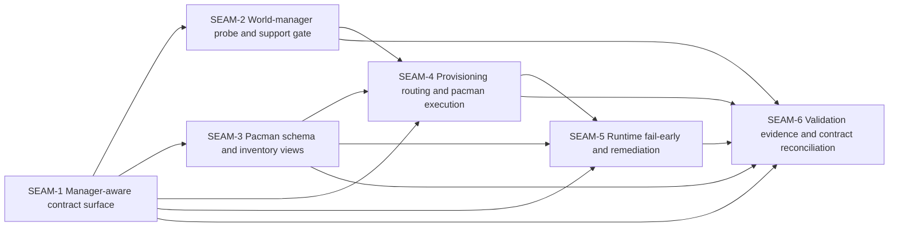

# Seam Map - Add non-APT system-package provisioning support

This seam map is extracted from the source pack's accepted slice order, workstream triage, contract surfaces, decision register, validation specs, and checkpoint plan. It stays intentionally above seam-local slicing.

## Horizon policy

- **Active seam**: `SEAM-1`
- **Next seam**: `SEAM-2`
- **Future seam(s)**: `SEAM-3`, `SEAM-4`, `SEAM-5`, `SEAM-6`

Explicit policy carried from extractor v2.3:

- only `SEAM-1` is eligible for authoritative downstream decomposition by default
- `SEAM-2` may later receive seam-local review and slices, but only provisional deeper planning until revalidated
- `SEAM-3` through `SEAM-6` remain seam-brief only in this pack
- the old `NASP*` slices are lineage inputs, not authoritative execution units here

## Seam topology

## Source-plan roll-up

- `NASP-PWS-contract`, `contract.md`, and `decision_register.md` are rolled into `SEAM-1`.
- `NASP-PWS-os_probe` and `slices/NASP0/NASP0-spec.md` are rolled into `SEAM-2`.
- `NASP-PWS-schema_inventory`, `world-deps-pacman-schema-spec.md`, and `slices/NASP1/NASP1-spec.md` are rolled into `SEAM-3`.
- `NASP-PWS-provisioning_wiring` and `slices/NASP2/NASP2-spec.md` are rolled into `SEAM-4`.
- `NASP-PWS-runtime_fail_early` and `slices/NASP3/NASP3-spec.md` are rolled into `SEAM-5`.
- `NASP-PWS-docs_validation`, `slices/NASP4/NASP4-spec.md`, `platform-parity-spec.md`, `manual_testing_playbook.md`, and the three smoke scripts are rolled into `SEAM-6`.
- `NASP-PWS-tasks_checkpoints` remains pack governance only. It is represented through `threading.md`, `review_surfaces.md`, and the closeout scaffolds instead of a standalone seam.

## Why the seam count differs from the accepted slice count

The source pack already decided that the original three-slice draft was too coarse and accepted a five-slice delivery model. This extractor adds one more seam because the source triage also kept a distinct prerequisite contract/decision workstream with no dependencies and with every other workstream depending on it.

That makes the seam structure:

1. one prerequisite contract-definition seam
2. five delivery seams aligned to the accepted source slices
3. zero governance-only seams for tasks/checkpoints

This keeps the seams cohesive without collapsing the contract authority problem into the first delivery seam.

## SEAM-1 — Manager-aware contract surface

- **Type**: `integration`
- **Execution horizon**: `active`
- **Source-plan lineage**: `NASP-PWS-contract`, `contract.md`, `decision_register.md`
- **Primary value**:
  - Freeze the single authoritative manager-aware operator contract, decision register, authority handoff, and safety invariants before probe, schema, provisioning, runtime, and validation seams proceed.
- **Primary touch surface**:
  - `contract.md`
  - `decision_register.md`
  - `pre-planning/spec_manifest.md` authority table as lineage input
- **Natural boundary**:
  - This seam owns contract truth and accepted decisions, not runtime implementation details.
- **Likely verification path**:
  - Confirm that commands, exit codes, mixed-manager posture, request-profile boundaries, v1 pacman scope, and overlapping-doc ownership are concrete enough for seam-local planning.
- **Key downstream consumers**:
  - `SEAM-2`
  - `SEAM-3`
  - `SEAM-4`
  - `SEAM-5`
  - `SEAM-6`

## SEAM-2 — World-manager probe and support gate

- **Type**: `platform`
- **Execution horizon**: `next`
- **Source-plan lineage**: `NASP-PWS-os_probe`, `NASP0`
- **Primary value**:
  - Turn the accepted manager-selection contract into one deterministic in-world probe and one fail-closed support gate across supported and unsupported backends.
- **Primary touch surface**:
  - `slices/NASP0/NASP0-spec.md`
  - `crates/shell/src/builtins/world_enable/runner.rs`
  - `crates/shell/src/builtins/world_enable/runner/helper_script.rs`
  - `crates/shell/src/execution/routing/dispatch/world_ops.rs`
  - `crates/world-agent/src/service.rs`
- **Natural boundary**:
  - This seam is about selecting or rejecting the world manager, not about inventory shape or package-manager execution.
- **Likely verification path**:
  - Confirm `/etc/os-release` normalization, contradiction handling, in-world-only routing, and unsupported-backend outcomes.
- **Key downstream consumers**:
  - `SEAM-4`
  - `SEAM-6`

## SEAM-3 — Pacman schema and inventory views

- **Type**: `integration`
- **Execution horizon**: `future`
- **Source-plan lineage**: `NASP-PWS-schema_inventory`, `world-deps-pacman-schema-spec.md`, `NASP1`
- **Primary value**:
  - Extend the world-deps schema with `install.method=pacman` and `install.pacman` while keeping additive compatibility, non-runnable v1 scope, and deterministic inventory rendering.
- **Primary touch surface**:
  - `world-deps-pacman-schema-spec.md`
  - `slices/NASP1/NASP1-spec.md`
  - `crates/shell/src/builtins/world_deps/inventory.rs`
  - `crates/shell/tests/world_deps_inventory_validation_wdp0.rs`
  - `crates/shell/tests/world_deps_inventory_views.rs`
- **Natural boundary**:
  - This seam owns authored inventory shape and rendered inventory truth, not provisioning-time routing or runtime remediation.
- **Likely verification path**:
  - Confirm additive schema support, invalid-state rejection, view rendering, and non-runnable pacman constraints.
- **Key downstream consumers**:
  - `SEAM-4`
  - `SEAM-5`
  - `SEAM-6`

## SEAM-4 — Provisioning routing and pacman execution

- **Type**: `platform`
- **Execution horizon**: `future`
- **Source-plan lineage**: `NASP-PWS-provisioning_wiring`, `NASP2`
- **Primary value**:
  - Convert contract, probe, and schema truth into one deterministic `substrate world enable --provision-deps` routing path with stable requirement normalization, mixed-manager rejection, and exact pacman execution shape.
- **Primary touch surface**:
  - `slices/NASP2/NASP2-spec.md`
  - `scripts/substrate/world-enable.sh`
  - `crates/shell/src/builtins/world_enable/runner/log_ops.rs`
  - `crates/shell/src/execution/routing/dispatch/world_ops.rs`
  - `crates/world-agent/src/service.rs`
- **Natural boundary**:
  - This seam is the provisioning-time execution seam. It does not own schema definition or runtime fail-early semantics.
- **Likely verification path**:
  - Confirm normalized requirement derivation, request-profile boundaries, mixed-manager fail-closed behavior, pacman command construction, and dry-run/verbose rendering.
- **Key downstream consumers**:
  - `SEAM-5`
  - `SEAM-6`

## SEAM-5 — Runtime fail-early and remediation

- **Type**: `platform`
- **Execution horizon**: `future`
- **Source-plan lineage**: `NASP-PWS-runtime_fail_early`, `NASP3`
- **Primary value**:
  - Preserve the runtime no-system-package-mutation posture while adding deterministic read-only presence probes, explicit-item scoping, and manager-aware remediation across APT-backed and pacman-backed items.
- **Primary touch surface**:
  - `slices/NASP3/NASP3-spec.md`
  - `crates/shell/src/execution/cli.rs`
  - `crates/shell/src/builtins/world_deps/surfaces.rs`
  - `crates/shell/tests/world_deps_current_dry_run_wdp3.rs`
  - `crates/shell/tests/world_deps_apt_install_wdp5.rs`
- **Natural boundary**:
  - This seam owns runtime preflight and remediation only. It does not own provisioning-time mutation or validation evidence.
- **Likely verification path**:
  - Confirm read-only probe families, explicit-item scope, mixed-manager runtime handling, and deterministic stderr/stdout rendering.
- **Key downstream consumers**:
  - `SEAM-6`

## SEAM-6 — Validation evidence and contract reconciliation

- **Type**: `conformance`
- **Execution horizon**: `future`
- **Source-plan lineage**: `NASP-PWS-docs_validation`, `NASP4`, parity/manual/smoke specs
- **Primary value**:
  - Lock Linux/macOS/Windows evidence and remove second-truth drift from overlapping ADR and documentation surfaces after the contract and behavior seams land.
- **Primary touch surface**:
  - `slices/NASP4/NASP4-spec.md`
  - `platform-parity-spec.md`
  - `manual_testing_playbook.md`
  - `smoke/linux-smoke.sh`
  - `smoke/macos-smoke.sh`
  - `smoke/windows-smoke.ps1`
  - shared reconciliation targets under `docs/project_management` and `docs/reference`
- **Natural boundary**:
  - This seam is cross-seam hardening and proof, not net-new probe, schema, provisioning, or runtime behavior.
- **Likely verification path**:
  - Confirm one accepted support matrix, one exact reconciliation target set, authoritative smoke/manual evidence, and no remaining APT-only second truth for shared manager-aware behavior.
- **Key downstream consumers**:
  - Pack closeout, operators, support, and future maintainers

## Why the extraction stops here

The source pack already contains deep execution detail, but extractor v2.3 explicitly forbids creating new authoritative slices during extraction. This pack therefore preserves the old plan's depth as:

- rich seam briefs rather than slice specs
- explicit contracts and threads rather than task graphs
- governance remediations and closeout scaffolds rather than execution checklists
- pack-level review surfaces rather than seam-local `review.md`
