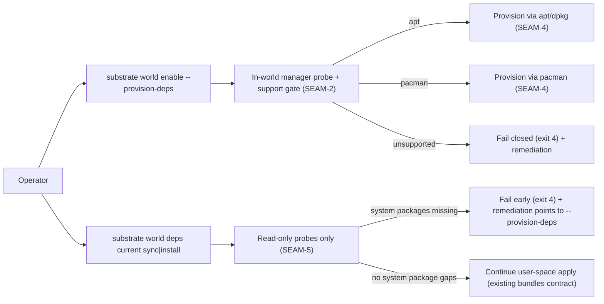
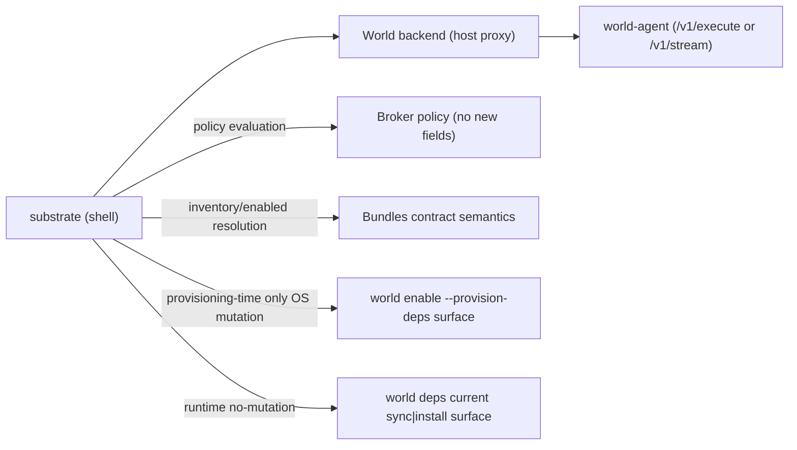

# Review Bundle - SEAM-1 Manager-aware contract surface

This artifact feeds `gates.pre_exec.review`.
`../../review_surfaces.md` is pack orientation only.

## Falsification questions

- Can runtime `substrate world deps current sync|install` still be interpreted as allowed to mutate `apt/dpkg` or `pacman` state under any backend?
- Can manager selection still be interpreted as derived from host state (PATH/package-manager presence) rather than in-world probe + support gate?
- Can `install.method=pacman` still be misread as runnable or host-native supported in v1 (instead of provisioning-only + fail-closed where unsupported)?

## R1 - UX / workflow flow

## R2 - API / service / data flow

## Likely mismatch hotspots

- Authority drift across:
  - `ADR-0030`, `ADR-0033`, the bundles contract, and older APT-pack references (compat shims / operator docs)
- Exit-code meaning drift, especially exit `4` (unsupported/prereq-missing) versus exit `2` (invalid inventory/config)
- “Provisioning-only” pacman scope in v1 versus any implied “runtime pacman install” behavior

## Pre-exec findings

- No new seam-owned remediations opened during decomposition.
- Existing pack-level risk remains tracked as `REM-001` (owned by `SEAM-6`): reconciliation of overlapping ADR and docs so they defer to the accepted `C-01` voice.

## Pre-exec gate disposition

- **Review gate**: pending
- **Contract gate concerns**:
  - `C-01` must contain an explicit authority/defer map for all overlapping documents and a complete “no new surface area” statement (no new config/env/protocol/log fields).
  - Exit codes must explicitly reference `docs/project_management/system/standards/shared/EXIT_CODE_TAXONOMY.md` and spell out feature-specific meanings for `2`, `3`, and `4`.
- **Revalidation prerequisites**:
  - None inbound; downstream seams must revalidate on `THR-01` publication and/or recorded stale triggers.
- **Opened remediations**: none

## Planned seam-exit gate focus

- **What must be true before downstream promotion is legal**:
  - `C-01` is published (as an authoritative artifact path) and `THR-01` is updated to `published`.
  - The authority/defer map is recorded so downstream seams know which documents are binding versus orientation-only.
- **Which outbound contracts/threads matter most**:
  - `C-01` and `THR-01`
- **Which review-surface deltas would force downstream revalidation**:
  - Any delta to exit-code mapping, request-profile posture, mixed-manager fail-closed posture, or v1 pacman “provisioning-only” constraints.

