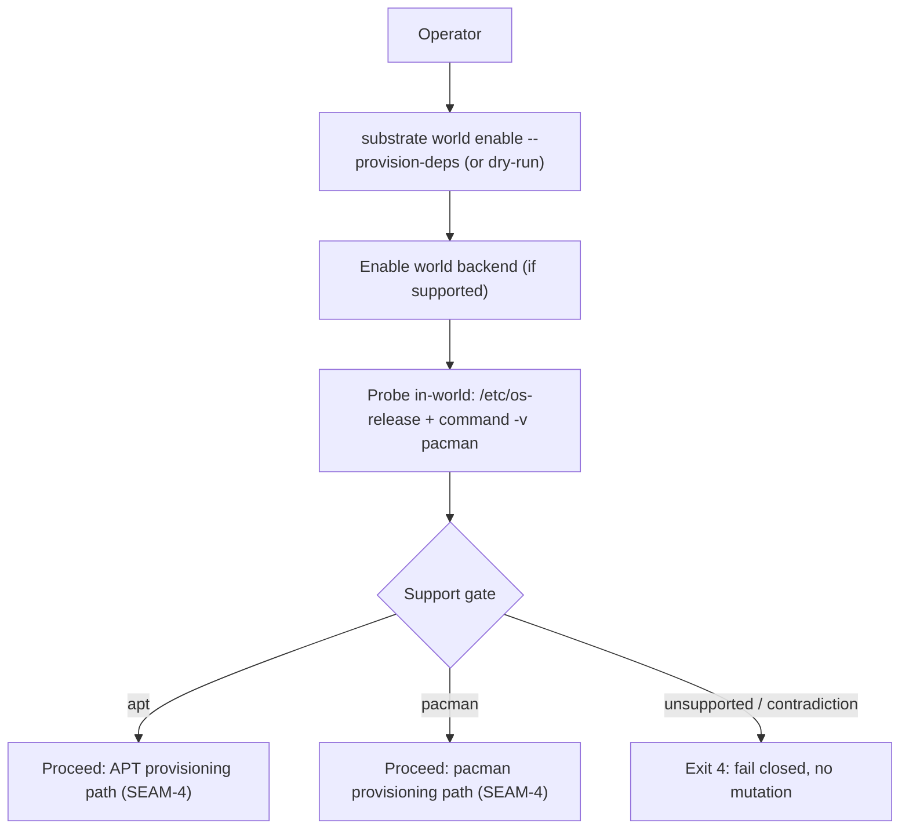
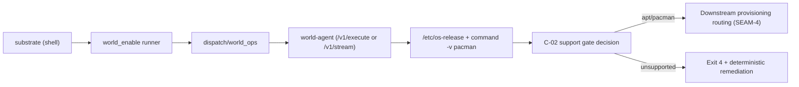

# Review Bundle - SEAM-2 World-manager probe and support gate

This artifact feeds `gates.pre_exec.review`.
`../../review_surfaces.md` is pack orientation only.

## Falsification questions

- Can manager selection still be derived from host state (PATH / host installer detection) under any provisioning or dry-run path?
- Can an ambiguous or contradictory `/etc/os-release` mapping still silently pick a manager (instead of failing closed with exit `4`)?
- Can “unsupported backend” posture still drift so Linux host-native or Windows WSL attempts OS package-manager mutation (or emits inconsistent exit-code meaning)?

## R1 - UX / workflow flow

## R2 - API / service / data flow

## Likely mismatch hotspots

- “In-world only” rule drift:
  - `crates/shell/src/builtins/world_enable/runner/helper_script.rs`
  - `crates/shell/src/execution/routing/dispatch/world_ops.rs`
  - `crates/world-agent/src/service.rs`
- `/etc/os-release` parsing and normalization drift (tokenization of `ID_LIKE`, whitespace/quoting quirks, empty/missing fields)
- Unsupported backend posture drift (Linux host-native, Windows WSL) versus “probe still runs for dry-run diagnostics”

## Pre-exec findings

- No new seam-owned remediations opened during decomposition.
- This seam remains blocked on `THR-01` publication: `SEAM-1` must publish `C-01` before `SEAM-2` can pass `gates.pre_exec.revalidation`.

## Pre-exec gate disposition

- **Review gate**: pending
- **Contract gate concerns**:
  - `C-02` must define:
    - a deterministic family-mapping algorithm from `/etc/os-release` (`ID`, `ID_LIKE`)
    - explicit contradiction rules and fail-closed posture (exit `4`)
    - platform/backend posture outcomes (Linux host-native unsupported; macOS Lima supported; Windows WSL unsupported)
    - diagnostics and exit-code meaning aligned with `docs/project_management/system/standards/shared/EXIT_CODE_TAXONOMY.md`
- **Revalidation prerequisites**:
  - Consume published `C-01` (`THR-01`) and revalidate that no host-derived routing inputs are allowed.
  - Revalidate that the probe runs in-world (not on host) and that the same behavior is reached from both “real” and dry-run paths.
- **Opened remediations**: none

## Planned seam-exit gate focus

- **What must be true before downstream promotion is legal**:
  - `C-02` is published and evidence-backed (supported and unsupported lanes).
  - `THR-02` is advanced to `published` with a stable contract artifact path.
  - Any deltas from pack review surfaces (`../../review_surfaces.md`) are explicitly recorded as stale triggers for `SEAM-4` / `SEAM-6`.
- **Which outbound contracts/threads matter most**:
  - `C-02` / `THR-02`
- **Which review-surface deltas would force downstream revalidation**:
  - Any change to mapping rules, contradiction policy, supported backend posture, or exit `4` semantics.

