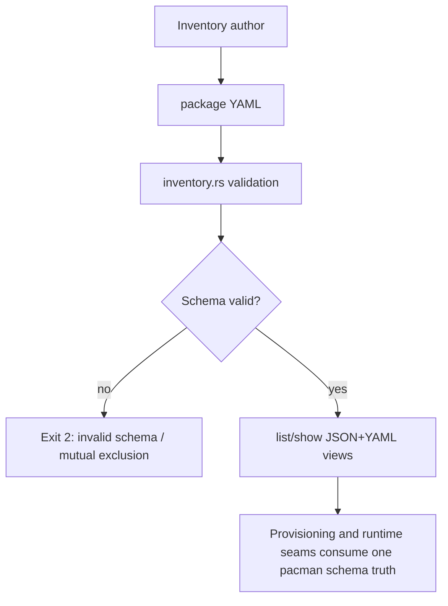
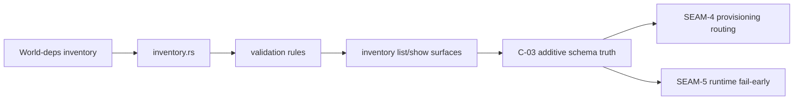

# Review Bundle - SEAM-3 Pacman schema and inventory views

This artifact feeds `gates.pre_exec.review`.
`../../review_surfaces.md` is pack orientation only.

## Falsification questions

- Can pacman schema support still imply a translation layer, remap layer, or schema-version bump instead of an additive `version: 1` extension?
- Can any inventory list/show surface still erase or rewrite `install.method=pacman` into `apt`, `script`, or `manual`?
- Can pacman-backed packages still become runnable through wrappers, entrypoints, or widened present semantics in v1?

## R1 - Authoring and validation workflow

## R2 - Service / data flow

## Likely mismatch hotspots

- `install.method` vocabulary drift in `crates/shell/src/builtins/world_deps/inventory.rs`
- Invalid-state enforcement for mutual exclusion with `install.apt`, script installers, and manual instructions
- Inventory rendering drift in JSON/YAML/list/show views and their tests
- Older bundles-contract or reference-doc wording that still implies pacman inventory is unsupported or runnable

## Pre-exec findings

- `THR-01` remains authoritative from `SEAM-1` closeout and is still current for additive schema work.
- `SEAM-2` closed with a passed seam-exit gate and published `THR-02`, which advances the pack horizon without changing `SEAM-3`'s contract ownership.
- No open pre-exec remediation currently blocks `SEAM-3`; `REM-003` remains owned by `SEAM-4`.

## Pre-exec gate disposition

- **Review gate**: passed
- **Contract gate concerns**:
  - `C-03` now has a concrete owner baseline:
    - additive `install.method=pacman` support on `version: 1`
    - `install.pacman` shape and mutual-exclusion rules
    - non-runnable v1 pacman constraints
    - inventory view/rendering obligations that preserve `pacman` as a first-class method
- **Revalidation prerequisites**:
  - Consumed published `C-01` (`THR-01`) and confirmed schema authority boundaries remain aligned with the bundles contract.
  - Revalidated that `SEAM-2` landing did not move schema ownership into the probe or provisioning seams.
- **Opened remediations**: none

## Planned seam-exit gate focus

- **What must be true before downstream promotion is legal**:
  - `C-03` is published and evidence-backed in validation plus inventory views.
  - `THR-03` is advanced to `published` with a stable schema artifact path.
  - Any deltas from pack review surfaces are explicitly recorded as stale triggers for `SEAM-4`, `SEAM-5`, and `SEAM-6`.
- **Which outbound contracts/threads matter most**:
  - `C-03` / `THR-03`
- **Which review-surface deltas would force downstream revalidation**:
  - Any change to method vocabulary, `install.pacman` shape, mutual-exclusion rules, non-runnable pacman scope, or inventory view rendering.
