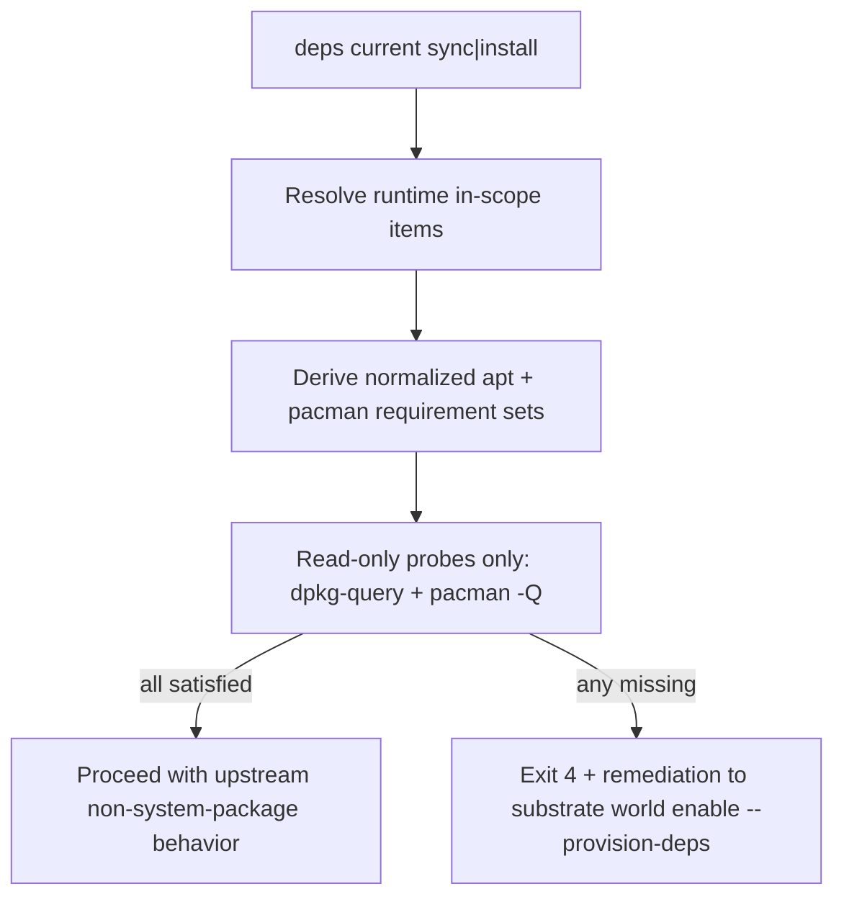

# Review Bundle - SEAM-5 Runtime fail-early and remediation

This artifact feeds `gates.pre_exec.review`.
`../../review_surfaces.md` is pack orientation only.

## Falsification questions

- Can any runtime `deps current sync|install` path still mutate `apt`, `apt-get`, `dpkg`, or `pacman` instead of staying read-only?
- Can `deps current install <ITEM...>` still pull unrelated enabled system-package items into fail-early scope instead of respecting the explicit expanded item set?
- Can manager-aware missing-requirement rendering or remediation wording drift between APT-backed and pacman-backed requirements, especially on Linux host-native and Windows?

## R1 - Runtime fail-early workflow

## R2 - Runtime service / data flow

## Likely mismatch hotspots

- runtime scope calculation in `crates/shell/src/builtins/world_deps/surfaces.rs`
- read-only probe handling for missing `dpkg-query` or `pacman -Q`
- explicit-item scoping for `deps current install <ITEM...>`
- manager-aware remediation wording in runtime stderr/stdout plus the world/deps docs

## Pre-exec findings

- `THR-01` remains authoritative from `SEAM-1` closeout and current for runtime contract wording boundaries.
- `THR-03` remains revalidated from `SEAM-3` closeout and current for additive pacman schema truth plus inventory-view obligations.
- `THR-04` is now published by `SEAM-4` closeout and current for provisioning-time normalization, request-profile boundaries, and exact manager-aware rendering assumptions.
- No open pre-exec remediation currently blocks `SEAM-5`; `REM-001` and `REM-002` remain owned by `SEAM-6`.

## Pre-exec gate disposition

- **Review gate**: passed
- **Contract gate concerns**:
  - `C-05` now has a concrete owner baseline:
    - runtime stays read-only for system-package managers
    - explicit-item scope is concrete for `current install <ITEM...>`
    - missing requirement rendering stays manager-aware and deterministic
    - remediation always points back to `substrate world enable --provision-deps`
- **Revalidation prerequisites**:
  - Consumed published `C-03` (`THR-03`) and `C-04` (`THR-04`) and confirmed the runtime seam still reuses additive schema truth and provisioning-time normalization without reopening mutation semantics.
  - Revalidated that the runtime seam still owns fail-early rendering and remediation rather than provisioning execution.
- **Opened remediations**: none

## Planned seam-exit gate focus

- **What must be true before downstream promotion is legal**:
  - `C-05` is published and evidence-backed in runtime read-only probe behavior and remediation wording.
  - `THR-05` is advanced to `published` with a stable artifact path.
  - Any deltas from pack review surfaces are explicitly recorded as stale triggers for `SEAM-6`.
- **Which outbound contracts/threads matter most**:
  - `C-05` / `THR-05`
- **Which review-surface deltas would force downstream revalidation**:
  - Any change to runtime in-scope rules, read-only probe families, manager-aware rendering, or remediation wording.
