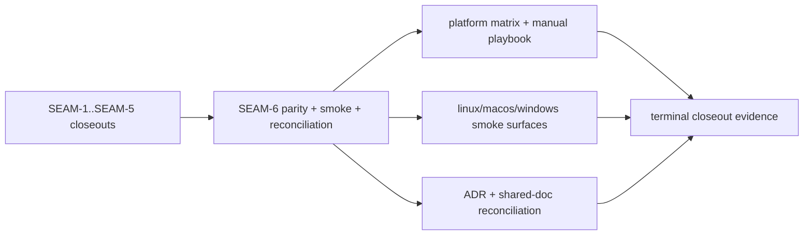
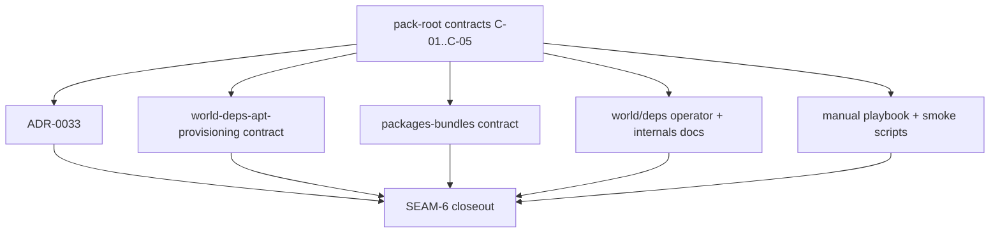

# Review Bundle - SEAM-6 validation evidence and contract reconciliation

This artifact feeds `gates.pre_exec.review`.
`../../review_surfaces.md` is pack orientation only.

## Falsification questions

- Can any named reconciliation target still present APT-only or mutation-at-runtime truth after `SEAM-5` published `C-05`?
- Can the platform matrix, smoke scripts, or manual playbook still hide an unsupported lane or the manual Arch-on-macOS fixture assumptions that `REM-002` keeps open?
- Can the parity/manual/smoke surfaces redefine behavior instead of proving the already-published `C-01` through `C-05` contracts?

## R1 - Terminal validation and reconciliation flow

## R2 - Second-truth risk map

## Likely mismatch hotspots

- **Second-truth doc drift**: shared ADR or pack docs continue to describe APT-only or runtime-mutation behavior after `C-01` and `C-05` landed.
- **Platform-lane ambiguity**: Linux host-native and Windows unsupported provisioning lanes stay implicit, or the manual Arch-on-macOS fixture assumptions remain under-specified.
- **Smoke/evidence mismatch**: smoke scripts or the manual playbook assert platform behavior that diverges from the already-published manager-aware contracts.

## Pre-exec findings

- The upstream promotion dependency is satisfied:
  - `../../governance/seam-5-closeout.md` records `seam_exit_gate.status: passed`, `promotion_readiness: ready`, and `gates.post_exec.landing: passed`.
  - `../../threading.md` now records `THR-05` as revalidated for the active seam after consuming the published runtime contract handoff.
- The active seam basis is current:
  - `../../governance/seam-1-closeout.md` publishes the manager-aware contract and decision basis `C-01`.
  - `../../governance/seam-2-closeout.md` publishes the in-world probe and support-gate contract `C-02`.
  - `../../governance/seam-3-closeout.md` publishes the pacman schema and inventory-view contract `C-03`.
  - `../../governance/seam-4-closeout.md` publishes the provisioning-routing contract `C-04`.
  - `../../governance/seam-5-closeout.md` publishes the runtime fail-early contract `C-05`.
- Contract ownership is coherent:
  - `SEAM-6` owns no new product contract; it consumes the published upstream contracts and turns them into evidence plus reconciliation truth.
  - `REM-001` and `REM-002` remain open, non-blocking remediations owned by `SEAM-6` and fit the terminal conformance scope instead of invalidating it.

## Pre-exec gate disposition

- **Review gate**: passed
- **Review gate concerns**:
  - none; the review bundle now makes the parity, smoke, and second-truth mismatch surfaces explicit enough to falsify the plan.
- **Contract gate**: passed
- **Contract gate concerns**:
  - none; ownership remains upstream, and the seam-local slices are concrete about which evidence and reconciliation surfaces consume the published contracts.
- **Revalidation**: passed
- **Revalidation concerns**:
  - none; the seam basis now references landed `SEAM-1` through `SEAM-5` closeouts and a revalidated `THR-05` handoff.
- **Opened remediations**:
  - none

## Planned seam-exit gate focus

- **What must be true before terminal closeout is legal**:
  - the platform/support matrix must make supported, unsupported, and manual-only evidence lanes explicit
  - the smoke/manual surfaces must prove the already-published behavior instead of redefining it
  - every named reconciliation target must stop presenting a second truth for manager-aware behavior
- **Which consumed threads matter most**:
  - `THR-05` for the runtime fail-early handoff
  - `THR-01` through `THR-04` for the contract, probe, schema, and provisioning invariants the terminal seam must preserve
- **Which review-surface deltas would force this seam to reopen**:
  - any doc drift that reintroduces APT-only or mutation-at-runtime semantics
  - any platform matrix or manual playbook drift that hides unsupported or manual-only evidence lanes
  - any smoke-script drift that no longer matches the published manager-aware contracts
