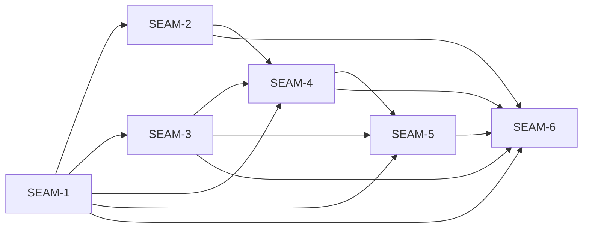

# Threading - Add non-APT system-package provisioning support

## Execution horizon summary

- **Active seam**: `SEAM-3`
- **Next seam**: `SEAM-4`
- **Future seams**: `SEAM-5`, `SEAM-6`
- **Horizon inference**:
  - `SEAM-2` has landed, published `C-02`, and moved out of the forward planning window.
  - `SEAM-3` is now the active delivery seam because `THR-01` remains revalidated and the prior active seam handed off with a passed seam-exit gate.
  - `SEAM-4` is the next seam because provisioning routing depends on both probe truth (`THR-02`) and schema truth (`THR-03`).
- **Governance-only lineage**:
  - `NASP-PWS-tasks_checkpoints` is intentionally represented as pack governance only. It is not a seam and does not own product behavior.

## Contract registry

- **Contract ID**: `C-01`
  - **Type**: UX affordance
  - **Owner seam**: `SEAM-1`
  - **Direct consumers**:
    - `SEAM-2`
    - `SEAM-3`
    - `SEAM-4`
    - `SEAM-5`
    - `SEAM-6`
  - **Derived consumers**:
    - operators
    - support/docs maintainers
    - overlapping APT and bundles contract packs
  - **Thread IDs**:
    - `THR-01`
  - **Definition**:
    - Shared manager-aware operator contract for `substrate world enable --provision-deps` and runtime `substrate world deps current sync|install`, including authority handoff, exit-code posture, safety invariants, request-profile boundaries, and v1 pacman scope.
  - **Versioning / compat**:
    - Additive manager-aware expansion over the older APT-only contract surfaces; no new config/env/protocol fields.

- **Contract ID**: `C-02`
  - **Type**: state
  - **Owner seam**: `SEAM-2`
  - **Direct consumers**:
    - `SEAM-4`
    - `SEAM-6`
  - **Derived consumers**:
    - provisioning logs and operator-visible backend diagnostics
  - **Thread IDs**:
    - `THR-02`
  - **Definition**:
    - Deterministic in-world world-manager probe and support-gate outcomes based on `/etc/os-release`, `ID_LIKE`, and in-world package-manager availability, with contradiction and unsupported handling.
  - **Versioning / compat**:
    - No host-detection fallback is allowed; only `apt`, `pacman`, or fail-closed unsupported outcomes are valid.

- **Contract ID**: `C-03`
  - **Type**: schema
  - **Owner seam**: `SEAM-3`
  - **Direct consumers**:
    - `SEAM-4`
    - `SEAM-5`
    - `SEAM-6`
  - **Derived consumers**:
    - world-deps inventory authors
    - inventory validation and list/show surfaces
  - **Thread IDs**:
    - `THR-03`
  - **Definition**:
    - Additive inventory/schema contract for `install.method=pacman`, `install.pacman`, mutual-exclusion rules, non-runnable v1 pacman constraints, and inventory-view rendering.
  - **Versioning / compat**:
    - Additive-only on `version: 1`; no translation layer, no schema-version bump, no remap into `apt`, `script`, or `manual`.

- **Contract ID**: `C-04`
  - **Type**: UX affordance
  - **Owner seam**: `SEAM-4`
  - **Direct consumers**:
    - `SEAM-5`
    - `SEAM-6`
  - **Derived consumers**:
    - provisioning operators
    - world-agent/request-profile maintainers
  - **Thread IDs**:
    - `THR-04`
  - **Definition**:
    - Provisioning-time requirement normalization, mixed-manager rejection, request-profile boundary, no-op detection, dry-run/verbose rendering, and exact pacman execution shape for `substrate world enable --provision-deps`.
  - **Versioning / compat**:
    - Must remain fail-closed and manager-specific; no fallback, no partial provisioning, no AUR-helper widening.

- **Contract ID**: `C-05`
  - **Type**: UX affordance
  - **Owner seam**: `SEAM-5`
  - **Direct consumers**:
    - `SEAM-6`
  - **Derived consumers**:
    - runtime operators
    - support/docs maintainers
  - **Thread IDs**:
    - `THR-05`
  - **Definition**:
    - Runtime no-system-package-mutation contract for `deps current sync|install`, including read-only probe families, explicit-item scope, manager-aware missing-requirement rendering, and deterministic remediation.
  - **Versioning / compat**:
    - Reuses upstream non-system-package behavior only after all in-scope system-package requirements are already satisfied.

## Thread registry

- **Thread ID**: `THR-01`
  - **Producer seam**: `SEAM-1`
  - **Consumer seam(s)**:
    - `SEAM-2`
    - `SEAM-3`
    - `SEAM-4`
    - `SEAM-5`
    - `SEAM-6`
  - **Carried contract IDs**:
    - `C-01`
  - **Purpose**:
    - Carry the single authoritative manager-aware operator contract and accepted decision set into every downstream seam.
  - **State**: revalidated
  - **Revalidation trigger**:
    - shared CLI/runtime wording, exit-code posture, request-profile posture, or authority-handoff targets change in ADR-0033, the APT pack, or the bundles contract
  - **Satisfied by**:
    - `SEAM-1` closeout publishing `C-01` plus the authoritative handoff/defer list, with downstream seam-local revalidation against the published pack-root contract and decision register
  - **Notes**:
    - This is the highest-load-bearing thread in the pack. It exists because the source planning pack explicitly split contract ownership from every later slice.

- **Thread ID**: `THR-02`
  - **Producer seam**: `SEAM-2`
  - **Consumer seam(s)**:
    - `SEAM-4`
    - `SEAM-6`
  - **Carried contract IDs**:
    - `C-02`
  - **Purpose**:
    - Carry deterministic in-world world-manager selection and support-gate outcomes into provisioning execution and platform validation.
  - **State**: published
  - **Revalidation trigger**:
    - `/etc/os-release` tie-break rules, supported family mapping, or unsupported-backend posture changes
  - **Satisfied by**:
    - `SEAM-2` closeout publishing probe/support-gate evidence across supported and unsupported paths
  - **Notes**:
    - Runtime fail-early does not consume this thread directly because runtime system-package handling stays read-only and does not route through provisioning-time manager selection.

- **Thread ID**: `THR-03`
  - **Producer seam**: `SEAM-3`
  - **Consumer seam(s)**:
    - `SEAM-4`
    - `SEAM-5`
    - `SEAM-6`
  - **Carried contract IDs**:
    - `C-03`
  - **Purpose**:
    - Carry additive pacman schema truth and inventory-view obligations into provisioning, runtime fail-early handling, and validation surfaces.
  - **State**: published
  - **Revalidation trigger**:
    - `install.method` vocabulary, `install.pacman` shape, invalid-state rules, or non-runnable pacman scope changes
  - **Satisfied by**:
    - `SEAM-3` closeout publishing the accepted schema/view contract and inventory implementation/test evidence
  - **Notes**:
    - This thread isolates authoring and validation churn from provisioning execution churn.

- **Thread ID**: `THR-04`
  - **Producer seam**: `SEAM-4`
  - **Consumer seam(s)**:
    - `SEAM-5`
    - `SEAM-6`
  - **Carried contract IDs**:
    - `C-04`
  - **Purpose**:
    - Carry provisioning-time normalization, mixed-manager rejection, request-profile routing, and exact pacman execution shape into runtime remediation and cross-platform validation.
  - **State**: defined
  - **Revalidation trigger**:
    - requirement normalization rules, pacman command shape, mixed-manager posture, or shared `world_enable` / `world-agent` touch surfaces change
  - **Satisfied by**:
    - `SEAM-4` closeout publishing provisioning-routing evidence and exact manager-aware dry-run/verbose rendering
  - **Notes**:
    - `REM-003` keeps this thread visible because adjacent shared-file work can stale its basis before decomposition.

- **Thread ID**: `THR-05`
  - **Producer seam**: `SEAM-5`
  - **Consumer seam(s)**:
    - `SEAM-6`
  - **Carried contract IDs**:
    - `C-05`
  - **Purpose**:
    - Carry runtime fail-early semantics, explicit-item scoping, and manager-aware remediation wording into validation evidence and doc reconciliation.
  - **State**: defined
  - **Revalidation trigger**:
    - runtime in-scope rules, read-only probe families, or backend-specific remediation wording change
  - **Satisfied by**:
    - `SEAM-5` closeout publishing runtime read-only probe evidence and accepted remediation wording
  - **Notes**:
    - This thread is what keeps runtime behavior from drifting back toward mutation-at-runtime semantics.

## Dependency graph

## Critical path

1. `SEAM-1` has already published the manager-aware contract, decision register, and authority handoff on `THR-01`.
2. `SEAM-2` has now published `THR-02`, so `SEAM-3` is the active schema seam and `SEAM-4` is next because provisioning routing still needs both `THR-02` and `THR-03`.
3. `SEAM-4` requires both probe truth and schema truth, so provisioning routing should not decompose until `SEAM-3` publishes `THR-03`.
4. `SEAM-5` depends on `SEAM-3` and `SEAM-4`, because runtime fail-early reuses the pacman schema contract and provisioning-time normalization story while keeping runtime mutation prohibited.
5. `SEAM-6` is the terminal conformance seam. It should not close until `THR-01` through `THR-05` are published or explicitly revalidated.

## Workstreams

- **Rolled into seams**
  - `NASP-PWS-contract` -> `SEAM-1`
  - `NASP-PWS-os_probe` -> `SEAM-2`
  - `NASP-PWS-schema_inventory` -> `SEAM-3`
  - `NASP-PWS-provisioning_wiring` -> `SEAM-4`
  - `NASP-PWS-runtime_fail_early` -> `SEAM-5`
  - `NASP-PWS-docs_validation` -> `SEAM-6`
- **Governance-only lineage**
  - `NASP-PWS-tasks_checkpoints`
    - owns the source pack's checkpoint cadence, kickoff prompts, `tasks.json`, `plan.md`, `session_log.md`, and `quality_gate_report.md`
    - remains represented here through closeout scaffolds, horizon policy, and pack-level governance rather than as a seam with product behavior
