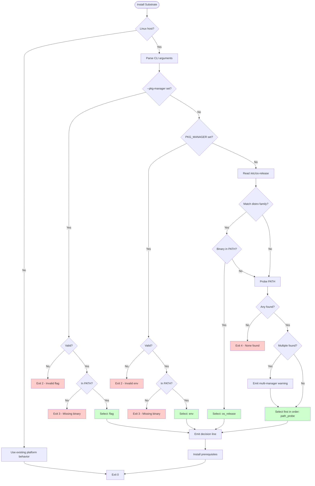
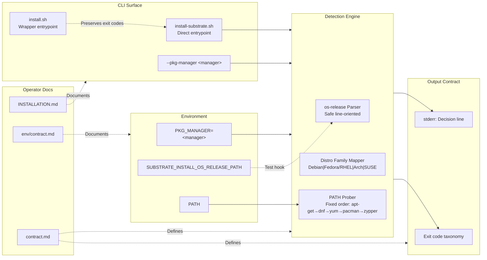
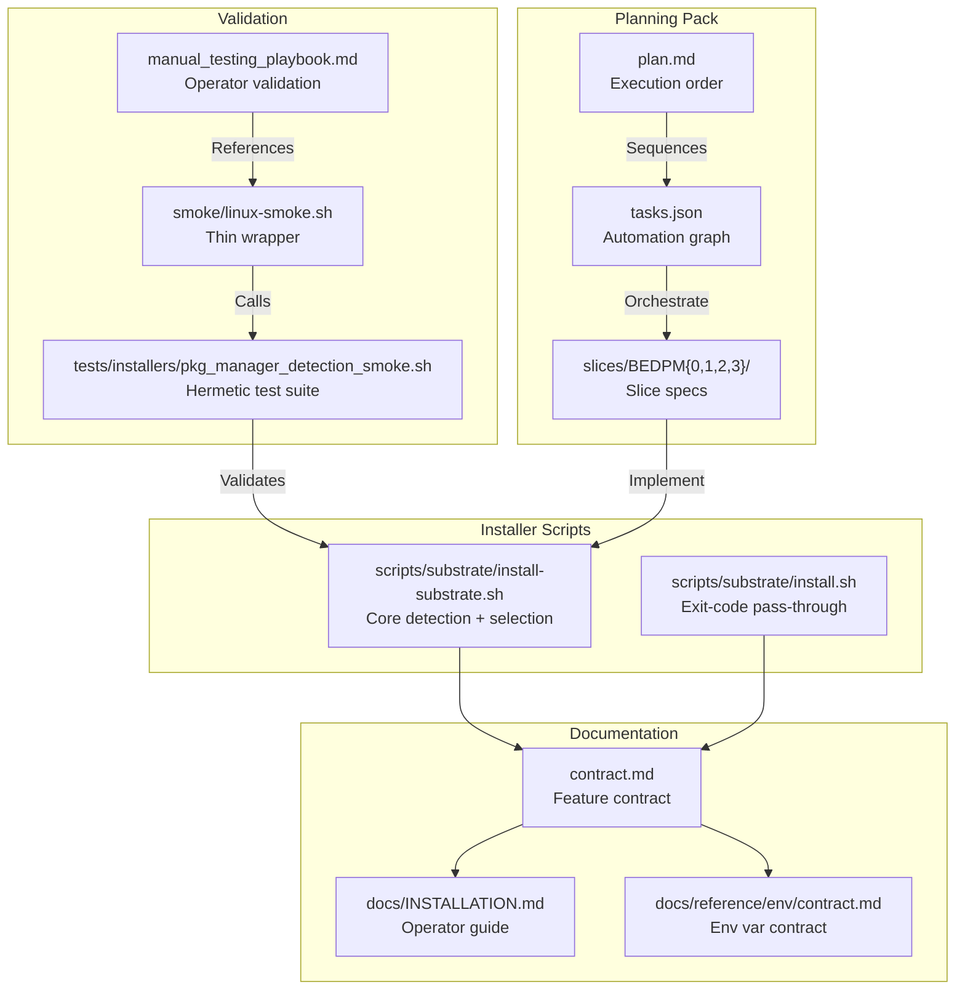
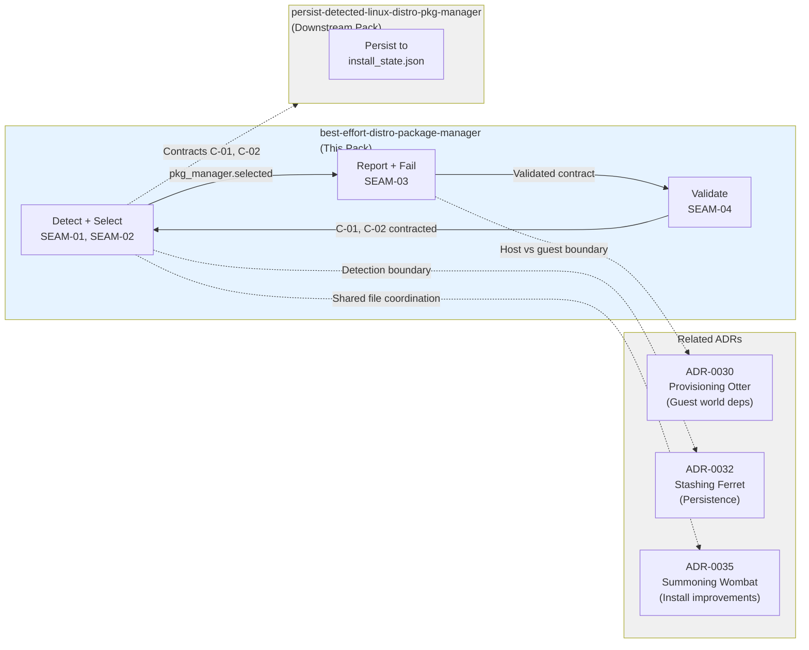

# Review Surfaces - Best-Effort Distro Package Manager

These diagrams orient the pack. They show the actual product/work shape that is expected to land.
They do not, by themselves, satisfy seam-local pre-exec review.

## R1 - Selection Precedence Flow

## R2 - Package Manager Interface

## R3 - Component Touch Surface

## R4 - Cross-Pack Contract Boundaries

## Review Surface Notes

**Active seam (SEAM-01) focus areas:**
- os-release parser safety (no shell execution)
- Mapping table accuracy (Debian, Fedora/RHEL, Arch, SUSE families)
- Decision-line format and placement
- `<unknown>` sentinel handling

**Next seam (SEAM-02) focus areas:**
- Precedence chain: flag → env → os_release → path_probe
- Exit-code taxonomy alignment with shared standards
- Multi-manager warning template
- Failure remediation content

**Future seams (SEAM-03, SEAM-04) will inherit:**
- Stable contracts from SEAM-01 and SEAM-02
- Defined threading state
- Validation requirements from hermetic test design

## Seam-Local Review Required

- `SEAM-01` requires seam-local `review.md` before decomposing into sub-slices
- `SEAM-02` requires seam-local `review.md` before decomposing into sub-slices
- Future seams will require review when promoted to `active` or `next` horizon
