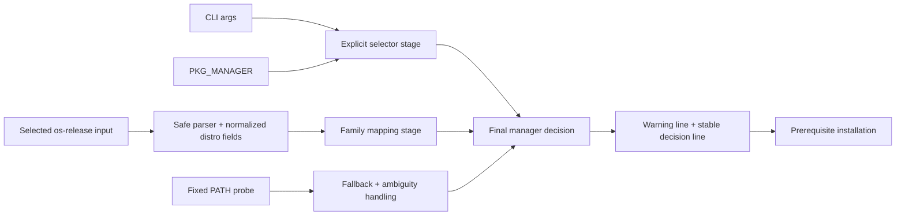
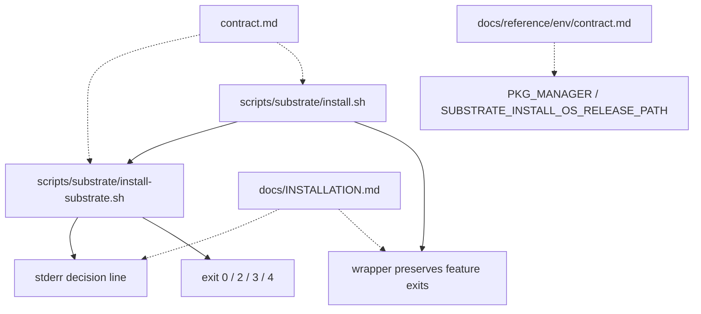
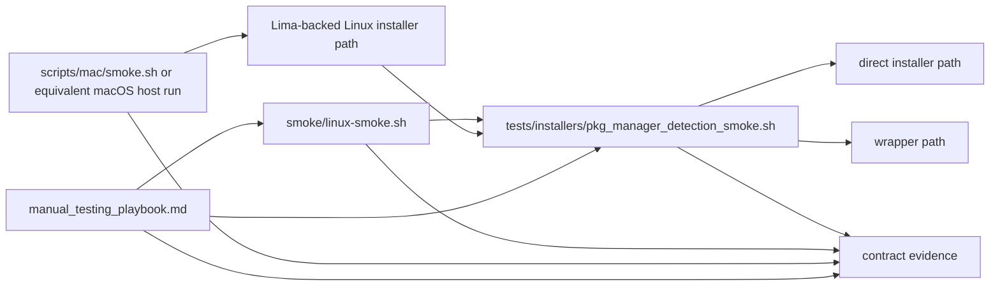
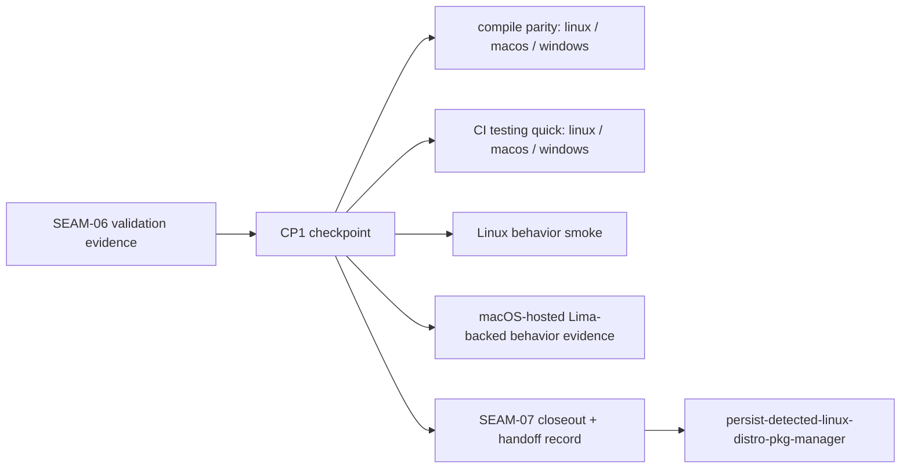

# Review Surfaces - Best-Effort Distro Package Manager

These diagrams orient the pack. They show the actual product and validation shape expected to land.
They do not, by themselves, satisfy seam-local pre-exec review.

## R1 - Hosted Installer Decision Pipeline

## R2 - Operator-Facing Surface That Lands

## R3 - Validation And Evidence Topology

## R4 - Checkpoint And Downstream Handoff

## Review Surface Notes

- These diagrams are pack-level orientation only.
- `SEAM-01` and `SEAM-02` still require seam-local `review.md` before they become `exec-ready`.
- Future seams will require seam-local review when promoted.

Active seam focus:

- selected-input contract and parser safety
- alternate-input hook and `<unknown>` degradation
- downstream inheritance boundary for parser/input truth
- later macOS-hosted Lima-backed runs must consume the same parser/input truth without drift

Next seam focus:

- family-table coverage and availability rules
- stable decision-line wording, timing, and suppression
- clean handoff into explicit-selector and fallback seams
- preserved semantics when the hosted install is exercised from macOS through the Lima backend
