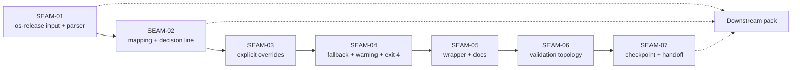

# Seam Map - Best-Effort Distro Package Manager

## Overview

This extraction deliberately expands the original four slice-oriented units into seven seams because the researched plan contains seven independently reviewable contract surfaces.

| Seam | Type | Horizon | Purpose | Primary touch surface |
|------|------|---------|---------|------------------------|
| SEAM-01 | domain | active | own the selected os-release input, parser safety rules, normalized distro fields, and `<unknown>` sentinel | `scripts/substrate/install-substrate.sh`, `contract.md` |
| SEAM-02 | capability | next | own distro-family mapping, availability-based selection, and stable decision-line reporting | `scripts/substrate/install-substrate.sh`, `contract.md` |
| SEAM-03 | capability | future | own `--pkg-manager` and `PKG_MANAGER` explicit selection behavior, precedence, and exit `2`/`3` posture | `scripts/substrate/install-substrate.sh`, `contract.md` |
| SEAM-04 | capability | future | own ordered PATH probing, multi-manager warning, exit `4`, and final fallback selection semantics | `scripts/substrate/install-substrate.sh`, `contract.md` |
| SEAM-05 | integration | future | own wrapper pass-through plus operator/env-doc propagation with no contract drift, including macOS-hosted wording where the hosted path uses Lima-backed Linux install flow | `scripts/substrate/install.sh`, `docs/INSTALLATION.md`, `docs/reference/env/contract.md` |
| SEAM-06 | conformance | future | own validation topology: authoritative repo harness, thin smoke wrapper, manual evidence model, and macOS-hosted Lima-backed verification | `tests/installers/pkg_manager_detection_smoke.sh`, `smoke/linux-smoke.sh`, `manual_testing_playbook.md`, `scripts/mac/smoke.sh` |
| SEAM-07 | conformance | future | own the single checkpoint boundary, evidence seal, macOS-hosted behavior evidence, downstream stale triggers, and persistence-pack handoff | `plan.md`, `pre-planning/ci_checkpoint_plan.md`, downstream contract boundary |

## Why The Seam Count Increased

- `BEDPM0` bundled two separable contracts: selected-input/parser semantics and mapping/reporting semantics.
- `BEDPM1` bundled two separable decision stages: explicit selectors and deterministic fallback/failure taxonomy.
- `BEDPM3` bundled two separable conformance concerns: validation topology/evidence assets and the final checkpoint/downstream handoff.
- Keeping those contracts explicit reduces downstream slice pressure and prevents later seam decomposition from inventing ownership boundaries.

## Source Coverage Matrix

| Source artifact / concern | Covered by |
|---------------------------|------------|
| `DR-0001` parser posture | SEAM-01 |
| `DR-0002` warning posture and fixed order | SEAM-04 |
| `DR-0003` alternate os-release hook | SEAM-01 |
| `DR-0004` wrapper exit posture | SEAM-05 |
| `DR-0005` smoke topology | SEAM-06 |
| `BEDPM0` slice contract | SEAM-01, SEAM-02 |
| `BEDPM1` slice contract | SEAM-03, SEAM-04 |
| `BEDPM2` slice contract | SEAM-05 |
| `BEDPM3` slice contract | SEAM-06, SEAM-07 |
| downstream persistence boundary | SEAM-01, SEAM-02, SEAM-07 |
| checkpoint boundary, CI parity cadence, and macOS-hosted behavior evidence | SEAM-07 |

## Seam Relationships

## Execution Progression

1. `SEAM-01` establishes the trusted input and parser contract.
2. `SEAM-02` turns normalized input into selection/reporting truth.
3. `SEAM-03` adds explicit operator-controlled selection.
4. `SEAM-04` finishes the decision pipeline with deterministic fallback and failure taxonomy.
5. `SEAM-05` propagates the final operator-facing contract through wrapper and docs, including the macOS-hosted Lima-backed path description.
6. `SEAM-06` locks one authoritative validation topology and evidence path, including macOS-hosted verification.
7. `SEAM-07` seals the checkpoint boundary, records macOS-hosted evidence, and publishes downstream handoff truth.

## Horizon Discipline

- `SEAM-01` is the only seam eligible for authoritative deep planning immediately.
- `SEAM-02` is the only seam eligible for provisional deeper planning after `SEAM-01` basis is refreshed.
- `SEAM-03` through `SEAM-07` remain seam briefs only until promotion advances them.
