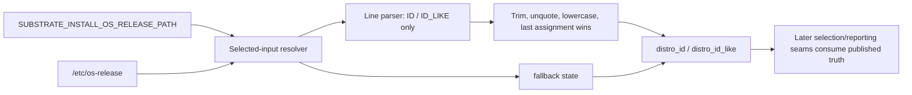
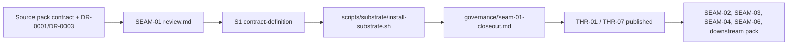

# Review Bundle - SEAM-01 os-release Input And Parser Contract

This artifact feeds `gates.pre_exec.review`.
`../../review_surfaces.md` is pack orientation only.

## Falsification questions

- Can a non-empty `SUBSTRATE_INSTALL_OS_RELEASE_PATH` still fall back to `/etc/os-release`, masking invalid alternate-input state and breaking `C-02`?
- Can the selected input execute or expand shell content instead of remaining a line-oriented `ID`/`ID_LIKE` parser, violating the safe-parser posture promised by `C-01`?
- Can downstream seams inherit partially normalized or ambiguously scoped parser output because SEAM-01 leaks mapping or reporting concerns that belong to `SEAM-02`?

## R1 - Input selection and parser flow

## R2 - Contract authority and handoff flow

## Likely mismatch hotspots

- `scripts/substrate/install-substrate.sh` currently reflects explicit override and `PATH` probing behavior, but it does not yet expose a selected-input resolver, safe os-release parser, or normalized distro-field handoff.
- The planned hermetic repo harness path `tests/installers/pkg_manager_detection_smoke.sh` is not present in the repo yet, so parser and alternate-input edge cases could drift unless SEAM-01 publishes an exact fixture matrix for later validation work to inherit.
- `docs/reference/env/contract.md` currently documents broader operator env surfaces, but it does not yet act as a propagation target for `SUBSTRATE_INSTALL_OS_RELEASE_PATH`; that makes it important that SEAM-01 keep parser/input authority entirely inside the source contract until SEAM-05 lands.

## Pre-exec findings

- No pre-exec remediation is opened during decomposition. Contract ownership, thread direction, and horizon posture are coherent as long as SEAM-01 stops at parser/input truth and does not absorb mapping/reporting work from `SEAM-02`.

## Pre-exec gate disposition

- **Review gate**: passed
- **Contract gate concerns**:
  - `C-01` and `C-02` remained limited to selected-input and parser semantics; no mapping, warning, decision-line, or override behavior landed in `SEAM-01`.
  - the contract-definition slice now records the concrete verification checklist for unreadable alternate input, duplicate assignments, comments, quoted values, and `<unknown>` normalization.
- **Revalidation prerequisites**:
  - the source pack contract and `DR-0001` / `DR-0003` remained the authoritative basis for parser and alternate-input semantics throughout `S1` to `S3`, so revalidation passed for the landed scope.
  - any future change to parser normalization, hook validation, or `<unknown>` behavior still requires downstream revalidation.
- **Opened remediations**: none

## Planned seam-exit gate focus

- **What must be true before downstream promotion is legal**:
  - landed evidence proves selected-input resolution, no-fallback degradation, and safe parsing behavior match `C-01` and `C-02`
  - `THR-01` and `THR-07` are explicitly recorded as `published`
- **Which outbound contracts/threads matter most**:
  - `C-01`, `C-02`
  - `THR-01`, `THR-07`
- **Which review-surface deltas would force downstream revalidation**:
  - any change to how invalid alternate paths degrade
  - any change to quote stripping, duplicate-key handling, or `<unknown>` emission
  - any late expansion of SEAM-01 into mapping/reporting behavior
